# CTF夺旗全套视频教程-网络安全：P15：路径遍历与提权至root权限 🚩

在本节课中，我们将学习在CTF（Capture The Flag）比赛中，如何从已获得的低权限用户（如`www-data`）提升至系统的最高权限（`root`）。这个过程被称为“提权”。我们将通过一个具体的实验环境，介绍多种提权思路和方法，最终目标是获取目标机器上的`flag`值。

## 实验环境与目标

上一节我们介绍了提权的基本概念。本节中，我们来看看本次实验的具体环境与目标。

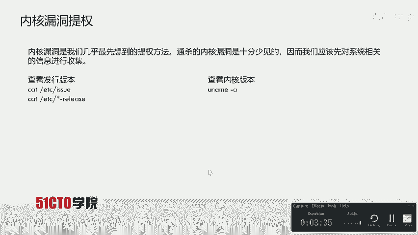

*   **攻击机**：Kali Linux，IP地址为 `192.168.253.12`。
*   **靶机**：一个Linux系统，IP地址为 `192.168.253.21`。
*   **初始状态**：我们已经通过Web服务漏洞获得了靶机上一个低权限用户（`www-data`）的反向Shell。
*   **最终目标**：将权限提升至`root`，从而能够执行任何操作，并找到并读取`flag`文件。

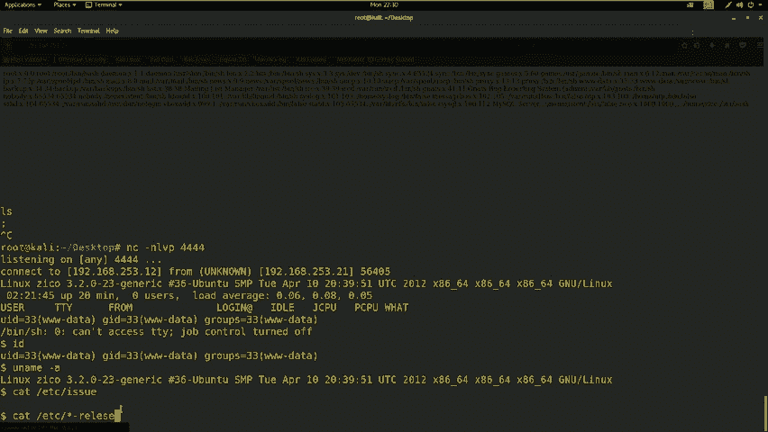

提权的前提是已经获得了一个低权限的Shell，并且靶机上存在一些常用工具，如`nc`、`python`、`perl`等，以便我们上传或下载文件。

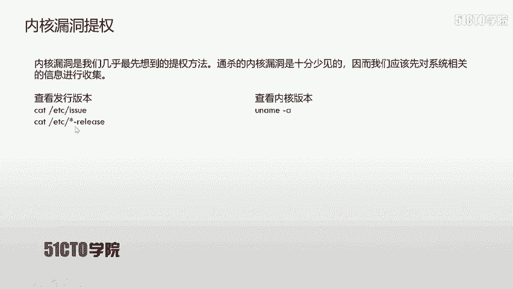

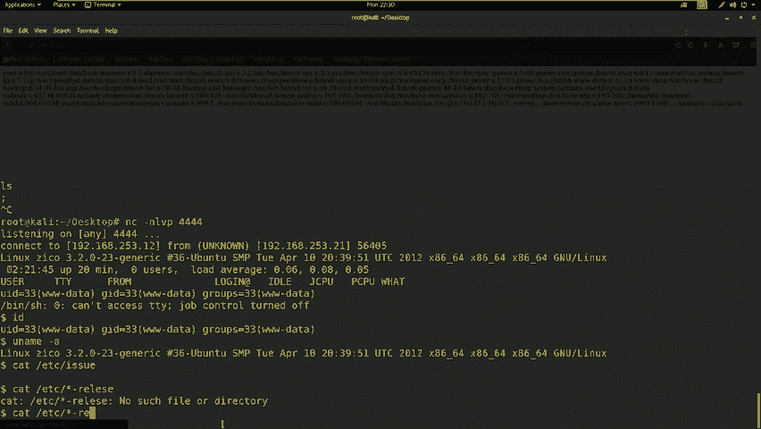

## 提权方法探索

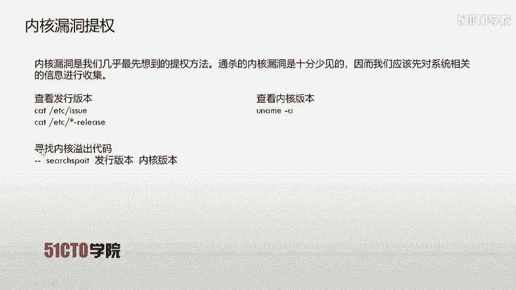

获得低权限Shell后，我们需要系统地尝试各种提权路径。以下是几种常见的思路。

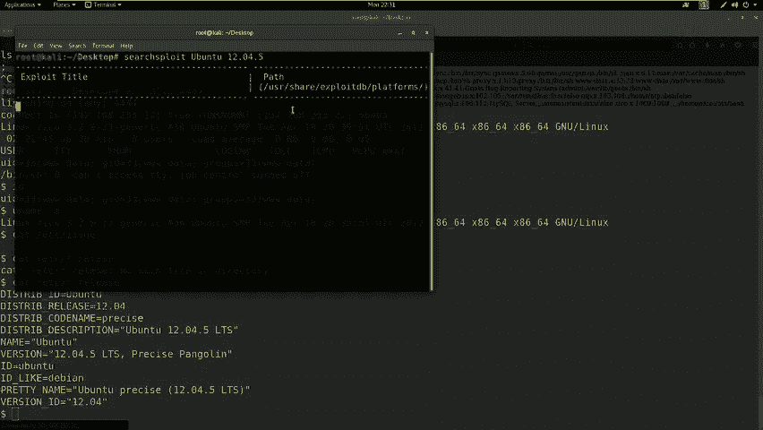

### 1. 内核漏洞提权 🐛

内核漏洞提权是最直接的方法，它利用操作系统内核本身的漏洞来获取最高权限。但通杀所有系统的内核漏洞极为罕见，因此我们需要先收集系统信息。

以下是收集系统信息的命令：

*   查看内核版本：`uname -a`
*   查看发行版信息：
    *   `cat /etc/issue`
    *   `cat /etc/*-release`

**实践操作**：
在获得的`www-data` Shell中，我们执行了`uname -a`和`cat /etc/*-release`，发现靶机系统是`Ubuntu 12.04.5`。随后，我们在Kali上使用`searchsploit ubuntu 12.04.5`搜索公开漏洞，发现该特定小版本没有可直接利用的内核漏洞。如果存在漏洞，通常的利用步骤是：
1.  上传漏洞利用代码（C语言文件）。
2.  在靶机上编译：`gcc exploit.c -o exploit`
3.  赋予执行权限：`chmod +x exploit`
4.  执行提权：`./exploit`

### 2. 明文密码与密码复用 🔑

很多管理员会在多个地方使用相同的密码。我们可以尝试寻找系统中存储的密码。

*   **系统密码文件**：Linux用户密码哈希存储在`/etc/shadow`中，但该文件通常只有`root`可读。用户信息在`/etc/passwd`中，全局可读。我们可以尝试查看这两个文件：`cat /etc/passwd` 和 `cat /etc/shadow`。在本次实验中，我们可以读取`passwd`，但无法读取`shadow`，因此无法直接破解密码哈希。
*   **配置文件密码**：Web应用（如WordPress）的配置文件中可能包含数据库密码。管理员可能复用此密码作为系统用户密码。我们切换到`/home/zico/wordpress`目录，查看`wp-config.php`文件，发现了数据库用户`zico`及其密码`swfcsfgspv9h3amqzw8`。

### 3. 计划任务提权 ⏰

Linux系统中，`cron`服务用于定时执行任务。如果这些任务以`root`权限运行，且对应的脚本文件权限配置不当（如全局可写），我们就可以修改脚本内容，在任务执行时获得`root`权限。
我们可以查看系统计划任务：`cat /etc/crontab`。在本实验中，未发现可利用的配置。

### 4. 利用SUDO权限提权 ⚡

如果我们获得的用户拥有`sudo`权限，并且可以执行某些特定命令，就可能通过这些命令进行提权。但注意，在反向Shell这种“非交互式”终端中，直接运行`sudo`可能会失败，因为它需要从真正的终端设备（TTY）读取密码。

**解决方法**：使用Python生成一个交互式TTY。
```bash
python -c ‘import pty; pty.spawn(“/bin/bash”)’
```
执行上述命令后，我们获得了一个更完整的Shell。然后尝试执行`sudo -l`来列出当前用户允许以`root`身份运行的命令。系统提示需要输入当前用户(`www-data`)的密码。我们尝试了几个常用密码均未成功。

## 实战提权过程

经过上述探索，我们发现了数据库密码。现在尝试利用密码复用进行提权。

1.  **SSH登录**：首先确认靶机开放了22端口（SSH服务）。然后使用发现的密码尝试SSH登录用户`zico`。
    ```bash
    ssh zico@192.168.253.21
    ```
    输入密码`swfcsfgspv9h3amqzw8`后，成功登录。

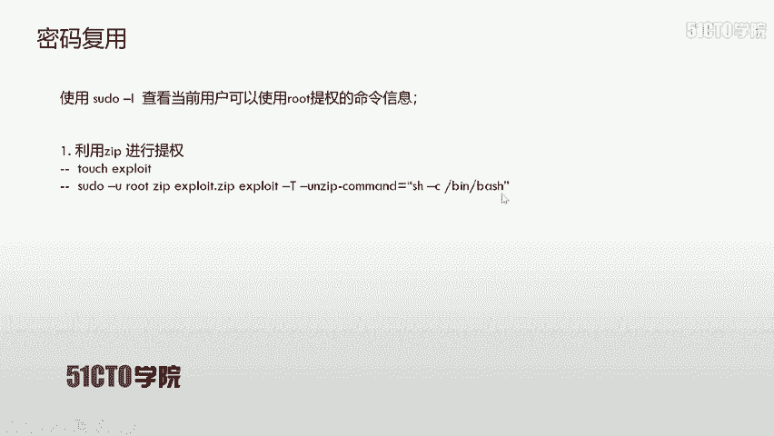

2.  **检查SUDO权限**：登录后，立即执行`sudo -l`。输出显示用户`zico`可以在不需要输入`root`密码的情况下，以`root`身份运行`vi`和`tar`等命令。这为我们提供了绝佳的提权机会。

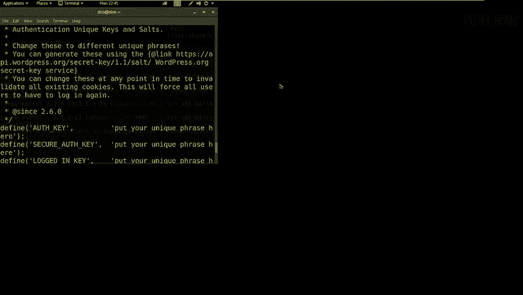

3.  **利用`tar`命令提权**：`tar`命令有一个特性，允许在压缩或解压时执行自定义命令。我们可以利用这一点。
    *   创建一个空文件：`touch exploit`
    *   执行提权命令：
        ```bash
        sudo tar -cf /dev/null exploit --checkpoint=1 --checkpoint-action=exec=”/bin/bash”
        ```
    执行后，我们成功获得了`root`权限的Shell。

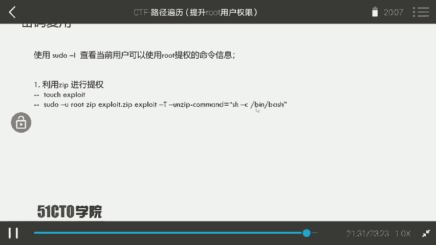

4.  **寻找Flag**：获得`root`权限后，通常可以在`/root`目录下找到flag文件。
    ```bash
    cd /root
    ls
    cat flag.txt
    ```
    成功读取到flag内容。

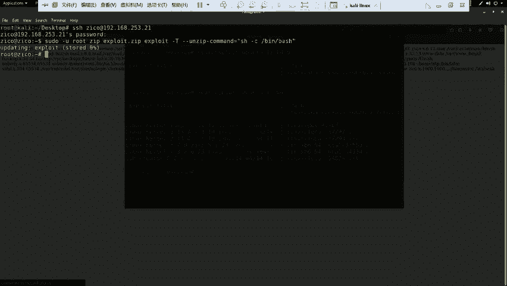

## 总结与思考

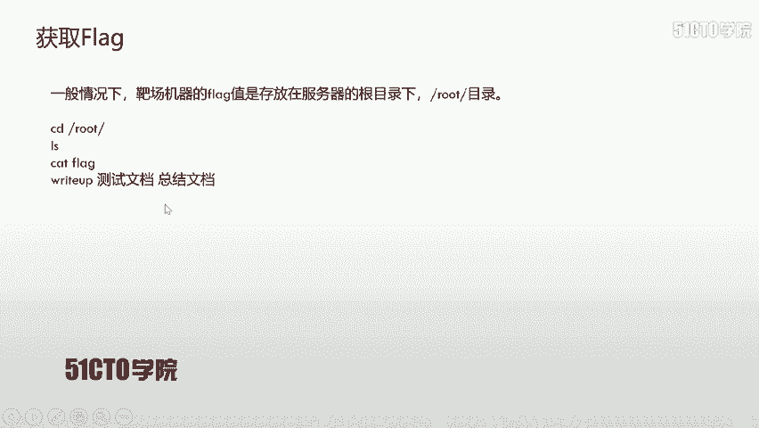

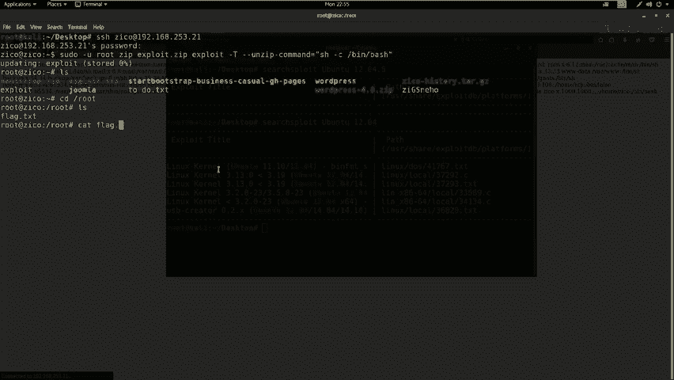

本节课中我们一起学习了从低权限用户提权至`root`的多种思路和实战过程。我们首先尝试了内核漏洞提权，然后探索了密码复用、计划任务和`sudo`权限滥用等方法。最终通过挖掘WordPress配置文件中的密码，成功SSH登录，并利用配置不当的`sudo`权限，通过`tar`命令完成了提权。

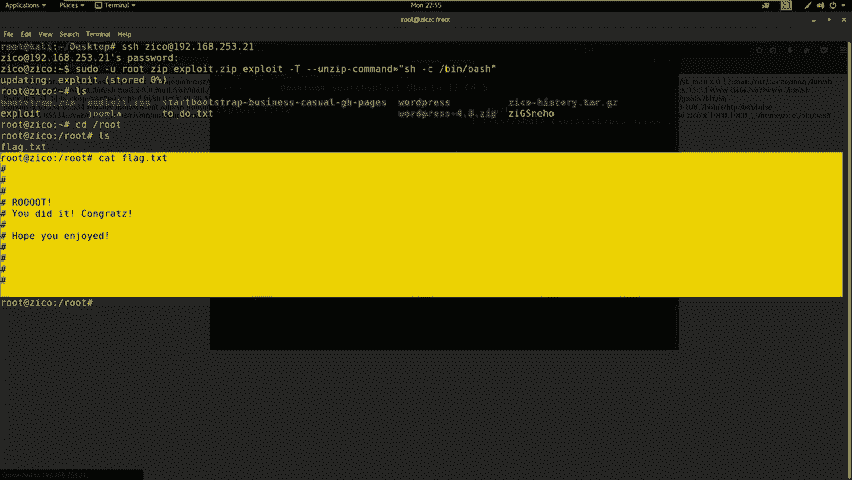

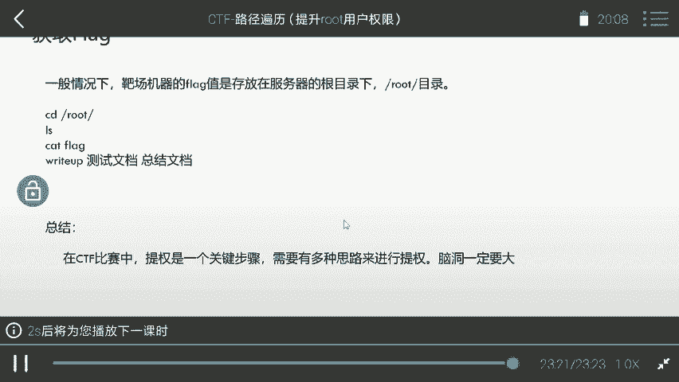

CTF中的提权环节非常灵活，需要结合信息收集、对系统配置的理解以及一些“脑洞”。关键步骤包括：**收集系统信息** -> **尝试各种公开漏洞** -> **寻找密码和配置文件** -> **检查特殊权限（如SUDO、SUID）** -> **利用特定程序特性**。保持开阔的思路和耐心是成功提权的关键。