# CTF夺旗全套视频教程-网络安全：P19：命令注入1

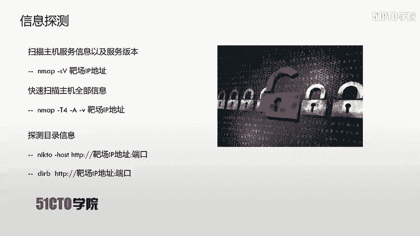

## 概述
在本节课中，我们将学习网络安全中的命令注入漏洞。我们将了解如何通过Web应用程序从外部执行目标主机的系统命令，最终目标是获取主机的访问权限，提升至root权限，并取得对应的flag值。

---

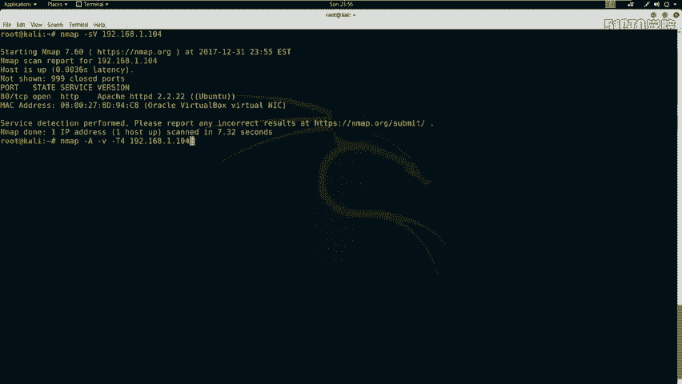

## 实验环境搭建
上一节我们介绍了课程目标，本节中我们来看看实验环境的配置。

攻击机是Kali Linux，其IP地址为 `192.168.1.106`。
靶场机器的IP地址为 `192.168.1.104`。

在CTF比赛中，主要目标是获取靶场机器上的flag值。所有操作都应围绕获取flag和控制靶场机器展开。

---

## 第一步：信息探测
在对外围进行渗透之前，首先需要对靶场机器进行信息探测。

以下是使用Nmap进行服务探测的步骤：
1.  使用Nmap扫描靶场机器的服务信息及版本。
    ```bash
    nmap -sV 192.168.1.104
    ```
2.  使用Nmap扫描主机的全部信息（使用 `-T4` 参数加快扫描速度）。
    ```bash
    nmap -A -v -T4 192.168.1.104
    ```
    **参数解释**：`-T4` 表示以最大效率发送数据包，能更快地获得扫描结果。

探测完主机信息后，如果目标开放了HTTP服务，则可以使用目录扫描工具探测Web目录。

以下是使用Nikto和Dirb进行Web目录扫描的步骤：
1.  使用Nikto扫描HTTP服务。
    ```bash
    nikto -h http://192.168.1.104
    ```
2.  使用Dirb扫描目录信息。
    ```bash
    dirb http://192.168.1.104
    ```

扫描完成后，Nikto和Dirb会列出发现的目录和文件，例如 `/notes`、`/uploads`、`/robots.txt` 等。这些信息是后续渗透的重要线索。

---

## 第二步：信息分析与初步访问
上一节我们介绍了如何收集信息，本节中我们来看看如何分析这些信息并找到突破口。

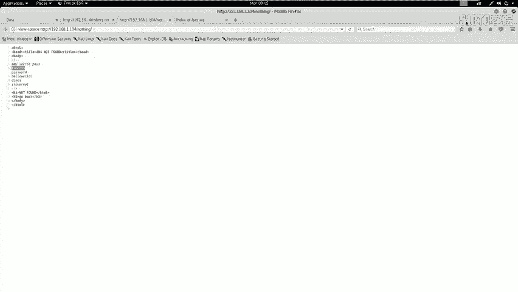

对扫描结果进行分析，目的是挖掘出可利用的信息。例如，发现开放的HTTP服务后，应使用浏览器访问敏感的页面或文件。

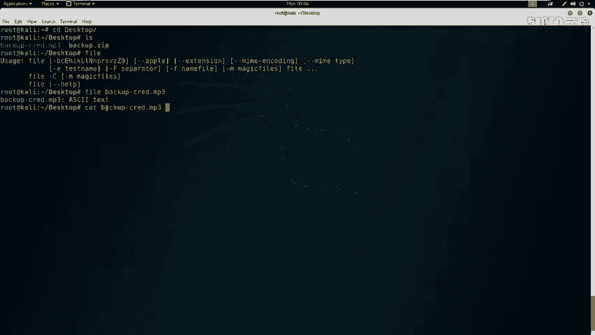

以下是需要访问和分析的关键点：
1.  访问主页 `http://192.168.1.104`，查看是否有明显信息。
2.  访问 `/robots.txt` 文件，查看被禁止爬取的目录。
3.  依次访问 `robots.txt` 中提到的目录，如 `/notes`、`/temp`、`/uploads`。

在访问 `/notes` 目录时，页面显示为“Not Found”。但与随机访问一个不存在的页面（返回标准404）不同，此页面的样式略有区别。这提示我们需要查看页面源代码。

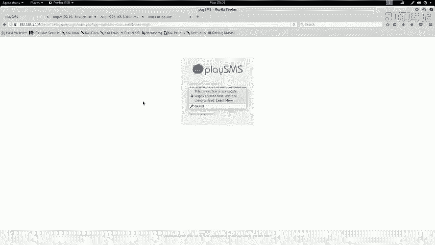

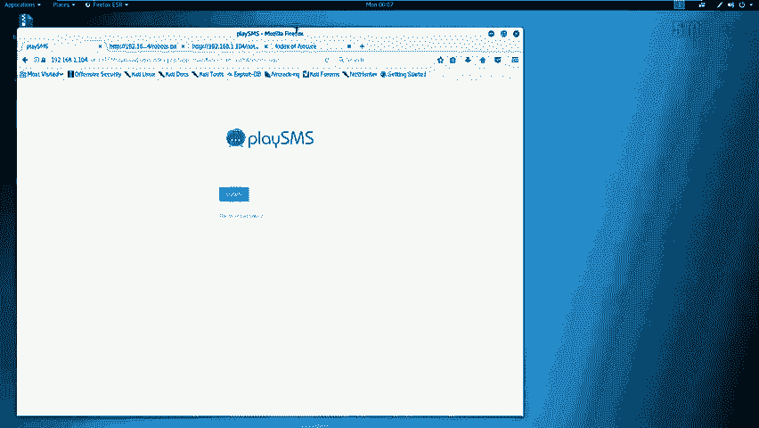

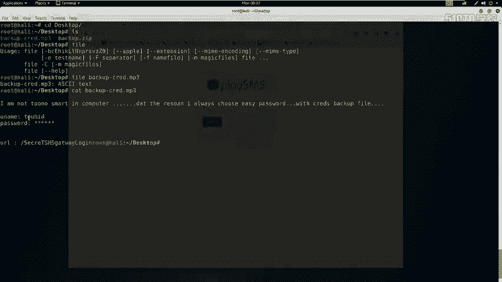

**关键发现**：在 `/notes` 页面的HTML源代码注释中，发现了一组可能的密码信息：
```
my secret pass
freedom
password
hello world!
i love root
```

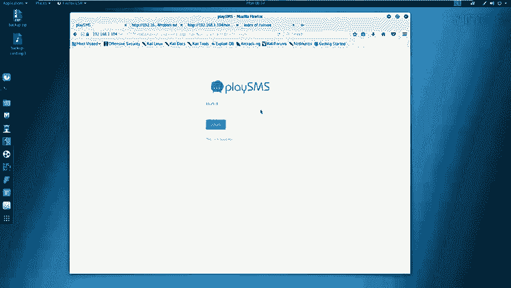

此外，在扫描结果中还发现了一个 `/secret` 目录，其中存在一个 `backup.zip` 文件（可能是网站源代码备份）。下载该文件后，尝试使用在 `/notes` 中找到的密码进行解压，密码 `freedom` 成功解压出 `backup.mp3` 文件。

---

## 第三步：文件分析与深入挖掘
我们成功获取了备份文件，但需要进一步分析其内容。

使用 `file` 命令检查 `backup.mp3` 的真实类型：
```bash
file backup.mp3
```
输出显示它实际上是一个ASCII文本文件。使用 `cat` 命令查看其内容：
```bash
cat backup.mp3
```
文件内容显示，该备份文件使用了一个简单密码（`freedom`）加密，并包含以下关键信息：
-   `username: touchID`
-   `password: ********` （被隐藏）
-   一个URL链接：`http://192.168.1.104/csrf`

访问该URL，出现一个登录界面。用户名 `touchID` 已知，密码则尝试使用之前在 `/notes` 中找到的密码列表进行爆破。最终，密码 `i love root` 成功登录系统后台。

---

## 第四步：漏洞搜索与验证
成功进入后台后，下一步是寻找系统漏洞。

首先识别后台系统。经查看，该系统为 `playSMS`。使用 `searchsploit` 工具搜索该系统的已知漏洞：
```bash
searchsploit playSMS
```
搜索结果显示存在一个“不严格的文件上传”漏洞（编号如 `42033.txt`）。查看漏洞详情：
```bash
cat /usr/share/exploitdb/exploits/php/webapps/42033.txt
```
漏洞描述指出：在 `sdfromfile.php` 文件中，由于缺乏有效的文件验证，注册用户可以上传任意文件。通过修改上传请求中的 `filename` 参数，可以注入并执行PHP代码。

根据漏洞提示，找到后台的文件上传功能点（路径通常包含 `sdfromfile`）。接下来，我们将利用Burp Suite工具来验证和利用此漏洞。

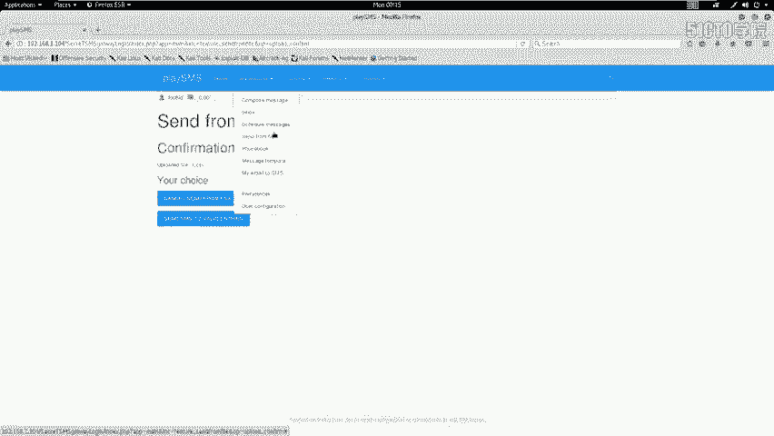

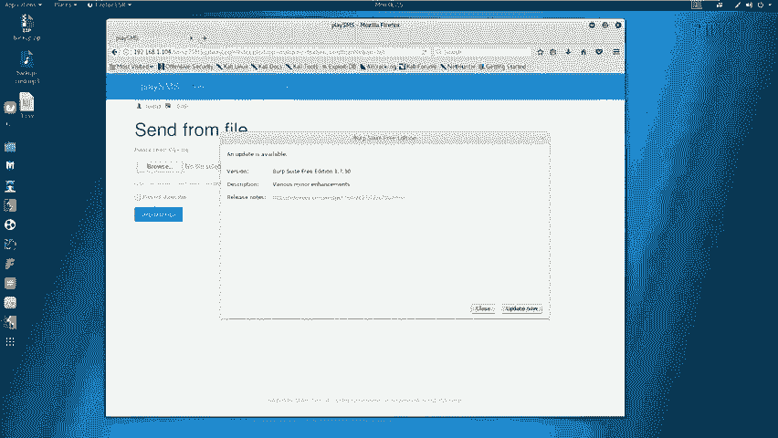

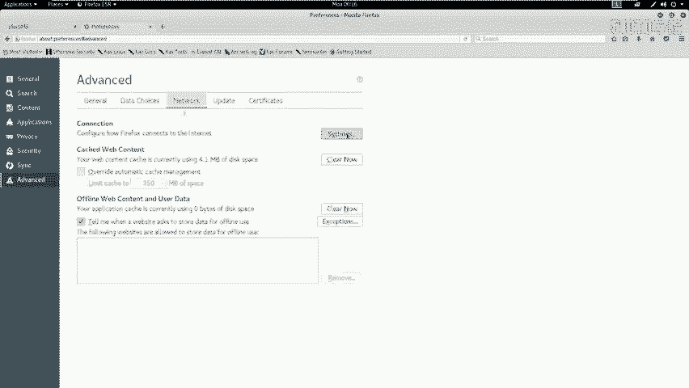

---

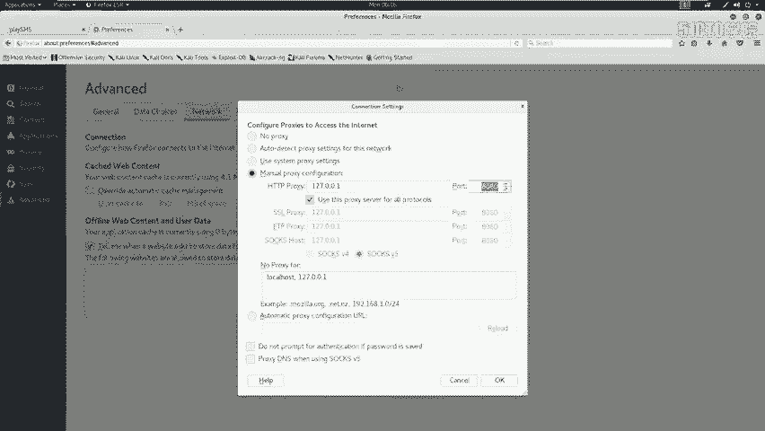

## 第五步：利用漏洞执行命令
上一节我们找到了可利用的漏洞，本节我们实际操作，利用文件上传功能执行系统命令。

以下是利用漏洞执行命令的步骤：
1.  在Kali桌面创建一个测试文件 `1.csv`。
    ```bash
    touch 1.csv
    ```
2.  在浏览器中配置代理（如Burp Suite，端口8080），并访问文件上传页面。
3.  上传 `1.csv` 文件，此时Burp Suite会截获HTTP请求包。
4.  将请求包发送到Burp Suite的 **Repeater** 模块进行修改。
5.  修改 `filename` 参数，将其值改为包含PHP代码的字符串，例如：
    ```
    test.php; system("uname -a");
    ```
    **代码解释**：将文件名改为 `test.php`，并利用 `system()` 函数执行系统命令 `uname -a`。
6.  发送修改后的请求。查看响应，如果成功，会在页面中看到 `uname -a` 命令的执行结果（例如Linux内核版本、主机名等信息）。
7.  重复此过程，修改 `filename` 中的命令，可以执行其他指令，如 `id` 来查看当前用户权限。
    ```
    test.php; system("id");
    ```

通过以上步骤，我们验证了通过修改 `filename` 参数可以实现命令注入，并能够远程执行任意系统命令。

---

## 总结
本节课我们一起学习了命令注入漏洞的初步利用流程：
1.  **信息收集**：使用Nmap、Nikto、Dirb等工具扫描目标，获取服务和目录信息。
2.  **信息分析**：分析扫描结果，访问敏感目录和文件，从源代码、备份文件中寻找凭证（用户名、密码）和线索。
3.  **漏洞挖掘**：识别Web应用系统，使用 `searchsploit` 查找公开漏洞。
4.  **漏洞验证与利用**：利用找到的文件上传漏洞，通过Burp Suite拦截并修改HTTP请求，在 `filename` 参数中注入PHP代码，实现远程命令执行。

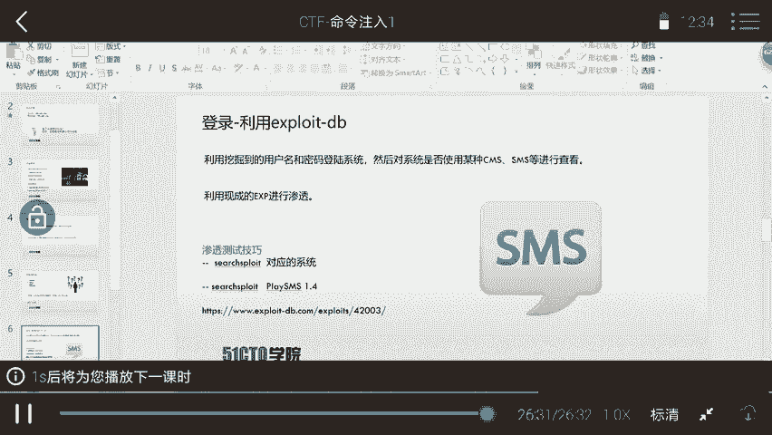

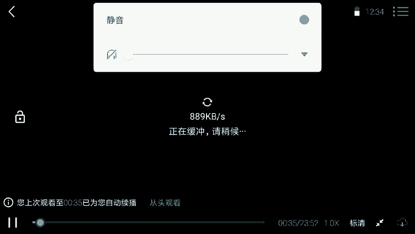

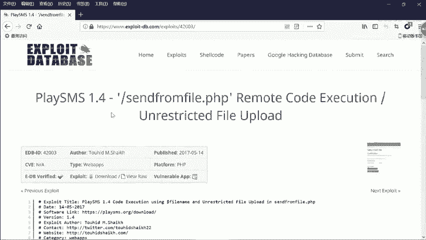

通过这一过程，我们成功从外部信息探测逐步深入，最终在目标系统上执行了任意命令，为后续获取flag和提升权限奠定了基础。下节课我们将学习如何利用此漏洞进一步获取稳定的远程Shell。