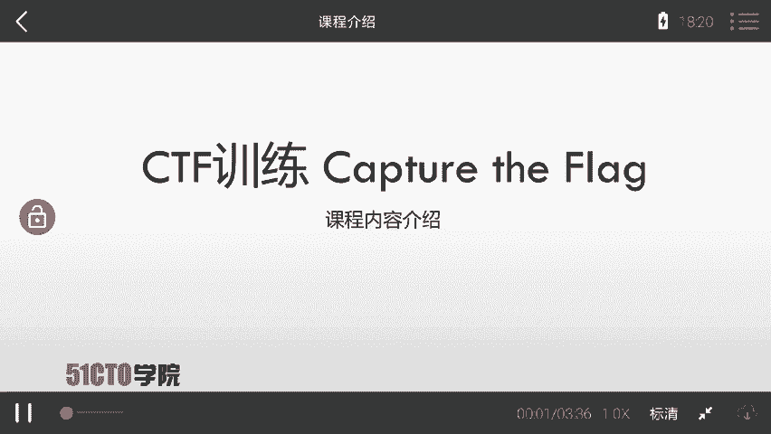
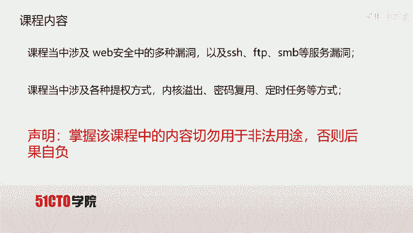
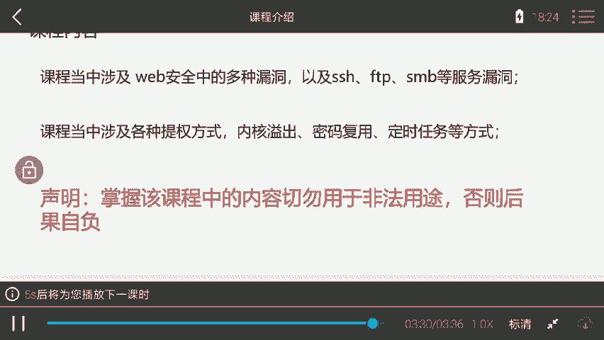
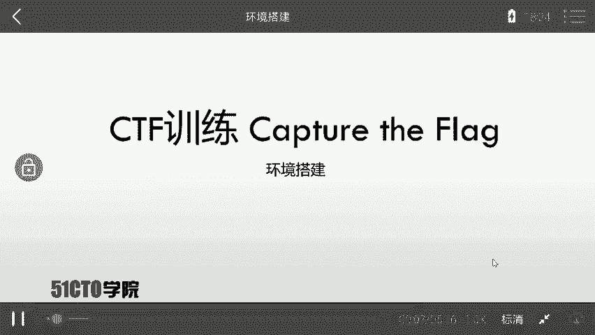
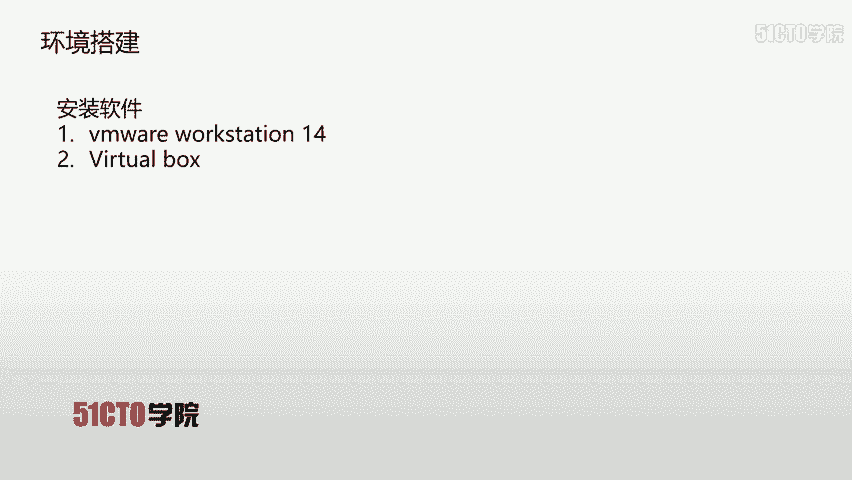
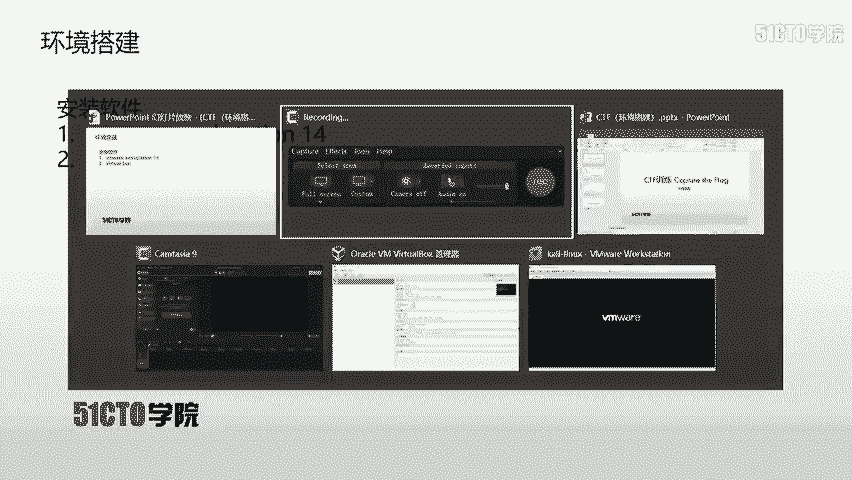

# CTF夺旗全套视频教程：P1：课程介绍 🚩

在本节课中，我们将对《CTF夺旗全套视频教程》进行整体介绍。我们将了解CTF竞赛的基本概念、本课程所使用的实验环境、面向的学员群体以及课程涵盖的核心内容。

## 什么是CTF？

CTF是一种流行的信息安全竞赛形式。其英文全称为“Capture The Flag”，直译为“夺旗”，也可意译为“夺旗赛”。

其大致流程是：参赛团队之间通过攻防对抗、程序分析等形式，率先从主办方给出的比赛环境中得到一串具有一定格式的字符串或其他内容，并将其提交给主办方，从而获得对应分数。为了方便称呼，我们把这样的内容称之为 **`flag`**。

在CTF比赛中，涉及内容比较繁杂，参赛者需要利用所有可以利用的方法获得对应的`flag`。

## 实验环境介绍

上一节我们介绍了CTF的基本概念，本节中我们来看看本课程所使用的实验环境。

在每节课中，我们都会提供对应的攻击机（Kali Linux）和靶场机器（Linux）。但是，学员需要在下载攻击机和靶场机器之后，自行搭建测试环境，并对靶场机器进行对应的渗透测试，以取得对应的`flag`值。

在拿到实验环境之后，大家需要抱有这样一个目的：**获取靶场机器上的`flag`值**。

## 课程面向对象

本课程定位为中等难度，需要学员具备一定的基础知识。

以下是学员需要了解或掌握的一些基本前提：
*   了解HTTP协议。
*   会使用一些基本的安全工具，例如 **Burp Suite**、**Nmap** 以及 **Metasploit**。

当然，对于课程中的内容，无论是想要入门的CTF新手、具备一定经验的CTF选手，还是网络爱好者，都是一门不错的学习资料。

## 课程核心内容

本课程内容主要涉及以下几个方面。

首先，课程中涵盖了Web安全中的多种漏洞，以及SSH、FTP、SMB等服务的漏洞。通过利用以上漏洞，我们可以获得靶场机器的shell访问权限。

但是，该shell通常并不是root权限。这时我们就需要涉及各种提权（Privilege Escalation）方式。

以下是本课程将讲解的几种提权方式：
*   内核溢出提权
*   密码复用提权
*   利用定时任务提权

我们通过以上方式，对靶场机器进行对应的提权操作。

本课程完全以实战的方式，引导大家对靶场进行渗透测试，以获取对应的`flag`值。

**重要提示**：学员在掌握该课程内容后，切勿用于非法用途，否则后果自负。

---

本节课中，我们一起学习了CTF竞赛的基本形式、本课程的实验环境要求、目标学员画像以及课程将要涵盖的核心技术模块，包括漏洞利用和权限提升。接下来，就让我们开启对应的CTF实战之旅吧。