# CTF夺旗全套视频教程：P22：CTF综合测试(高难度)WEB安全初级入侵 🚩

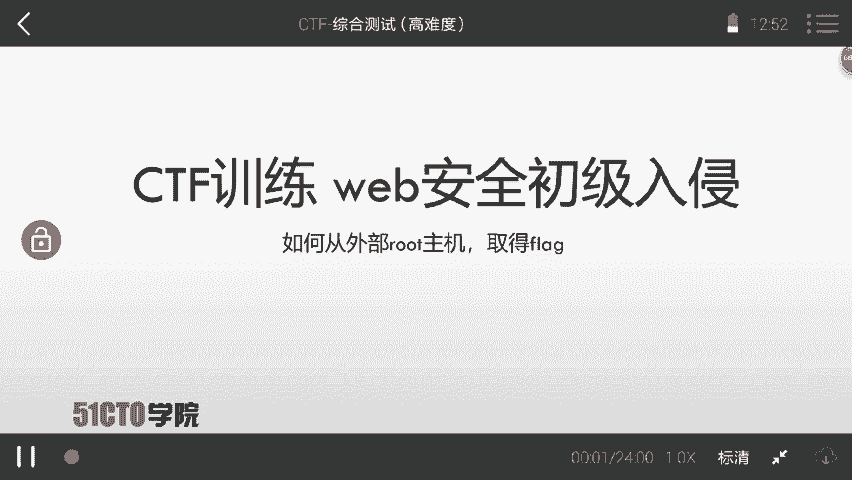

在本节课中，我们将学习如何通过Web应用程序的安全漏洞进行测试，以达到入侵的效果。最终目标是获取目标主机的最高权限（root权限），并取得对应的Flag值。我们将从信息收集开始，逐步分析并利用发现的漏洞。

## 实验环境介绍


上一节我们介绍了课程目标，本节中我们来看看本次实验的具体环境。

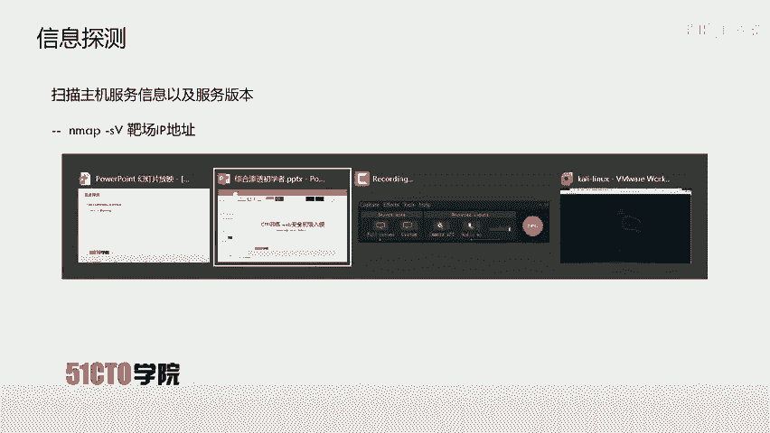

*   **攻击机IP地址**：`192.168.253.12`
*   **靶机IP地址**：`192.168.253.13`

在渗透测试或CTF比赛中，我们的核心目标是获取靶机的root权限或找到存储在靶机上的Flag值。明确目标后，即可使用攻击机对靶机展开测试。

## 信息探测


测试的第一步是对靶机进行信息探测，深入了解其开放的服务和版本信息。我们可以使用Nmap等工具进行扫描。

以下是使用Nmap进行扫描的两种常用命令：

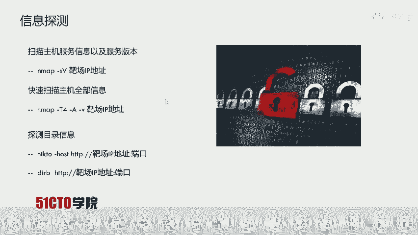

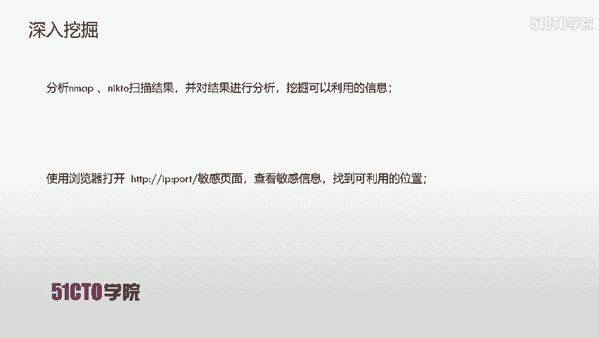

1.  **扫描服务及版本信息**：
    ```bash
    nmap -sV 192.168.253.13
    ```
    此命令会向靶机发送数据包，并分析返回的信息，以识别开放的端口及其对应的服务版本。

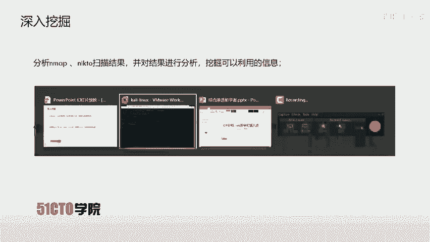

2.  **全面扫描（使用全部功能）**：
    ```bash
    nmap -A -v -T4 192.168.253.13
    ```
    参数说明：
    *   `-A`：启用操作系统检测、版本检测、脚本扫描和路由跟踪。
    *   `-v`：显示详细输出。
    *   `-T4`：指定扫描速度（0-5），T4为较快速度。

除了Nmap，我们还可以使用其他工具专门针对HTTP服务进行更细致的扫描，例如探测Web目录和敏感文件。

以下是两个常用的Web目录扫描工具：

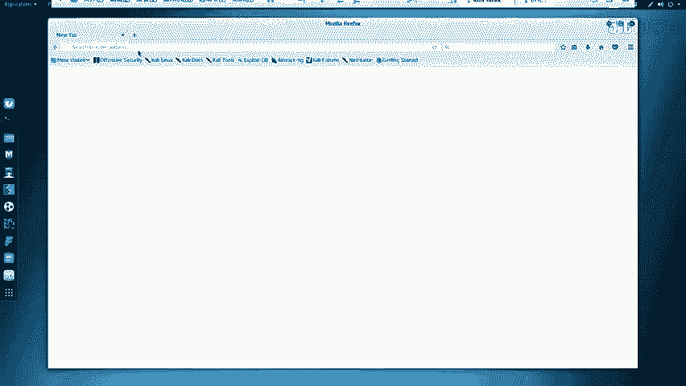

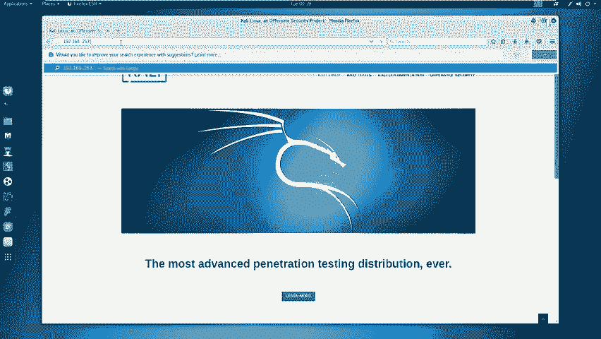

*   **使用Nikto扫描**：
    ```bash
    nikto -h http://192.168.253.13
    ```
    Nikto会扫描目标Web服务器，寻找潜在的危险文件、配置错误和已知漏洞。

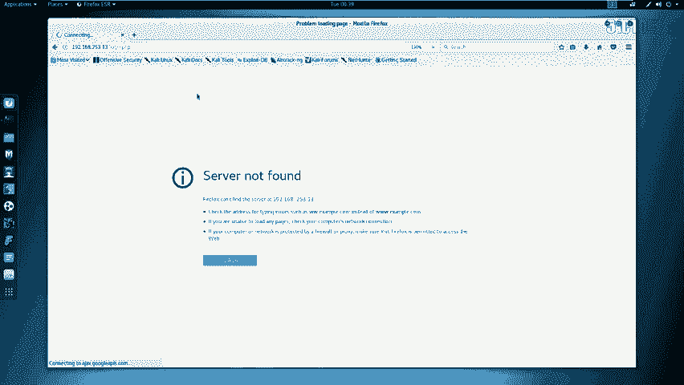

*   **使用Dirb扫描**：
    ```bash
    dirb http://192.168.253.13
    ```
    Dirb是一个Web内容扫描器，通过字典攻击来寻找隐藏的目录和文件。

## 信息分析与漏洞挖掘


在完成初步的信息收集后，我们需要对扫描结果进行深入分析，挖掘其中可能被利用的信息。

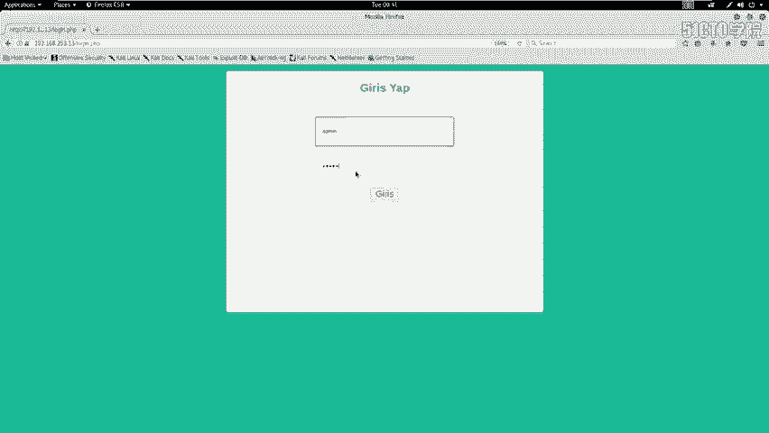

分析Nmap、Nikto和Dirb的扫描结果，我们发现了以下几条关键信息：
1.  开放了21（FTP）、22（SSH）、80（HTTP）端口。
2.  发现了一个名为 `config.php` 的文件，这可能是包含数据库认证信息的配置文件。
3.  发现了一个登录页面 `login.php`。
4.  发现了一个名为 `upload` 的上传目录。

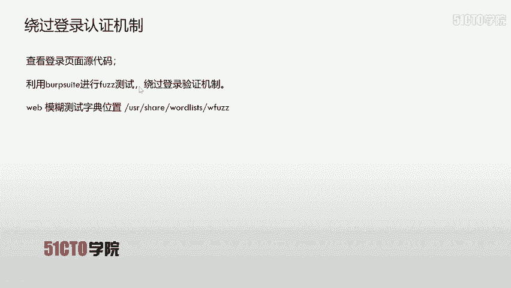

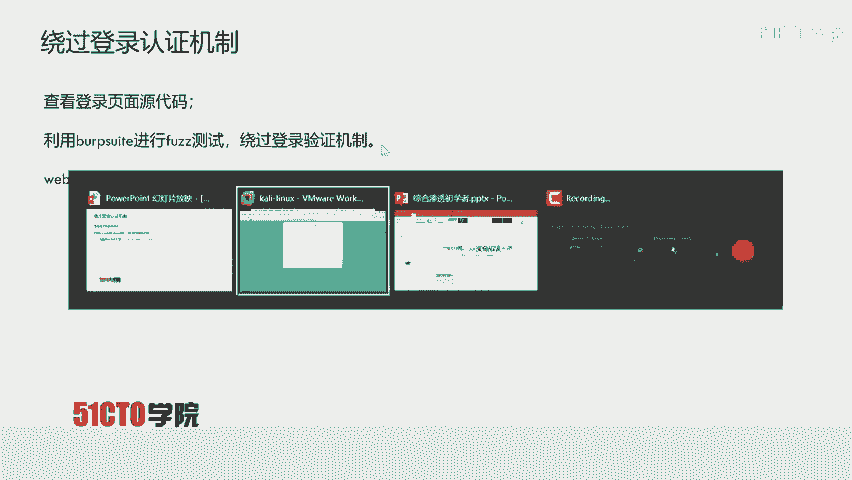

基于这些发现，我们可以从以下几个方向进行深入测试：
*   **SQL注入**：检查登录界面 `login.php` 是否存在SQL注入漏洞。
*   **敏感信息泄露**：尝试直接访问 `config.php`，看是否能获取数据库密码等敏感信息。
*   **已知漏洞利用**：检查网站是否使用了存在已知漏洞的CMS或框架。
*   **备份文件**：寻找网站备份文件，其中可能包含源代码或配置文件。
*   **文件上传功能**：对发现的 `upload` 目录和上传功能进行测试。

## 登录绕过测试

我们首先访问发现的登录页面 `http://192.168.253.13/login.php`。

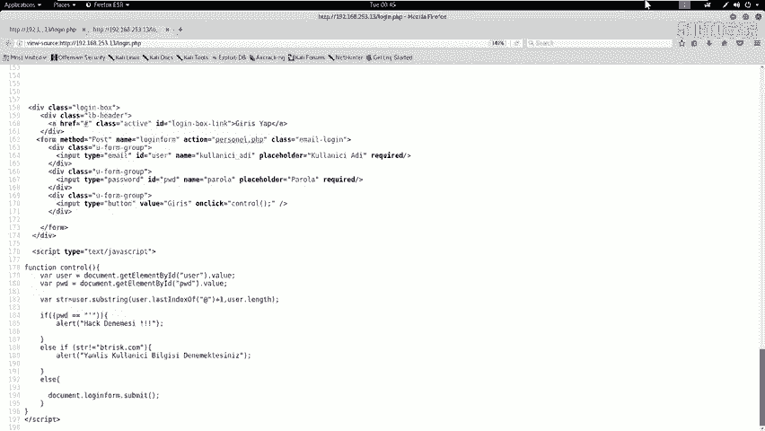

这是一个标准的登录界面。尝试使用弱口令（如admin/admin）登录失败后，我们需要寻找其他绕过认证的方法。

首先，查看页面源代码，寻找隐藏信息。在源代码底部，我们发现了一段JavaScript验证代码：

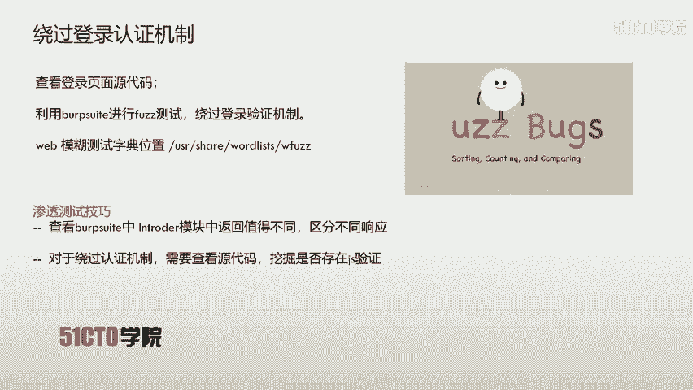

```javascript
// 示例代码逻辑
var user = document.getElementById(‘user’).value;
var pwd = document.getElementById(‘pwd’).value;
var str = user.substring(user.lastIndexOf(‘@’)+1);
if (pwd == “‘“) {
    alert(“黑客攻击！”);
} else if (pwd != “‘“ && str != “btrssk.com”) {
    alert(“用户名需以@btrssk.com结尾”);
} else {
    // 执行登录
}
```

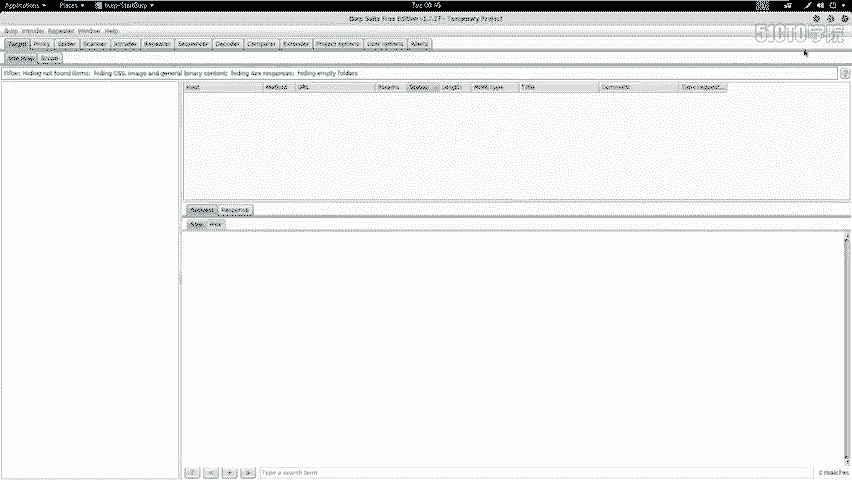

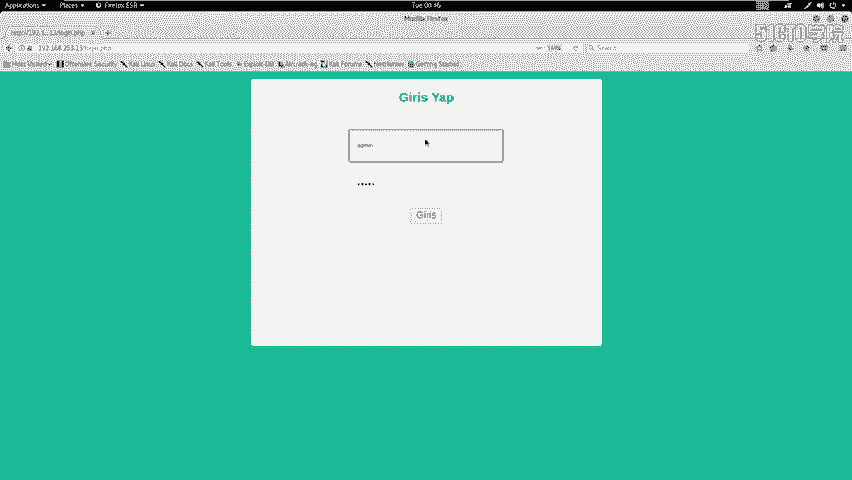

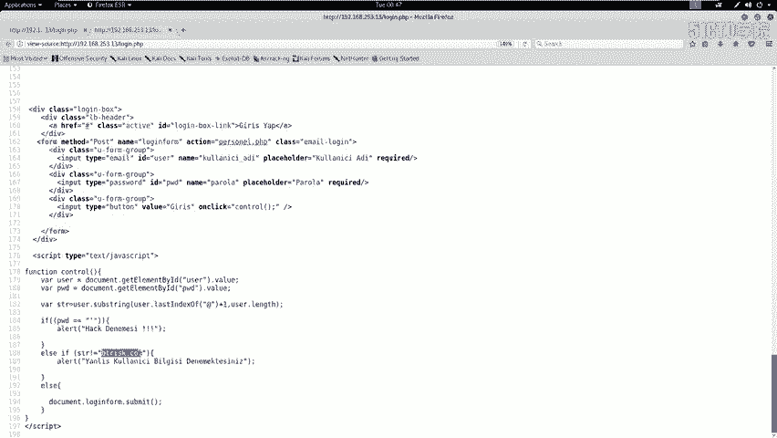

代码分析：
1.  用户名（user）需要以 `@btrssk.com` 结尾。
2.  密码（pwd）如果等于单引号 `‘`，则会触发“黑客攻击”警报，这强烈暗示后端可能存在SQL注入漏洞。

## 使用Burp Suite进行爆破测试

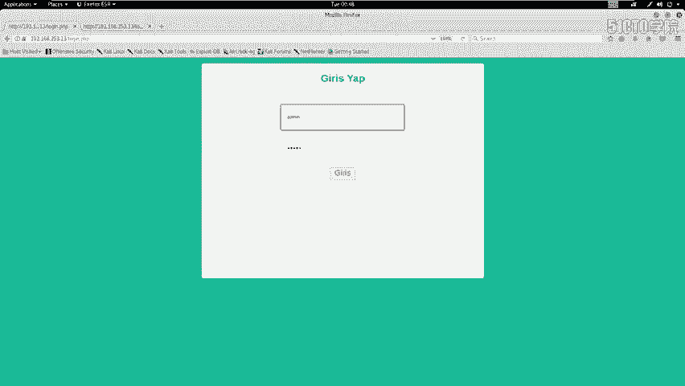

为了验证SQL注入漏洞，我们可以对密码字段进行爆破（Brute-force）测试。爆破测试的原理是通过自动化工具尝试大量可能的输入（密码字典），并根据服务器返回响应的差异（如页面长度、内容）来判断哪些输入是有效的。

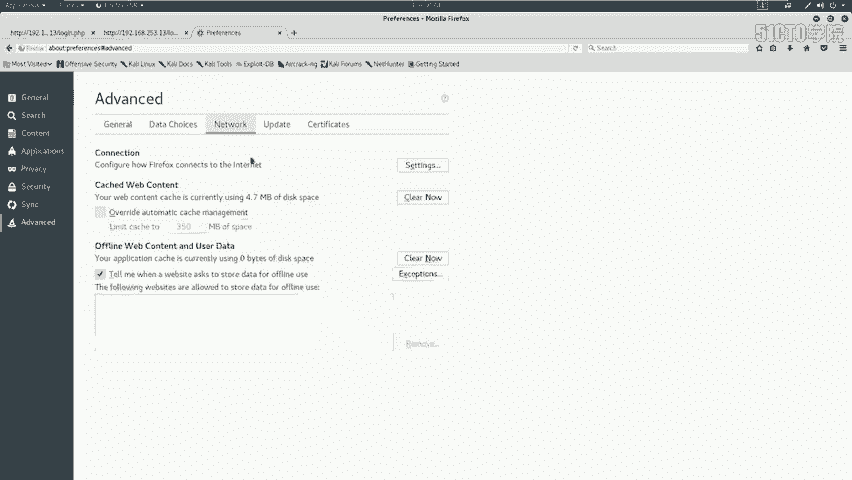

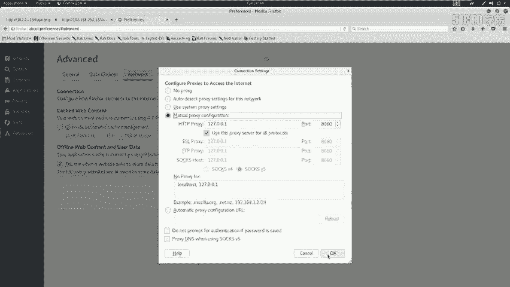

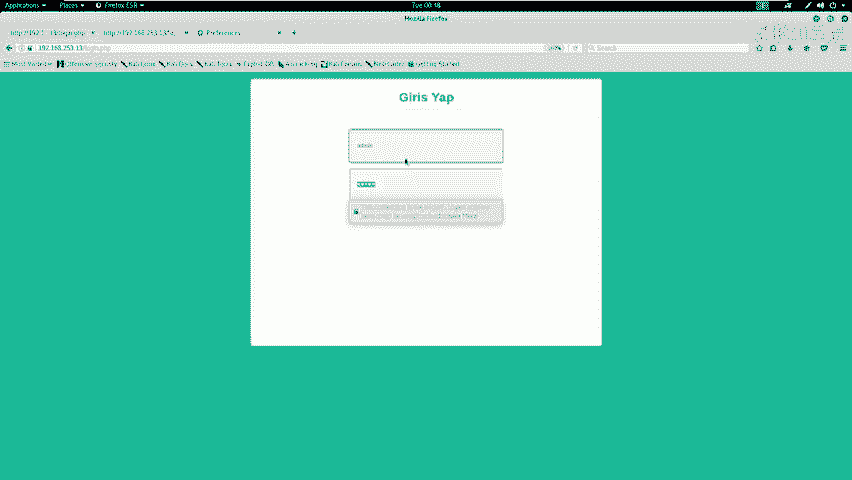

以下是使用Burp Suite Intruder模块进行爆破的步骤概要：
1.  在浏览器中配置代理，将流量指向Burp Suite。
2.  在登录页面输入用户名（例如：`test@btrssk.com`）和任意密码（例如：123456），并点击登录。
3.  在Burp Suite中截获该登录请求，并将其发送到Intruder模块。
4.  在Intruder模块中，将密码（`pwd`）参数的值设置为爆破点（Payload Position）。
5.  选择Payload类型为文件，并加载一个SQL注入测试字典（例如Kali Linux中的 `/usr/share/wordlists/sqlmap.txt`）。
6.  开始攻击，观察不同Payload对应的响应长度（Length）。长度与众不同的响应可能代表登录成功或触发了不同的SQL查询逻辑。

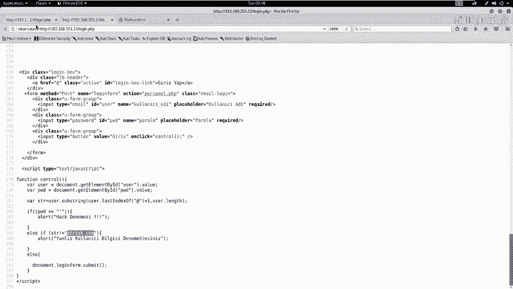

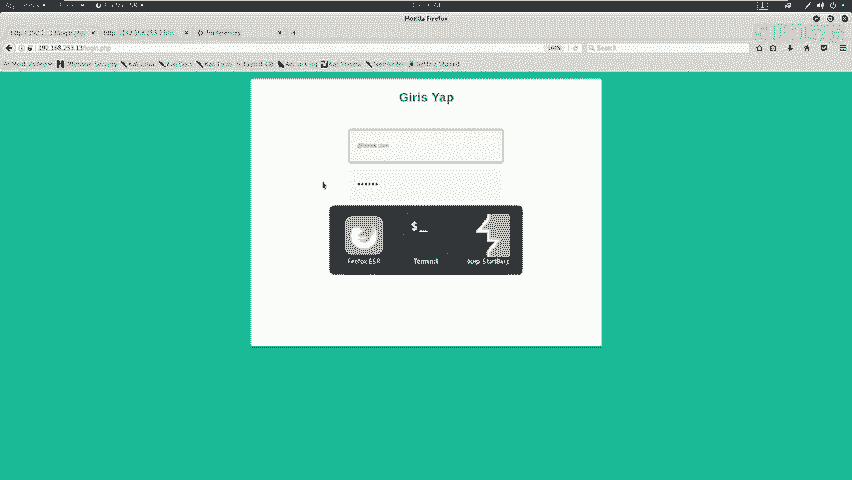

通过爆破测试，我们找到了一个返回长度与其他响应不同的Payload。在浏览器中访问该请求的响应页面，我们成功进入了一个后台界面，该界面包含一个文件上传功能。

## 文件上传功能测试

进入的后台界面提供了一个文件上传功能。我们首先尝试上传一个正常的图片文件（如 `.jpg`），上传成功。

接着，我们尝试上传一个PHP Webshell文件（如 `shell.php`），发现被阻止，系统只允许上传图片格式文件。

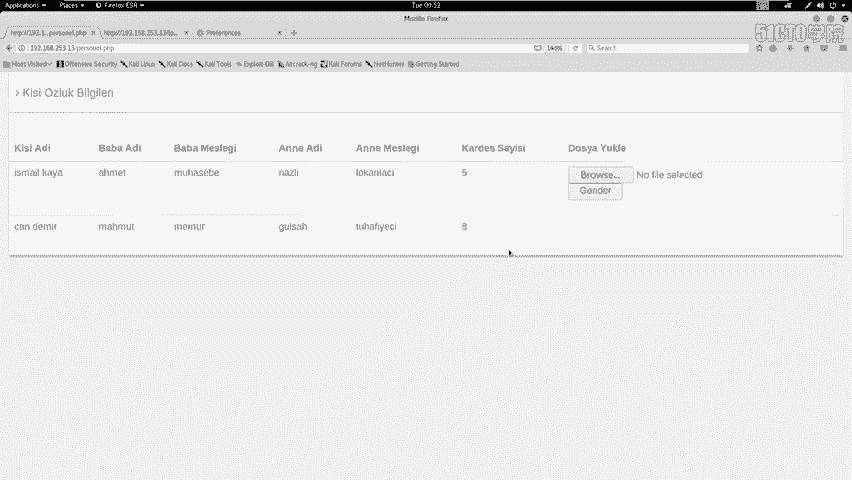

这表明网站对上传的文件类型进行了检测。如何绕过这种文件上传检测机制，将是下一节课要解决的核心问题。

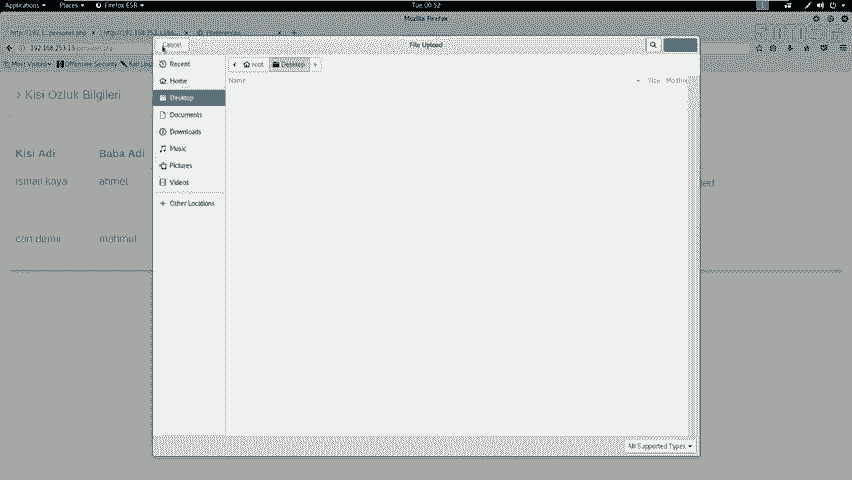

## 课程总结

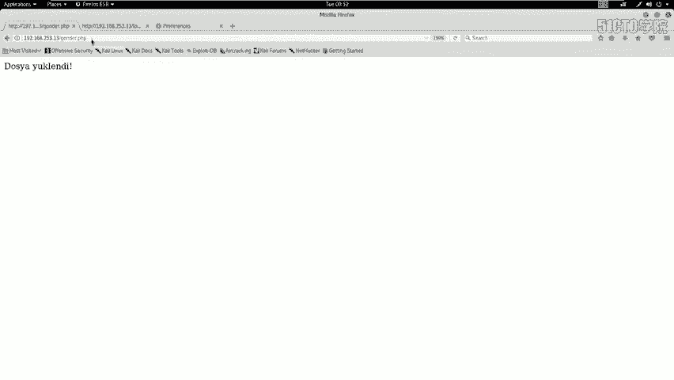

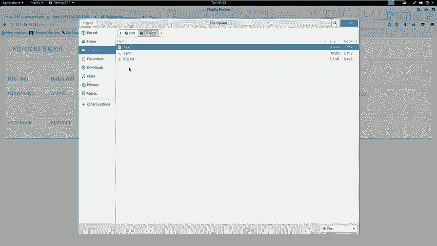

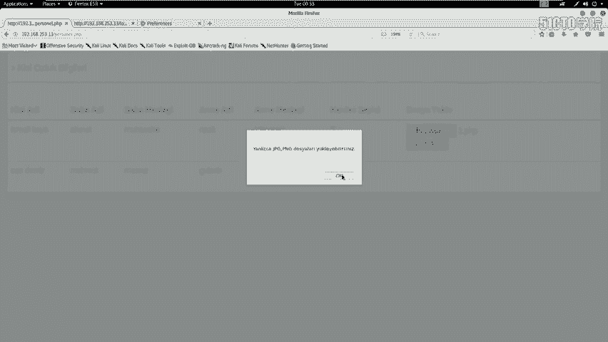

本节课中我们一起学习了Web安全初级入侵的完整流程：
1.  **信息收集**：使用Nmap、Nikto、Dirb等工具探测目标开放的服务、目录和文件。
2.  **漏洞挖掘**：分析扫描结果，寻找可能的攻击入口，如SQL注入点、敏感文件、上传功能等。
3.  **漏洞利用**：
    *   通过代码审计发现前端验证逻辑。
    *   利用Burp Suite对疑似SQL注入点进行爆破测试，成功绕过登录认证。
    *   进入后台后发现文件上传功能，并对其进行了初步测试，确认存在文件类型限制。

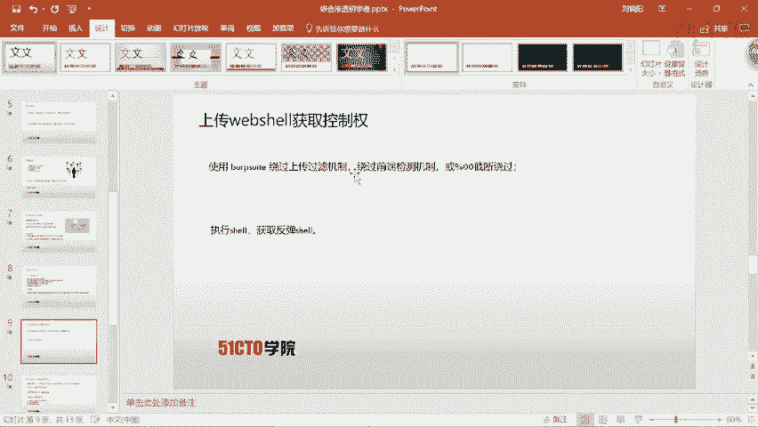

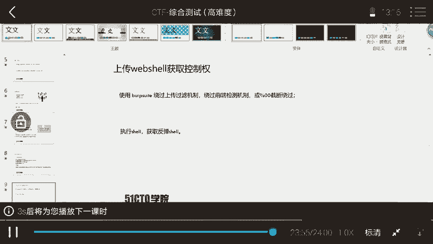

我们成功完成了从外部侦察到突破边界（登录系统）的步骤。下一节，我们将重点探讨如何绕过文件上传限制，从而上传Webshell并最终获取系统权限。