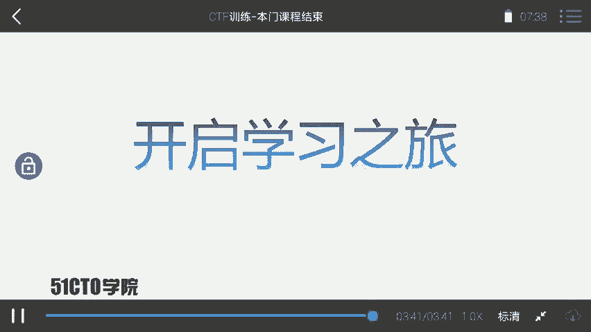
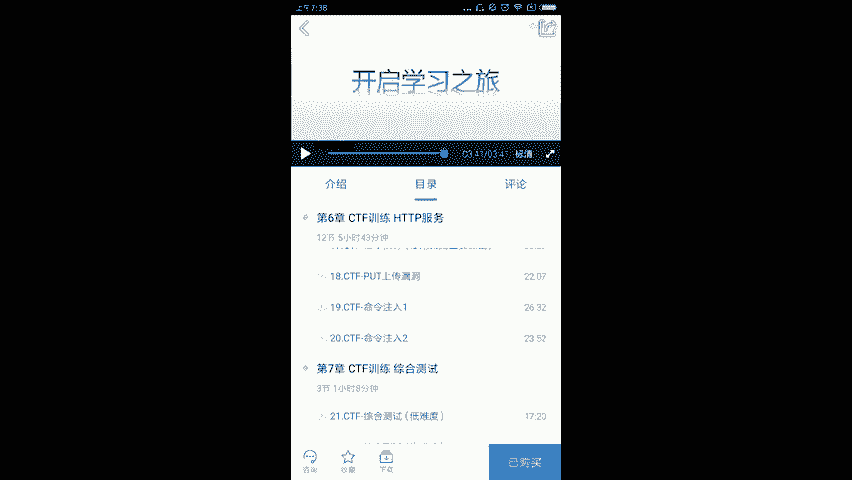

# CTF夺旗全套视频教程：P24：课程总结与展望 🏁

在本节课中，我们将对之前所学的CTF知识进行回顾与总结，并展望未来的学习路径。

## 课程回顾

上一节我们完成了具体技能的学习，本节中我们来对整个课程进行梳理。

CTF是一种流行的信息安全竞赛形式，其英文名可译为“夺旗赛”，也可意译为“夺旗赛”。其大致流程如下：参赛团队之间通过进行攻防对抗、程序分析等形式，率先从主办方给出的比赛环境中得到一串具有一定格式的字符串或其他内容，并将其提交给主办方，从而夺得分数。为了方便称呼，我们把这样的内容称之为 **`flag`**。

在CTF比赛中涉及的内容比较繁杂，我们需要利用所有可以利用的方法获得对应的 **`flag`**。这里强调需要有很大的“脑洞”来挖掘对应的信息。通过本课程的学习，大家基本掌握了CTF比赛中的一些基本套路，可以完成一定难度靶场中 **`flag`** 的寻找。

## 学习之路与未来展望

然而，本门课程并不能确保并指导你立即成为顶尖高手。成为高手的路是相当漫长的。在接下来的时间里，大家需要不断学习，不断进步，才能离高手的距离越来越近。

在信息安全或CTF学习中，我们需要不断实践、不断尝试才能更快地进步。同时，学习也需要有一定的方法、对应的课程以及训练环境。

以下是讲师后续计划推出的课程，旨在帮助大家继续深入学习：

*   **代码审计课程**：专门教大家去挖掘对应的漏洞，并且编写对应的 **`POC（Proof of Concept）`**。
*   **WiFi安全课程**：将使用一些高度集成的工具测试WiFi安全，并涉及最新的测试方法，例如中间人攻击直接修改对应WiFi密码。
*   **Metasploit模块编写课程**：教大家如何编写一个 **`Metasploit`** 模块来进行自动化测试。
*   **CTF训练高端课程**：提升课程难度，使大家对CTF有更深入的了解，并提升综合安全能力。

## 总结与鼓励

本节课中，我们一起回顾了CTF竞赛的基本概念与流程，总结了已掌握的基本技能，并展望了未来的进阶学习方向。

大家的学习尚未成功，仍需努力。让我们一起开启接下来的学习之旅吧。

