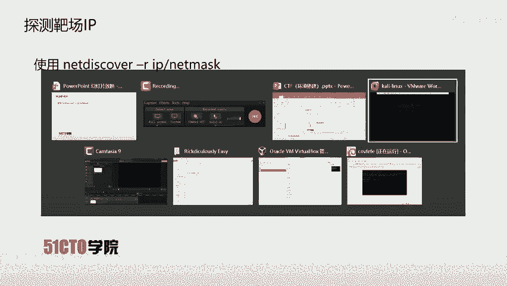
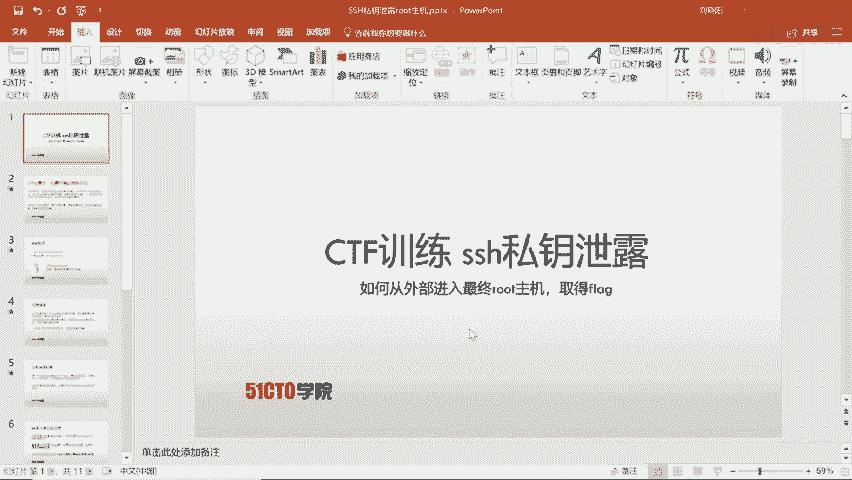

# CTF夺旗全套视频教程-网络安全：P2：2.CTF夺旗-环境搭建 🛠️

在本节课中，我们将要学习如何搭建一个用于CTF（Capture The Flag，夺旗赛）学习和练习的本地环境。一个稳定、独立的实验环境是进行网络安全技术探索的基础。

## 环境搭建概述

上一节我们介绍了CTF的基本概念，本节中我们来看看如何准备一个实战环境。搭建本地环境的主要目的是为了安全、可控地进行漏洞复现、工具测试和技能练习，而不会影响真实的网络系统。

## 虚拟机软件选择

首先，我们需要一个虚拟机软件来创建隔离的操作系统环境。以下是两款主流且免费的选择：

*   **VMware Workstation Player**：功能强大，性能较好，适合个人学习使用。
*   **VirtualBox**：完全开源免费，跨平台支持优秀。



你可以根据个人喜好和电脑配置选择其中一款进行安装。

## 靶机系统下载

环境搭建的核心是“靶机”。靶机是预先配置好漏洞或挑战的操作系统镜像。下载后可以直接导入虚拟机软件运行。

推荐访问以下网站获取丰富的靶机资源：


*   **Vulnhub**：一个专注于提供各种漏洞环境的网站，资源非常丰富。
*   **攻防世界**：国内的CTF学习平台，也提供一些练习环境。

在这些网站上，你可以找到从易到难的各种靶机，例如著名的 `Metasploitable`、`DVWA` 等。

## 环境配置步骤

以下是搭建环境的通用步骤，以导入Vulnhub靶机为例：

1.  **下载虚拟机镜像**：从Vulnhub等网站下载所需的 `.ova` 或 `.vmx` 格式的靶机文件。
2.  **导入虚拟机**：打开你安装的虚拟机软件（如VMware），选择“打开”或“导入”功能，选择下载的靶机文件。
3.  **配置网络**：这是关键的一步。为了确保你的攻击机（通常是Kali Linux）能和靶机通信，需要将两者的网络模式设置为同一类型。推荐使用 **NAT模式** 或 **仅主机模式**。
    *   **NAT模式**：虚拟机通过主机IP访问外部网络，适合需要联网的场景。
    *   **仅主机模式**：虚拟机和主机形成一个封闭的内部网络，与外界隔离，安全性更高。
4.  **启动与登录**：启动导入的靶机。通常，Vulnhub靶机的登录信息（用户名和密码）会在其下载页面提供，请仔细阅读说明。

## 攻击机准备



为了发起测试，我们还需要一个攻击机。Kali Linux 是渗透测试和CTF中最流行的攻击机系统，它预装了数百种安全工具。

你可以用同样的方法，在虚拟机中安装或导入一个Kali Linux镜像。确保攻击机和靶机处于**相同的虚拟网络**中，这样它们才能相互发现和通信。你可以使用 `ping` 命令来测试连通性。

在Kali Linux的终端中，你可以使用以下命令来探测靶机IP：
```bash
ping <靶机IP地址>
```

## 总结

本节课中我们一起学习了CTF环境搭建的全过程。我们首先了解了搭建环境的重要性，然后选择了虚拟机软件，接着找到了靶机资源，并一步步完成了虚拟机的导入、网络配置和启动。最后，我们准备了Kali Linux作为攻击机，并测试了网络连通性。现在，你已经拥有了一个属于自己的、安全的CTF练习实验室，可以开始后续的挑战了。