# CTF夺旗全套视频教程-网络安全：P3：CTF-SSH私钥泄露 🚩

在本节课中，我们将学习CTF比赛中SSH私钥泄露的漏洞利用方法。我们将通过泄露的私钥，从外部靶场主机进入其内部，最终获取靶场主机的root权限，并取得对应的flag。

## 比赛环境介绍

在开始之前，我们先介绍CTF比赛中常见的两种比赛环境。

以下是两种常见的比赛环境：

1.  **同一局域网环境**：攻击机和靶场机器位于同一局域网。选手通过Web方式访问攻击机（通常是Kali Linux），并使用攻击机来测试和渗透靶场机器，最终获取flag。在这种环境下，选手通常无需自备电脑，所有设备由举办方提供。
2.  **网线接口环境**：举办方提供一个网络接口。选手需要自备个人电脑（PC）及各种渗透测试工具。选手的电脑可以接入互联网查询资料。举办方会提供靶场机器的IP地址，选手直接使用自己的攻击机进行渗透测试，获取flag。

## 实验环境搭建

上一节我们介绍了比赛环境，本节中我们来看看本次课程的具体实验环境。

*   **攻击机（Kali Linux）IP地址**：`192.168.253.12`
*   **靶场机器IP地址**：`192.168.253.10`

面对这样的环境，我们的目标很明确：获取靶场机器上的flag值并提交。

## 信息探测与扫描

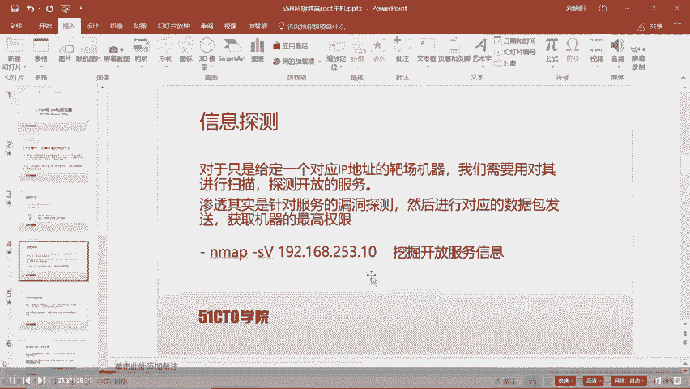

无论参加何种CTF比赛，渗透测试的第一步都是信息探测。在获得靶场IP地址后，我们需要扫描其开放的服务。日常渗透测试的本质，就是对目标机器上的服务进行漏洞探测。

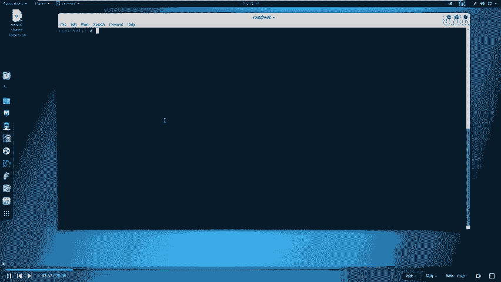

接下来，我们使用攻击机对靶场机器进行服务信息扫描。这里我们使用 `nmap` 工具的 `-sV` 参数来探测服务版本信息。

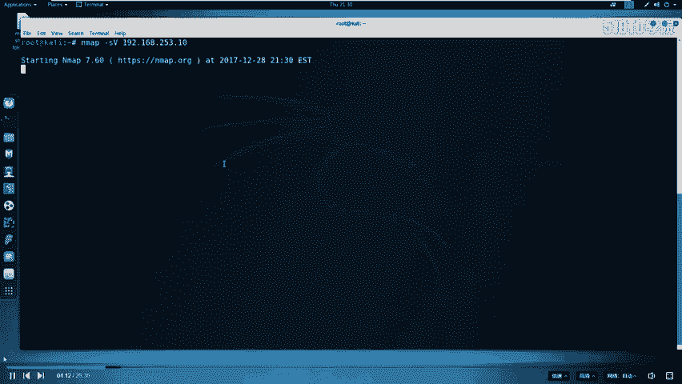

命令如下：
```bash
nmap -sV 192.168.253.10
```
扫描结果显示，靶场机器开放了SSH服务以及两个HTTP服务（其中一个在非常规端口）。

## 服务分析与深入探测

在探测结束后，我们需要对结果进行分析。计算机上的每个服务都对应一个端口，通过端口通信实现资源共享。0-1023是常见服务的默认端口，但很多服务（如MySQL的3306端口）会使用其他端口。

对于本次靶场，开放的非常规端口HTTP服务值得深入排查。探测HTTP服务最直接的方法是使用浏览器访问。

我们访问 `http://192.168.253.10:31337`，但页面没有显示flag信息。

在CTF比赛中，大量信息可能隐藏在网页源代码中。我们查看该页面的源代码，但依然没有发现有用信息。

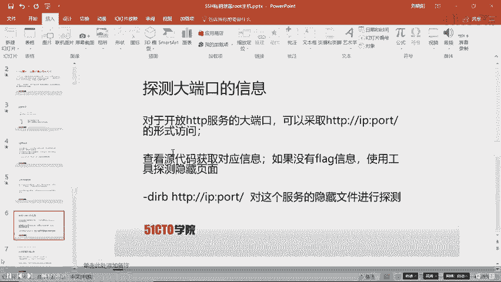

## 目录与文件枚举

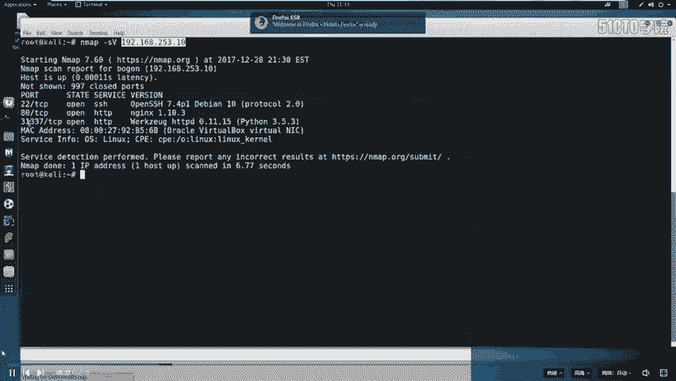

既然源代码中没有flag，我们需要探测该服务下是否隐藏了其他文件或目录。这里我们使用 `dirb` 工具进行目录爆破。

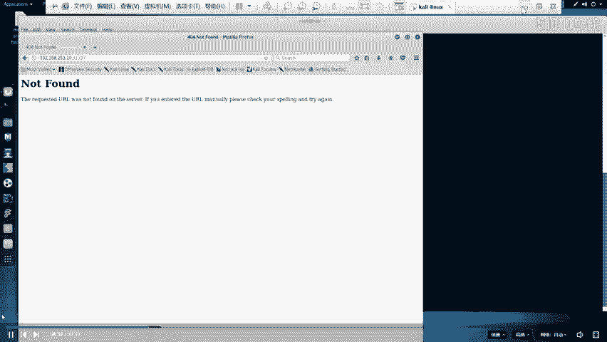

命令如下：
```bash
dirb http://192.168.253.10:31337/
```
扫描完成后，我们发现了几个结果，其中 `/ssh` 和 `/robots.txt` 最为醒目。我们先对它们进行深入分析。

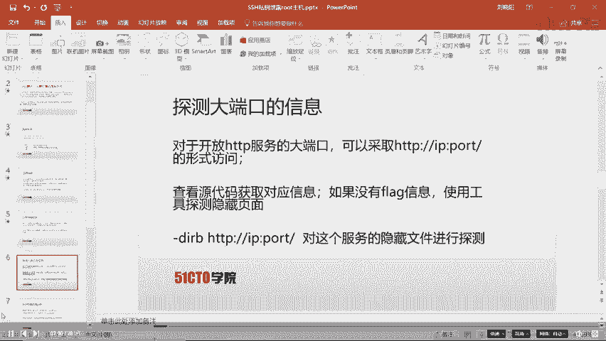

`robots.txt` 文件用于指示搜索引擎哪些内容可以或不可以抓取。我们访问 `http://192.168.253.10:31337/robots.txt`。

文件内容显示，它禁止抓取 `.bashrc`、`.profile` 和 `taxes` 文件。这个 `taxes` 文件引起了我们的注意。

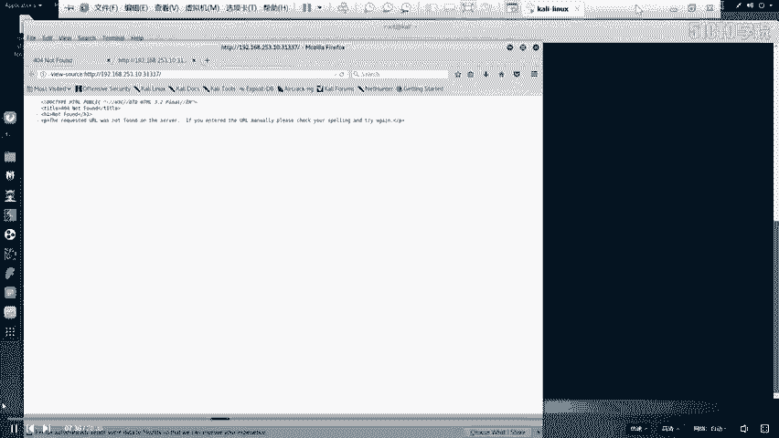

访问 `http://192.168.253.10:31337/taxes`，我们成功找到了第一个flag。

## SSH私钥泄露与利用

在分析完 `robots.txt` 后，我们注意到了 `/ssh` 目录。访问 `http://192.168.253.10:31337/ssh`，我们发现了一些看似是SSH密钥的信息。

这里简要说明SSH的作用：SSH允许远程用户通过客户端安全地登录到服务器的SSH服务，并进行远程操作。其认证方式通常涉及公钥和私钥。用户持有私钥（如 `id_rsa`），服务器上存有对应的公钥（`id_rsa.pub`），通过加解密操作完成认证。

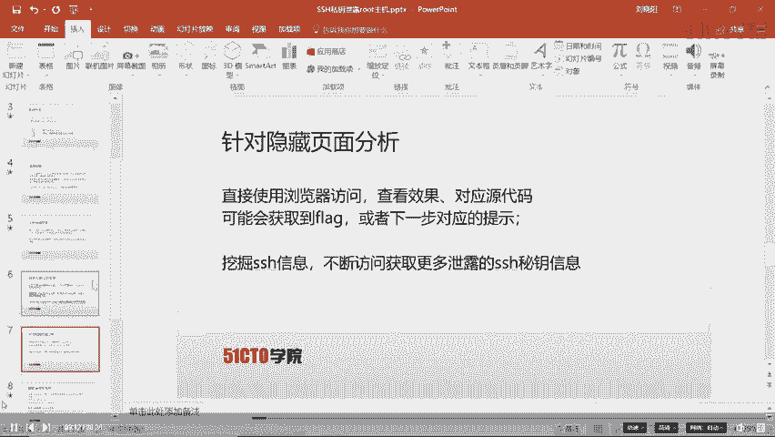

我们看到的很可能是一个泄露的SSH私钥。我们可以尝试使用这个私钥登录靶场机器的SSH服务。

首先，将网页上的私钥内容保存到攻击机的一个文件中，例如 `id_rsa`。然后，需要给该私钥文件设置正确的权限（仅所有者可读）。

```bash
chmod 600 id_rsa
```
接着，使用该私钥尝试通过SSH登录靶场机器。假设我们知道一个用户名（例如 `root` 或通过其他信息收集得到的用户名），命令如下：
```bash
ssh -i id_rsa username@192.168.253.10
```
如果私钥有效且该用户允许使用密钥登录，我们将成功获得一个远程Shell，从而进入靶场机器内部。

## 权限提升与获取Flag

成功登录后，我们可能处于一个普通用户权限。最终目标是获取 `root` 权限。我们可以使用诸如 `sudo -l`（查看当前用户可用的sudo命令）、查找SUID权限文件、检查内核漏洞等方法来尝试提权。

在获取 `root` 权限后，便可以在文件系统中搜索最终的flag文件（通常名为 `flag.txt`、`root.txt` 或类似名称），读取其内容。

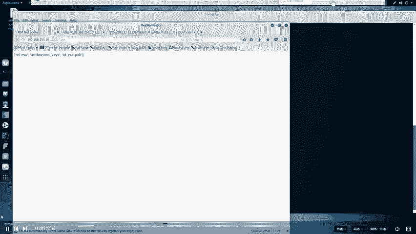

## 总结

本节课中我们一起学习了CTF中SSH私钥泄露漏洞的完整利用流程。

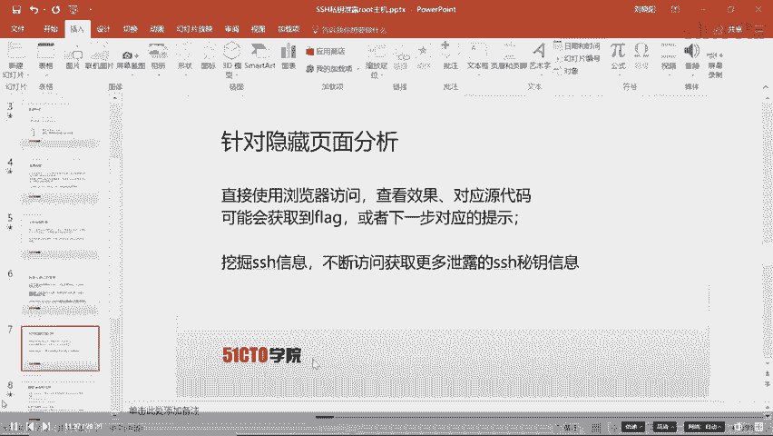

1.  **信息收集**：使用 `nmap` 扫描目标，发现开放服务。
2.  **Web探测**：访问Web服务，检查页面源码。
3.  **目录枚举**：使用 `dirb` 等工具发现隐藏目录和文件，如 `robots.txt` 和泄露的SSH私钥文件。
4.  **漏洞利用**：利用泄露的SSH私钥，通过 `ssh -i` 命令远程登录目标服务器。
5.  **权限提升**：在系统内部进行提权操作，最终获取 `root` 权限和flag。

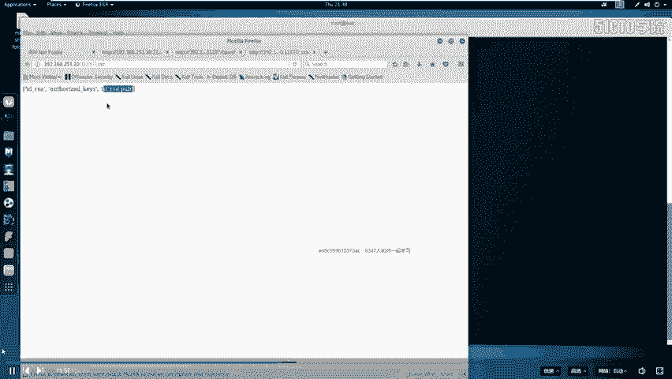

这个流程清晰地展示了从外部信息探测到内部权限获取的完整攻击链，是CTF比赛中一个经典且重要的考点。