# CTF夺旗全套视频教程：P4：SSH服务渗透（拿到第一个用户权限）🚩

在本节课中，我们将要学习如何对SSH服务进行渗透测试，从外部主机进入靶场机器，最终获取root权限并取得flag。我们将从介绍SSH协议开始，逐步深入到信息收集、弱点分析以及利用私钥获取初始访问权限的完整流程。

## SSH协议简介

SSH协议是Secure Shell的缩写，由IETF网络小组制定。其目标是在不安全的网络环境中建立安全连接。目前，SSH协议广泛用于远程登录操作，提供安全的通信保障。

SSH协议的安全性源于其对用户名、密码及所有传输数据进行加密，这在一定程度上避免了信息泄露问题。SSH最初是Linux上的一个程序，后来因其功能强大被移植到包括Windows在内的多种平台上。SSH服务默认基于**TCP 22端口**运行。

## SSH认证机制

上一节我们介绍了SSH协议，本节中我们来看看它的两种主要认证机制。

### 基于口令的安全验证

在这种机制下，用户只需知道账户和密码，即可使用SSH客户端登录到远程主机。在此过程中，所有传输的数据（包括密码）都经过加密，这有助于防范中间人攻击嗅探密码。然而，这种方式无法完全防止服务器被冒充的中间人攻击。

### 基于密钥的安全验证

这种机制依赖于密钥对。用户需要创建一对密钥：私钥和公钥。公钥需放置在需要访问的服务器上。登录时，客户端使用私钥与服务器上的公钥进行匹配验证。如果匹配成功，则允许登录。

以下是密钥文件的常见命名规则：
*   **私钥**通常命名为 `id_rsa`
*   **公钥**通常命名为 `id_rsa.pub`

## SSH认证机制的安全弱点

以上我们已经对SSH协议认证机制有了初步认识。下面我们来看看这两种认证机制存在哪些安全弱点。

### 基于口令验证的弱点

基于口令的验证方式无法避免暴力破解攻击。如果用户名存在弱口令，攻击者可以使用安全工具快速破解密码，从而通过SSH客户端连接服务器。需要注意的是，通过这种方式获得的权限不一定是root权限，可能需要进行后续的权限提升。

### 基于密钥验证的弱点

对于基于密钥的验证，攻击者可以通过对目标主机进行大量信息收集，尝试寻找泄露的私钥文件。如果获取到某个用户的私钥，就可能无需密码直接登录。登录过程通常如下：
1.  修改私钥文件权限为`600`（仅所有者可读写）。
2.  使用SSH客户端指定私钥文件进行登录。

以下是登录命令示例：
```bash
chmod 600 id_rsa
ssh -i id_rsa username@target_ip
```
同样，通过此方式登录获得的权限也不一定是root权限。

## 实验环境与信息收集

下面呢，我们介绍一下今天的CTF实验环境，并开始第一步：信息收集。

*   **攻击机**：Kali Linux， IP: `192.168.1.105`
*   **靶机**：Linux， IP: `192.168.1.106`

我们的目标是获取靶机上的flag并提升至root权限。所有操作都应围绕此目的展开。首先，我们需要探测靶机开放的服务。

以下是常用的Nmap扫描命令：
*   探测服务及版本：`nmap -sV 靶机IP`
*   探测全面信息：`nmap -A -v 靶机IP`
*   探测操作系统：`nmap -O 靶机IP`

扫描结果显示，靶机开放了**22端口（SSH服务）**和**80端口（HTTP服务）**。

## 信息分析与弱点挖掘

我们对靶场进行了服务探测。接下来，需要对收集到的信息进行分析，挖掘其中的敏感信息和安全弱点。

对于开放的SSH服务（22端口），我们可以考虑两点：
1.  尝试暴力破解用户名和密码。
2.  寻找是否存在泄露的私钥文件。

对于开放的HTTP服务（80端口），我们可以考虑：
1.  通过浏览器访问服务，获取页面展示信息（如潜在的用户名）。
2.  使用目录扫描工具，探测隐藏目录或敏感文件。

访问靶机80端口的网站后，在“About Us”页面发现了几个可能的人名：`martin`， `jen`， `jim`。这些很可能就是系统的用户名。

接下来，我们使用`dirb`工具扫描网站目录：
```bash
dirb http://192.168.1.106
```
在扫描结果中，我们发现了一个名称奇特的文件。访问该文件，其内容看起来像是一个**SSH私钥**。我们成功挖掘到了敏感信息。

此外，也可以使用`nikto`扫描器进行漏洞扫描：
```bash
nikto -host 192.168.1.106
```

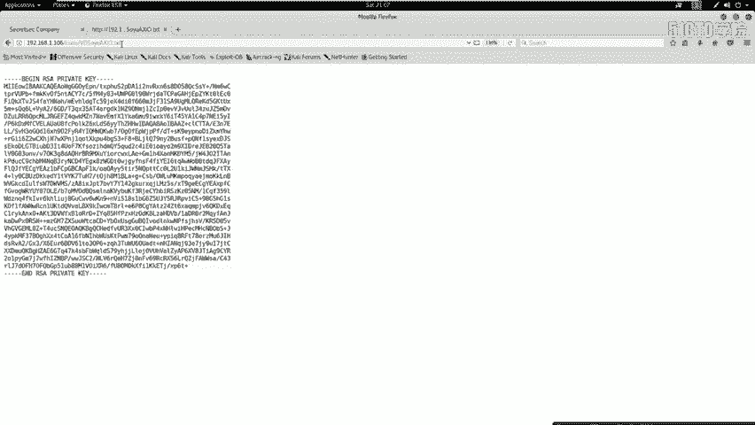

## 利用私钥获取初始访问权限

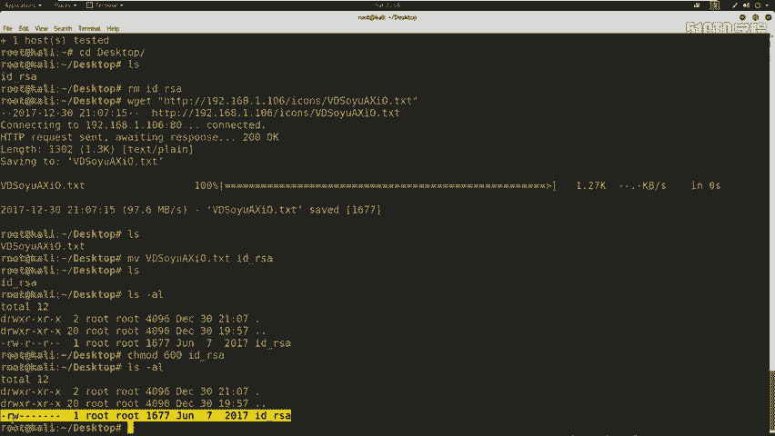

我们挖掘到敏感信息之后，就可以利用这些弱点进行渗透。本节中，我们将利用获取到的私钥文件尝试登录靶机。

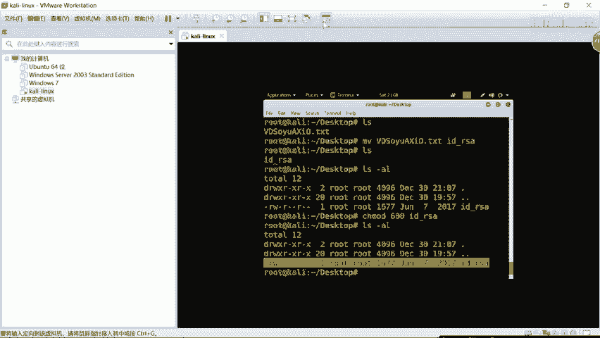

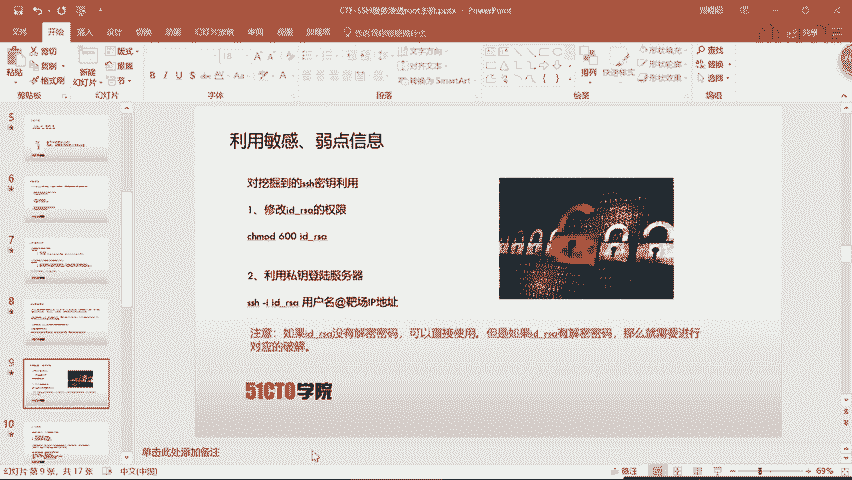

操作步骤如下：
1.  下载私钥文件。
2.  修改私钥文件权限为`600`。
3.  使用私钥尝试登录。我们需要私钥对应的用户名，结合之前在网站上发现的`martin`用户进行尝试。

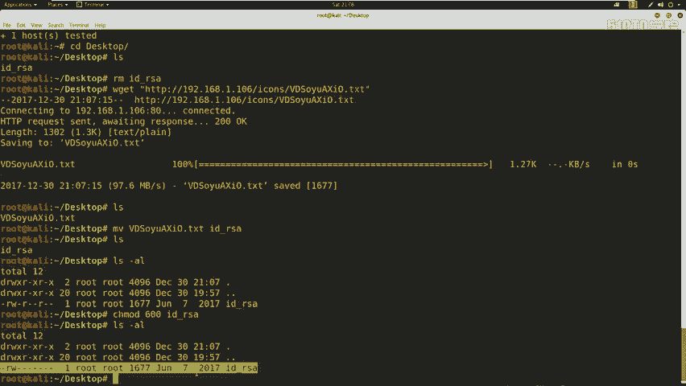

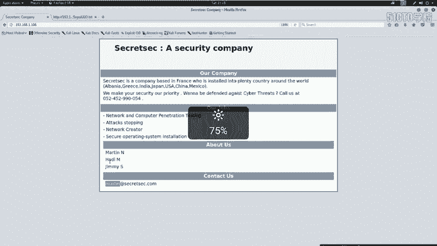

以下是实际操作命令示例：
```bash
wget http://192.168.1.106/.../id_rsa
mv id_rsa id_rsa
chmod 600 id_rsa
ssh -i id_rsa martin@192.168.1.106
```
执行后，我们成功以`martin`用户身份登录了靶机。

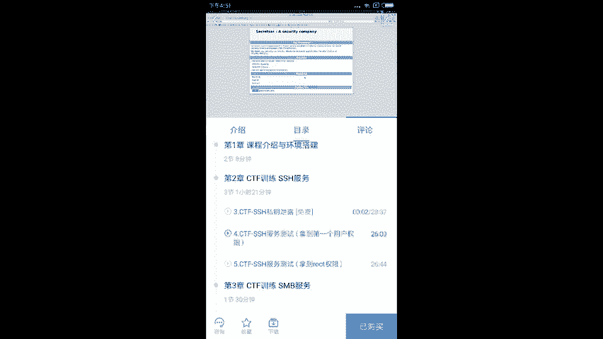

## 登录后操作与权限确认

成功登录服务器后，我们需要评估当前权限并寻找flag。

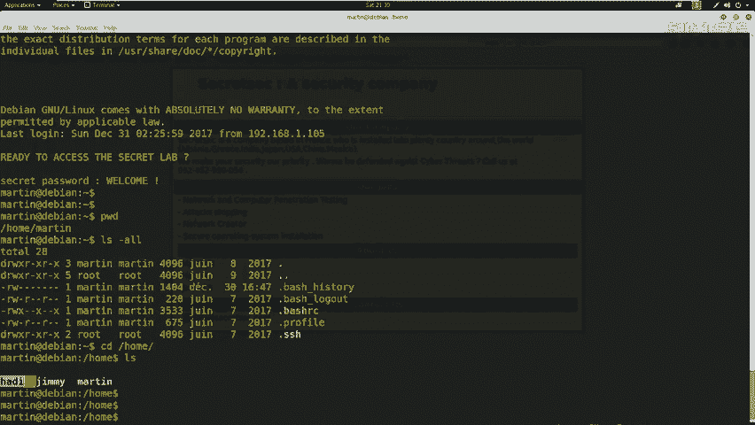

可以执行以下命令：
*   `id`：查看当前用户的权限信息。
*   `pwd`：查看当前工作目录。
*   `ls -la /home`：查看系统存在哪些用户。
*   在根目录`/`或用户目录下寻找flag文件（如`flag.txt`， `proof.txt`等）。

执行`id`命令后，我们发现当前用户`martin`只是一个普通用户，并非root。这意味着我们只拿到了第一个用户权限，还需要进一步**提权**才能读取属于root的flag文件。

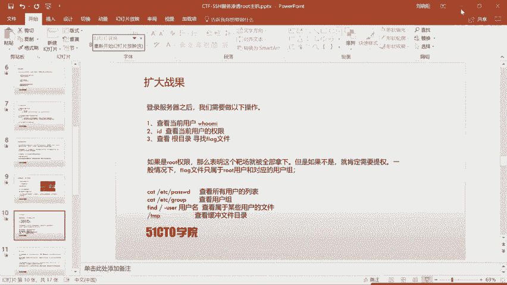

## 总结

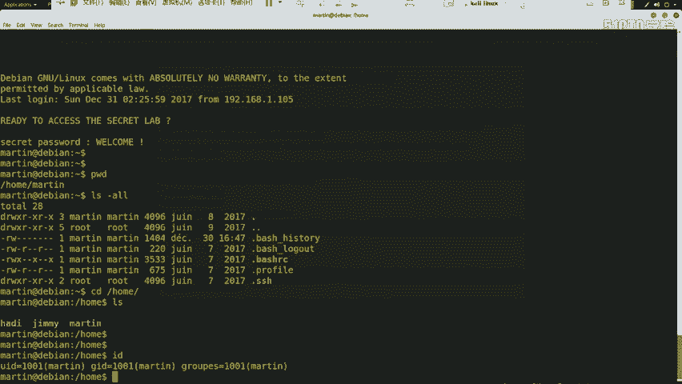

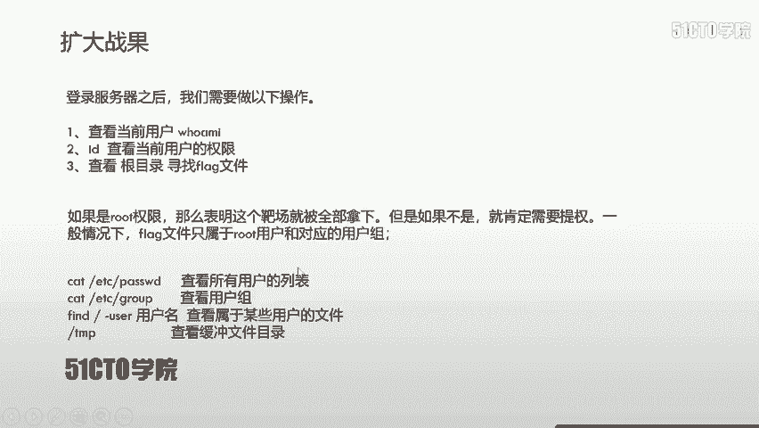

本节课中，我们一起学习了针对SSH服务的渗透测试方法。我们从SSH协议和认证机制讲起，分析了其安全弱点。随后，通过Nmap扫描、Web信息收集和目录扫描，我们发现了潜在的SSH用户名和泄露的私钥文件。最后，我们利用私钥成功登录靶机，获得了第一个用户（`martin`）的权限。然而，这并非终点，我们当前的权限并非root，下节课我们将学习如何进一步提升权限，直至完全控制靶机。