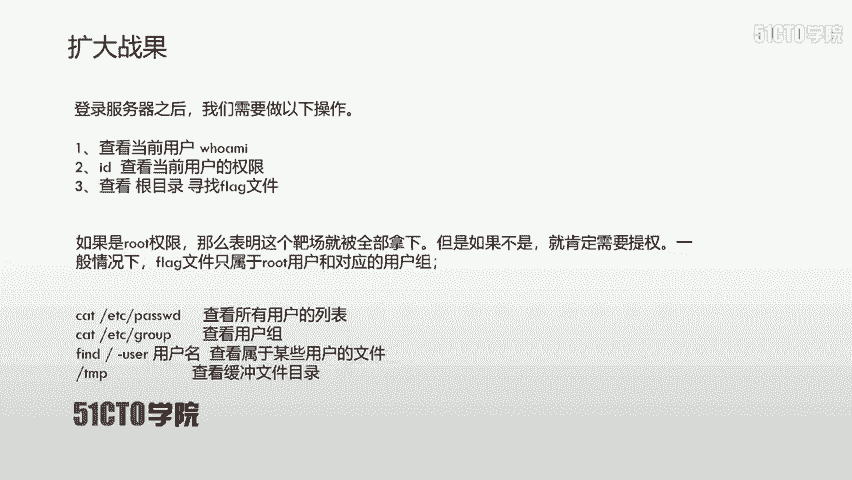
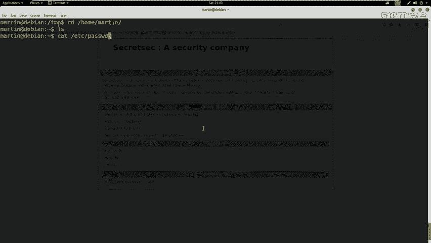
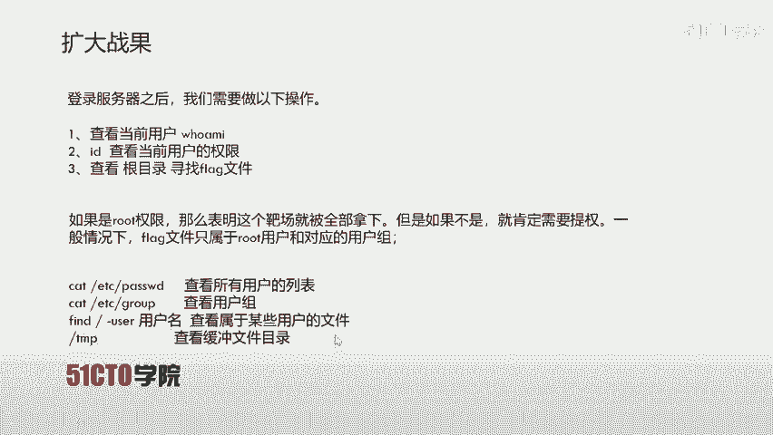
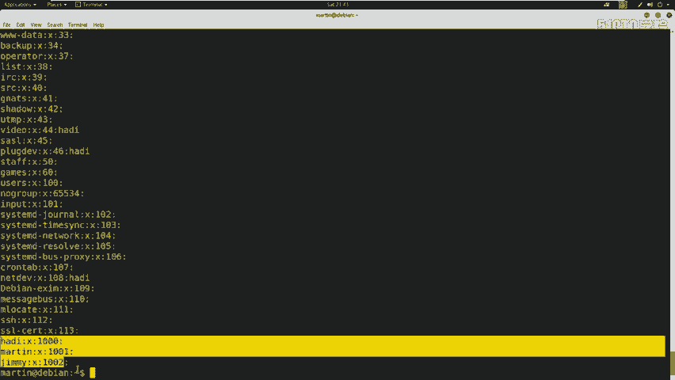
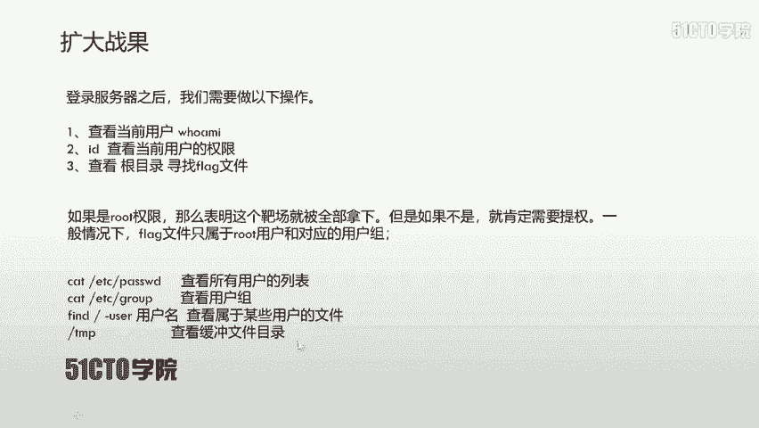
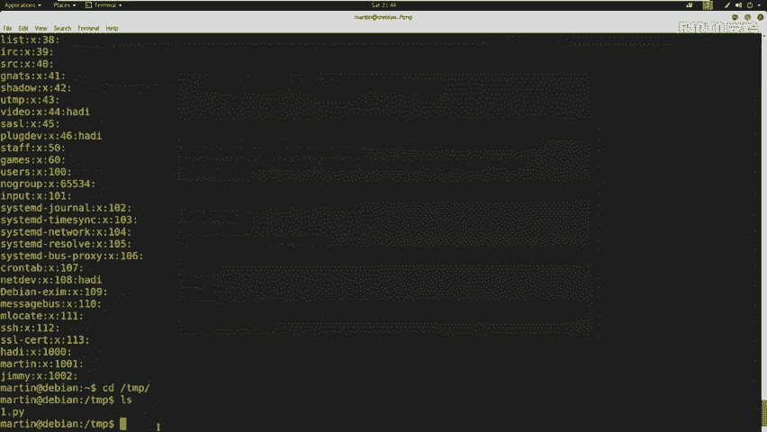
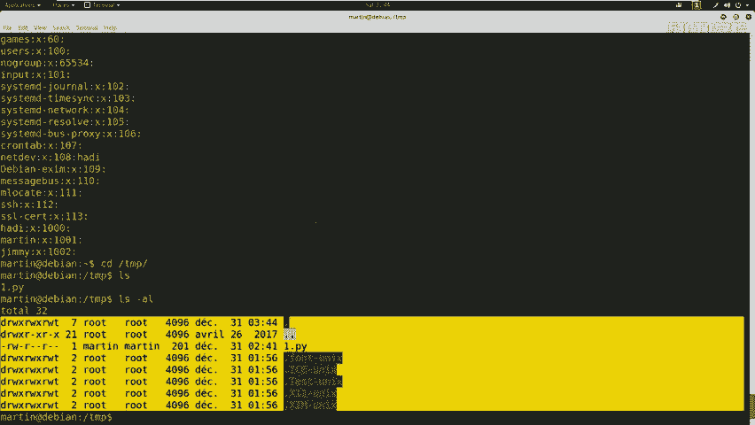

# CTF夺旗全套视频教程-网络安全：P5：SSH服务测试（拿到root权限）🚩

在本节课中，我们将学习如何从已获得的普通用户权限（martin用户）出发，通过信息收集和权限提升技术，最终获取目标服务器的最高管理员（root）权限。

上节课我们讲到已经使用martin用户登录了服务器，并查看了其权限和所属用户组。我们发现当前登录的martin用户并非我们最终需要的root权限用户。因此，我们需要进行权限提升。通常，系统的关键文件（如`/flash`目录）是属于root用户及其用户组的。

## 信息收集与系统侦察🔍

在进行提权操作之前，我们可以使用几条命令来收集系统配置和用户信息，这有助于我们寻找提权的潜在路径。

以下是几条常用的信息收集命令：

*   **查看所有用户列表**：使用 `cat /etc/passwd` 命令可以列出系统上的所有用户账户信息。
*   **查看所有用户组列表**：使用 `cat /etc/group` 命令可以列出系统上的所有用户组信息。
*   **查找属于特定用户的文件**：使用 `find / -user [用户名]` 命令可以在根目录 `/` 下搜索属于指定用户的所有文件。
*   **检查临时目录**：临时目录 `/tmp` 常常存放着系统或用户进程产生的临时文件，有时可能包含敏感信息或可利用的脚本。

## 实战操作演示💻

现在，让我们在目标主机上执行这些命令。

首先，执行 `cat /etc/passwd` 查看所有用户。

可以看到，系统中存在 `jim`、`martin`、`heading` 等用户，以及 `root` 用户和一些系统内置用户。

接下来，执行 `cat /etc/group` 查看所有用户组。

列表中显示了 `handing`、`martin`、`j` 等用户组以及多个系统用户组。

然后，我们切换到临时目录 `/tmp` 进行查看。使用命令 `cd /tmp` 进入目录，再使用 `ls` 列出文件。

目录中有一个 `1.py` 文件，这是之前上传的测试文件。在实际的CTF场景或渗透测试中，如果这里没有我们上传的文件，通常也看不到任何可见文件。

此时，目录下可能只存在一些隐藏文件。

## 总结📝

本节课中，我们一起学习了在获得初始立足点（martin用户）后，如何进行初步的信息收集。我们查看了系统的用户和用户组列表，并检查了可能存放临时或敏感文件的 `/tmp` 目录。这些信息是后续寻找权限提升漏洞、最终获取root权限的重要基础。在接下来的课程中，我们将基于这些信息，探索具体的提权方法。