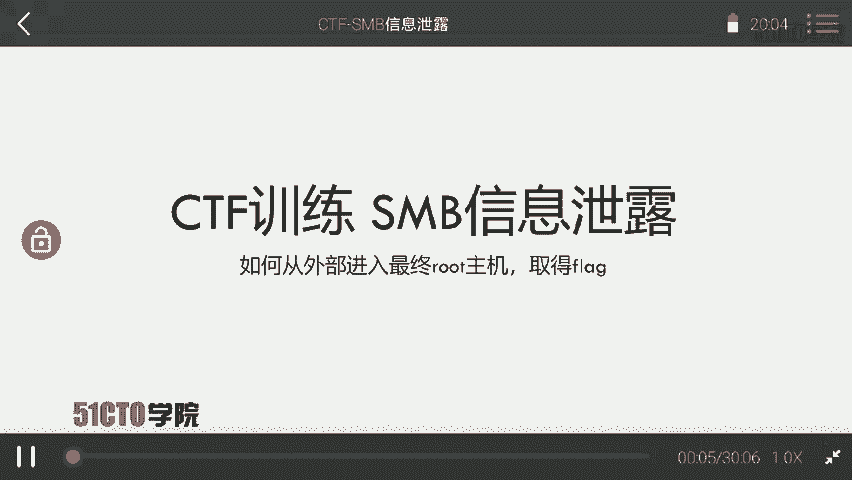
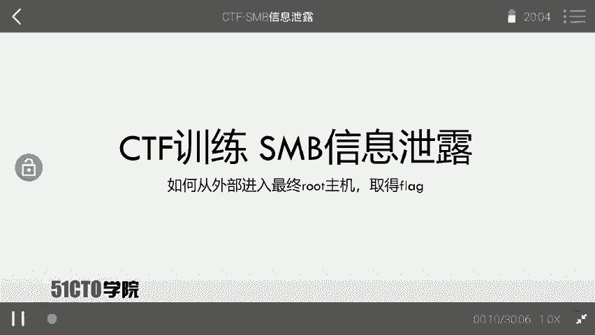
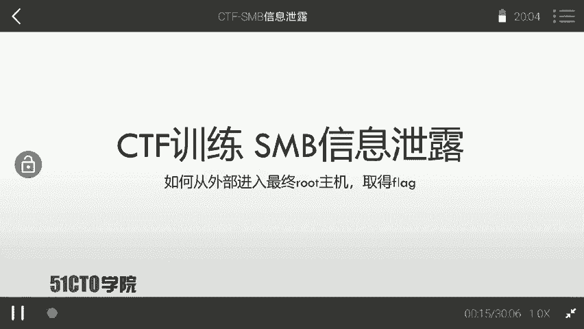
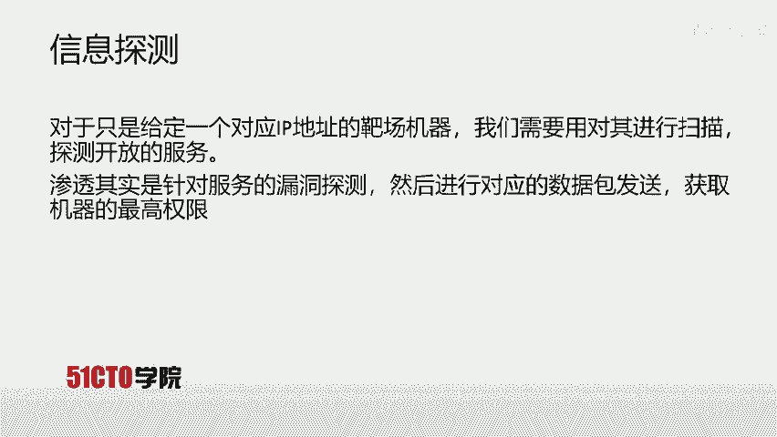

# CTF夺旗全套视频教程-网络安全：P6：CTF夺旗-SMB信息泄露

在本节课中，我们将学习如何利用SMB（服务器消息块）协议的信息泄露漏洞。我们将从信息收集开始，逐步探测目标主机开放的SMB服务，最终通过泄露的信息获取主机权限，并提升至root权限，从而取得目标flag值。

## 什么是SMB协议？

上一节我们明确了课程目标，本节中我们来看看SMB协议本身。



SMB是Server Message Block的缩写。它是一个通信协议，由微软和英特尔公司在1987年制定的一个网络协议，主要作为微软网络的通信协议。后来，Linux系统移植了SMB协议，并将其改名为Samba。

SMB协议基于TCP/IP协议栈，通常使用的端口号是139和445。SMB协议用于访问计算机共享资源。可以通过共享文件夹来启用SMB协议。远程计算机就可以通过该协议来下载对应的资源。



例如，在以下网络拓扑中，一台计算机开放了SMB协议并设置了共享。另一台机器就可以通过网络连接这台计算机，并下载其上的资源。





## 实验环境介绍

了解了SMB协议的基本概念后，我们来搭建本次实验的操作环境。

本次实验环境如下：
*   **攻击机**：使用Kali Linux系统，IP地址为 `192.168.253.12`。
*   **靶机**：使用Linux系统，IP地址为 `192.168.253.17`。

我们的最终目标是获取靶机上的flag值。这意味着我们需要想方设法获取靶机的控制权限。


## 渗透测试流程：信息收集

拿到靶机IP地址后，第一步是进行信息收集。

我们需要对靶机进行扫描，探测其开放的服务，并寻找可利用的弱点。渗透测试的本质，就是针对目标机器开放的服务进行漏洞探测，通过发送精心构造的数据包，来获取机器的最高权限。

以下是信息收集的典型步骤：

1.  **使用Nmap进行端口扫描**：探测目标开放了哪些端口和服务。
    ```bash
    nmap -sV -sC 192.168.253.17
    ```
    这条命令会扫描目标IP的常见端口，并尝试识别服务版本和运行默认脚本。

2.  **针对SMB服务进行专项探测**：如果发现开放了139或445端口，可以使用专门工具进行深入探测。
    ```bash
    nmap --script smb-os-discovery 192.168.253.17
    ```

3.  **枚举SMB共享**：尝试列出目标主机上所有可用的共享文件夹。
    ```bash
    smbclient -L //192.168.253.17 -N
    ```
    参数 `-L` 表示列表，`-N` 表示匿名登录（不提供密码）。


## 利用信息泄露获取权限

在完成信息收集后，我们可能会发现SMB服务配置不当，例如存在匿名可访问的共享，或者共享中包含了敏感信息（如配置文件、备份文件、密码哈希等）。

假设通过枚举，我们发现了一个名为 `conf` 的共享，并且可以匿名访问。

1.  **连接SMB共享**：
    ```bash
    smbclient //192.168.253.17/conf -N
    ```
    成功连接后，会进入SMB命令行界面。

2.  **浏览并下载敏感文件**：
    在SMB命令行中，使用 `ls` 查看文件，使用 `get` 命令下载文件。例如，发现了一个 `config.txt` 文件：
    ```bash
    smb: \> get config.txt
    ```
    下载到本地后，检查该文件内容，可能包含数据库密码、SSH密钥或其他服务的凭据。

3.  **利用泄露的凭据**：如果文件中泄露了SSH密码或密钥，我们可以尝试登录靶机。
    ```bash
    ssh user@192.168.253.17
    ```
    输入找到的密码，或使用找到的私钥文件进行连接。


## 权限提升与获取Flag

成功获得一个初始shell（通常是普通用户权限）后，下一步是提升权限。

1.  **信息收集（内部）**：在靶机内部，检查当前用户权限、sudo权限、SUID文件、计划任务等，寻找提权机会。
    ```bash
    sudo -l
    find / -perm -u=s -type f 2>/dev/null
    ```

2.  **利用漏洞提权**：根据收集到的信息，利用相应的漏洞或配置错误提升至root权限。例如，发现某个具有SUID权限的程序存在漏洞。

3.  **获取Flag**：获得root权限后，通常可以在 `/root` 目录或指定位置找到flag文件。
    ```bash
    cat /root/flag.txt
    cat /home/user/flag.txt
    ```


## 总结

本节课中我们一起学习了SMB信息泄露的完整利用流程。



我们首先介绍了SMB协议的基本概念和作用。然后，我们搭建了实验环境，明确了攻击机和靶机的角色。接着，我们遵循标准的渗透测试流程，从使用Nmap进行端口扫描和信息收集开始，重点探测了SMB服务。通过工具枚举，我们发现了配置不当的SMB共享，并从中下载了包含敏感信息的文件。利用泄露的凭据，我们成功获得了靶机的初始访问权限。最后，通过在靶机内部进行信息收集和漏洞利用，我们将权限提升至root，并最终找到了目标flag。

这个流程清晰地展示了如何将一个看似微小的信息泄露点，通过层层利用，最终转化为系统的完全控制权。