# CTF夺旗全套视频教程：P8：CTF夺旗实战演练 🚩

在本节课中，我们将学习如何在CTF（Capture The Flag）比赛中进行实战演练。我们将从一个给定的实验环境出发，通过一系列信息探测、服务分析和漏洞利用的步骤，最终找到并提交隐藏的flag，从而获得分数。


---

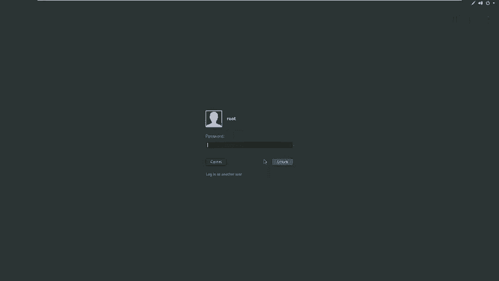

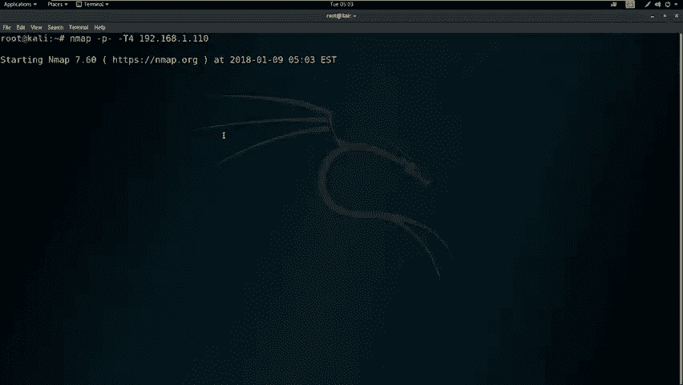

## 实验环境概述

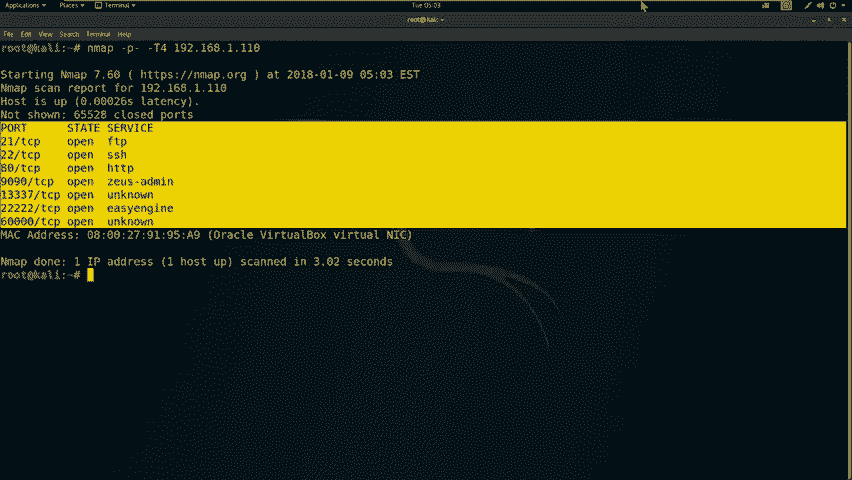

我们的实验环境包含两台机器：
*   **攻击机**：Kali Linux，IP地址为 `192.168.1.111`。
*   **靶机**：Linux系统，IP地址为 `192.168.1.110`。

我们的核心目标是探测靶机上存储flag的位置，获取其值并提交。

---

## 第一步：信息探测与端口扫描

在获得靶机IP地址后，第一步是进行信息探测，以了解靶机开放了哪些服务。

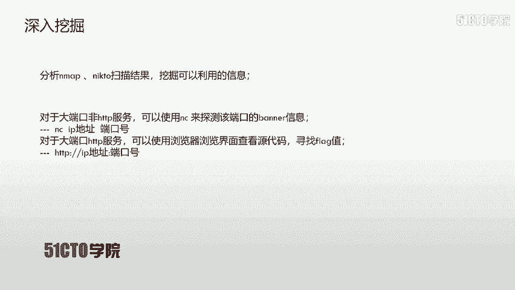

以下是进行端口扫描的两种常用方法：

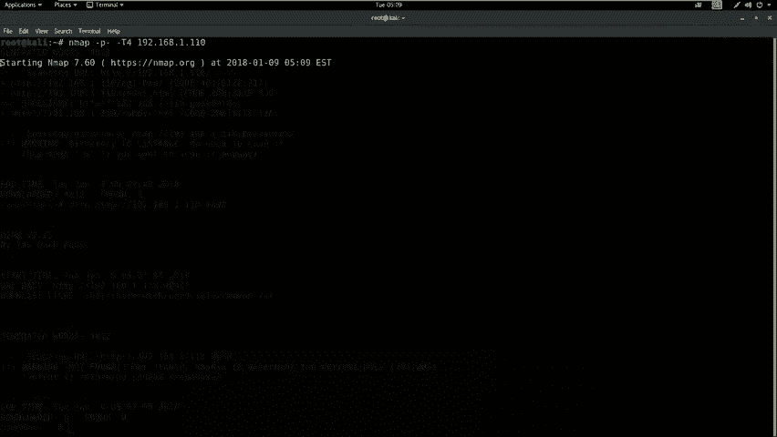

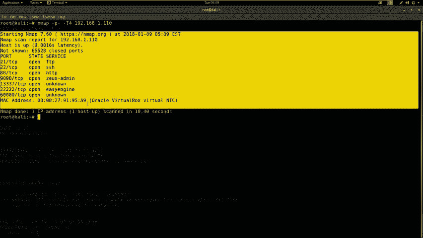

**1. 快速全端口扫描**
此命令用于快速扫描靶机所有（0-65535）端口。
```bash
nmap -p- -T4 192.168.1.110
```
*   `-p-`：扫描所有端口。
*   `-T4`：设置扫描速度为最快。
*   执行后，可以快速获得开放的端口列表。

**2. 全面信息探测扫描**
此命令使用Nmap的所有脚本模块进行更深入的探测。
```bash
nmap -T4 -A -v 192.168.1.110
```
*   `-A`：启用操作系统检测、版本检测、脚本扫描和路由追踪。
*   `-v`：显示详细输出。
*   注意：此扫描可能遗漏某些非常规端口，因此建议结合第一种方法使用。

扫描结果显示靶机开放了多个端口，包括21（FTP）、22（SSH）、80（HTTP）、9090（HTTP）、13337、60000等。

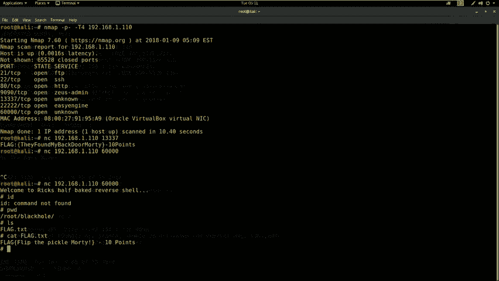

---

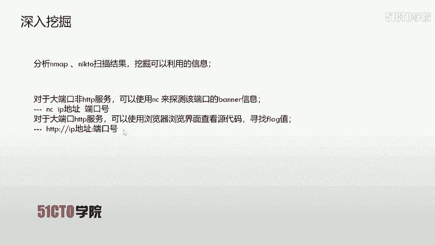

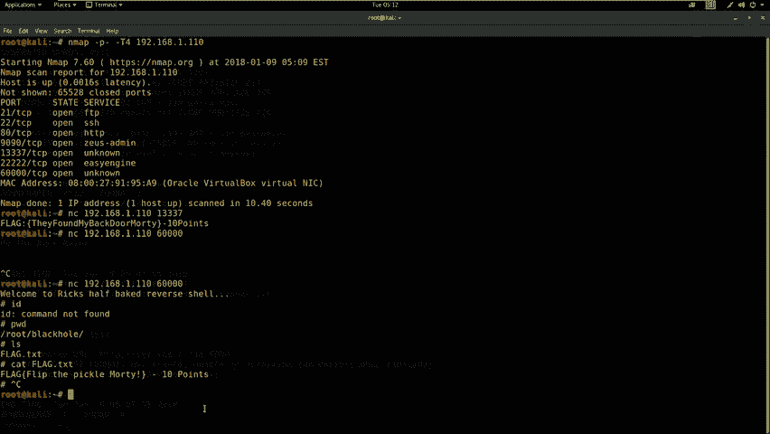

## 第二步：Web服务敏感信息探测

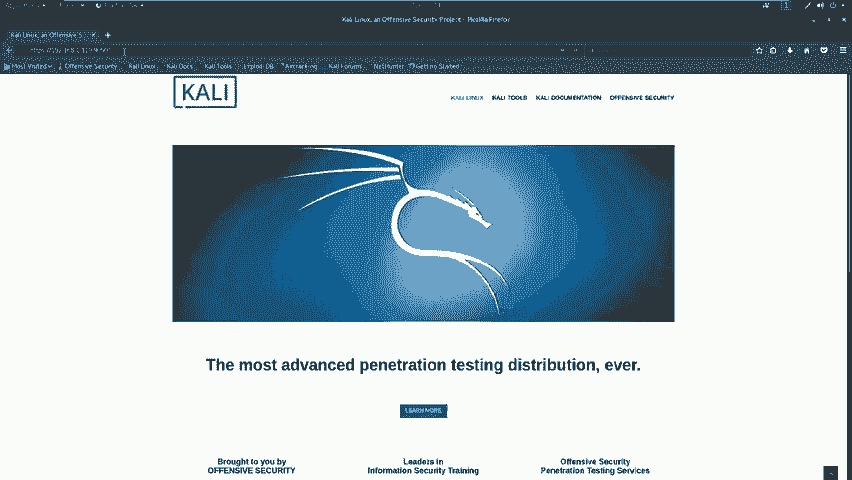

对于开放的HTTP服务（如80、9090端口），我们可以使用专门工具探测其敏感目录和文件。

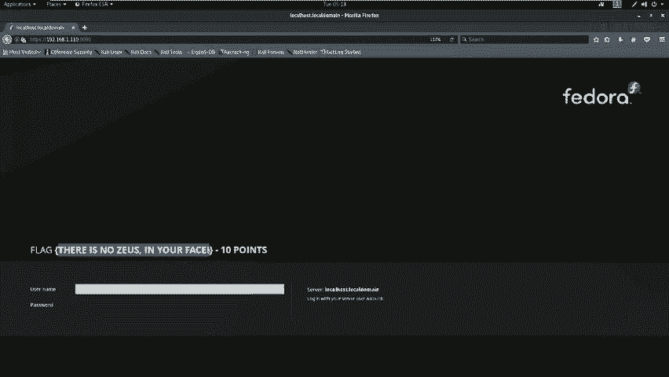

**1. 使用Nikto进行漏洞扫描**
Nikto是一款Web服务器扫描器，用于查找潜在的危险文件和配置。
```bash
# 扫描80端口（默认HTTP端口可省略）
nikto -host http://192.168.1.110
# 扫描非标准端口（如9090）必须指定端口
nikto -host http://192.168.1.110:9090
```

**2. 使用Dirb进行目录爆破**
Dirb通过字典攻击来发现Web服务器上隐藏的目录和文件。
```bash
# 扫描80端口
dirb http://192.168.1.110
# 扫描9090端口
dirb http://192.168.1.110:9090
```
Dirb对80端口的扫描发现了 `/passwd/` 等敏感目录。

---

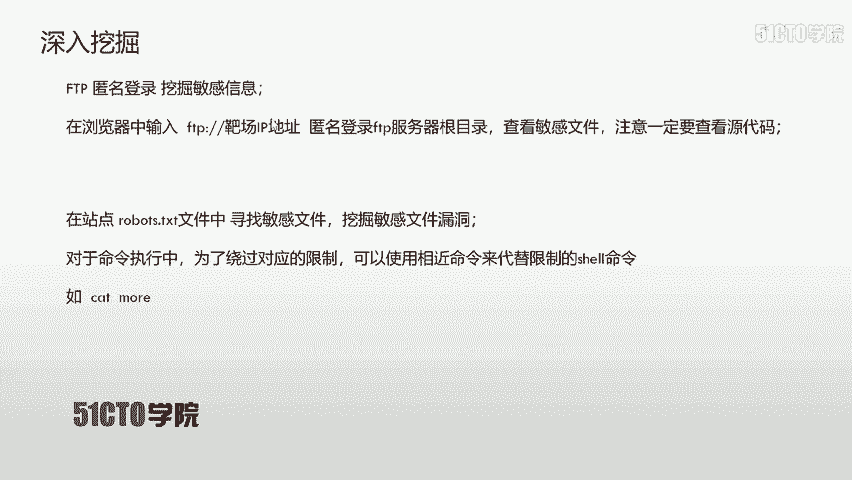

## 第三步：分析扫描结果并深入挖掘

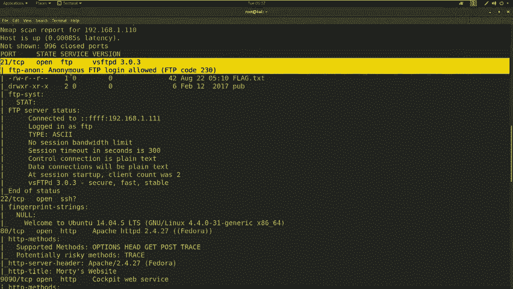

在完成初步探测后，我们需要分析结果，寻找可利用的入口点。


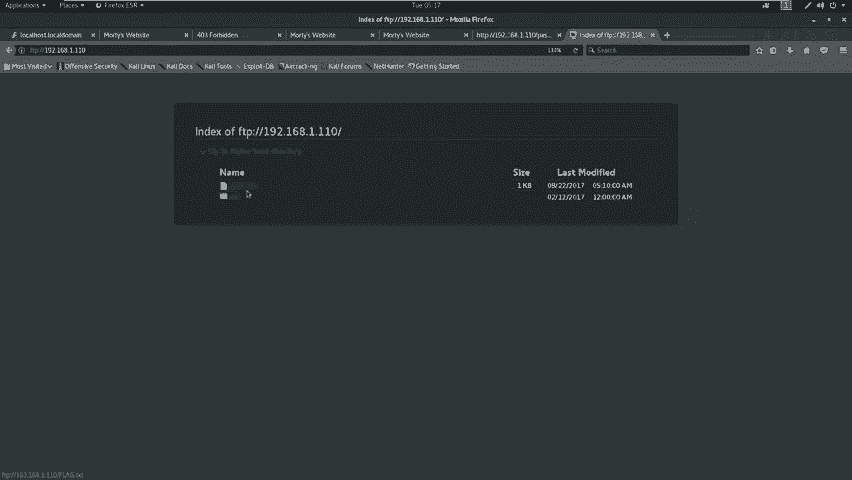

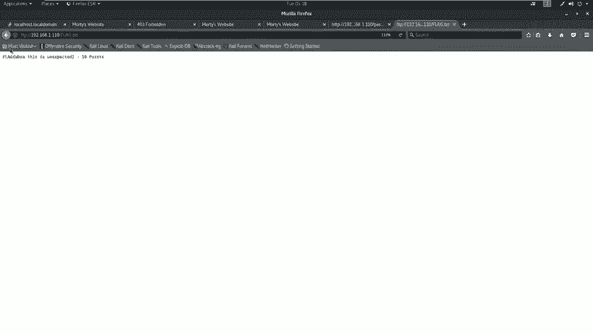

**1. 探测未知服务的Banner信息**
对于扫描结果中显示“unknown”服务的大端口（如13337、60000），可以使用Netcat（nc）连接并获取其Banner信息，其中可能包含flag。
```bash
# 连接13337端口
nc 192.168.1.110 13337
```
执行后，直接从返回的Banner信息中获得了第一个flag。

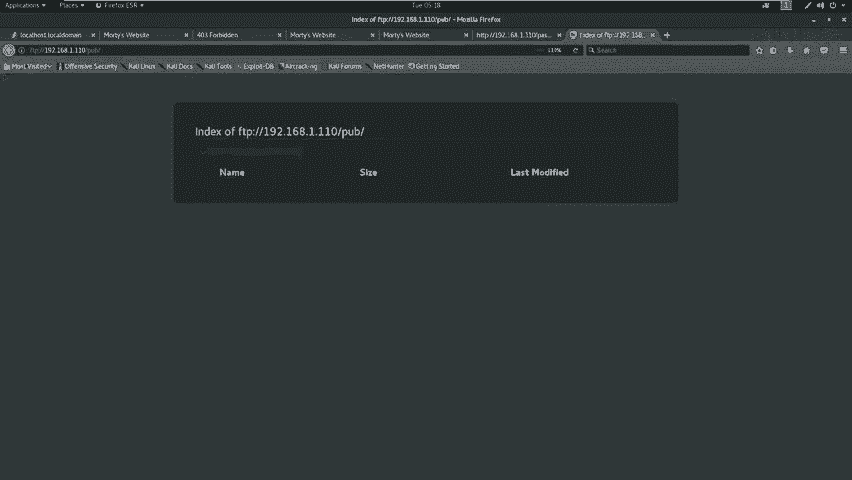

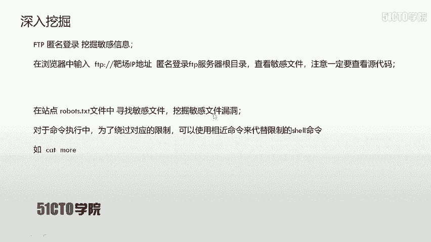

**2. 交互式Shell与文件查看**
继续探测60000端口。
```bash
nc 192.168.1.110 60000
```
连接后，获得了一个Shell。通过执行以下命令查找flag：
```bash
pwd        # 查看当前目录
ls         # 列出文件
more flag.txt # 查看flag文件（该环境过滤了`cat`命令）
```
使用 `more` 命令成功读取了第二个flag。

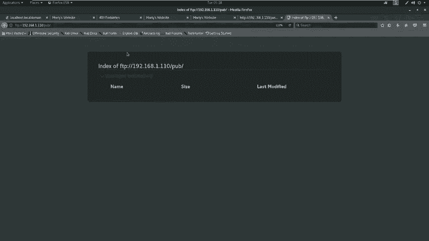


**3. 浏览器访问Web服务**
对于大端口HTTP服务（如9090），直接使用浏览器访问 `http://192.168.1.110:9090`，在页面中发现了第三个flag。

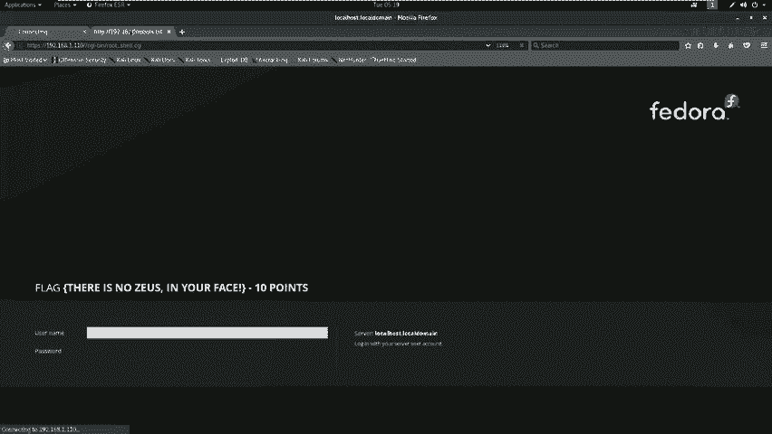

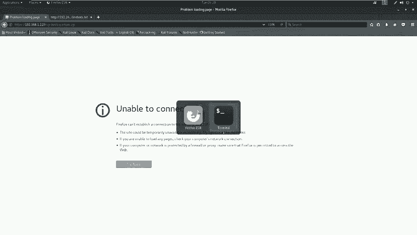

对于80端口的Web服务，访问Dirb发现的敏感目录 `/passwd/`，直接找到了 `flag.txt` 文件，获得第四个flag。同时，该目录下的 `password.html` 文件的源代码注释中提示了一个密码：`winter`。

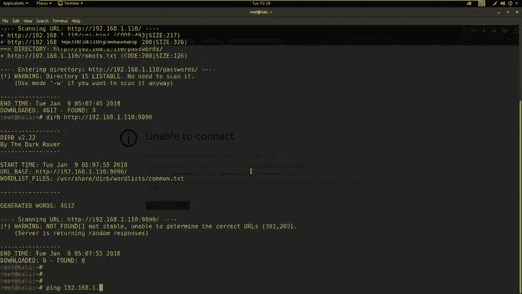

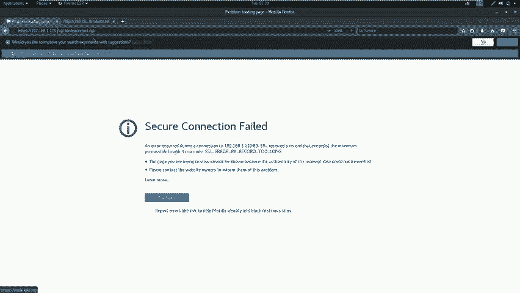

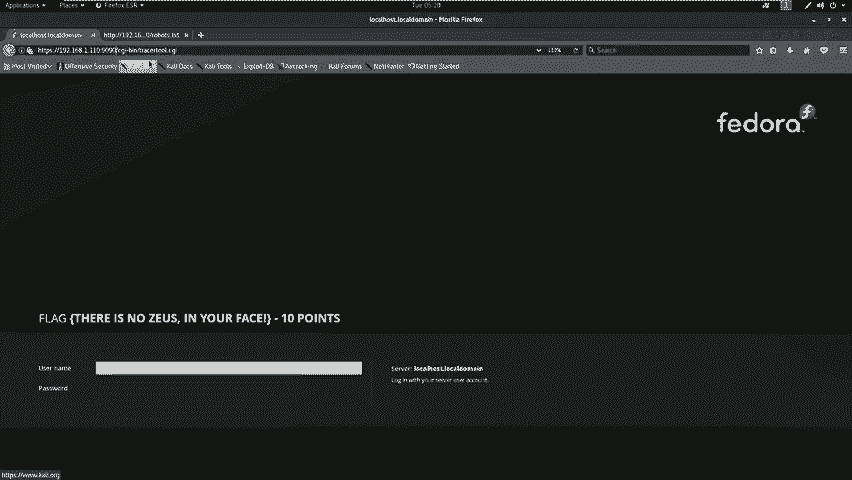

**4. 利用FTP匿名登录**
扫描显示21端口FTP服务支持匿名登录。在浏览器中访问 `ftp://192.168.1.110`，在根目录下发现 `flag.txt`，获得第五个flag。

**5. 检查Robots文件**
访问 `http://192.168.1.110/robots.txt`，发现了被禁止爬取的目录，如 `/cgi-bin/root-shell.cgi` 和 `/cgi-bin/cmd.cgi`。访问后者，发现一个用于路由追踪的输入框，可能存在命令注入漏洞。

---

## 第四步：漏洞利用与权限提升

**1. 测试命令注入漏洞**
在 `/cgi-bin/cmd.cgi` 页面的输入框中，尝试注入系统命令。
*   输入 `127.0.0.1; id`，回显显示当前用户为 `apache`，证实存在命令注入。
*   尝试 `127.0.0.1; cat /etc/passwd` 被拦截，说明过滤了 `cat` 命令。
*   使用功能相近的 `more` 命令绕过：`127.0.0.1; more /etc/passwd`。成功读取系统用户列表，发现用户 `summer`。

**2. 尝试远程登录**
结合之前获得的密码 `winter` 和用户名 `summer`，尝试SSH登录。常规22端口被拒，但扫描结果显示512端口运行着类似服务。
```bash
ssh -p 512 summer@192.168.1.110
```
输入密码 `winter` 后，成功登录靶机系统。

**3. 在远程Shell中寻找最终flag**
登录后，在用户目录下发现 `flag.txt`。再次使用 `more` 命令查看，获得了最终的flag。
```bash
pwd
ls
more flag.txt
```

---

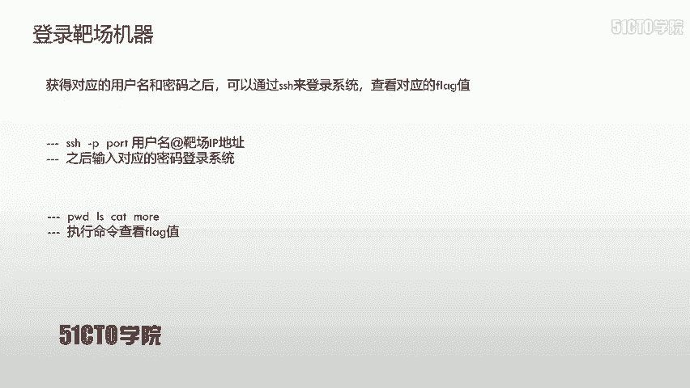

## 总结与核心要点 🎯

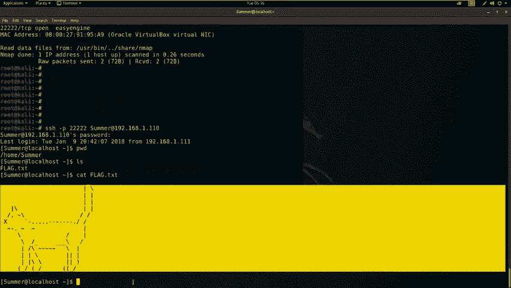

本节课我们一起学习了CTF实战的基本流程。以下是需要牢记的核心要点：

1.  **全面探测**：对靶机所有开放端口和服务进行细致探测，不要遗漏任何信息。结合使用 `nmap -p-` 和 `nmap -A`，并利用 `nikto`、`dirb` 等工具辅助。
2.  **Banner信息**：对于未知服务，使用 `nc` 连接获取Banner，可能直接暴露flag或关键信息。
3.  **命令注入与绕过**：对Web输入点进行命令注入测试。如果常用命令（如`cat`）被过滤，尝试使用功能相近的命令（如`more`、`less`、`head`）进行绕过。
4.  **信息关联利用**：将各处收集到的信息（如源码注释中的密码、`/etc/passwd`中的用户名）关联起来，尝试进行身份认证（如SSH登录），从而深入系统。
5.  **检查所有服务**：FTP、SSH、HTTP、CGI等每一个服务都可能存在弱点或隐藏信息，务必逐一检查。

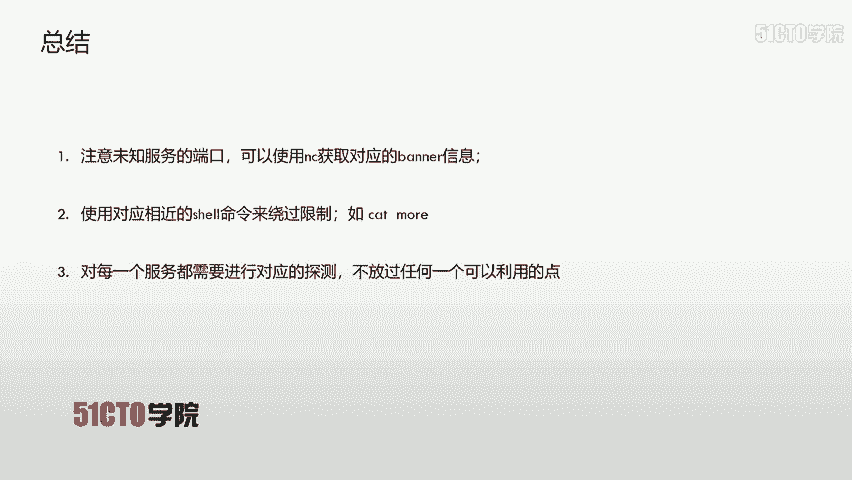

在CTF比赛中，耐心、细致和联想能力至关重要。本节课的演练涵盖了从信息收集到漏洞利用的完整链条，希望大家能掌握这些基本思路和方法。