# CTF夺旗赛教程：P11：13.CTF夺旗-Capture the flag入门教学 🚩

在本节课中，我们将学习CTF夺旗赛的基本概念，并通过一个完整的实战演练，掌握从信息探测到获取Flag的完整流程。我们将使用Kali Linux作为攻击机，对一个靶场环境进行渗透测试。

---

## 概述

CTF是一种流行的信息安全竞赛形式，英文全称是“Capture The Flag”，直译为“夺得旗帜”，也常被称为“夺旗赛”。其核心流程是：参赛团队通过信息对抗、程序分析等手段，率先从主办方提供的比赛环境中找到一串特定格式的字符串（即Flag）并提交，从而获得分数。

本节课我们将在一个模拟的CTF环境中，学习如何系统地探测目标、分析服务并最终获取多个Flag。

---

## 实验环境搭建

我们的实验环境包含两台机器：
*   **攻击机**：Kali Linux，IP地址为 `192.168.1.111`。
*   **靶场机器**：使用Linux系统，IP地址为 `192.168.1.110`。

我们的所有操作都围绕一个核心目标展开：**获取靶场机器上存储的Flag值**。

---

## 第一步：信息探测

在获得靶场IP地址后，第一步是进行信息探测，以了解目标开放了哪些服务。

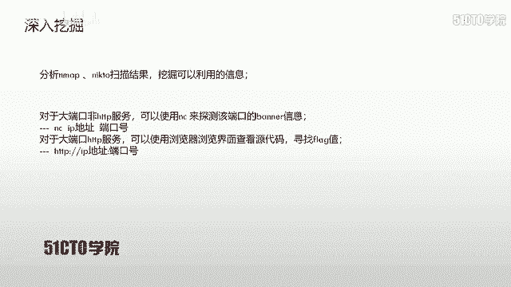

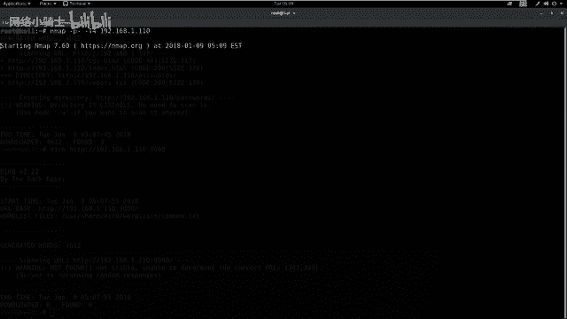

### 端口扫描

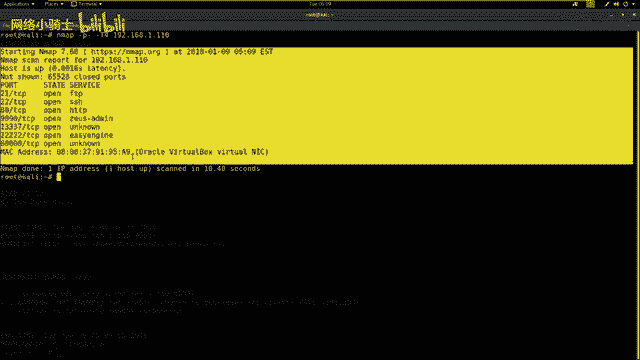

我们使用 `nmap` 工具来扫描靶场机器开放的端口。以下是两个常用的扫描命令：

1.  **快速全端口扫描**：此命令扫描所有65535个端口，并使用最快速度（`-T4`）。
    ```bash
    nmap -p- -T4 192.168.1.110
    ```
    执行后，`nmap` 会列出所有开放的端口及其对应的服务。

2.  **全面信息探测**：此命令使用 `nmap` 的所有扫描脚本（`-A`）并以详细模式（`-v`）输出，进行更深入的信息收集。
    ```bash
    nmap -T4 -A -v 192.168.1.110
    ```
    需要注意的是，全面扫描有时可能会遗漏某些端口，因此**结合使用以上两条命令**是更稳妥的做法。

### Web服务敏感信息探测

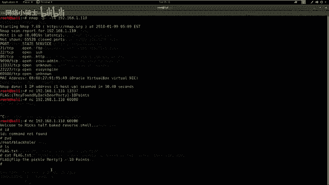

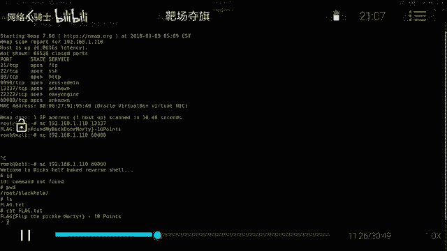

对于扫描结果中开放的HTTP服务（如80、9090端口），我们可以使用专门工具探测其敏感目录或文件。

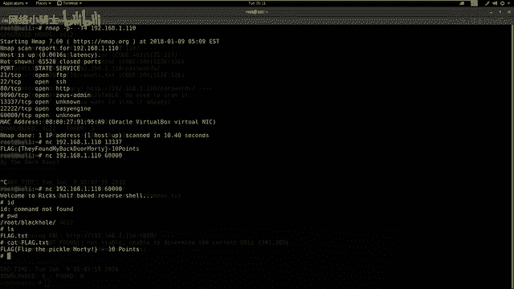

以下是两个常用工具：

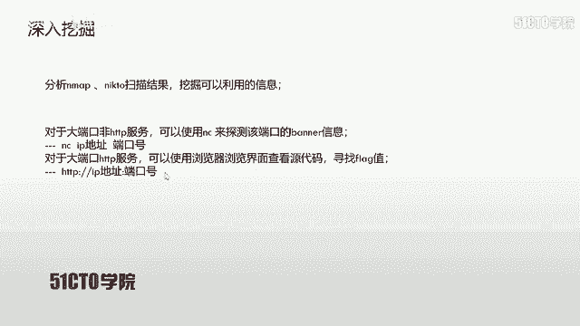

*   **使用 `nikto` 扫描Web漏洞**：
    ```bash
    # 扫描80端口（可省略端口号）
    nikto -host http://192.168.1.110
    # 扫描非80端口（如9090）必须指定端口
    nikto -host http://192.168.1.110:9090
    ```


*   **使用 `dirb` 探测Web目录**：
    ```bash
    # 扫描80端口
    dirb http://192.168.1.110
    # 扫描9090端口
    dirb http://192.168.1.110:9090
    ```
    `dirb` 会尝试暴力破解常见的目录和文件名，有助于发现隐藏的访问路径。

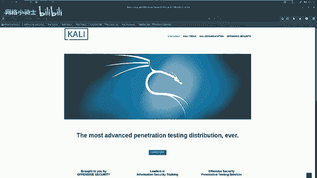

---

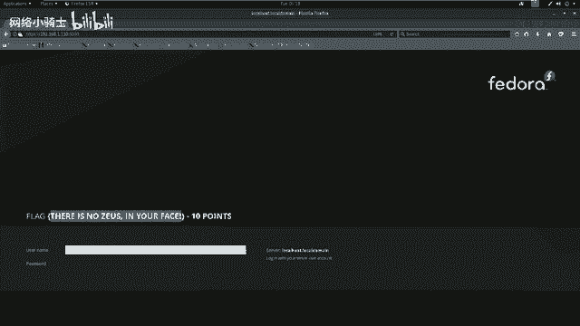

## 第二步：分析扫描结果并挖掘信息

在完成初步探测后，我们需要分析 `nmap` 和 `nikto` 的扫描结果，挖掘其中可利用的信息。

### 探测未知服务的Banner信息

扫描结果中可能会出现一些运行在非常见大端口（如13337, 60000）上的“未知”服务。我们可以使用 `netcat (nc)` 工具连接这些端口，获取其Banner信息，其中可能直接包含Flag。

**命令格式**：
```bash
nc 192.168.1.110 <端口号>
```

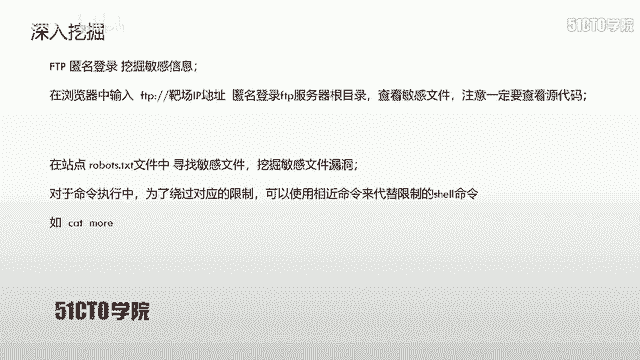

**实战操作**：
1.  连接 `13337` 端口：
    ```bash
    nc 192.168.1.110 13337
    ```
    连接后，服务返回的Banner信息中直接包含了第一个Flag。
2.  连接 `60000` 端口：
    ```bash
    nc 192.168.1.110 60000
    ```
    连接后，我们获得了一个反向Shell。通过执行 `ls` 命令发现当前目录下存在 `flag.txt` 文件。使用 `cat flag.txt` 命令即可获得第二个Flag。

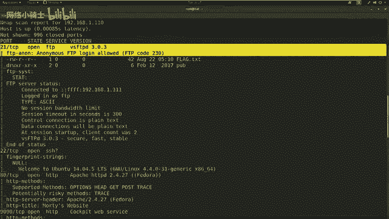

### 检查Web界面与源代码


对于探测到的大端口HTTP服务（如9090端口），我们可以直接使用浏览器访问。

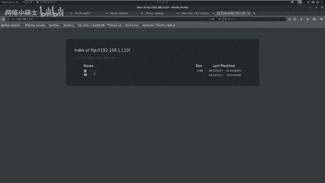


**操作流程**：
1.  在浏览器中访问 `http://192.168.1.110:9090`。
2.  在页面中直接找到了第三个Flag。

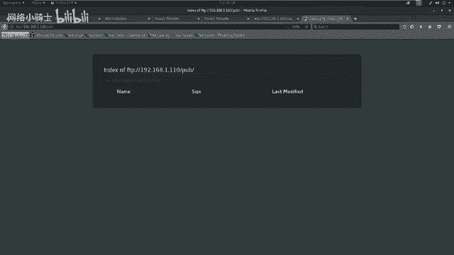

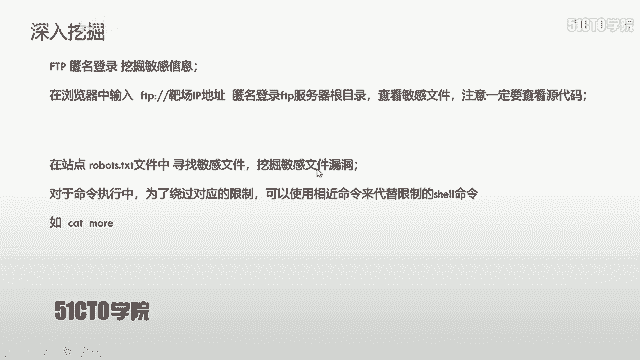

对于常见的80端口Web服务，则需要更仔细地检查：
1.  访问 `http://192.168.1.110`。
2.  根据 `dirb` 扫描结果，尝试访问发现的敏感目录，如 `/passwords/`。
3.  在 `/passwords/` 目录下，发现并访问 `flag.txt` 文件，获得第四个Flag。
4.  同时，检查该目录下的 `password.html` 文件的源代码，在注释中发现了一个密码提示：`win`。此信息需记录下来，后续可能用到。

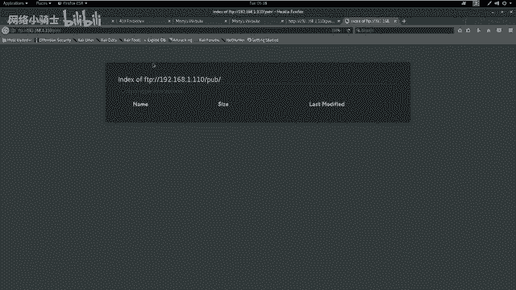

---


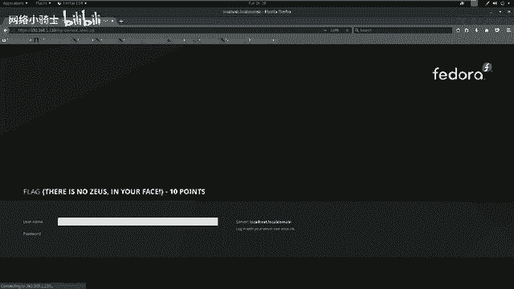

## 第三步：深入利用各类服务

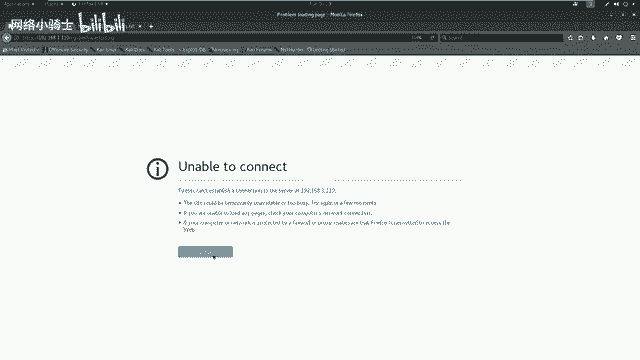

不要放过任何已开放的服务，每个都可能成为突破口。

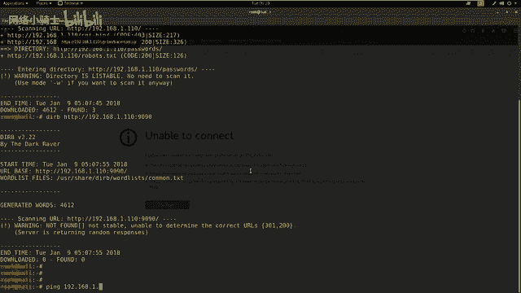

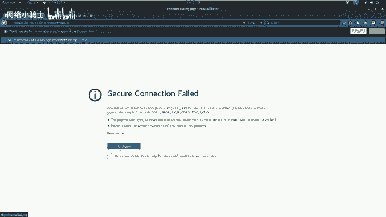

### 利用FTP匿名登录

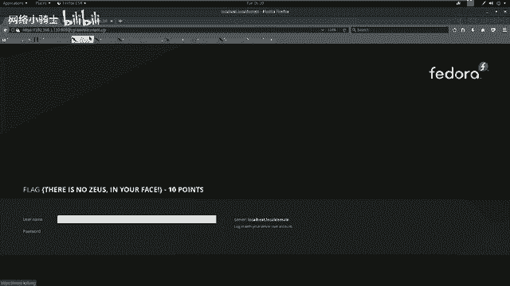

扫描结果显示21端口FTP服务支持匿名登录。

**操作流程**：
1.  在浏览器中访问 `ftp://192.168.1.110`。
2.  在FTP根目录下发现 `flag.txt` 文件，打开后获得第五个Flag。

### 检查Robots.txt文件

`robots.txt` 文件通常用于指示搜索引擎不要抓取某些目录，其中可能包含敏感路径。

**操作流程**：
1.  根据 `dirb` 扫描结果，访问 `http://192.168.1.110/robots.txt`。
2.  文件内容显示了几个禁止抓取的目录，如 `/cgi-bin/`。
3.  尝试访问 `/cgi-bin/traceroute.cgi`，发现一个执行路由追踪的Web界面。

### 利用命令注入漏洞

在 `/cgi-bin/traceroute.cgi` 页面中，发现一个接收IP参数的表单，这可能存在命令注入漏洞。

**漏洞验证与利用**：
1.  在输入框中尝试注入命令：`127.0.0.1; id`。
2.  页面返回了命令执行结果，显示当前用户为 `apache`，确认存在命令注入漏洞。
3.  尝试读取系统文件 `/etc/passwd` 来获取用户名。发现 `cat` 命令被过滤，使用功能相似的 `more` 命令绕过：`127.0.0.1; more /etc/passwd`。
4.  从 `/etc/passwd` 文件中发现一个用户 `samir`。

### 利用凭据进行SSH登录

现在我们拥有一个用户名 `samir` 和之前找到的密码 `win`。扫描结果显示靶机开放了SSH服务（22端口）和另一个端口（52）。

**尝试登录**：
1.  尝试通过22端口登录失败。
2.  尝试通过52端口登录成功：
    ```bash
    ssh samir@192.168.1.110 -p 52
    ```
    输入密码 `win` 后，成功获得一个Shell。
3.  在Shell中，使用 `ls` 发现当前目录下有 `flag.txt`。
4.  再次使用 `more` 命令（因 `cat` 被过滤）查看文件内容：`more flag.txt`，获得最终Flag。

---

## 总结与核心要点

本节课我们一起完成了一次完整的CTF夺旗流程。以下是需要牢记的核心要点：

1.  **全面探测**：对于未知服务端口，务必使用 `nc` 等工具获取其Banner信息，Flag可能直接暴露其中。
2.  **灵活绕过**：当遇到命令过滤时，尝试使用功能相近的命令进行绕过，例如用 `more` 替代 `cat`。
3.  **不放过任何服务**：对每个开放的服务（如FTP、SSH、HTTP各端口）都需进行深入测试，仔细挖掘其中的弱点信息。
4.  **信息关联**：在渗透过程中收集到的各类信息（如源码中的密码、文件中的用户名）可能相互关联，组合利用才能突破更深层次的防御。

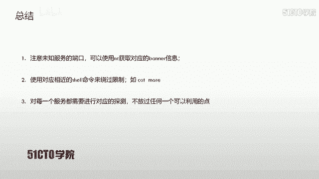

通过本节课的学习，你应该已经掌握了CTF入门所需的基本信息收集和漏洞利用思路。记住，耐心和细致是CTF竞赛中最重要的品质。