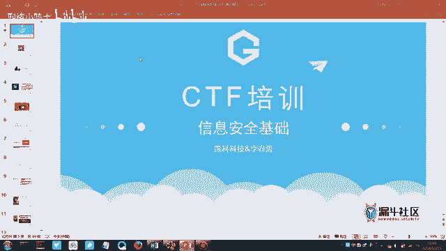
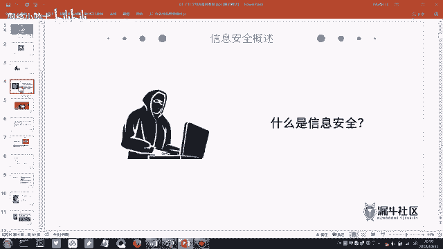
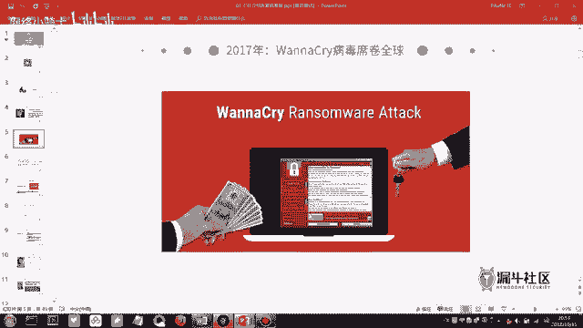
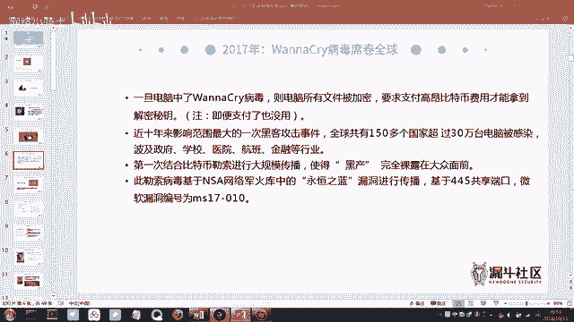
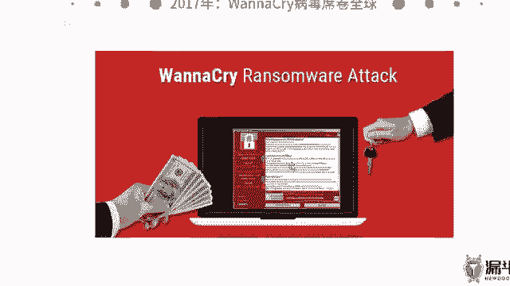
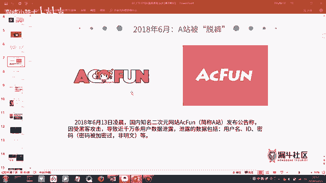
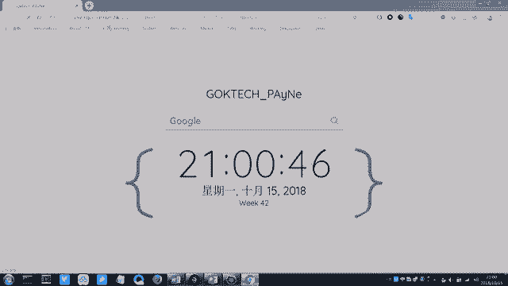
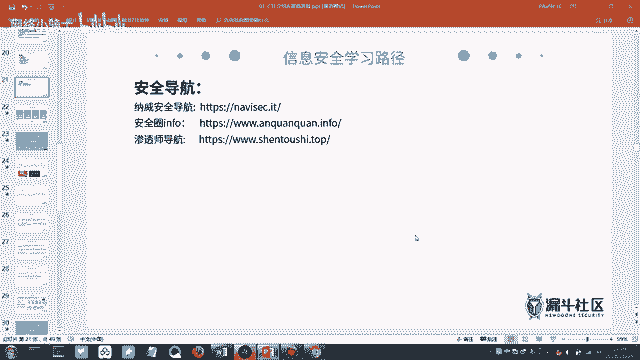
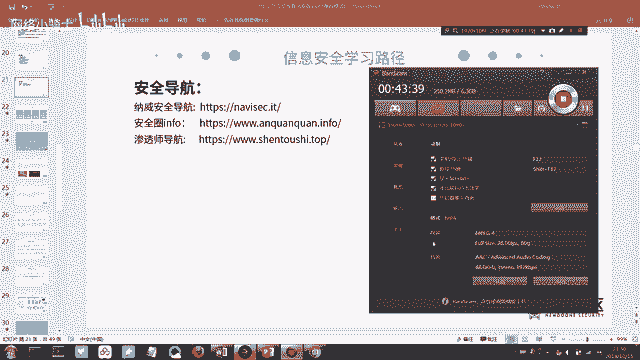

# CTF夺旗赛教程：1：CTF赛制介绍与信息安全概述 🚩

在本节课中，我们将要学习CTF比赛的基本概念，并了解其所属的信息安全领域。我们将从信息安全的核心定义出发，通过实际案例理解其重要性，并探讨学习信息安全后可以从事的方向。

## 什么是信息安全？

上一节我们提到了CTF比赛属于信息安全范畴。那么，什么是信息安全呢？国际标准化组织ISO给出的官方定义是：为保护数据的**机密性**、**完整性**和**可用性**而采取的措施。

这个定义听起来可能有些枯燥。为了便于理解，我们可以通过两个真实的安全事件来感受信息安全的具体含义。

### 案例一：WannaCry勒索病毒

2017年，一个名为WannaCry的勒索病毒在全球爆发。该病毒会加密感染计算机上的所有文档文件，并要求受害者支付比特币以换取解密密钥。

*   **影响**：许多政企单位、学校乃至个人用户受到影响。对于即将毕业的学生而言，最严重的后果可能是耗费心血撰写的毕业论文被加密锁定。
*   **关键点**：病毒会设定支付时限，超时后即使支付赎金文件也无法恢复。事实上，许多受害者支付赎金后文件也未能解密。

### 案例二：A站（AcFun）数据泄露

二次元视频网站A站曾发生数据库被盗事件。数据库存储了网站所有的用户数据，包括用户名、密码、绑定的手机号等。

*   **危害**：攻击者获取数据库后，会进行“撞库”攻击。由于许多用户在不同网站使用相同的密码，攻击者可以用这批数据尝试登录受害者的微信、QQ、邮箱、游戏等其他账号，进而盗取资产或进行诈骗。
*   **后续**：约800万条用户数据在“暗网”上被标价40万人民币出售。A站官方也向用户发出通知，建议修改密码。

通过这些案例，我们可以理解，信息安全的核心就是**攻击**与**防御**的持续对抗。防御技术不断提升，攻击手段也随之演进。

## 网络空间与国家安全

我们生活的世界有海、陆、空三个空间，而**网络空间**被认为是“第五空间”。信息安全是网络空间安全的核心内容。

其重要性已上升到国家战略层面。例如，曾有国家利用网络攻击手段，破坏了另一国用于研发核武器的地下工厂的工业控制系统，使其研发进程严重受阻。

这印证了“没有网络安全就没有国家安全”的论断。国家也越来越重视网络安全人才的培养与选拔，例如由公安部发起的“网鼎杯”CTF大赛，就是国家级别的网络“强人”选拔计划。

## 白帽子与黑帽子

在信息安全领域，从业者有不同的“帽子”颜色，代表不同的立场：

*   **白帽子**：站在防御一方，致力于发现并修复安全漏洞，保护系统和数据安全。他们是信息安全领域的“正义之士”。
*   **黑帽子**：利用技术进行非法攻击，如窃取数据、制作病毒木马等，以牟取利益或造成破坏。

国内有许多顶尖的白帽子黑客，例如阿里巴巴的首席安全科学家“道哥”（吴翰清），他曾在面试时现场演示攻破阿里内网，以此证明实力，并推动了阿里安全体系的建设。

## 学习信息安全能做什么？

了解了信息安全的重要性后，你可能会问：学习它具体能做什么？以下是几个主要方向：

以下是信息安全领域的几个实践方向：

1.  **漏洞挖掘与提交（SRC）**：许多互联网公司设有“安全应急响应中心”（SRC），白帽子可以向其提交旗下产品（如网站、APP）的安全漏洞，并获得现金奖励、礼品或荣誉积分。这就像游戏中的“排位赛”，排名靠前者甚至会有公司主动联系招聘。
2.  **参加安全竞赛（CTF）**：这是系统化锻炼和证明安全技术能力的绝佳途径。比赛类型丰富，包括省级赛（如“海峡杯”）、国家级赛（如“网鼎杯”、“护网杯”）乃至世界级大赛（如DEF CON CTF）。获奖不仅能获得丰厚奖金，更是进入顶尖安全公司的“敲门砖”。
3.  **参与技术交流**：参加像“KCon”、“Black Hat”这样的知名安全技术大会，可以了解前沿技术、拓展人脉，与行业内的顶尖高手交流学习。
4.  **从事安全岗位**：毕业后可以应聘专业的安全岗位，例如**安全服务工程师**、**渗透测试工程师**、**安全研发工程师**等。这些岗位负责对客户系统进行安全评估、渗透测试，并提供防护方案。

## 学习资源推荐

如果你对信息安全产生了兴趣，可以参考以下资源开始学习：

*   **书籍**：《白帽子讲Web安全》、《Web前端黑客技术揭秘》、《Metasploit渗透测试指南》。
*   **导航网站**：关注一些安全导航站，如“渗透师导航”、“Hacking8安全信息流”，里面聚合了大量的学习工具、靶场、技术文章和社区链接。
*   **实践平台**：尝试在**漏洞盒子**、**补天**等公益漏洞平台提交简单的漏洞，或在**CTFHub**、**BugKu**等在线靶场练习CTF题目。

本节课中我们一起学习了CTF比赛所属的信息安全领域的基本概念。我们通过真实案例理解了信息安全的重要性，认识了“白帽子”与“黑帽子”的区别，并了解了学习信息安全后可以从事的多种实践方向，如漏洞挖掘、CTF竞赛和职业发展。从下节课开始，我们将正式进入CTF赛制和具体技术工具的介绍。