# CTF夺旗赛教程：P22：命令注入1

在本节课中，我们将学习CTF中的命令注入漏洞。我们将了解如何通过Web应用程序从外部执行主机系统命令，最终目标是获得主机的访问权限，提升至root权限，并获取对应的flag值。

## 实验环境概述

本次实验环境如下：
*   **攻击机**：Kali Linux，IP地址为 `192.168.1.106`。
*   **靶机**：IP地址为 `192.168.1.104`。

在CTF比赛中，我们的核心目标是获取靶机上的flag值。所有操作都应围绕此目标展开。

## 第一步：信息收集

上一节我们介绍了实验环境，本节中我们来看看如何对靶机进行初步的信息探测。信息收集是渗透测试的第一步，目的是发现目标系统的开放服务、版本信息以及可能的入口点。

以下是信息收集的常用命令：

1.  **使用Nmap扫描服务及版本**
    使用 `nmap -sV` 命令可以扫描靶机开放的服务及其版本信息。
    ```bash
    nmap -sV 192.168.1.104
    ```
    此命令会向靶机发送数据包，并根据响应分析出运行的服务。

2.  **使用Nmap进行深度扫描**
    使用 `nmap -A -T4` 命令可以进行更全面的扫描，包括操作系统识别、脚本扫描等。`-T4` 参数用于加快扫描速度。
    ```bash
    nmap -A -T4 192.168.1.104
    ```

3.  **使用Nikto扫描Web目录**
    如果靶机开放了HTTP服务，可以使用 `nikto` 工具扫描Web目录和文件。
    ```bash
    nikto -h http://192.168.1.104
    ```
    该命令能发现诸如 `robots.txt`、`upload`等目录，并提示可能存在的敏感信息。

4.  **使用Dirb扫描Web目录**
    另一个常用的Web目录扫描工具是 `dirb`。
    ```bash
    dirb http://192.168.1.104
    ```

## 第二步：信息分析与初步渗透

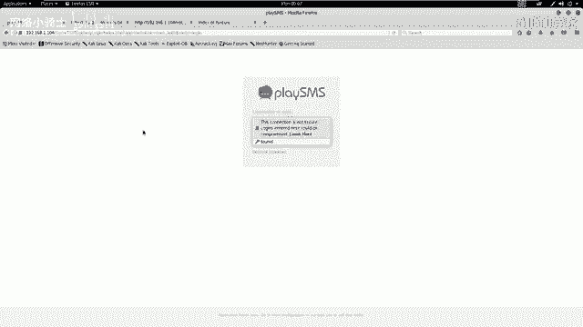

探测完基本信息后，我们需要从这些信息中挖掘可利用的线索。例如，开放了HTTP服务，我们就可以用浏览器访问扫描到的敏感页面。

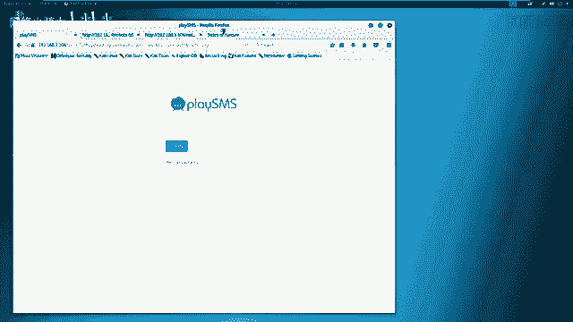

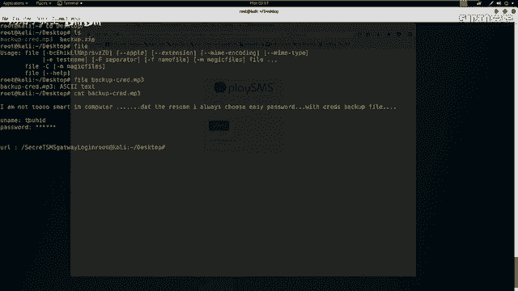

以下是分析过程中发现的关键信息：

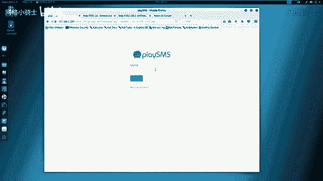

1.  **访问 `robots.txt` 文件**
    该文件通常包含网站不希望被爬取的目录。访问后发现它禁止爬取某些目录，如 `/noscript/`、`/temp/`、`/uploads/`。

2.  **探查敏感目录**
    *   访问 `/noscript/` 目录，页面显示为 “Not Found”。但与真正的404页面对比后发现略有不同。
    *   查看该页面的HTML源代码，在注释中发现了一组可能的密码：
        ```
        my secret pass = freedom
        password = hello world!
        i love root
        ```
    *   访问其他被禁止的目录（如 `/temp/`、`/uploads/`）未发现有用信息。

3.  **发现并分析备份文件**
    *   在扫描结果中，发现了一个 `/secret/` 目录。
    *   该目录下有一个 `backup.zip` 文件，可能是网站源代码的备份。
    *   下载该压缩包后，发现需要解压密码。尝试使用在 `/noscript/` 页面注释中找到的密码 `freedom`，成功解压。
    *   解压出的文件名为 `backup.mp3`，但使用 `file` 命令检查其真实类型，发现它实际上是一个ASCII文本文件。
        ```bash
        file backup.mp3
        ```
    *   使用 `cat` 命令查看该文本文件内容：
        ```bash
        cat backup.mp3
        ```
        文件内容显示，它似乎是一个用简单密码（如 `freedom`）加密的备份，其中包含 `username`、`password`（被星号隐藏）和一个URL。

4.  **登录后台系统**
    *   将文本文件中发现的URL在浏览器中打开，显示为一个登录界面。
    *   用户名（`touchid`）已给出。使用之前在注释中找到的多个密码进行尝试。
    *   使用密码 `iloveroot` 成功登录系统后台。

## 第三步：漏洞研究与利用

成功进入后台后，下一步是寻找可利用的漏洞。常见的思路是识别后台系统类型，并搜索其已知漏洞。

以下是漏洞利用的步骤：

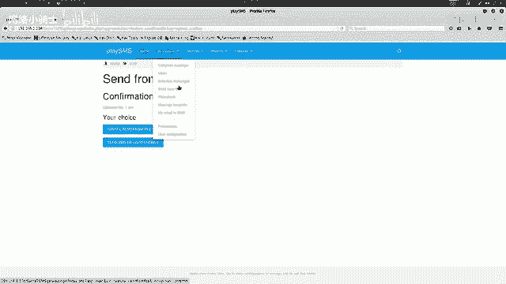

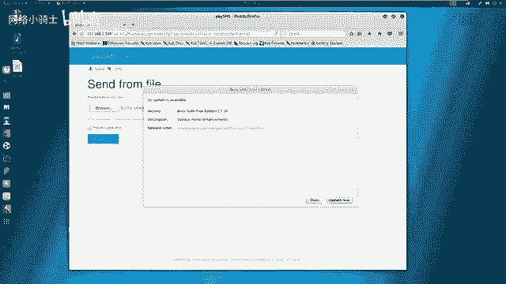

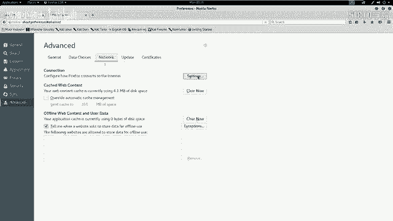

1.  **识别系统并搜索漏洞**
    该系统识别为 `playSMS`。使用 `searchsploit` 工具在本地漏洞库中搜索相关漏洞。
    ```bash
    searchsploit playSMS
    ```
    搜索结果显示存在一个编号为 `42038.txt` 的漏洞，描述为“不受限制的文件上传”，允许注册用户上传任意文件。

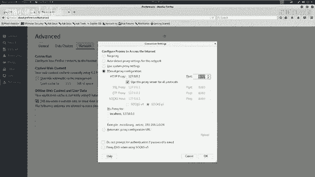

2.  **理解漏洞细节**
    查看该漏洞的详细说明文件。
    ```bash
    cat /usr/share/exploitdb/exploits/php/webapps/42038.txt
    ```
    漏洞位于 `/sendfromfile.php` 页面。虽然上传的文件不会存储在服务器上，但如果能够拦截HTTP请求并修改上传文件的文件名（`filename`参数）为一段PHP代码，服务器就会执行该代码。

3.  **利用漏洞执行命令**
    *   在后台找到文件上传功能（对应 `/sendfromfile.php`）。
    *   准备一个用于上传的任意文件（如 `1.csv`）。
    *   使用代理工具 **Burp Suite** 拦截上传文件的HTTP请求。
    *   将拦截到的请求发送到 **Repeater** 模块进行修改。
    *   按照漏洞描述，将 `filename` 参数修改为包含PHP代码的格式，例如：
        ```
        filename="<?php system(‘uname -a‘); ?>"
        ```
    *   发送修改后的请求，在响应中可以看到系统成功执行了 `uname -a` 命令，并返回了系统信息。
    *   重复此过程，修改 `filename` 中的命令，可以执行其他系统指令，如 `id`，以查看当前用户权限。
        ```
        filename="<?php system(‘id‘); ?>"
        ```

## 总结

本节课中我们一起学习了命令注入漏洞的初步利用流程：
1.  **信息收集**：使用Nmap、Nikto、Dirb等工具扫描目标，获取服务、目录和文件信息。
2.  **信息分析**：深入探查扫描结果，从`robots.txt`、页面源代码、备份文件中发现敏感信息（如密码），从而登录后台系统。
3.  **漏洞利用**：识别后台系统，搜索已知漏洞。利用“不受限制的文件上传”漏洞，通过Burp Suite拦截并修改HTTP请求，将文件名参数篡改为PHP代码，从而在目标服务器上执行任意系统命令。

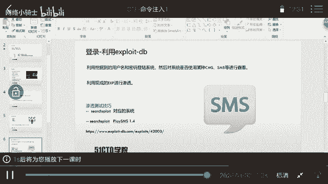

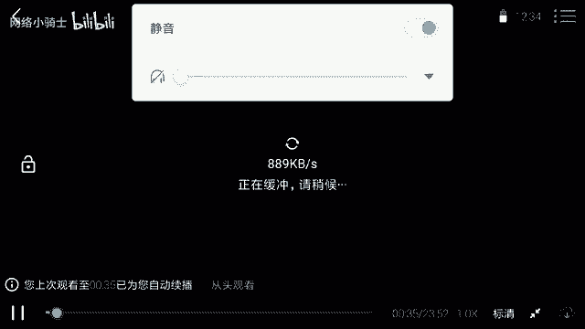

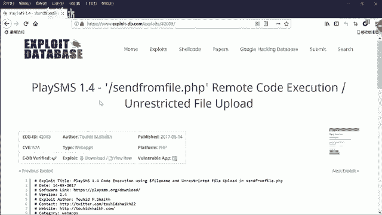

通过这一过程，我们成功在靶机上实现了远程命令执行。下节课我们将讲解如何利用此漏洞进一步获取服务器的完整控制权。