# CTF夺旗赛教程：P25：CTF综合测试 - Web渗透测试入门


## 概述
在本节课中，我们将学习如何通过Web应用程序的安全漏洞进行渗透测试，目标是入侵目标主机，最终获取root权限或找到flag值。我们将从Web安全基础讲起，逐步演示信息收集、漏洞分析与利用的完整流程。

---

## Web安全简介
随着Web 2.0、社交网络、微博等一系列新型互联网产品的诞生，基于Web环境的互联网应用越来越广泛。在企业信息化过程中，各种应用都架设在Web平台之上，Web业务的迅速发展也引起了黑客的强烈关注。


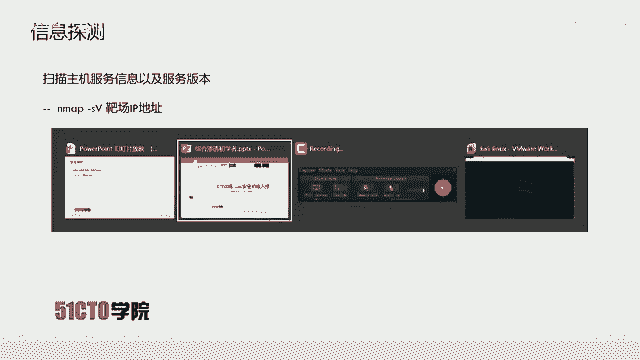

接踵而至的是Web安全威胁的凸显。黑客利用网站操作系统的漏洞和Web应用程序的SQL注入漏洞等，获取Web服务器的控制权限。轻则篡改网页内容、挂黑页，重则通过Web漏洞窃取企业内部重要的数据信息。

更为严重的是在网页中植入恶意代码。例如，近年来较为流行的是在网页中植入恶意代码，实现“挖矿”操作，如挖掘比特币、门罗币等虚拟货币，使网站访问者受到侵害。


---

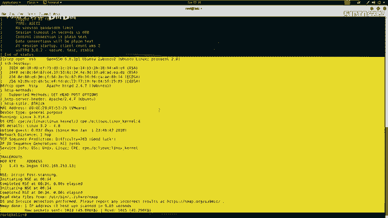

## 实验环境配置
以下是本次实验的环境配置信息：
*   **攻击机IP地址**：`192.168.253.12`
*   **靶机IP地址**：`192.168.253.13`

在渗透测试中，我们的核心目标是获取靶机的root权限。在CTF比赛中，目标则是找到靶机上的flag值。明确目标后，即可使用攻击机对靶机进行测试。

---

## 信息收集：服务与端口探测
测试的第一步是对靶机进行信息探测，深入了解其开放的服务。我们可以使用Nmap工具扫描靶机IP地址所开放的服务及其版本信息。

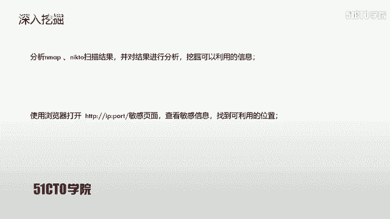

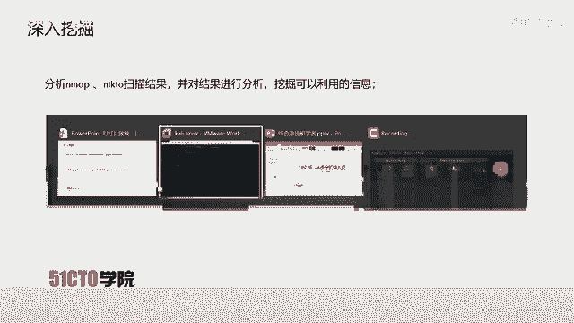

以下是操作步骤：

1.  使用Nmap进行基础服务与版本扫描：
    ```bash
    nmap -sV 192.168.253.13
    ```
    执行此命令后，Nmap会向靶机发送数据包并处理返回的信息，将结果显示在标准输出中。

2.  使用Nmap进行全方位扫描：
    除了基础扫描，我们还可以使用Nmap的“全部功能”模式来获取靶机的更全面信息。
    ```bash
    nmap -A -v -T4 192.168.253.13
    ```
    参数说明：
    *   `-A`：启用操作系统检测、版本检测、脚本扫描和路由跟踪。
    *   `-v`：显示详细输出。
    *   `-T4`：指定扫描速度（0-5），T4为较快速度。
    命令参数顺序可以调整，不影响执行。扫描完成后，结果将返回到标准输出。

---

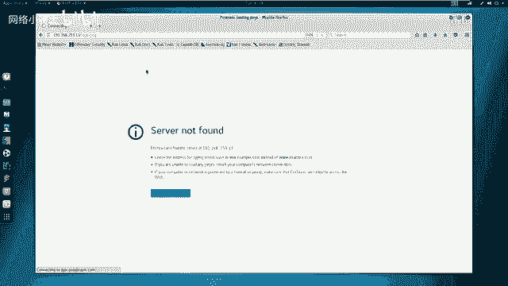

## 信息收集：Web目录与文件探测
除了使用Nmap探测主机服务，我们还可以使用其他工具专门针对HTTP服务进行深度扫描。

以下是针对Web目录和文件的扫描方法：

1.  使用`nikto`扫描Web服务敏感信息：
    ```bash
    nikto -h http://192.168.253.13
    ```
    此命令会扫描靶机80端口（HTTP默认端口）的Web服务，并返回可能存在的敏感文件或配置信息。如果端口不是80，则需在IP后指定端口，例如 `http://192.168.253.13:8080`。


2.  使用`dirb`探测Web目录结构：
    ```bash
    dirb http://192.168.253.13
    ```
    此工具会探测靶站存在的目录和文件信息，有助于我们发现隐藏的路径或资源。

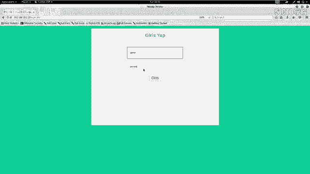

---

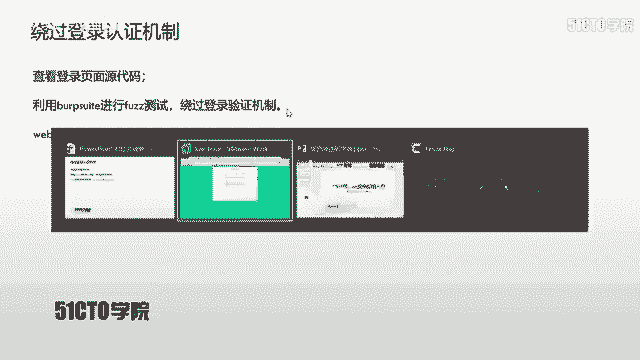

## 扫描结果分析与漏洞挖掘
完成信息收集后，我们需要从海量信息中挖掘出可利用的漏洞点。本节我们将分析Nmap、Nikto、Dirb等工具的扫描结果。

首先分析Nmap扫描结果：
*   开放了**21端口**（FTP服务）及对应软件版本。
*   开放了**22端口**（SSH服务）。
*   开放了**80端口**（HTTP Web服务）。

由于本次从Web入手，我们重点分析80端口的相关信息。查看Nikto的扫描结果，发现了几个关键点：
*   `config.php`：一个PHP配置文件，可能包含数据库认证信息。
*   `login.php`：用户登录界面。
*   其他默认文件或目录信息。

Dirb的扫描结果补充了目录信息：
*   资源目录、图片目录(`imgs`)等。
*   一个敏感的**上传目录**(`upload`)。
*   服务器状态目录等。

初步分析后，`login.php`登录界面是一个明显的潜在入口。我们尝试访问该页面：`http://192.168.253.13/login.php`。

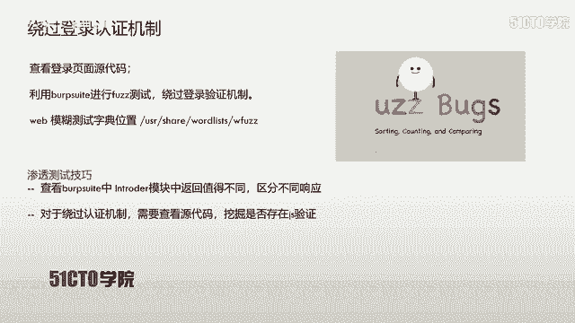

---

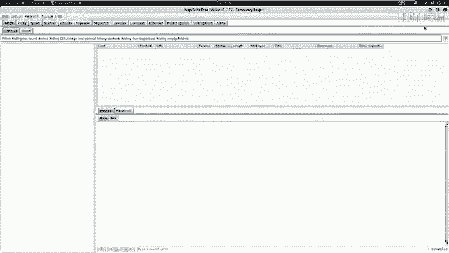

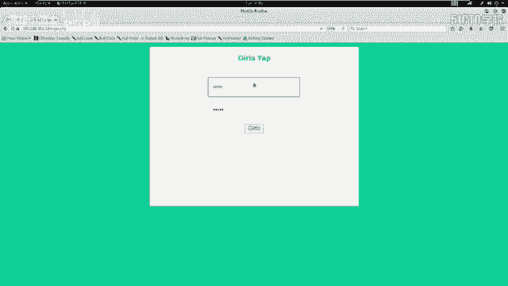

## 登录界面测试与代码审计
打开登录界面后，我们首先尝试使用弱口令（如admin/admin）登录，但失败了。接下来，我们需要寻找绕过登录认证机制的方法。

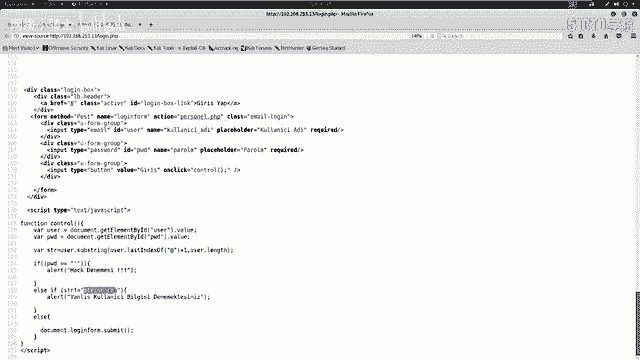

首先，查看页面源代码，寻找隐藏信息。在源代码底部，我们发现了一段JavaScript代码：
```javascript
// 示例代码逻辑
var user = document.getElementById('user').value;
var pwd = document.getElementById('pwd').value;
var str = user.substring(user.lastIndexOf('@')+1);
if(pwd == '\''){
    alert('黑客攻击！');
} else if(pwd != '\'' && str != 'btrssk.com'){
    alert('用户名需以@btrssk.com结尾');
} else {
    // 执行登录
}
```
代码分析：
1.  获取用户名(`user`)和密码(`pwd`)。
2.  提取用户名中最后一个`@`符号之后的部分，赋值给`str`。
3.  进行判断：
    *   如果密码等于**单引号(`'`)**，则弹出“黑客攻击”警告。
    *   如果密码不是单引号，且`str`不等于`"btrssk.com"`，则提示用户名格式错误。
    *   否则，执行登录流程。

这段代码提示了两个关键信息：
1.  密码字段对**单引号**有特殊反应，提示可能存在**SQL注入漏洞**。
2.  用户名必须以`@btrssk.com`结尾。

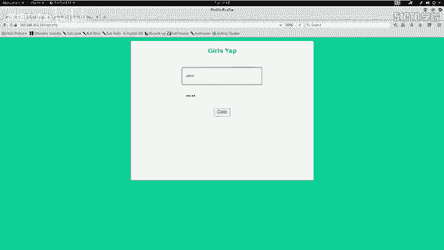

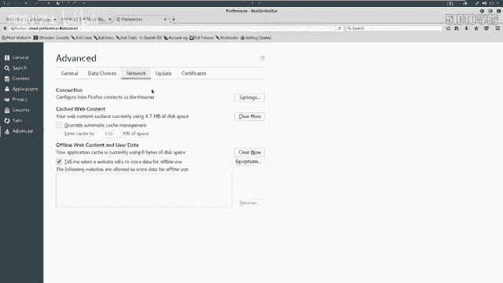

---

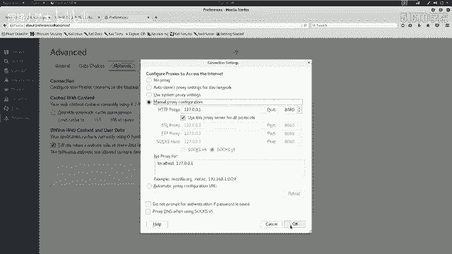

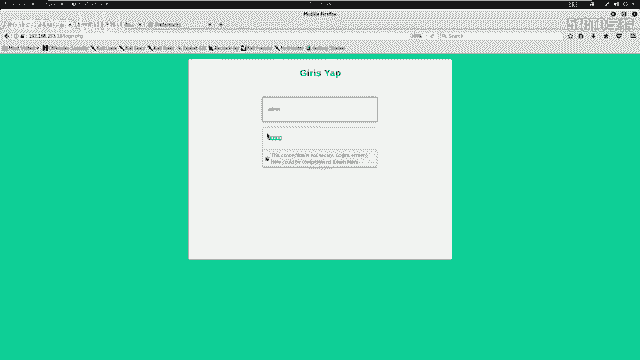

## 利用Burp Suite进行模糊测试
基于代码审计的发现，我们可以对登录表单进行模糊测试（Fuzzing），通过尝试大量输入来观察服务器的不同响应，从而找到有效的绕过方式。

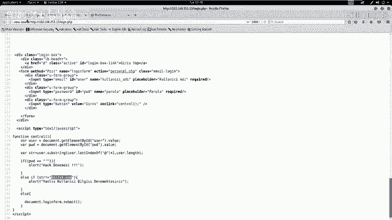

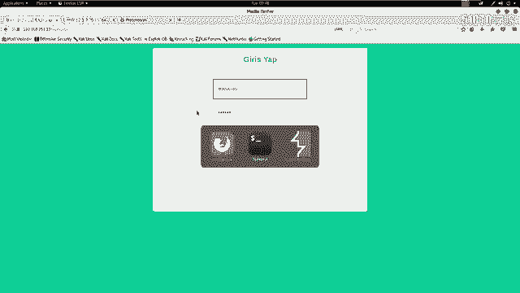

操作步骤如下：

1.  **配置代理**：启动Burp Suite，并在浏览器中设置代理，将流量拦截到Burp。
2.  **捕获请求**：在登录界面输入用户名（如`test@btrssk.com`）和任意密码，点击登录。Burp会捕获到这个POST请求。
3.  **发送到Intruder**：在Burp中右键点击捕获的请求，选择“Send to Intruder”。
4.  **设置攻击位置**：在Intruder标签页的“Positions”子标签中，清除所有变量，然后仅将**密码(`pwd`)**字段的值设置为攻击变量（选中后点击“Add”）。
5.  **选择载荷**：在“Payloads”子标签中，选择“Payload type”为“Runtime file”。我们需要一个SQL注入的测试字典。在Kali Linux中，常用字典路径为：`/usr/share/seclists/Fuzzing/SQLi/Generic-SQLi.txt`。将其复制到方便的位置并在此处加载。
6.  **开始攻击**：点击顶部的“Start attack”按钮，Burp会使用字典中的每一项作为密码进行自动化测试。
7.  **分析结果**：攻击完成后，观察“Length”列。不同的响应长度通常代表不同的服务器反馈（如登录失败、错误提示、登录成功）。我们需要找到与其他常见失败长度（如2044、2203）**不同的响应长度**（本例中为2900）。

通过检查长度为2900的响应内容，我们发现其返回了一个包含**文件上传功能**的新页面，这表明我们成功绕过了登录验证。

---

## 文件上传功能测试
在浏览器中访问上传页面后，我们开始测试上传功能。通常，上传功能是获取WebShell的重要途径。

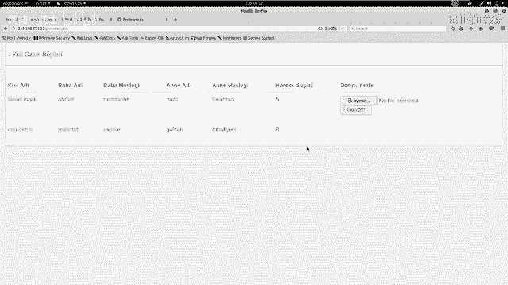

测试过程：
1.  首先尝试上传一个图片文件（如`.jpg`），上传成功。
2.  接着尝试上传一个PHP脚本文件（如`shell.php`），上传被阻止，页面提示只能上传图片格式。

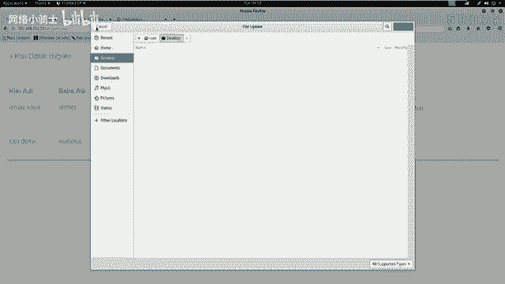

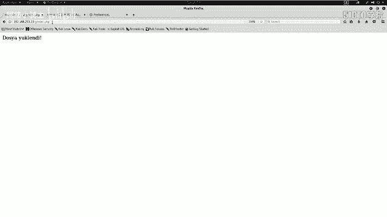

这表明应用程序存在**文件上传检测机制**，阻止了非图片格式的文件上传。我们的下一个目标就是研究如何绕过这个检测机制。

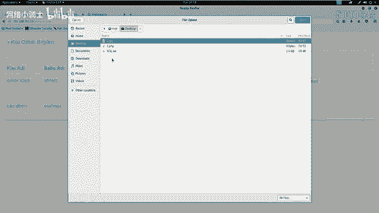

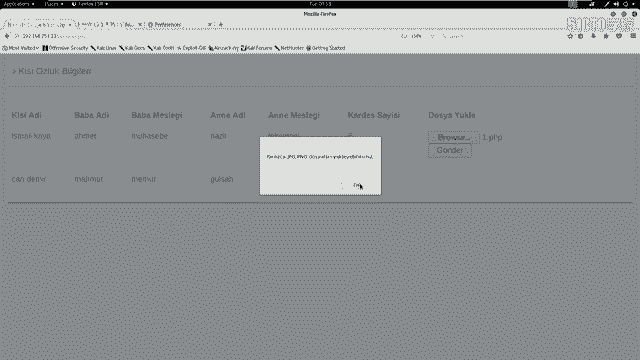

---

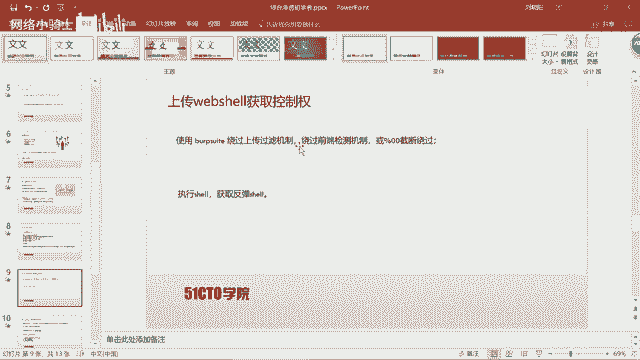

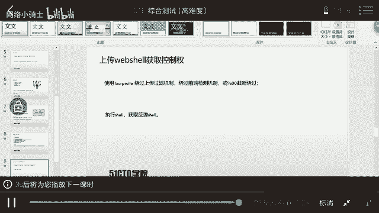

## 总结
本节课中，我们一起学习了Web渗透测试的初步流程：
1.  **信息收集**：使用Nmap、Nikto、Dirb等工具探测目标的服务、端口、Web目录和敏感文件。
2.  **漏洞分析**：对收集到的信息（特别是`login.php`）进行人工审计，分析前端JavaScript代码，发现潜在的SQL注入点和认证逻辑缺陷。
3.  **漏洞利用**：利用Burp Suite的Intruder模块对登录表单进行模糊测试，通过响应长度差异成功绕过认证，进入后台的上传页面。
4.  **后续方向**：发现了文件上传功能，但存在格式限制。下节课我们将重点探讨如何绕过文件上传检测机制，从而上传WebShell，进一步控制服务器。