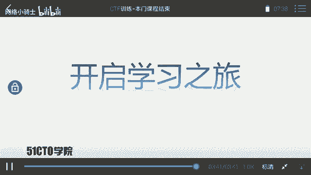
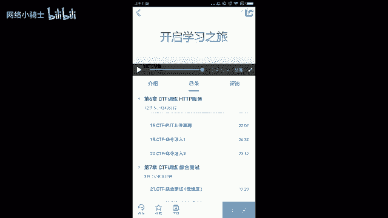

# CTF夺旗赛教程：P27：29.课程总结 🏁

在本节课中，我们将对之前所学的CTF入门知识进行回顾与总结，并展望未来的学习路径。

经过长时间的学习，我们的CTF入门课程已接近尾声。下面我们对整个课程进行总结。

## 回顾CTF核心概念

在课程开始，我们首先介绍了CTF。我们现在回想一下CTF的含义。

CTF是一种流行的信息安全竞赛形式，其英文名可译为“夺旗赛”。其大致流程如下：参赛团队之间通过进行攻防对抗、程序分析等形式，率先从主办方给出的比赛环境中得到一串具有一定格式的字符串或其他内容，并将其提交给主办方，从而夺得分数。为了方便称呼，我们把这样的内容称之为 **`flag`**。

## CTF比赛的特点与要求

在CTF比赛中，涉及的内容比较繁杂。我们需要利用所有可以利用的方法获得对应的`flag`。这里强调大家需要有很大的“脑洞”来挖掘对应的信息。

通过本门课程的学习，大家基本掌握了CTF比赛中的一些基本套路，可以完成一定难度靶场`flag`的寻找。但是本门课程并不能确保并指导你成为一位高手。大家通往高手的路还相当远。

## 持续学习的方法与路径

在接下来的时间里，大家需要不断学习，不断进步，以缩短与高手的距离。我们必须掌握有效的学习方法。

在信息安全或CTF学习中，我们需要不断实践，不断尝试，才能更快地进步。同时，我们的学习也需要有合适的方法、对应的课程以及训练环境。

## 后续课程预告

我之后也会推出一些课程来帮助大家学习。欢迎大家关注我之后发布的课程。

以下是后续课程的简要介绍：

*   **代码审计课程**：专门教大家去挖掘对应的漏洞，并且编写对应的 **`POC（Proof of Concept）`**。
*   **WiFi安全课程**：课程中将使用一些高度集成的工具测试WiFi，并涉及最新的测试方法，例如之前所见的中间人WiFi攻击，直接修改对应的 **`WPA/WPA2`** WiFi密码。
*   **Metasploit模块编写课程**：教大家如何编写一个Metasploit模块来进行自动化测试。
*   **CTF训练高端课程**：最后，我将提升课程难度，发布一门CTF训练的高端课程，使大家对CTF有更深入的了解，并提升大家的安全能力。

## 总结与鼓励

大家的学习尚未成功，大家仍需努力。让我们一起开启接下来的学习之旅吧。

在本节课中，我们一起回顾了CTF夺旗赛的基本概念、比赛形式以及学习心得。我们明确了持续实践和系统学习的重要性，并预览了未来深入学习的课程方向。记住，安全之路漫漫，唯有点滴积累与不断探索，方能不断精进。