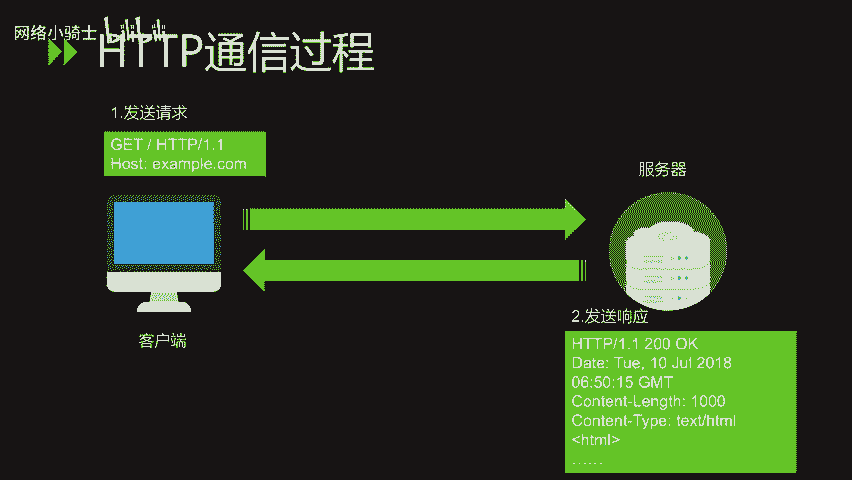
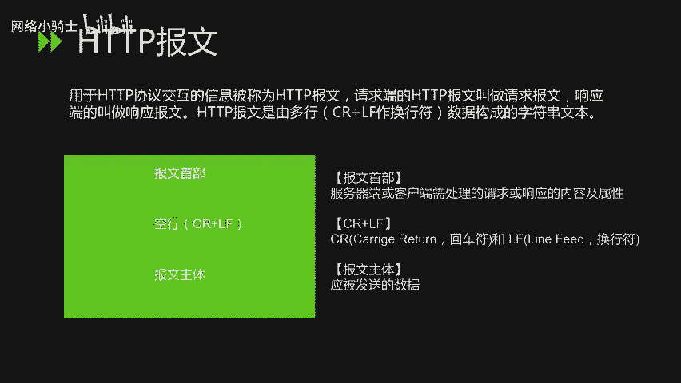
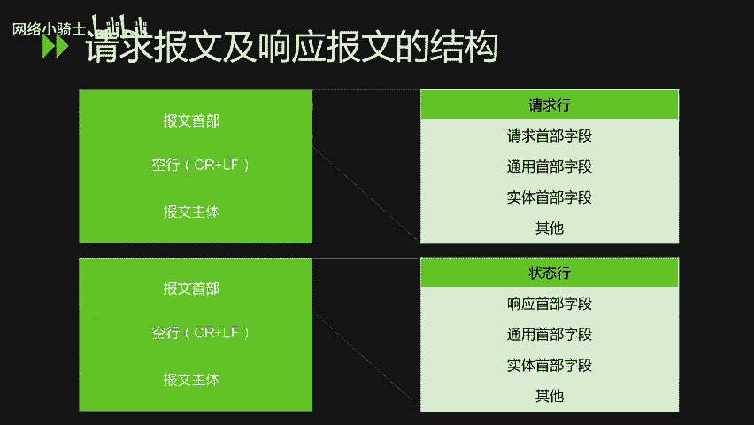
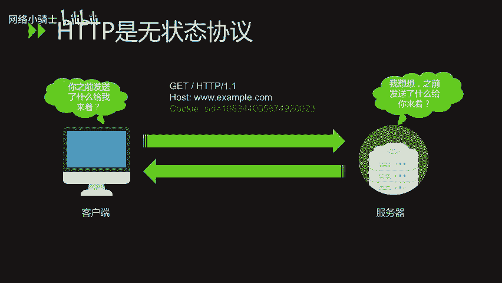
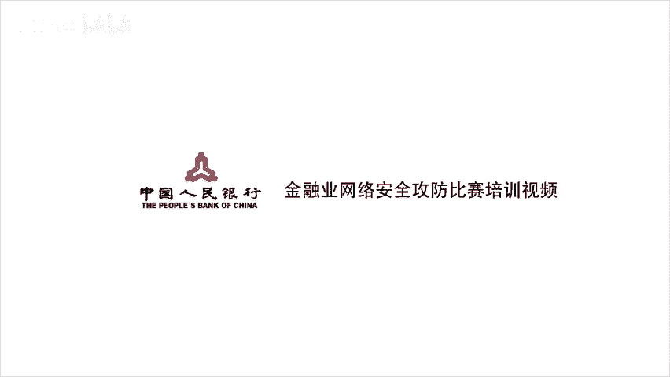

# CTF夺旗赛教程：28：HTTP协议分析_1 🔍

在本节课中，我们将学习HTTP协议的基础知识，包括其发展历史、协议结构、请求与响应报文格式、常见的HTTP方法、状态码，以及HTTP无状态特性的含义。

---

## HTTP协议概述 🌐

HTTP是超文本传输协议的缩写，它是互联网上应用最广泛的一种网络协议。所有万维网文件都必须遵守这个标准。设计HTTP最初的目的是为了提供一种发布和接收HTML页面的方法。HTTP协议用于客户端和服务器端之间的通信，通常建立在TCP/IP协议之上。

## HTTP发展史 📜

HTTP协议诞生于1989年，最初的设想是借助多文档之间相互关联形成的超文本，连接成可相互浏览的万维网。1990年，HTTP/0.9版本问世。1996年5月，HTTP/1.0版本被正式公布为标准。1997年1月公布的HTTP/1.1是目前主流的HTTP协议版本。

## HTTP通信过程与报文结构 📨

HTTP协议规定，通信从客户端主动发起请求开始。服务器端在没有接收到请求之前，不会发送响应。

在HTTP通信过程中，用于交互的信息单元称为**HTTP报文**。请求端发出的报文叫**请求报文**，响应端发出的叫**响应报文**。

HTTP报文是由多行数据构成的字符串文本，行之间使用CRLF（回车换行符）分隔。报文大致可分为**报文首部**和**报文主体**两部分。报文首部包含请求或响应的内容及属性，报文主体则是实际被发送的数据。

---

### HTTP请求报文

以下是HTTP请求报文的主要结构：

*   **请求行**：包含请求方法、请求URI和协议版本。
*   **请求首部字段**：包含请求的附加信息。
*   **通用首部字段**：请求和响应报文都可能使用的字段。
*   **实体首部字段**：描述报文主体内容的字段。
*   **其他**：可能包含其他自定义头部。
*   **空行**：用于分隔首部和主体。
*   **报文主体**：可选，包含发送的数据。

请求行中的**方法**指明了客户端希望服务器执行的操作，主要包含以下几种：

*   **GET**：请求访问已被URI识别的资源。
*   **POST**：传输实体的主体，常用于提交表单数据。
*   **PUT**：传输文件，用于上传资源。
*   **HEAD**：与GET方法类似，但服务器只返回首部，不返回报文主体，用于确认URI的有效性。
*   **DELETE**：删除文件。
*   **OPTIONS**：查询针对请求URI指定的资源支持的方法。
*   **TRACE**：让Web服务器将之前的请求通信环回给客户端，用于诊断。
*   **CONNECT**：要求用隧道协议连接代理，主要用于SSL/TLS加密链路的建立。

虽然GET方法也可以通过URL参数传输数据，但通常使用POST方法来传输实体主体。

---

### HTTP响应报文

上一节我们介绍了客户端发出的请求报文，本节中我们来看看服务器返回的响应报文。HTTP响应报文的结构如下：

*   **状态行**：包含协议版本、状态码和原因短语。
*   **响应首部字段**：包含响应的附加信息。
*   **通用首部字段**：同上。
*   **实体首部字段**：同上。
*   **其他**：可能包含其他自定义头部。
*   **空行**：用于分隔首部和主体。
*   **报文主体**：通常是请求的资源内容或错误信息。

状态行中的**状态码**是一个三位数字代码，表示请求的结果。状态码分为五类：

*   **1xx（信息性状态码）**：接收的请求正在处理。
*   **2xx（成功状态码）**：请求已正常处理完毕。
*   **3xx（重定向状态码）**：需要进行附加操作以完成请求。
*   **4xx（客户端错误状态码）**：服务器无法处理请求，问题通常在客户端。
*   **5xx（服务器错误状态码）**：服务器处理请求时出错。

在日常上网或工作中，常见的状态码有以下几种：

*   **200 OK**：请求成功，服务器已正常处理。
*   **301 Moved Permanently**：永久重定向，请求的资源已被分配新的URI。
*   **302 Found**：临时重定向，希望用户本次使用新的URI访问。
*   **304 Not Modified**：客户端发送了附带条件的请求（如If-Modified-Since），但资源未满足条件。返回此状态码时，不包含报文主体。
*   **400 Bad Request**：请求报文存在语法错误。
*   **401 Unauthorized**：请求需要HTTP认证（如Basic认证）。
*   **403 Forbidden**：服务器拒绝访问请求的资源。
*   **404 Not Found**：服务器上找不到请求的资源。
*   **500 Internal Server Error**：服务器内部执行请求时发生错误。
*   **503 Service Unavailable**：服务器暂时超载或正在维护，无法处理请求。

## HTTP的无状态性与Cookie 🍪

HTTP协议是一种**无状态协议**。这意味着协议本身不会对请求和响应之间的通信状态进行保存。每次请求都是独立的，服务器不会记住之前的请求。

这种设计是为了更快地处理大量事务，确保协议的可伸缩性。但随着Web应用的发展，需要保持状态（如用户登录）的场景越来越多。为此，引入了**Cookie**技术。通过Cookie，HTTP通信可以管理状态，服务器可以识别和跟踪用户会话。关于Cookie技术的详细讲解，将在下一节课进行。

---

本节课中我们一起学习了HTTP协议的基础知识，包括其发展历程、通信模型、请求与响应报文的详细结构、核心的请求方法与状态码，并理解了HTTP无状态协议的特性及其解决方案。掌握这些是进行Web安全分析和CTF中Web题目挑战的重要基础。