# CTF夺旗赛教程：29：HTTP协议分析_2

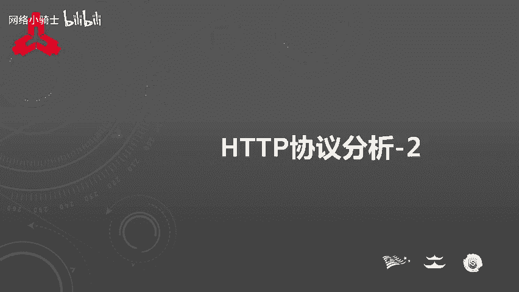

在本节课中，我们将深入学习HTTP协议的首部字段，并了解在CTF竞赛中如何分析和利用这些字段来解题。课程内容分为两部分：HTTP首部字段的详细解析和基于这些知识的CTF题目讲解。

## HTTP首部字段概述

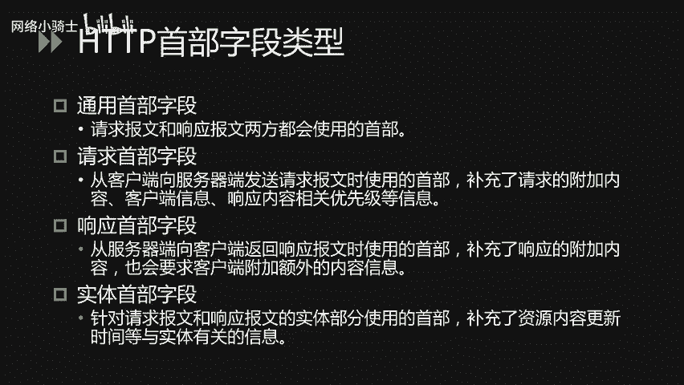

HTTP首部字段是构成HTTP报文的关键要素之一。在客户端与服务器之间进行HTTP通信时，无论是请求还是响应，都会使用首部字段来传递额外的重要信息。这些信息包括报文主体的大小、使用的语言、认证信息等。HTTP首部字段由字段名和字段值构成，中间用冒号分隔。值得注意的是，单个HTTP首部字段可以包含多个值。

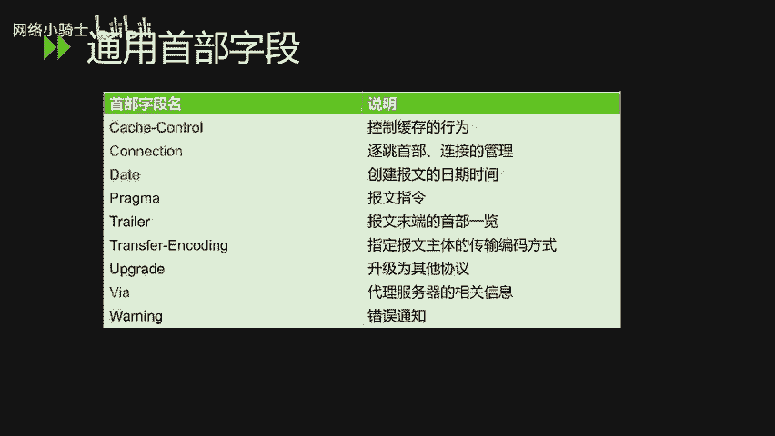

HTTP首部字段主要分为四种类型：通用首部字段、请求首部字段、响应首部字段以及实体首部字段。接下来，我们将对这四种类型进行详细分析。

## 通用首部字段

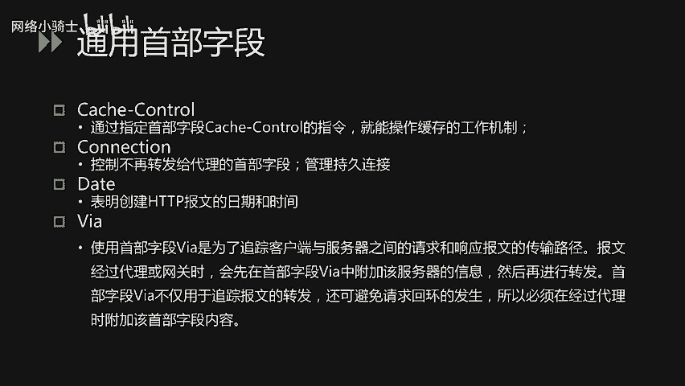

通用首部字段是请求报文和响应报文双方都会使用的首部。上一节我们介绍了首部字段的基本概念，本节中我们来看看几种常见的通用首部字段。

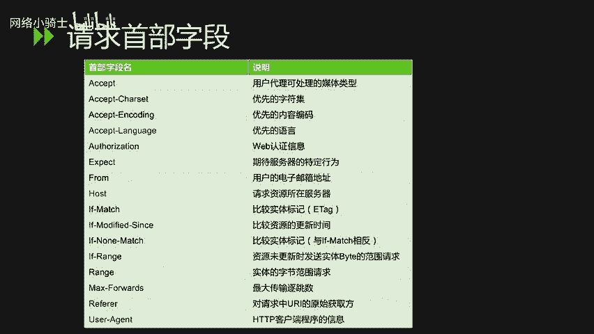

以下是几种常见的通用首部字段：
*   **Cache-Control**：通过指定该字段的指令，可以操作缓存的工作机制。
*   **Connection**：该字段有两个主要作用。一是控制不再转发给代理的首部字段，二是管理持久连接。
*   **Date**：该字段表明创建HTTP报文的日期和时间。
*   **Via**：使用该字段是为了追踪客户端与服务器之间请求和响应报文的传输路径。当报文经过代理或网关时，会先在`Via`字段中附加该服务器的信息，然后再进行转发。该字段不仅用于追踪报文转发，还可避免请求循环的发生，因此经过代理时必须附加此字段内容。

## 请求首部字段

请求首部字段是从客户端向服务器端发送请求报文时使用的首部，用于补充请求的附加内容、客户端信息、响应内容优先级等信息。

以下是几种常见的请求首部字段：
*   **Accept**：该字段可通知服务器，用户代理能够处理的媒体类型及这些类型的相对优先级。可以使用`type/subtype`形式一次指定多种媒体类型。例如，文本文件使用`text/html`，图片文件使用`image/gif`或`image/jpeg`，应用程序使用`application/octet-stream`等格式。当服务器提供多种内容时，会优先返回权重值最高的媒体类型。
*   **Accept-Language**：该字段用来告知服务器用户代理能够处理的自然语言集及其相对优先级。可以一次指定多种语言集，并用权重值`q`来表示优先级。例如，客户端在服务器有中文版资源时会要求返回中文版响应，否则请求返回英文版响应。
*   **Authorization**：该字段用来告知服务器用户代理的认证信息。其值的内容，例如在Basic认证中，是一段Base64编码的字符串。通常，用户代理在收到服务器返回的`401`状态码响应后，会在后续请求中加入此字段。
*   **Host**：该字段会告知服务器请求的资源所处的互联网主机名和端口号。在HTTP/1.1规范中，`Host`是唯一一个必须被包含在请求内的首部字段。当同一IP地址下部署了多个域名时，服务器需要此字段来明确识别请求的是哪个域名。
*   **Referer**：该字段会告知服务器请求的原始资源的URI。客户端通常会发送此字段，但出于安全性考虑（例如原始URI可能包含token、密码等），有时也可不发送。
*   **User-Agent**：该字段会将创建请求的浏览器和用户代理名称等信息传达给服务器。

## 响应首部字段

响应首部字段是从服务器端向客户端返回响应报文时使用的首部，用于补充响应的附加内容，或要求客户端附加额外的信息。

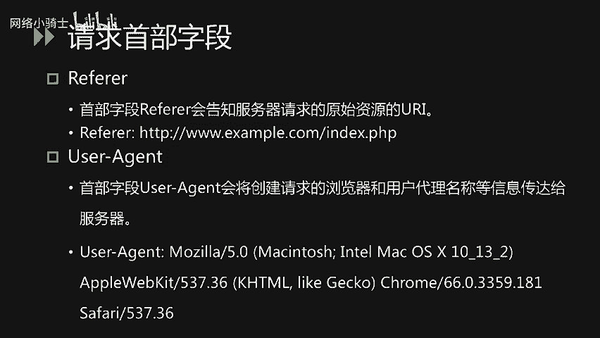

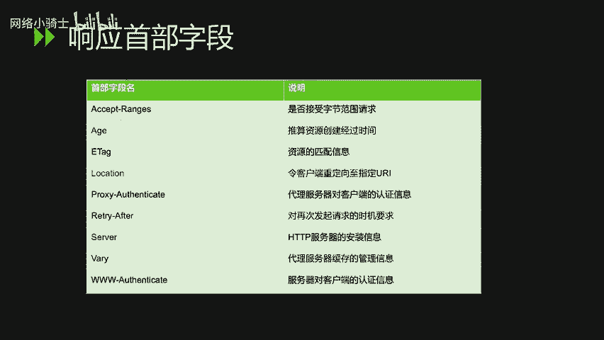

以下是两种常见的响应首部字段：
*   **Location**：使用该字段可以将响应接收方引导至某个与请求URI位置不同的资源。该字段通常配合`3xx`重定向状态码使用，提供重定向的目标URI。
*   **Server**：该字段告知客户端当前服务器上安装的HTTP服务器应用程序的信息，通常包括软件名称和版本号。

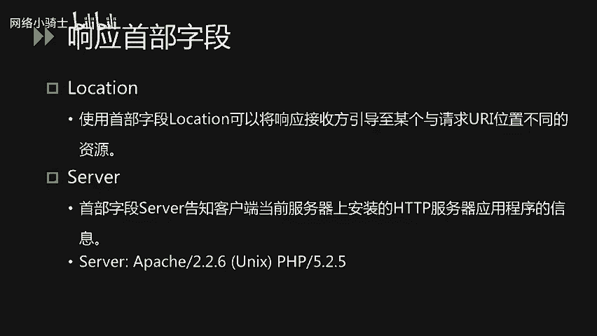

## 实体首部字段

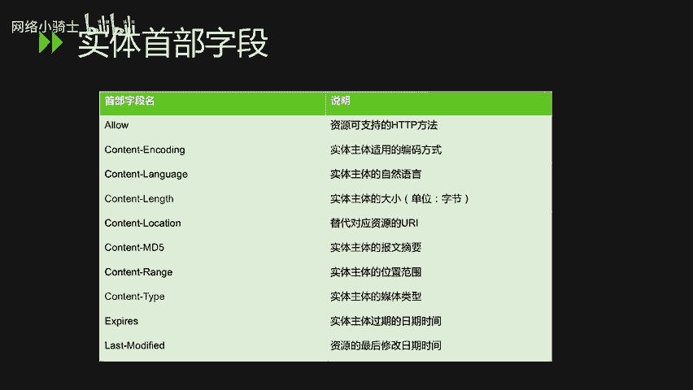

实体首部字段是针对请求报文和响应报文的实体部分使用的首部，补充了资源内容更新时间等与实体有关的信息。

以下是几种常见的实体首部字段：
*   **Allow**：该字段通知客户端服务器支持的所有HTTP方法（如GET、POST）。当服务器接收到不支持的HTTP方法时，会以状态码`405 Method Not Allowed`作为响应返回。
*   **Content-Length**：该字段指明实体主体部分的大小，单位是字节。
*   **Content-Type**：该字段代表实体主体内对象的媒体类型，使用`type/subtype`形式赋值。

## CTF题目实战讲解

了解了HTTP首部字段的基础知识后，我们通过几组CTF题目来学习如何应用这些知识解题。在CTF中，对HTTP协议分析的考察点通常集中在以下几个方面。

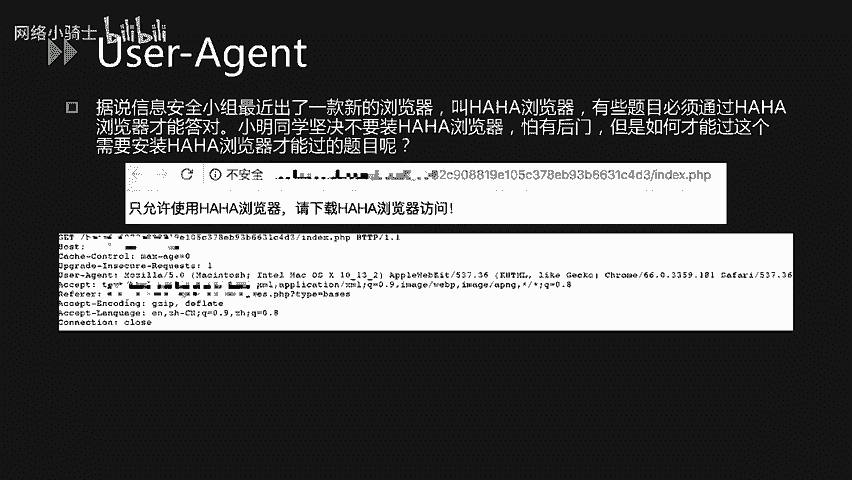

以下是常见的考察知识点：
*   **请求方法 (Method)**：如将GET请求转换为POST请求以绕过检测。
*   **User-Agent**：修改用户代理字符串以伪装成特定浏览器。
*   **Location**：分析重定向响应，寻找隐藏信息或路径。
*   **Referer**：修改或添加Referer字段以满足访问条件。
*   **X-Forwarded-For**：使用该字段伪造客户端IP地址。
*   **Accept-Language**：修改语言偏好以通过地域限制。
*   **Cookie**：篡改Cookie值以伪造登录状态或其他身份信息。
*   **自定义首部字段**：识别并利用服务器返回或要求的非标准首部字段。

### 1. 请求方法 (Method) 考察
**场景**：GET请求被过滤器或WAF（Web应用防火墙）拦截。
**解法**：可以尝试将请求方法转换为POST来绕过检测。在Burp Suite等工具中，可以通过右键选择“Change request method”来一键切换GET和POST方法。

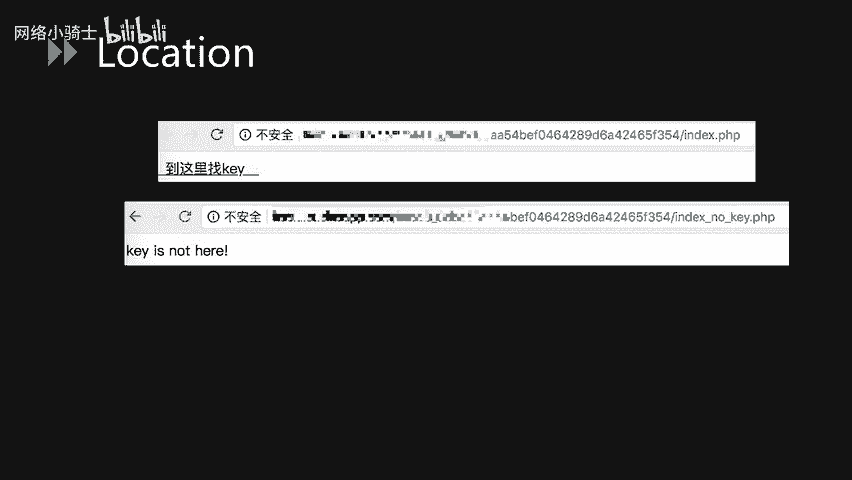

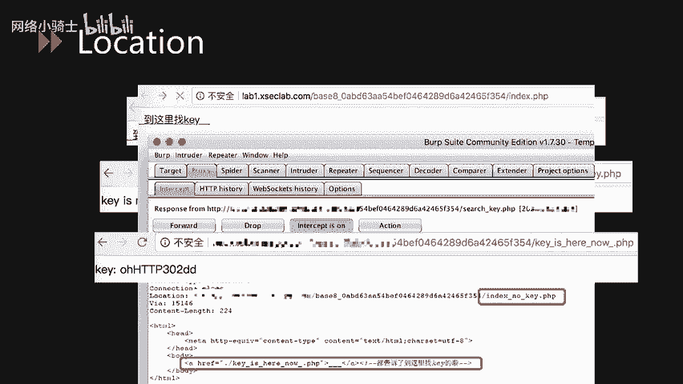

### 2. User-Agent 考察
**题目描述**：据说信息安全小组最近出了一款新的“哈哈浏览器”，有些题目必须通过它才能答对。小明同学坚决不装，怕有后门。请问小明该如何得到flag？
**解法**：打开题目页面，显示“只允许使用哈哈浏览器”。使用Burp Suite拦截请求包，可以看到`User-Agent`字段。将其值修改为“哈哈”后重放请求，即可获得flag。

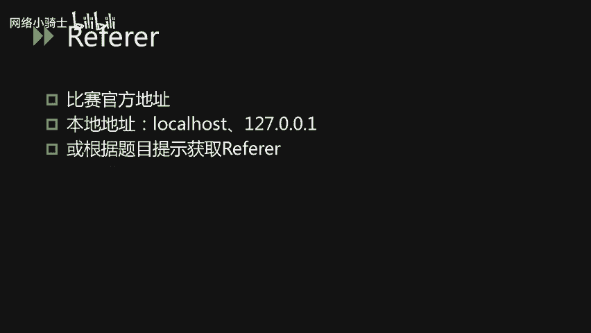

### 3. Location 考察
**题目描述**：页面有一个超链接显示“到这里找flag”。点击后跳转到`index_no_flag.php`，页面显示“flag is not here”。
**解法**：在点击超链接时使用Burp Suite拦截响应。通常会收到一个`302`状态码的响应包，在`Location`字段或响应实体中可能隐藏了真正的flag文件路径。访问该路径即可获取flag。

### 4. Referer 考察
**解法**：这类题目通常需要将`Referer`字段的值修改为比赛官方地址、本地地址（如`127.0.0.1`），或根据题目给出的特定提示进行设置。

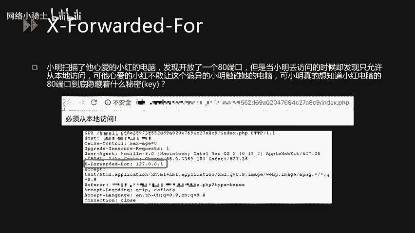

### 5. X-Forwarded-For 考察
**题目描述**：小明扫描发现目标开放了80端口，但只允许本地访问。他想知道该端口隐藏了什么秘密。
**解法**：页面显示“必须从本地访问”。使用Burp Suite拦截请求，添加`X-Forwarded-For`字段并将其值设置为`127.0.0.1`，即可伪造本地访问，获取flag。

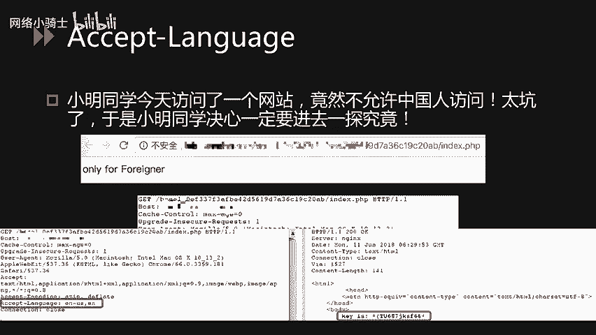

### 6. Accept-Language 考察
**题目描述**：小明访问了一个网站，竟然不允许中国人访问，他想一探究竟。
**解法**：页面显示“only for foreigner”。使用Burp Suite拦截请求，将`Accept-Language`字段的值改为`en`（英文）或其他非中文语言，即可绕过限制获取flag。

### 7. Cookie 考察
**题目描述**：小明来到一个网站想要flag，却怎么都登录不了，你能帮他登录吗？
**解法**：页面显示“必须要登录才能得到flag”。使用Burp Suite拦截请求，发现Cookie中有一个字段`login=0`。将其值修改为`login=1`（或其他表示已登录的值），重放请求即可伪造登录状态，获取flag。

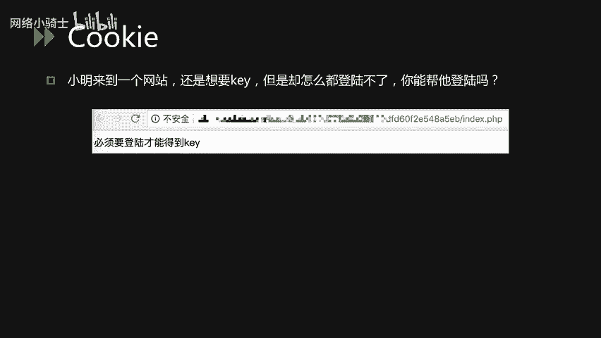

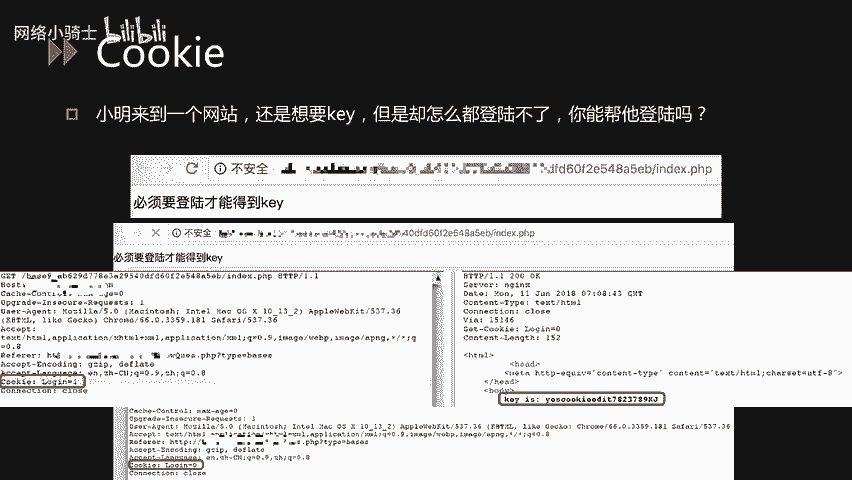

### 8. 自定义首部字段考察
**题目描述**：页面显示“flag就在这里猜在这里是哪里呢？”
**解法**：题目描述暗示flag就在当前页面或响应中。使用Burp Suite拦截服务器的响应报文，仔细检查所有首部字段。有时服务器会在自定义的首部字段（例如一个名为`Flag`的字段）中直接返回flag内容。

## 课程总结

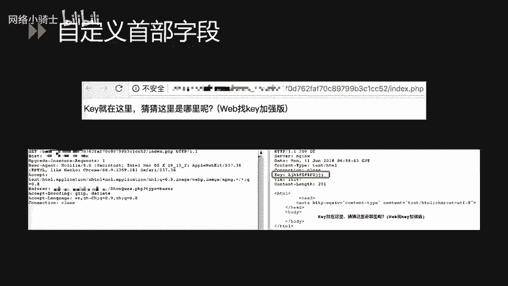

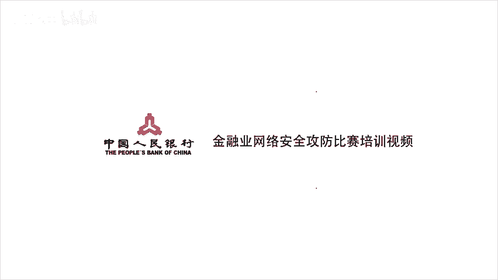

本节课中，我们一起深入学习了HTTP协议的四类首部字段：通用、请求、响应和实体首部字段，并了解了它们各自的作用和常见字段。随后，我们通过多个CTF实战例题，演示了如何通过修改和分析这些首部字段来解题，涵盖了请求方法伪造、User-Agent伪装、重定向分析、Referer/IP伪造、语言偏好修改、Cookie篡改以及识别自定义字段等核心技巧。掌握这些知识对于CTF Web类题目的攻防至关重要。