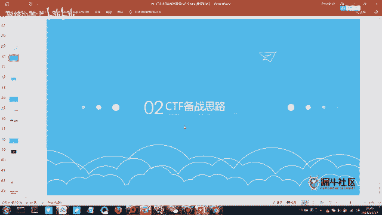
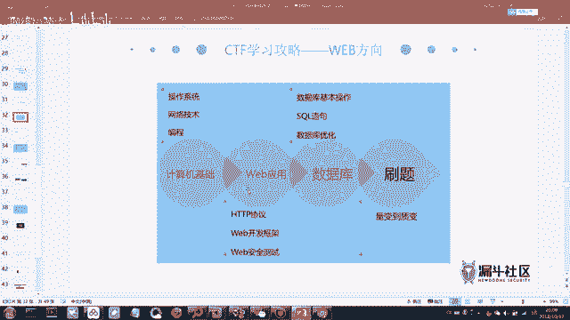
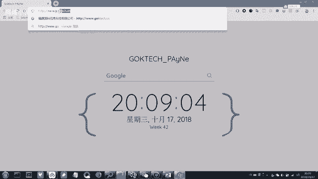
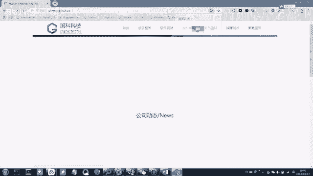
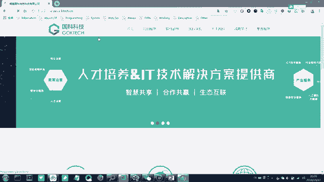
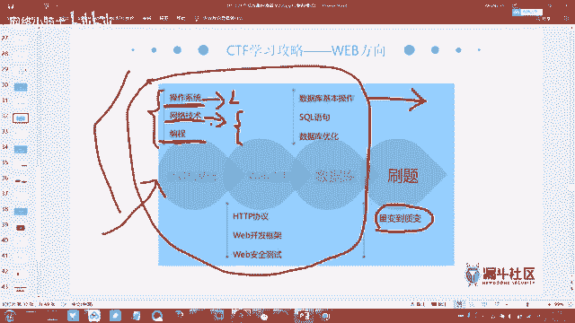
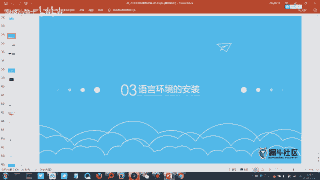
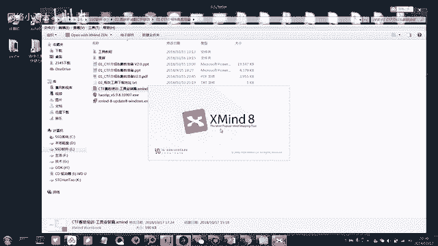
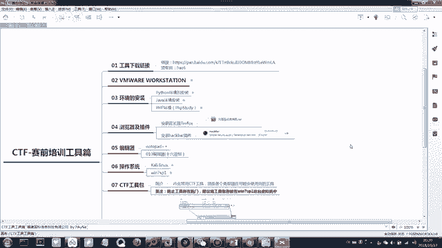

# CTF夺旗赛教程：P2：3. CTF赛制介绍与工具介绍(3)

## 概述
在本节课中，我们将学习CTF比赛的备战思路，了解需要掌握的知识体系，并介绍一些实用的刷题平台和工具。

## CTF备战思路

上一节我们介绍了CTF的基本概念和模式，本节中我们来看看如何为CTF比赛进行准备。梳理出适合自己的备战思路，需要对CTF所需的技术知识有一定理解。

关于CTF比赛需要掌握的知识，可以分为两个主要模块：基础知识和专项知识。

### 基础知识模块
以下是基础知识模块包含的内容：
1.  **Linux系统基本使用**：需要懂一些基本的Linux命令，例如进入目录、查看文件等。无需精通，但必须了解基本操作。
2.  **网络协议分析**：涉及网络流量数据包的分析能力。
3.  **计算机组成原理与操作系统原理**：这两部分知识了解即可，不是必须精通的内容。

### 专项知识模块
专项知识模块又分为两个方向：
1.  **Pwn（二进制漏洞利用）与逆向工程加密码学**：这个方向难度相对较高。
2.  **Web（网络攻防）与杂项（Misc）**：这个方向涉及的技术点可能相对少一些，更注重漏洞原理的利用以及信息收集能力。

## 具体技能学习路线

为了更清晰地规划学习路径，以下是需要掌握的具体技能。

### 操作系统与网络
*   **Linux命令**：掌握基本的Linux命令，例如 `cd`（进入目录）、`ls`（查看文件）等。这在操作Kali Linux等安全工具时是必需的。
*   **网络技术基础**：需要具备类似HCNA或CCNA水平的网络基础知识。了解IP、通信过程等，有助于理解网络相关的题目。

### 编程与Web应用
*   **编程能力**：编程能力属于拔高项，并非必须，但掌握后会更有利。
*   **HTTP/HTTPS协议**：必须掌握HTTP协议。它是Web通信的基础协议。
    *   **HTTP**：超文本传输协议，是Web客户端与服务端通信的标准协议。
    *   **HTTPS**：可以理解为 **`HTTPS = HTTP + TLS/SSL`**。它在HTTP基础上增加了加密层，因此更安全。许多大型网站（如百度、京东）都使用HTTPS以保障信息安全。
*   **数据库与SQL**：需要掌握数据库的基本操作和SQL查询语句，重点是**增（INSERT）、删（DELETE）、查（SELECT）、改（UPDATE）**。理解SQL是学习SQL注入漏洞的基础。

## 学习方法与心态

CTF知识体系看似庞大，但注重的是**知识的广度而非深度**。初学者无需对每个领域都精通。

1.  **广泛了解**：对上述每个部分进行初步了解，能够入门即可。
2.  **通过刷题学习**：这是一个量变到质变的过程。通过大量解题，积累思路和实战经验。
3.  **按需深入**：在刷题过程中，遇到不熟悉的知识点，再通过搜索（如Google，需要VPN）进行针对性学习。如果发现对某个方向特别感兴趣，可以将其作为自己的专精方向。

## 刷题平台推荐

以下是练习CTF题目的一些平台，每个平台都包含大量题目。

*   **实验吧**：题目相对友好，适合初学者，并且提供题目解析（WP）。
*   **BugKu CTF**：题目难度适中，适合入门和巩固。
*   **i春秋（CTF大本营）**：包含大量历年比赛真题，难度较高，适合有一定基础后挑战。

建议初学者从**实验吧**和**BugKu CTF**开始练习，待能力提升后再尝试**i春秋**上的题目。

## 实践操作：工具准备

现在进入今晚的实践操作部分，请打开之前提到的Xmind软件，并打开从群文件中下载的思维导图文件，我们将开始工具的安装与介绍。

## 总结
本节课我们一起学习了CTF的备战思路，明确了需要掌握的基础知识（Linux、网络）和专项知识（Pwn/逆向/密码学、Web/杂项），并了解了“广度优先，实践为主”的学习方法。最后，我们介绍了几大刷题平台，并开始了工具的准备工作。接下来，我们将具体学习这些工具的使用。