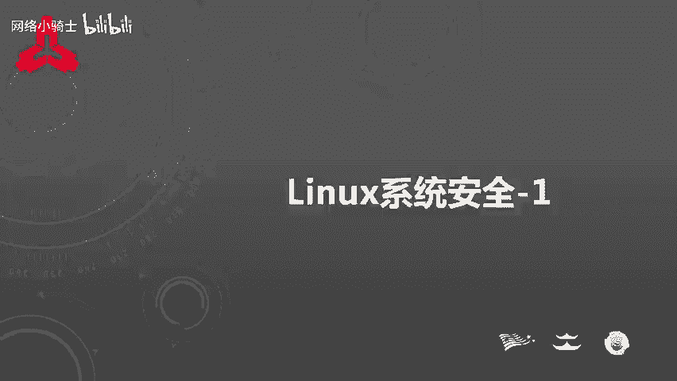
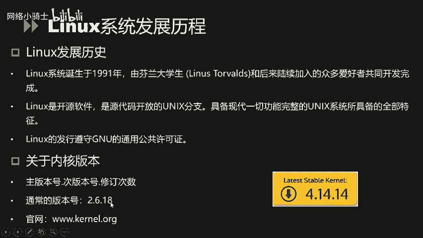
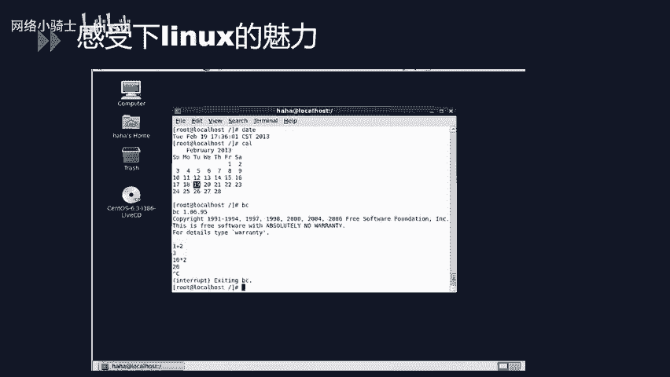
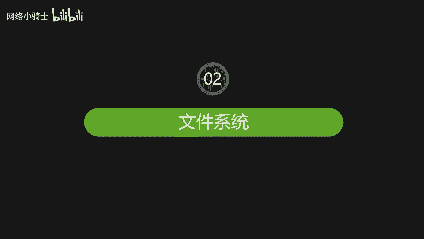
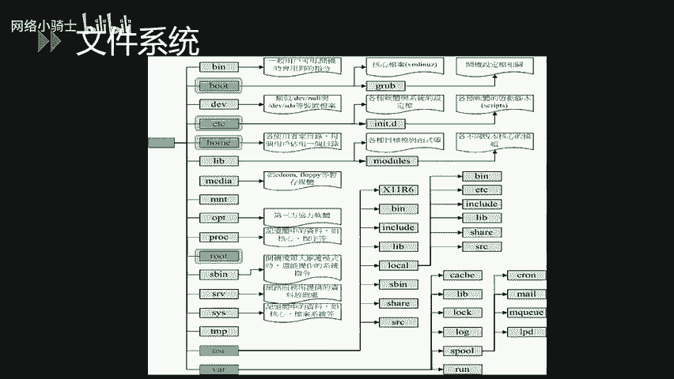
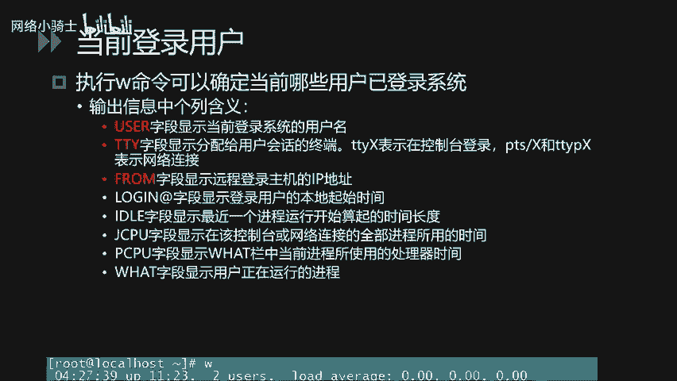
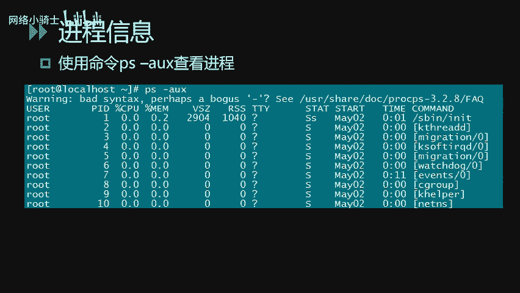
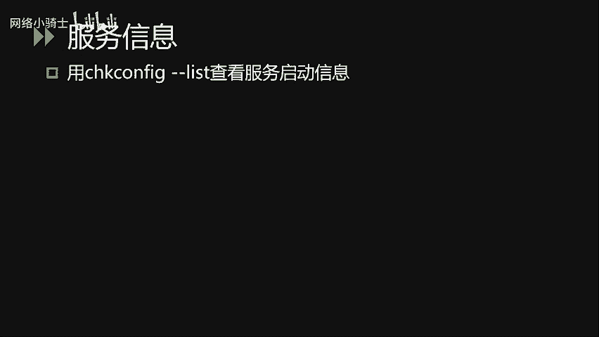
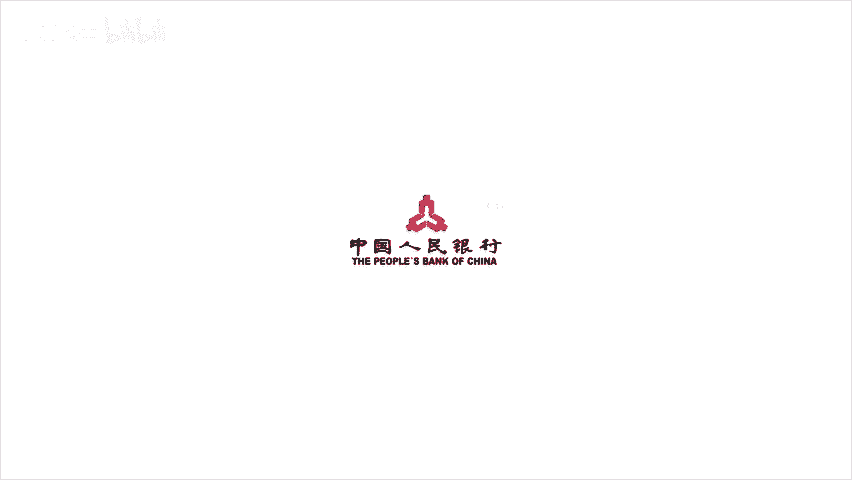

# CTF夺旗赛教程：P30：Linux系统安全_1



在本节课中，我们将学习Linux系统安全的基础知识。课程内容分为三个主要模块：Linux系统简介、Linux文件系统介绍以及Linux的基本操作。通过学习，你将能够理解Linux的基本概念、文件目录结构，并掌握一些核心的系统操作命令。

---

## Linux简介 🐧

上一节我们概述了课程内容，本节中我们来看看Linux系统本身。

Linux系统诞生于1991年，由芬兰赫尔辛基大学的学生林纳斯·托瓦兹和后来陆续加入的众多爱好者共同开发完成。1994年发布了第一个完整的核心版本。因此，大家能够通过网络取得Linux的核心源代码，经由自己精心改造后再回传给Linux社区。这使得Linux能够被广泛使用并进一步发展成为完整的系统。其标志就是我们常见的企鹅，它象征着开源精神。

Linux系统可以安装在各种计算机硬件设备中，例如手机、平板电脑、路由器、视频游戏控制台以及大型计算机等。Linux是一个领先的操作系统，世界上运行最快的10台超级计算机都运行着Linux操作系统。

严格来讲，“Linux”这个词本身只表示Linux内核，但实际上人们已经习惯了用“Linux”来形容整个基于Linux内核的操作系统。Linux常见的发行版本有：
*   **Red Hat**：红帽，1993年创办。
*   **SUSE**：1994年推出。
*   **Debian**：1993年创办。
*   **Ubuntu**：2004年推出。



简单来说，Linux系统诞生于1991年，是一个开源软件，具有Unix系统的全部特征。



简单说完Linux的发展历程后，这里重点强调一下Linux的内核版本。Linux的内核版本主要由三部分组成：
1.  **主版本号**
2.  **次版本号**
3.  **修订次数**



通常我们常见的版本号为 `2.6.18`。目前最新的版本号是 `4.14.14`。对于版本号，我们需要重点关注的是第二位，即**次版本号**。如果次版本号是**偶数**，说明这是一个**稳定版**，适合生产环境使用。如果次版本号是**奇数**，说明是**开发版本**，可能存在bug，不建议用于生产环境。因此，我们通常使用 `2.6.18` 这样的版本作为生产环境。

对于Linux，我们可以通过虚拟机安装的方式来学习。现在很多发行版本都带有图形界面，例如CentOS，这样可以非常容易地上手。

---

## Linux文件系统 📁



上一节我们介绍了Linux系统概况，本节中我们来深入了解Linux的文件系统。

Linux的文件目录结构。这里我们重点讲解系统的一些关键目录和配置文件，以理解Linux系统的整个文件目录结构。

首先，在Linux系统中有一个非常重要的概念：**一切皆文件**。Linux系统把一切资源都看作是文件，包括硬件设备。系统把每个硬件都看成是一个文件，通常称为**设备文件**。这样用户就可以通过读写文件的方式来实现对硬件设备的访问。

Linux系统在启动时，第一个挂载的是**根文件系统**，即 `/`。图上显示的是Linux常见的树状目录结构。从根 `/` 开始，常见的目录有 `/bin`, `/boot`, `/dev`, `/etc`, `/home`, `/mnt`, `/root`, `/usr` 等。

以下是针对每个二级目录的进一步说明：
*   **`/bin` 目录**：存放的是在单人维护模式下还能够被操作的指令。该目录下的命令可以被root及一般账号使用。
*   **`/boot` 目录**：主要放置开机会使用的文件，包括Linux核心文件以及开机所需要的配置文件。
*   **`/dev` 目录**：在Linux系统上，任何装置与设备都是以文件的形态存在于这个目录当中。
*   **`/etc` 目录**：系统的主要配置文件目录，例如人员的账号密码文件、各种服务的启动档案等。
*   **`/home` 目录**：系统默认的用户家目录。
*   **`/lib` 目录**：用于放置开机会使用到的函数库，以及在 `/bin` 和 `/sbin` 目录下指令会调用的函数库。
*   **`/media` 目录**：下面放置的是可移除的装置，包括软盘、光盘、U盘的挂载点。
*   **`/opt` 目录**：用于给第三方软件安装的目录。
*   **`/root` 目录**：系统管理员的家目录。
*   **`/sbin` 目录**：存放的是开机过程中所需要的，包括开机修复和还原系统所需要的相关指令。
*   **`/srv` 目录**：可以认为是“service”的缩写，是一些网络服务启动后所需要调用的数据目录。
*   **`/tmp` 目录**：让一般使用者或正在执行的程序暂时放置文件的地方。

以下是针对部分三级目录的进一步说明：
*   **`/usr/lib` 目录**：放置的是各种应用软件的函数库、目标文件以及不被一般使用者惯用的执行脚本。
*   **`/usr/local` 目录**：系统管理员在本地自行安装下载的软件时建议的安装目录。
*   **`/var/lib` 目录**：程序本身执行的过程中需要使用到的数据文件放置的目录。
*   **`/var/log` 目录**：比较重要，用于放置系统的关键日志记录文件。
*   **`/etc/init.d/` 目录**：放置的是系统服务预设的启动脚本。

讲完系统的重要目录之后，下面对系统内账户相关的重要配置文件做进一步的讲解。

第一个是 `/etc/passwd` 文件。PPT上显示的是该文件中的一行样例：
```
test:x:1000:1000:test,,,:/home/test:/bin/bash
```
以下是各字段的说明：
1.  **用户名**：例如 `test`。
2.  **密码**：这里用 `x` 代替。用户的密码原来是直接存储在这个字段的，但后期为了安全，有了专门的 `/etc/shadow` 文件，所以这里默认用 `x` 代替。
3.  **用户的UID**：一般情况下，`root` 为 `0`。`1` 到 `499` 是系统的默认账号ID值。`500` 到 `65535` 是用户可登录的账号UID值。
4.  **用户的GID**：Linux的用户组ID。
5.  **当前账户的群组名或描述信息**。
6.  **用户的家目录**。
7.  **用户的Shell**：用户登录之后会默认调用的Shell。

系统的默认账号及其UID值如下表所示：
| 账号 | UID | 说明 |
| :--- | :--- | :--- |
| root | 0 | 管理员账户 |
| daemon | 1 | 与执行系统运行任务相关联 |
| bin, sys, adm | 2,3,4 | 系统任务守护进程账号 |
| lp | 7 | 打印机守护进程 |
| nobody | 65534 | 特殊账号，不可用于登录 |

讲完 `/etc/passwd`，我们再讲解 `/etc/shadow`。这个文件主要用于存储用户密码的加密信息。

以PPT上的例子 `test:$6$salt$encrypted:18020:0:99999:7:::` 为例，密码域由三部分组成：
1.  **ID值**：指加密算法。例如，ID为 `1` 时采用 **MD5** 加密；ID为 `5` 时采用 **SHA256** 加密；ID为 `6` 时采用 **SHA512** 加密。
2.  **盐（Salt）**：一个固定长度的随机字符串，每次修改密码后都会随机生成。
3.  **加密后的密文**：根据加密方法和盐，通过加密算法生成的密文。

Linux系统的文件系统讲解到此结束。

---

## Linux基本操作 ⚙️

上一节我们学习了Linux的文件系统结构，本节中我们来看看Linux系统的基本操作。

基本操作这一小节主要讲解Linux文件和目录的基本操作，包括文件与目录管理、账户用户管理、以及系统服务、进程、端口的查看。

首先是文件与目录管理。在Linux系统中定位一个文件或目录时有两种方式：
*   **绝对路径**：从Linux文件系统的根 `/` 开始写起，写法一定由根目录斜杠开始。例如 `/home/test/file.txt`。
*   **相对路径**：相对于当前的工作目录，不是由根开始写起。例如，当前在 `/home`，那么 `test/file.txt` 就是相对路径。

以下是目录的基本操作命令：
*   `cd`：用于改变当前的工作目录。`cd /path/to/directory`
*   `pwd`：显示当前所在的目录。
*   `mkdir`：创建一个新的目录。`mkdir new_folder`
*   `rmdir`：删除一个空的目录。
*   `ls`：用于列出文件与目录。`ls -l`

关于文件安全管理操作，我们讲解一下Linux文件系统的访问权限。Linux的访问权限有三种类别：**拥有人（Owner）**、**拥有组（Group）** 和 **其他人（Others）**。可以为每个类别分配不同的权限组合。所有文件都归一个用户及一个组所有。这三种权限分别是：**可读（r）**、**可写（w）**、**可执行（x）**。

其中，账户的UID定义用户的身份，账户的GID定义用户所处的组别。可以通过 `ls -l` 命令查看文件或目录的权限属性。

以下是相关的管理命令：
*   创建用户：`useradd username`
*   创建组：`groupadd groupname`
*   更改文件所有权：`chown user filename`
*   更改组所有权：`chgrp group filename`
*   设置文件的权限：`chmod permissions filename` （例如 `chmod 755 file.sh`）
*   权限赋予（以其他用户身份执行命令）：`sudo command`

下面讲一下Linux系统的用户安全管理操作。
*   添加用户：`useradd username`
*   删除用户：`userdel -r username` （加上 `-r` 参数表示在删除用户的同时，一并删除用户的家目录及本地邮件存储的目录或文件）
*   锁定用户：`passwd -l username`
*   修改用户属性：`usermod` 命令。可以修改账户的有效期、登录目录等。
*   查看当前用户ID：`id` 命令用于查看当前用户的用户ID和组ID。



Linux系统是一个多用户操作系统。通过执行 `w` 命令，我们可以查看当前系统的用户登录信息。从输出中我们可以看到：
*   `USER` 字段：显示当前登录系统的用户名。
*   `FROM` 字段：显示远程登录主机的IP地址，若为本地登录则显示空或 `:0`。
*   `LOGIN@` 字段：显示用户登录的起始时间。
*   `WHAT` 字段：显示用户正在运行的程序。
*   `TTY` 字段：显示分配给用户会话的终端。`ttyS` 表示在控制台登录，`pts/#` 或 `ttyp#` 表示是网络连接。

下面我们再讲一下端口开放情况的查看。
我们可以使用 `netstat -tulpn` 或 `ss -tulpn` 命令查看当前开放的端口及对应的服务。然后再使用 `lsof -i` 命令显示进程和端口的对应关系。

看一个例子：通过 `netstat` 我们发现系统开放了 3306、22、80 端口。其中 3306 和 80 端口处于监听状态，等待连接。而 22 端口的服务正与某个IP的某个端口建立了连接。

使用 `lsof -i :端口号` 可以显示占用特定端口的进程信息。从输出中我们可以看出进程的PID（进程ID）。例如，`sshd` 服务的PID为 832，通过对照 `netstat` 输出中PID为 832 的条目，我们可以知道它对应的是 22 端口。这样我们就可以通过进程PID来找到对应的端口号。

再讲一下进程信息的查看。使用 `ps aux` 命令查看进程，可以看到当前进程的PID、内存和CPU的使用率，以及 `COMMAND` 字段对应的应用目录和服务。



最后讲一下服务信息的查看。使用 `chkconfig --list` 或 `systemctl list-unit-files`（取决于系统版本）可以查看服务的启动信息。这里会列出每一个服务在系统不同运行级别下的自动启动状态。



Linux系统有6种运行级别：
1.  **运行级别 0**：关机。
2.  **运行级别 1**：单用户模式（救援模式）。
3.  **运行级别 2**：无网络连接的多用户模式。
4.  **运行级别 3**：有网络连接的多用户模式（文本界面）。
5.  **运行级别 4**：保留，未使用。
6.  **运行级别 5**：带图形界面的多用户模式。
7.  **运行级别 6**：重启。

例如，我们看到 `mysql` 服务在运行级别1-5下默认都是关闭的，这意味着无论系统在哪个运行级别启动，`mysql` 服务都不会自动启动，需要手动启动该服务才行。

---



本节课中我们一起学习了Linux系统安全的基础知识，包括Linux系统的简介与发展、核心的文件目录结构及其关键配置文件（如 `/etc/passwd`, `/etc/shadow`）的含义，以及最常用的系统操作命令，涉及文件目录管理、用户权限管理和系统状态（用户、进程、端口、服务）查看。掌握这些内容是进一步学习Linux系统安全和CTF竞赛中相关挑战的基础。