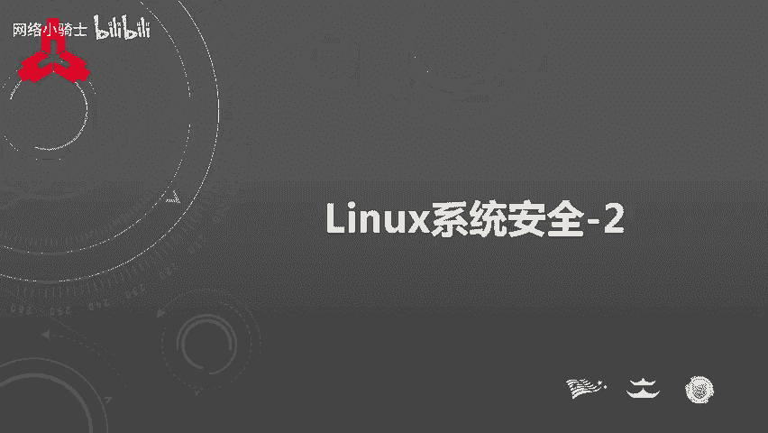
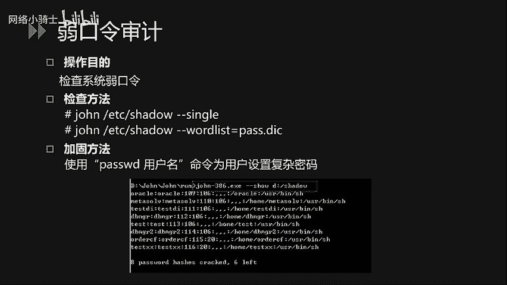
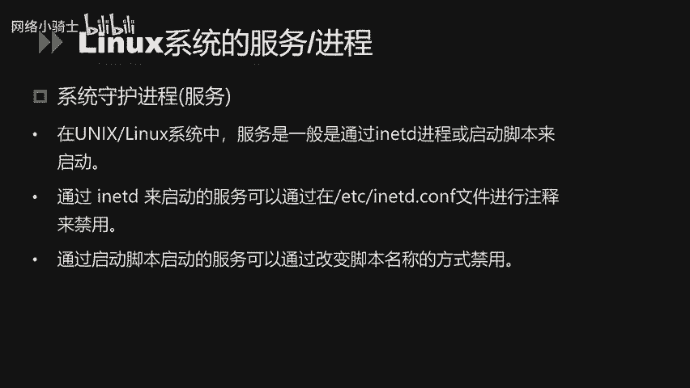
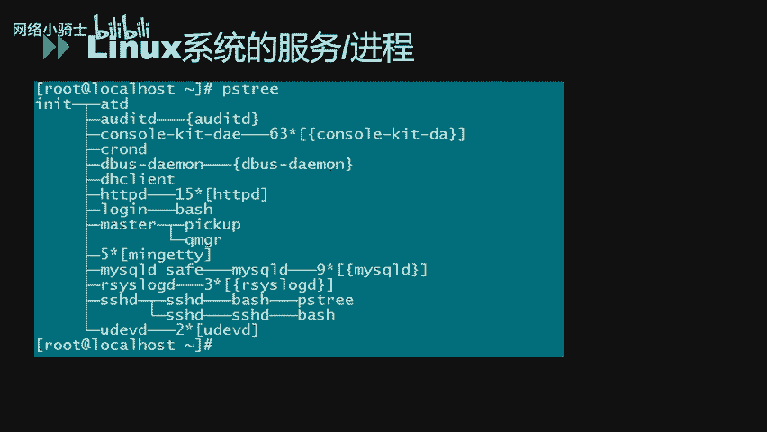
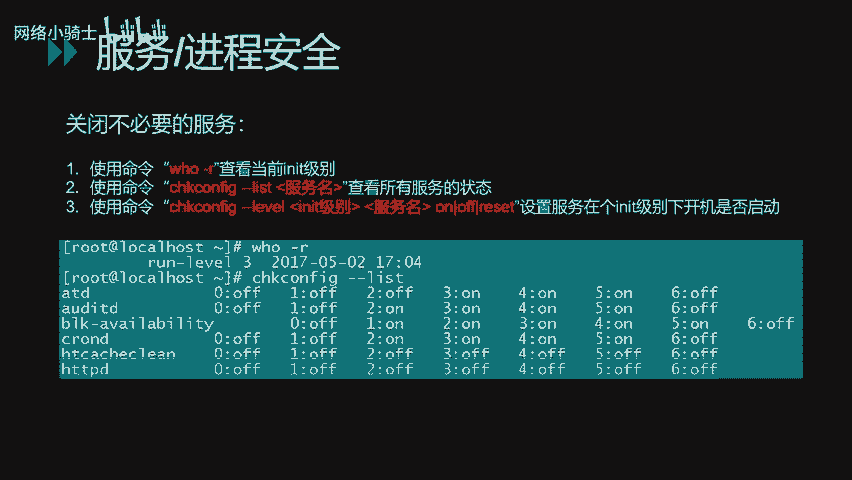
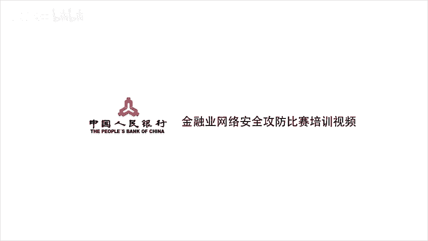

# CTF夺旗赛教程：P31：Linux系统安全配置（第二部分）



## 概述
在本节课中，我们将继续学习Linux系统安全配置。主要内容包括Linux的常规安全设置、账户安全策略以及系统服务与进程的安全配置。通过学习这些内容，你将能够加固一个Linux系统，减少潜在的安全风险。

---

## Linux常规安全配置

上一节我们介绍了Linux安全的基础概念，本节中我们来看看如何进行具体的常规安全配置。

### 文件与目录权限
针对系统内重要的目录和文件，需要合理配置其访问权限以增强安全性。可以使用 `ls -l` 命令查看当前权限设置。

**示例命令：**
```bash
ls -l /etc/
```

对于重要目录，可以使用 `chmod` 命令进行加固。例如，加固 `/etc` 目录：

**示例命令：**
```bash
chmod -R 750 /etc
```
此配置意味着只有root用户拥有读、写和执行权限，其他用户均无权访问。

### 设置默认权限（umask）
单独设置每个文件或目录的权限非常繁琐。通过配置 `umask` 值，可以为新建的文件和目录赋予默认权限。系统默认 `umask` 值通常为022。

通过修改 `/etc/profile` 文件中的 `umask` 值来增强安全性。例如，设置为027：

**配置示例：**
```bash
umask 027
```
此设置下，新建文件属主有读写执行权限，同组用户只有读和执行权限，其他用户无任何权限。

### 限制历史命令记录
Linux系统默认将用户输入的命令历史记录在 `~/.bash_history` 文件中。为避免敏感信息泄露，可以限制其记录的命令总数。

通过修改 `/etc/profile` 文件中的 `HISTFILESIZE` 和 `HISTSIZE` 变量来实现。例如，限制为只保留最新的5条命令：

**配置示例：**
```bash
HISTFILESIZE=5
HISTSIZE=5
```

### 设置连接超时
为增加安全性，可以设置终端连接的超时时间。若在规定时间内无任何操作，系统将自动断开连接。通过修改 `/etc/profile` 文件中的 `TMOUT` 值实现。

**配置示例：**
```bash
TMOUT=180
```
此设置表示3分钟无操作则自动断开会话。

### 加固root用户的PATH环境变量
`PATH` 环境变量定义了系统查找命令的目录。若 `PATH` 中包含当前目录（`.`），则存在安全风险。例如，在当前目录下存在一个名为 `ls` 的恶意脚本时，执行 `ls` 命令可能会运行该脚本。

因此，root用户的 `PATH` 环境变量不应包含当前目录（`.`）。

**检查当前PATH：**
```bash
echo $PATH
```
**加固方法：** 编辑 `/etc/profile` 文件，确保 `PATH` 变量中不包含 `.`。

---

## Linux账户安全设置

完成了常规安全配置，接下来我们重点关注系统账户的安全策略。

### 禁用无用账户
减少系统无用账户可以降低风险。首先查看系统所有账户：

**示例命令：**
```bash
cat /etc/passwd
```
确认不必要的账户后，使用 `passwd -l` 命令锁定它们。对于仅用于服务（如FTP）且无需登录的账户，应将其shell设置为 `/sbin/nologin`。

### 配置账户锁定策略
为防止暴力破解密码，可以配置账户锁定策略。编辑 `/etc/pam.d/system-auth` 文件。

**配置示例：**
```
auth required pam_tally2.so deny=10 unlock_time=300
```
此配置表示连续输错10次密码后，账户将被锁定5分钟（300秒）。

### 检查空口令与特权账户
空口令账户和未经授权的特权账户是重大安全隐患。

以下是检查方法：
*   **检查空口令账户：** 检查 `/etc/shadow` 文件。
*   **检查特权账户（UID为0）：** 检查 `/etc/passwd` 文件。

**示例命令（使用awk）：**
```bash
# 检查空口令
awk -F: '($2=="") {print $1}' /etc/shadow

# 检查UID为0的账户
awk -F: '($3==0) {print $1}' /etc/passwd
```

### 配置口令周期策略
强制用户定期修改密码可以提升安全性。相关配置文件为 `/etc/login.defs`。

关键参数包括：
*   **PASS_MAX_DAYS:** 密码最长使用天数。
*   **PASS_MIN_DAYS:** 密码最短使用天数。
*   **PASS_WARN_AGE:** 密码到期前提醒天数。

也可以针对特定用户设置策略：

**示例命令：**
```bash
chage -M 30 -m 0 -W 7 -E 2000-01-01 username
```
此命令将用户 `username` 的密码最长使用期设为30天，最短为0天，在2000年1月1日过期，过期前7天发出警告。

### 配置口令复杂度策略
强制使用强密码可以避免弱口令。编辑 `/etc/pam.d/system-auth` 文件。

**配置示例：**
```
password requisite pam_cracklib.so minlen=8 lcredit=-1 ucredit=-1 dcredit=-1
```
此策略要求密码至少8位，且包含至少一个小写字母、一个大写字母和一个数字。

### 限制root远程登录
应禁止root用户通过SSH远程登录。通过修改SSH服务的配置文件实现，具体在服务安全配置部分讲解。

### 控制使用su命令的权限
严格限制可以通过 `su` 命令切换为root的用户。编辑 `/etc/pam.d/su` 文件。

**配置示例：**
在文件开头添加：
```
auth required pam_wheel.so group=wheel
```
然后，将允许使用 `su` 命令的用户加入 `wheel` 组：

**示例命令：**
```bash
usermod -aG wheel username
```



### 保护系统引导过程（GRUB密码）
为防止他人通过单用户模式重置root密码，可以为GRUB引导管理器设置密码。编辑 `/etc/grub.conf` 文件，添加 `password` 字段。

### 修改SNMP默认团体字
默认的SNMP团体字（如 `public`）会泄露系统信息。修改 `/etc/snmp/snmpd.conf` 文件中的默认团体字。如非必要，建议禁用SNMP服务。

### 使用工具审计弱口令
可以使用第三方工具（如 `john`）来审计系统中存在的弱口令。
*   **单用户模式：** 尝试用用户名的各种变体作为密码进行测试。
*   **字典模式：** 使用常见的弱密码字典进行针对性测试。

---

## Linux系统服务与进程安全配置



最后，我们来学习如何管理系统的服务与进程，这是防御外部攻击的重要环节。

### 查看系统进程
每个运行的服务都对应一个或多个进程。服务本质上是监听用户请求的进程，通过端口号区分。



**常见服务与端口对应关系：**
*   FTP: 21
*   SSH: 22
*   Telnet: 23
*   SMTP: 25
*   HTTP: 80
*   MySQL: 3306

可以使用以下命令查看进程：
*   **`pstree`:** 以树状图显示进程关系。
*   **`ps aux`:** 显示每个进程的详细信息（PID、用户、CPU/内存占用等）。

### 服务管理
Linux服务通常由 `init` 进程或启动脚本管理。
*   对于 `init` 管理的服务，可编辑 `/etc/inittab` 文件来配置。
*   对于脚本管理的服务，可通过重命名或修改启动脚本来禁用。

### 常见服务安全配置示例
以下是针对几个关键服务的安全配置：

**1. SSH服务**
配置文件：`/etc/ssh/sshd_config`
*   **禁止root远程登录：** `PermitRootLogin no`
*   **使用协议版本2：** `Protocol 2`
*   **限制登录尝试次数：** `MaxAuthTries 3`
修改后需重启服务：`service sshd restart`

**2. TCP Wrappers**
这是一个基于主机的访问控制工具。通过编辑 `/etc/hosts.allow` 和 `/etc/hosts.deny` 文件，可以控制哪些主机可以访问哪些服务。

**配置示例：**
在 `/etc/hosts.allow` 中添加：
```
sshd: 192.168.1.100
```
在 `/etc/hosts.deny` 中添加：
```
sshd: ALL
```
此配置表示只允许IP `192.168.1.100` 访问本机的SSH服务。

**3. NFS服务**
使用 `exportfs` 命令管理共享目录。编辑 `/etc/exports` 文件，删除不必要的共享目录。

**4. 系统日志配置（syslog）**
配置文件：`/etc/syslog.conf`
确保关键的安全事件和认证日志被妥善记录。例如，将认证信息记录到独立文件：

**配置示例：**
```
authpriv.* /var/log/secure
```

**5. 禁用Ctrl+Alt+Del重启**
为避免误操作导致系统重启，可以禁用该快捷键。编辑 `/etc/inittab` 文件，注释掉（在行首加`#`）包含 `ctrlaltdel` 的行，然后运行 `init q` 重新加载配置。

### 关闭不必要的服务
暴露的服务越多，系统风险越高。应定期检查并关闭非必需的服务。

**检查与关闭步骤：**
1.  查看当前运行级别：`who -r`
2.  查看该级别下自动启动的服务：`chkconfig --list | grep 3:on` （假设运行级别为3）
3.  禁用指定服务在指定级别的自动启动：`chkconfig --level 3 servicename off`

---



## 总结
本节课我们一起学习了Linux系统安全配置的三个核心部分：
1.  **常规安全配置：** 包括文件权限、umask、历史命令、连接超时和PATH环境变量的加固。
2.  **账户安全设置：** 涵盖禁用无用账户、配置账户/口令锁定策略、检查特权账户、设置口令周期与复杂度，以及使用工具进行弱口令审计。
3.  **服务与进程安全配置：** 学习了如何查看和管理进程，并对SSH、TCP Wrappers、NFS、系统日志等关键服务进行了安全配置示例，最后强调了关闭不必要服务的重要性。



通过综合应用这些配置，可以显著提升Linux系统的整体安全性，为CTF竞赛和实际运维打下坚实的基础。