# CTF夺旗赛教程：P32：Linux系统安全_3 🔐


在本节课中，我们将要学习Linux系统安全的三个核心部分：网络安全配置、日志审计安全以及系统安全工具的使用。我们将从网络参数调整和防火墙规则讲起，接着学习如何通过日志发现攻击行为，最后介绍一些用于安全检测的实用工具。

---

## 网络安全配置 🔧

上一节我们介绍了Linux系统安全的基础概念，本节中我们来看看如何配置网络以增强安全性。这部分主要包含网络参数配置和iptables防火墙规则设置。

### 网络参数配置

系统中提供了`sysctl`命令，可以查看当前的网络参数。我们可以使用`sysctl -a`查看当前的网络参数配置。然后我们可以通过修改`/etc/sysctl.conf`这个文件内的参数来调整我们当前系统的网络参数配置。

如PPT所示，我们可以配置忽略ICMP广播，这样就不会对ping请求做出回应。这样就无法通过ping来发现该主机。同时我们也可以通过修改TTL值来隐藏当前操作系统的正确类型，因为有些扫描器是通过系统返回的TTL值来判断当前的操作系统类型的。

完成修改配置后，我们可以通过`sysctl -p`命令来使配置生效。这是网络参数配置部分的内容。

### iptables防火墙


iptables是Linux内核集成的IP信息包过滤系统。如果系统连接到互联网或局域网，使用iptables可以更好地控制IP信息包过滤，实现防火墙功能。

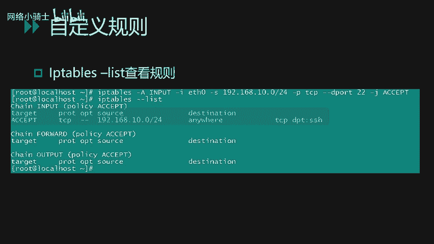

下面讲一下Linux的iptables命令选项的输入顺序。如PPT所示，第一个选项是`-t`表名，然后是我们的规则链名、规则号、网卡名、协议名、源端口、目的端口，最后是我们的动作，即针对匹配规则的数据包做出的行为。

以下是常见的参数选项：
*   `-A`选项：向规则链中添加条目，即新增一条防火墙规则。
*   `-D`选项：从规则链中删除条目。
*   `-I`选项：在防火墙规则链中插入对应的条目。
*   `-L`选项：查看当前已有的防火墙规则策略。
*   `-p`选项：用来匹配具体协议的数据包类型。
*   `-s`选项：匹配数据包的源IP地址。
*   `-j`选项：指定要跳转的目标（动作）。
*   `-i`选项：数据包进入本机的网络接口。
*   `-o`选项：数据包离开本机所使用的网络接口。

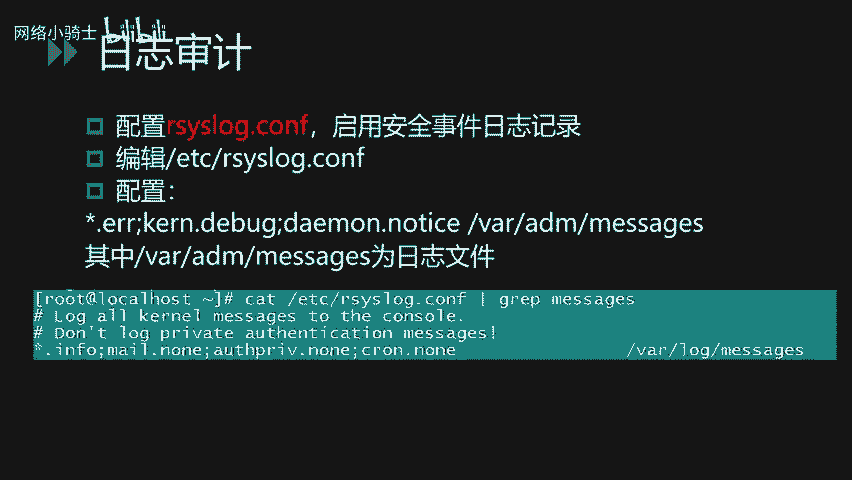

下面再讲一下规则链名的主要内容：
*   **INPUT链**：处理输入的数据包，即系统接收的数据包。
*   **OUTPUT链**：处理输出的数据包，即本系统向外发送的数据包。
*   **FORWARD链**：处理转发的数据包。

常见的动作有：
*   **ACCEPT**：表示接收该数据包。
*   **DROP**：表示丢弃该数据包。
*   **REDIRECT**：表示将这个数据包重定向到另一个指定的地方。

下面我们看几个具体的iptables例子。

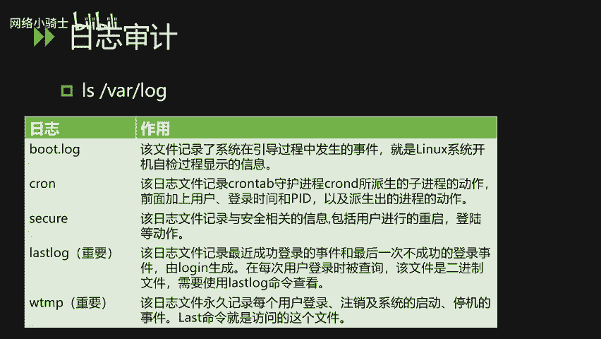

**例1：限制进入连接**
```bash
iptables -A INPUT -s 192.168.0.0/24 -p tcp --dport 22 -j ACCEPT
```
这条规则限制仅从`192.168.0.0/24`网段内的IP地址才能够连接到本机的22端口，即限制访问本机SSH服务的主机只能是该网段内的主机，从而对SSH服务达到一定的防护效果。

**例2：限制外发连接**
```bash
iptables -A OUTPUT -o eth0 -p udp -j DROP
```
这条规则限制本机`eth0`网卡无法向外发起UDP连接，即向外的UDP包都会被丢弃掉。

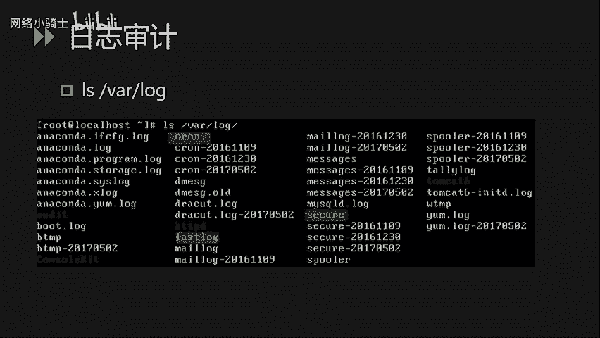

添加完自定义规则后，我们可以通过`iptables -L`命令来查看当前的所有规则链。规则链分为三块：INPUT（进入）、FORWARD（转发）和OUTPUT（输出）。

---

## 日志审计安全 📝

上一节我们介绍了如何配置网络防火墙，本节中我们来看看如何通过日志审计来发现安全威胁。日志审计安全主要讲解日志审计功能配置和日志的简单分析。通过日志分析，我们可以发现一些可疑的攻击行为。

首先，要启用Linux系统的安全日志审计功能，需要配置`/etc/rsyslog.conf`文件。如PPT所示，系统的错误日志、内核日志、调试日志等都会被记录到`/var/log/messages`这个文件中。

系统的日志默认情况下都保存在`/var/log`目录下。以下是该目录下一些常见的重要日志文件：
*   **`dmesg`文件**：该日志文件记录了系统在引导过程中发生的事件，即Linux系统开机自检过程显示的相关信息。
*   **`cron`日志**：记录了cron守护进程所派生的子进程的相关动作。
*   **`secure`日志**：记录了与安全相关的信息，包括用户进行的重启、登录等动作内容。
*   **`lastlog`文件**：这是一个比较重要的日志。该文件记录了最近成功登录的事件和最后一次不成功的登录事件，由login生成，在每次用户登录时被查询。因为该文件是一个二进制文件，所以我们需要使用`lastlog`命令来查看。
*   **`wtmp`日志**：永久记录每个用户的登录、注销及系统启动、停机等事件。我们可以使用`last`命令来访问这个文件。

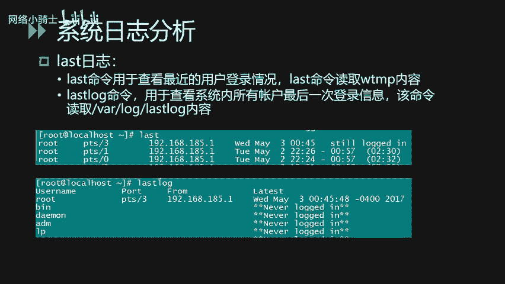


除了这些系统日志外，第三方服务的日志（如HTTP日志、Tomcat日志）也会保存在该目录中。开启对应的日志审计功能后，我们就可以通过日志分析来发现恶意的攻击行为或者非法的登录行为。

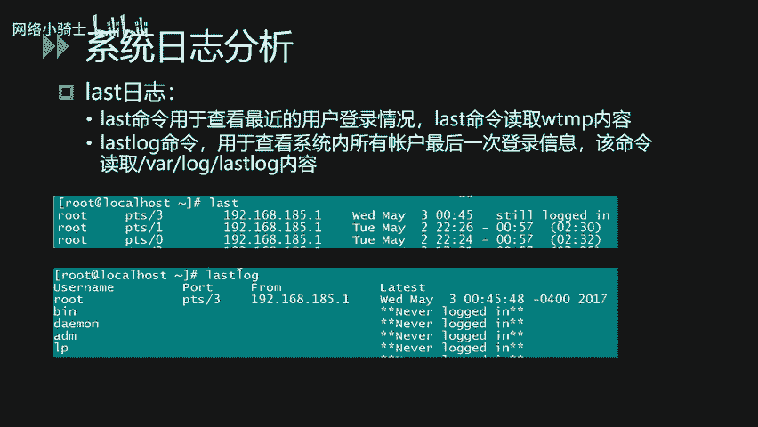

### 日志分析实例


日志内容格式一般包括事件的发生时间节点、主机名、服务名和具体信息。下面我们针对SSH日志的异常行为进行分析。

首先，我们可以通过命令查看SSH日志的内容。我们使用`cat`命令，再加上`grep`参数来匹配`sshd`服务的相关日志内容。
```bash
cat /var/log/secure | grep sshd
```
通过日志，我们可以查看每个SSH会话的源IP地址。例如，一条记录可能显示从`192.168.68.1`的9528端口，使用root账号成功登录。

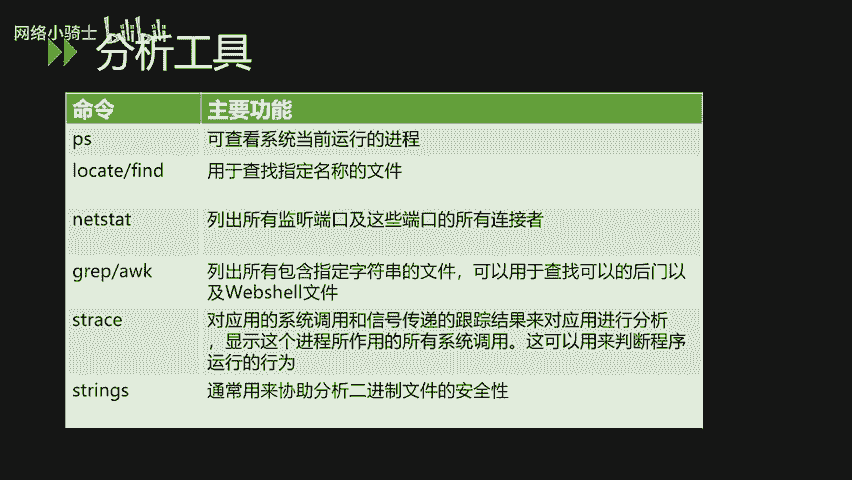

**SSH口令爆破日志分析**
如果我们在日志中看到大量密集的登录失败信息（状态为`Failed`或`Invalid`），从事件发生的时间节点和频繁度来分析，可以初步断定这是一个SSH口令爆破行为。在日常运维中，发现此类行为后，建议将日志导出做批量分析，检查是否有登录成功的情况，并定位被破解的账号。

**`last`和`lastlog`命令的使用**
*   `last`命令：查看最近用户的登录情况。可以显示登录的账号名称、登录位置（本地或远程）、源IP地址、登录时间等。
*   `lastlog`命令：查看系统内所有账号的最后一次登录信息。可以通过该命令发现异常的登录行为。例如，发现某个平时不登录的账号突然有登录记录。

---

## Linux下的安全工具 🛠️

讲完系统日志分析之后，我们再讲一下Linux下的安全工具。这主要是一些Linux下常见的命令和后门检测工具。

### 系统自带命令

通过系统自带命令，我们可以对可疑的进程和文件进行定位分析。
以下是常用的系统命令：
*   **`ps`命令**：用于查看当前运行的进程。
*   **`find`或`locate`命令**：用于查找定位指定名称的文件。可以通过关键字进行全系统搜索。
*   **`netstat`命令**：列出所有监听的端口和这些端口当前的连接状态。
*   **`grep`和`awk`**：都是文本字符串处理工具，可以帮助查找文件内的关键字。常用于通过关键字匹配来定位恶意文件，例如Webshell。
*   **`lsof`命令**：显示进程所打开的所有系统文件描述符，可以用来帮助我们判断程序的运行行为。
*   **`strings`命令**：可以用来协助分析二进制文件的安全性，提取文件中的可打印字符。

**实例：查找Webshell**
假设我们已知一句话木马包含`eval`和`post`关键字。
*   **方法一：使用`grep`命令**
    ```bash
    grep -r -i -l "eval.*post" /app/website/
    ```
    参数说明：`-r`递归搜索，`-i`忽略大小写，`-l`只输出文件名。此命令在`/app/website/`目录下递归查找包含`eval`和`post`字样的文件。
*   **方法二：使用`find`结合`xargs`**
    ```bash
    find /app/website/ -type f | xargs grep -l "eval.*post"
    ```
    使用`xargs`将`find`搜索出来的文件名作为后面`grep`命令的输入。

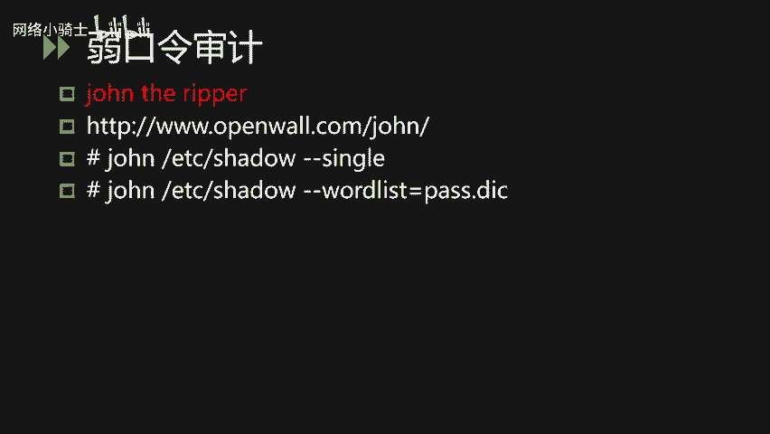

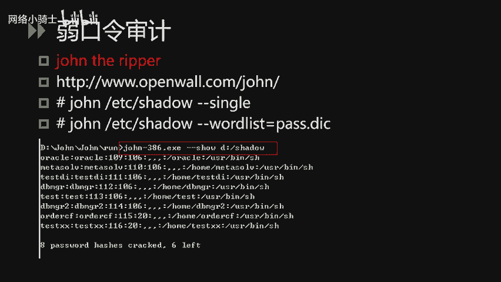

### 口令审计工具

在日常运维中，弱口令是经常碰到的安全重点。我们会从两个层面介绍工具，对Linux系统的口令强度进行审查。

**1. John the Ripper**
该工具能够对Linux系统的`/etc/shadow`文件进行离线口令审计。使用此工具时，必须有权限获取目标系统的影子密码文件。
它支持多种系统的口令哈希，除了Linux，还能审计Oracle数据库、Windows系统的口令。
使用方法：
*   **方式一：使用账户名变体爆破**
    ```bash
    john --single /etc/shadow
    ```
    此模式提取账户名后，利用账户名的各种格式变化来爆破对应的密码。
*   **方式二：使用密码字典爆破**
    ```bash
    john --wordlist=password.lst /etc/shadow
    ```
    通过收集内部常见弱口令，形成字典后进行针对性爆破。

**2. Hydra（九头蛇）**
该工具与John the Ripper的区别在于它通过在线爆破的方式进行口令审计。好处是不需要提取密码文件，坏处是可能触发账户锁定策略，使用前需确认安全配置。
使用方法：
*   **爆破FTP服务**
    ```bash
    hydra -l login -P passlist.txt 192.168.0.1 ftp
    ```
    使用`login`账户和`passlist.txt`密码字典，爆破`192.168.0.1`主机上的FTP服务密码。
*   **爆破SMB服务**
    ```bash
    hydra -l administrator -P passwords.txt 192.168.0.1 smb
    ```

### 后门检测工具

在Linux系统中，后门一般被称为Rootkit。
**1. chkrootkit**
它是一个用于Linux本地的Rootkit检测工具。据官方介绍，目前能够进行的Rootkit检查类型可达60多种。
使用方法很简单，安装后直接运行：
```bash
./chkrootkit -q -r /
```
参数`-q`安静模式，`-r`指定检查的根目录，会对整个系统进行后门程序检测。

**2. rkhunter (Rootkit Hunter)**
使用起来也比较简单，安装工具后，直接使用`rkhunter --check`命令即可。检查过程中，程序会打印每一项的检查结果。检查完成后，会生成一份具体的报告，默认存放在`/var/log/rkhunter.log`文件中。

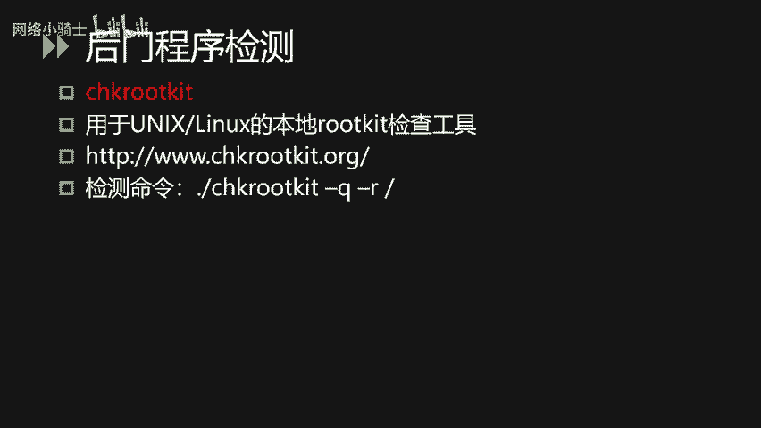

---

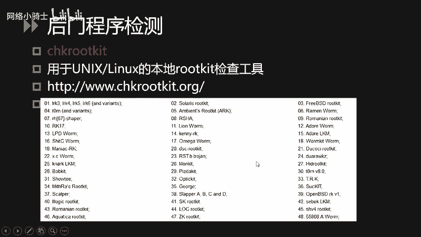

## 总结 📚

本节课中我们一起学习了Linux系统安全的三个重要方面。
1.  **网络安全配置**：我们学习了如何使用`sysctl`调整网络参数（如隐藏ping响应和TTL值），以及如何使用`iptables`配置精细的防火墙规则来控制网络流量。
2.  **日志审计安全**：我们了解了Linux系统日志的存储位置和重要日志文件（如`secure`, `lastlog`, `wtmp`），并学习了如何通过分析日志（特别是SSH日志）来识别如口令爆破等攻击行为，还掌握了`last`和`lastlog`命令的使用。
3.  **安全工具使用**：我们介绍了一系列系统自带命令（`ps`, `find`, `grep`, `lsof`等）用于进程和文件分析，以及两款专门的口令审计工具（**John the Ripper**用于离线破解，**Hydra**用于在线爆破）和两款后门检测工具（**chkrootkit**和**rkhunter**）。

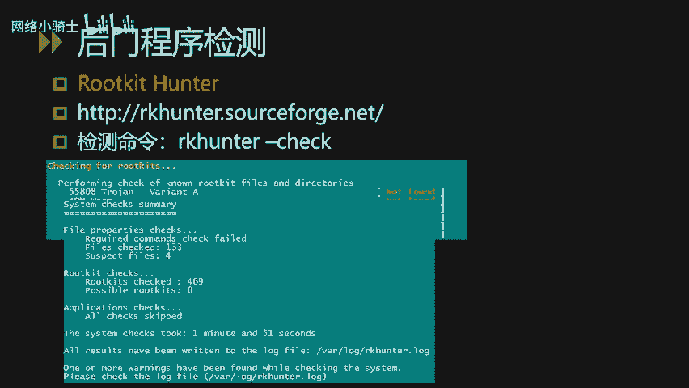


通过掌握这些知识，你可以更好地加固Linux系统，并具备初步的安全事件分析和应急响应能力。