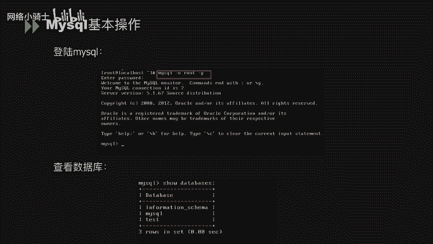
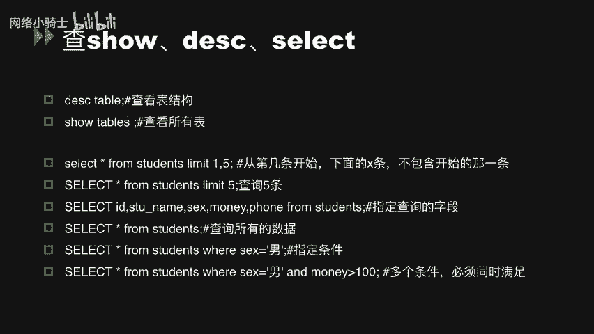
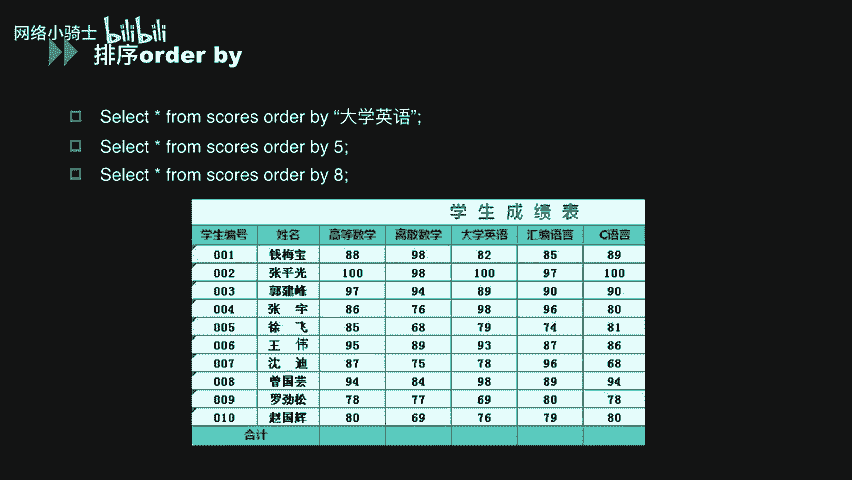
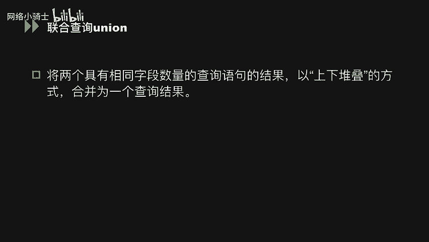
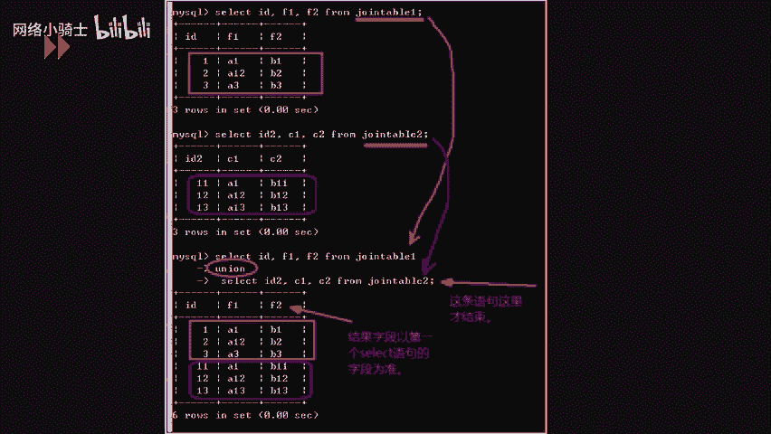
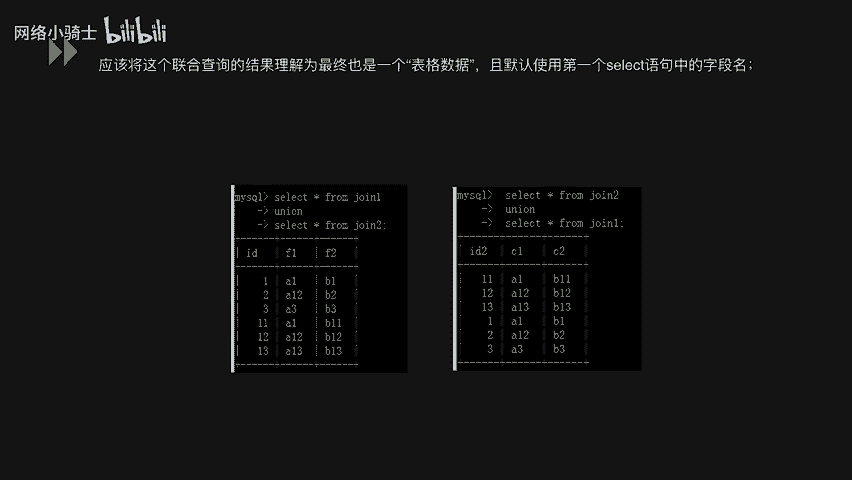

# CTF夺旗赛教程：P33：MySQL常用命令 🗄️


在本节课中，我们将学习MySQL数据库的基本操作命令。这些命令是进行数据库管理和后续学习SQL注入等CTF相关技术的基础。我们将从登录数据库开始，逐步介绍增、删、改、查等核心操作，并讲解排序和联合查询等高级用法。

## 登录与查看数据库

首先，我们需要登录到MySQL数据库。登录命令如下：



```bash
mysql -U 用户名 -P
```

执行此命令后，控制台会提示输入密码。输入正确密码后，即可进入MySQL命令行界面。

进入MySQL后，可以使用以下命令查看当前数据库服务器上的所有数据库：

```sql
SHOW DATABASES;
```

## 用户与权限管理

以下是关于用户和权限管理的基本操作。

**新建用户并赋予权限**：创建用户时，可以直接为其设置密码并授予权限。
```sql
GRANT ALL PRIVILEGES ON *.* TO '新用户名'@'localhost' IDENTIFIED BY '密码';
```

**查询、增加、取消用户权限**：
*   **查询权限**：`SHOW GRANTS FOR '用户名'@'localhost';`
*   **增加权限**：使用 `GRANT` 语句可以授予如 `SELECT`、`INSERT`、`DELETE` 等操作权限。
*   **取消权限**：使用 `REVOKE` 语句可以删除用户的特定数据库权限。

**查看版本号和时间**：
*   **查看版本**：`SELECT VERSION();`
*   **查看当前时间**：`SELECT NOW();`

**查看日志文件**：
```sql
SHOW VARIABLES LIKE ‘%log%’;
```

**查看用户及主机信息**：
```sql
SELECT user, host, password FROM mysql.user;
```

## 数据库的增操作

本节介绍向数据库中添加数据的命令，主要包括创建表和插入数据。

**创建表 (CREATE)**：使用 `CREATE TABLE` 命令可以创建一张新表。
```sql
CREATE TABLE scores (id INT, name VARCHAR(50), grade INT);
```
这条语句创建了一个名为 `scores` 的表，包含 `id`、`name`、`grade` 三个字段。

**插入数据 (INSERT)**：创建表后，可以使用 `INSERT INTO` 命令向表中添加具体数据。
```sql
INSERT INTO students (name, money, sex, phone) VALUES (‘张三’, 100, ‘男’, ‘13800138000’);
```
如果插入数据的顺序与表中列的顺序完全一致，可以省略列名部分：
```sql
INSERT INTO students VALUES (‘李四’, 200, ‘女’, ‘13900139000’);
```

## 数据库的删操作

本节介绍从数据库中删除数据的命令。

**删除表 (DROP)**：`DROP TABLE` 命令可以快速删除整张表。
```sql
DROP TABLE table_name;
```

**删除数据行 (DELETE)**：`DELETE FROM` 命令可以删除表中的特定行。
```sql
DELETE FROM table_name WHERE id = 1;
```
这条语句仅删除 `table_name` 表中 `id` 等于 1 的那一行数据。



## 数据库的改操作

本节介绍修改数据库结构或数据的命令。

**修改表结构 (ALTER)**：`ALTER TABLE` 命令用于修改表名、表结构，例如新增字段。
```sql
ALTER TABLE students ADD COLUMN email VARCHAR(100);
```

**更新数据 (UPDATE)**：`UPDATE` 命令用于修改表中已有的具体数值。
```sql
UPDATE students SET money = 100;
```
这条语句会将 `students` 表中所有行的 `money` 字段值改为 100。通常我们会使用 `WHERE` 子句来限定修改范围：
```sql
UPDATE students SET money = 200 WHERE name = ‘HK’;
```
这条语句仅将 `name` 为 ‘HK’ 的行的 `money` 值修改为 200。

## 数据库的查操作



本节介绍从数据库中查询数据的命令，这是最常用的操作。

**查看表结构 (DESC)**：
```sql
DESC table_name;
```



**查看所有表 (SHOW TABLES)**：
```sql
SHOW TABLES;
```

**查询数据 (SELECT)**：`SELECT` 是最核心的查询命令。
*   **限制查询条数 (LIMIT)**：
    ```sql
    SELECT * FROM students LIMIT 5; -- 查询前5条
    SELECT * FROM students LIMIT 1, 5; -- 从第2条开始，查询5条
    ```
*   **查询指定字段**：
    ```sql
    SELECT id, name, sex, money, phone FROM students;
    ```
*   **查询所有数据**：
    ```sql
    SELECT * FROM students;
    ```

## 数据排序 (ORDER BY)



上一节我们介绍了基础查询，本节中我们来看看如何对查询结果进行排序。`ORDER BY` 关键词用于根据指定列对结果集进行排序。

假设有一张学生成绩表 `scores`，包含“大学英语”等列。
*   **按列名排序**：
    ```sql
    SELECT * FROM scores ORDER BY 大学英语;
    ```
    结果将按“大学英语”列的值升序排列。
*   **按列序号排序**：也可以使用列的序号（从1开始）进行排序。
    ```sql
    SELECT * FROM scores ORDER BY 5; -- 假设“大学英语”是第5列
    ```
    **重要提示**：如果 `ORDER BY` 后面的数字超过了表的实际列数，数据库会报错。这一特性在后续的SQL注入漏洞利用中会用到。

## 联合查询 (UNION)

联合查询 `UNION` 用于将两个或多个 `SELECT` 语句的结果集合并为一个结果集，合并方式是上下堆叠。

**使用限制**：
1.  每个 `SELECT` 语句查询结果的列数必须相同。
2.  每个 `SELECT` 语句对应列的数据类型应该相似。

**语法形式**：
```sql
SELECT 语句1 UNION [ALL | DISTINCT] SELECT 语句2;
```
*   默认使用 `DISTINCT`，会自动去除重复的行。
*   使用 `UNION ALL` 可以包含所有重复的行。

**示例**：
假设有两个表 `table1` 和 `table2`。
```sql
SELECT id, f1, f2 FROM table1
UNION
SELECT id, c1, c2 FROM table2;
```
这条语句将两个表的结果上下合并显示。`SELECT` 语句的顺序决定了结果集中上下部分的顺序。



---


本节课中我们一起学习了MySQL数据库的常用命令，包括数据库的登录、用户管理、以及数据的增、删、改、查等基本操作。我们还深入了解了数据排序 (`ORDER BY`) 和联合查询 (`UNION`) 的用法与限制。掌握这些命令是理解后续Web安全中SQL注入漏洞的基础。