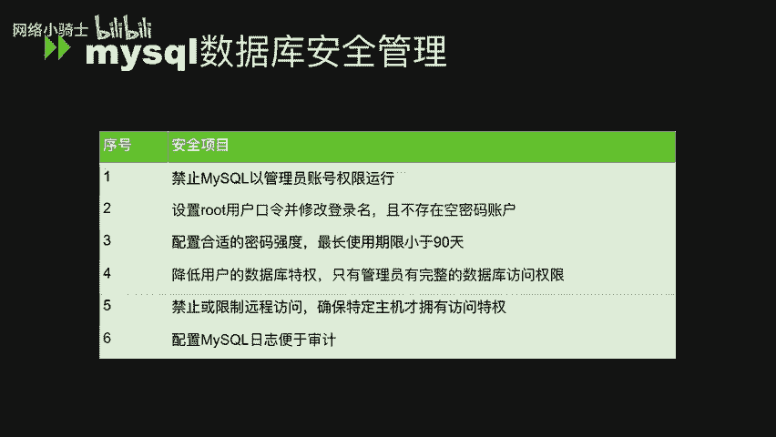
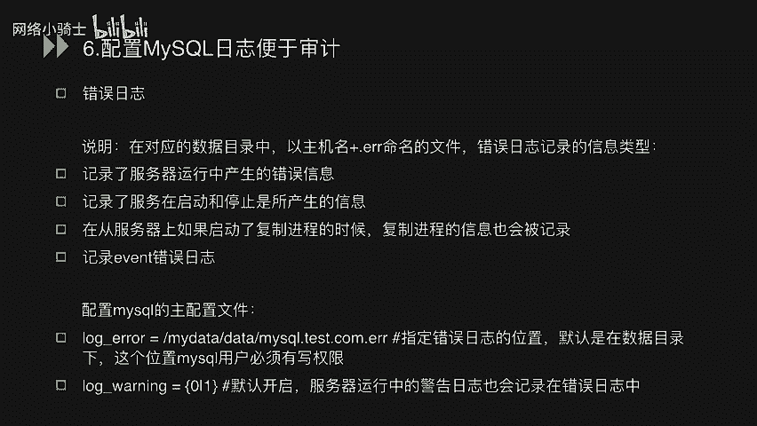
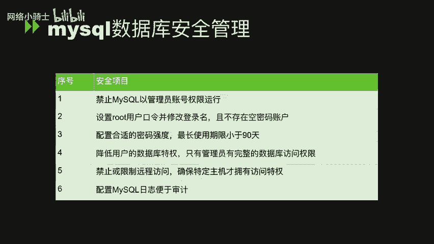

# CTF夺旗赛教程：P34：MySQL数据库系统安全管理与优化 🛡️


在本节课中，我们将要学习MySQL数据库安全管理的核心知识。课程内容主要分为三个部分：MySQL安全配置规范、常用基本命令操作，以及SQL查询与手工注入执行的原理分析。通过学习，你将掌握如何加固数据库并理解SQL注入的基本原理。


---



## 第一部分：MySQL数据库安全管理 🔐

上一节我们介绍了课程的整体结构，本节中我们来看看MySQL数据库安全管理的具体配置规范。这部分内容共分为六个关键点，每个点都涉及一项基本的安全基线配置。

### 1. 禁止MySQL以管理员账号权限运行
此规范要求MySQL数据库应使用普通用户账户运行，而非管理员账号（如root）。这样做的目的是在数据库出现安全漏洞时，将影响范围限制在MySQL用户权限内，避免危及整个操作系统。

加固方法是在MySQL配置文件 `my.cnf` 中添加以下配置：
```ini
user = mysql
```
添加后，重启MySQL服务即可使数据库以`mysql`用户身份运行。

### 2. 设置root用户口令，修改登录名，并消除空密码账户
此规范旨在加强root账户的安全性。首先，我们需要为root用户设置强密码。

以下是操作步骤：
1.  使用 `mysql -uroot -p` 登录数据库。
2.  执行命令修改root密码：
    ```sql
    SET PASSWORD FOR 'root'@'localhost' = PASSWORD('new_password');
    ```
    将 `new_password` 替换为实际的强密码。

为了进一步提升安全性，可以修改root用户的用户名：
```sql
USE mysql;
UPDATE user SET user='new_username' WHERE user='root';
FLUSH PRIVILEGES;
```
修改后，需使用新的用户名 `new_username` 登录。

此外，必须确保所有数据库用户均设置了密码，不存在空密码账户。检查空密码用户的命令如下：
```sql
SELECT * FROM mysql.user WHERE password='';
```
在安全的系统中，此查询应无任何返回结果。若存在空密码用户，可使用以下命令为其设置密码：
```sql
SET PASSWORD FOR 'user'@'host' = PASSWORD('new_password');
```

### 3. 配置合理的密码强度与最长使用期限
数据库用户密码应具备足够的复杂性，包括长度、大小写字母、数字和特殊字符。同时，密码最长使用期限应小于等于90天。

加固方案是启用密码复杂度插件并设置全局策略：
```sql
-- 启用密码复杂度插件（示例，具体插件名可能因版本而异）
INSTALL PLUGIN validate_password SONAME 'validate_password.so';
-- 设置密码策略：最小长度14位，需包含大小写字母、数字和特殊字符
SET GLOBAL validate_password.length = 14;
SET GLOBAL validate_password.mixed_case_count = 1;
SET GLOBAL validate_password.number_count = 1;
SET GLOBAL validate_password.special_char_count = 1;
-- 设置密码最长有效期为90天
SET GLOBAL default_password_lifetime = 90;
```

### 4. 降低用户的数据库特权
在MySQL中，`mysql.user` 和 `mysql.db` 表列出了各种权限。通常，高级权限应仅授予管理员用户。

以下是需要重点管控的权限：
*   **FILE_PRIV**：允许用户读取服务器主机上的文件。
*   **PROCESS_PRIV**：允许用户查看所有用户的进程信息。
*   **SUPER_PRIV**：允许用户执行设置全局变量、调试等高级操作。
*   **SHUTDOWN_PRIV**：允许用户关闭数据库服务器。
*   **CREATE_USER_PRIV**：允许用户创建或删除其他用户。
*   **GRANT_PRIV**：允许用户修改其他用户的权限。

应确保只有管理员拥有上述权限。可以使用以下命令审计拥有特定权限的非管理员用户：
```sql
-- 查询拥有FILE权限的用户
SELECT user, host FROM mysql.user WHERE File_priv = 'Y';
-- 查询拥有PROCESS权限的用户
SELECT user, host FROM mysql.user WHERE Process_priv = 'Y';
```
对于查询到的非管理员用户，应回收其不必要的权限：
```sql
-- 回收SHUTDOWN权限
REVOKE SHUTDOWN ON *.* FROM 'user'@'host';
-- 回收CREATE USER权限
REVOKE CREATE USER ON *.* FROM 'user'@'host';
-- 回收GRANT权限
REVOKE GRANT OPTION ON *.* FROM 'user'@'host';
```
请将 `'user'@'host'` 替换为实际的用户名和主机。

### 5. 禁止或限制远程访问
允许从外网直接访问生产数据库是危险的。应严格限制访问来源IP，并遵循最小权限原则。

**不安全的做法（完全开放）：**
```sql
GRANT ALL ON *.* TO 'root'@'%';
```

**安全的做法（限制特定IP和权限）：**
```sql
-- 仅允许本地访问
GRANT ALL ON *.* TO 'root'@'localhost';
-- 允许特定IP访问，并仅授予必要权限（如SELECT, INSERT）
GRANT SELECT, INSERT ON mydb.* TO 'some_user'@'192.168.1.100';
```

### 6. 配置MySQL日志便于审计
启用日志功能对于安全审计和故障排查至关重要。MySQL应配置错误日志、二进制日志、慢查询日志等。

加固方法是在主配置文件 `my.cnf` 中设置：
```ini
# 错误日志配置
log-error = /var/log/mysql/error.log
# 通用查询日志（审计用，生产环境慎用，影响性能）
general_log = 1
general_log_file = /var/log/mysql/general.log
# 慢查询日志
slow_query_log = 1
slow_query_log_file = /var/log/mysql/slow.log
long_query_time = 2
# 二进制日志（用于复制和恢复）
log-bin = /var/log/mysql/mysql-bin.log
```
错误日志主要记录：
*   服务器运行中的错误信息。
*   服务器启动和停止时的信息。
*   从服务器上复制进程的信息。
*   事件调度器运行时的错误信息。

确保日志文件所在目录的权限正确，`mysql` 用户需有写入权限。

---



以上便是MySQL数据库安全管理六个核心规范的详细讲解。通过禁用高权限运行、强化账户认证、实施最小权限原则、限制网络访问并开启审计日志，可以显著提升数据库系统的安全性。




本节课中我们一起学习了MySQL安全配置的基础知识。下一节，我们将进入第二部分，学习MySQL的常用基本命令，为后续理解SQL注入打下操作基础。