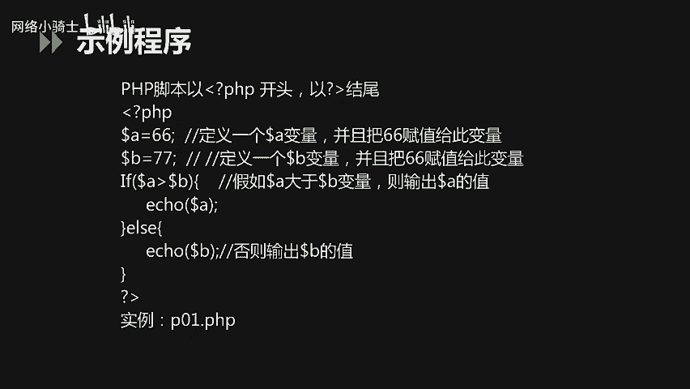
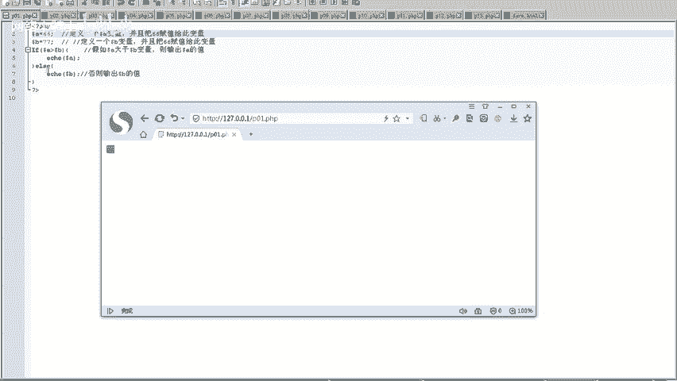
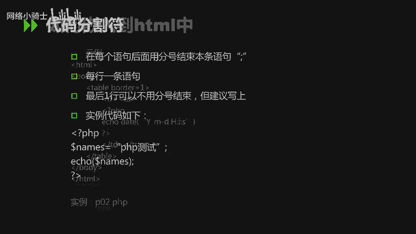
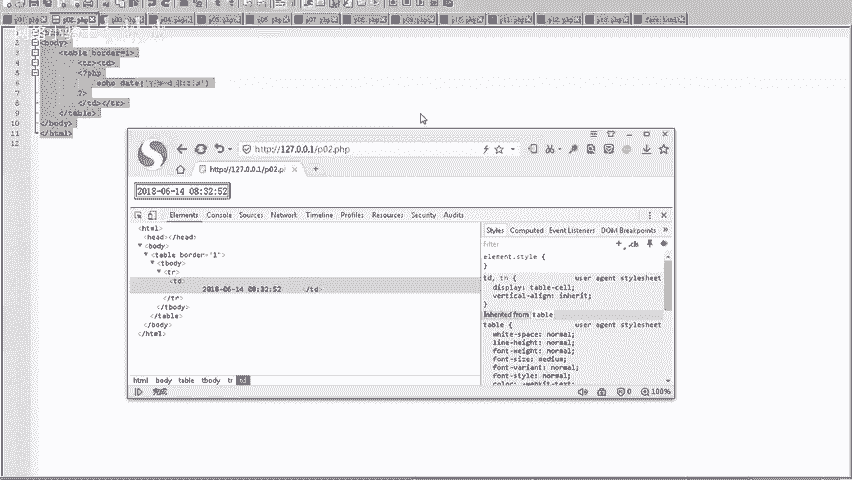
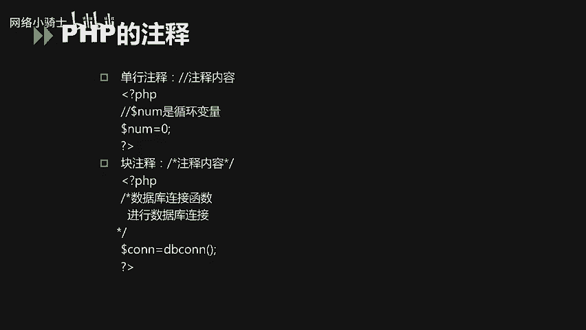
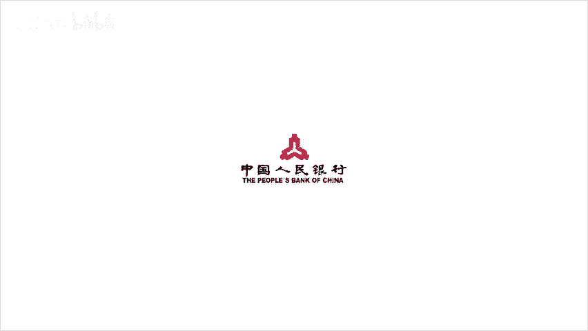

# CTF夺旗赛教程：P35：PHP基础知识_1 🚩


在本节课中，我们将要学习PHP的基础知识，这是CTF比赛中Web安全方向的重要基础。课程主要分为两部分：PHP的基本常识和基本语法。我们将从定义、环境讲起，并重点学习其核心语法，包括数据类型、变量和常用函数。

---

## PHP基本常识

上一节我们介绍了课程的整体结构，本节中我们来看看PHP的基本常识，这部分内容我们了解即可。

### PHP的定义与现状

PHP最初代表“Personal Home Page Tools”。目前，PHP被定义为“超文本预处理器”（Hypertext Preprocessor）的递归缩写。PHP本身是一种被广泛应用的开放源代码的多用途脚本语言。

在2017年12月的编程语言排名中，PHP处于第九位。PHP是服务端脚本语言，它返回的是HTML代码。与PHP竞争的主要语言有三类：
*   微软的C#语言。
*   Oracle的Java语言。
*   谷歌的Python语言。

### PHP的主要应用领域

PHP主要应用于服务端脚本开发，尤其是在Web开发及中小型网站开发中。其他两种应用场景如下：
*   命令行脚本：直接在命令行下执行PHP程序。
*   客户端GUI应用开发：但目前应用场景较少。

### PHP的运行环境与支持

在软件开发中，大部分开发人员使用Windows操作系统，因此需要熟练掌握Windows下的PHP开发运行环境。PHP同样可以在其他操作系统上进行开发，包括Linux、Unix和Mac OS。

支持PHP运行的服务器主要包括Apache和Nginx。PHP本身支持多种数据库，主流的有MySQL、SQL Server和Oracle。

---

## PHP基本语法



了解了PHP的基本概况后，本节中我们将重点学习PHP的基本语法，这是后续学习的核心。

### PHP脚本示例

首先，我们通过一个简单的例子来认识PHP脚本。PHP脚本以 `<?php` 开头，以 `?>` 结尾。

以下是一个比较两个变量大小并输出较大值的示例代码：



```php
<?php
$a = 88;
$b = 77;
if ($a > $b) {
    echo $a;
} else {
    echo $b;
}
?>
```

**代码解释**：
1.  `<?php` 标记PHP代码开始。
2.  `$a = 88;` 定义变量 `$a` 并赋值为88。分号 `;` 用于结束一条语句。
3.  使用 `if...else` 语句判断 `$a` 和 `$b` 的大小，并通过 `echo` 输出较大的值。
4.  `?>` 标记PHP代码结束。

将上述代码保存为 `.php` 文件并在配置好的服务器（如Apache）中运行，访问该文件路径，页面将输出较大的数值（本例中为88）。



### PHP与HTML的融合

PHP可以轻松嵌入到HTML页面中。以下示例展示了如何在HTML表格中输出当前服务器时间：

```html
<table>
    <tr>
        <td>当前时间是：</td>
        <td><?php echo date("Y-m-d H:i:s"); ?></td>
    </tr>
</table>
```



**代码解释**：
*   在HTML的 `<td>` 标签中，直接嵌入 `<?php ... ?>` 脚本。
*   `date("Y-m-d H:i:s")` 是PHP内置函数，用于获取当前日期和时间，并按“年-月-日 时:分:秒”的格式返回。
*   服务器执行PHP代码后，会将生成的时间字符串填充到表格单元格中，最终返回完整的HTML页面给浏览器。

### 语句结束与注释

在PHP代码中，每条语句通常以分号 `;` 结束。虽然最后一条语句后的分号可以省略，但建议始终加上以保持代码规范。

注释对代码编写和维护至关重要。PHP支持两种注释方式：

以下是注释的示例：
*   **单行注释**：使用双斜杠 `//`。
    ```php
    // 这是单行注释，定义了一个变量
    $name = “PHP测试”;
    ```
*   **多行注释**：使用 `/*` 和 `*/` 包裹。
    ```php
    /*
    这是一个多行注释（块注释）。
    可以在这里写多行说明文字。
    */
    echo $name;
    ```

---



## 总结



本节课中我们一起学习了PHP的基础知识。我们首先了解了PHP的定义、应用领域和运行环境等基本常识。接着，我们重点学习了PHP的基本语法，包括如何编写一个简单的PHP脚本、如何将PHP嵌入HTML，以及语句结束符和注释的写法。掌握这些基础是进一步学习PHP安全与CTF Web题目的关键第一步。