# CTF夺旗赛教程：P36：PHP基础知识_2


在本节课中，我们将继续学习PHP的基础知识，主要包括PHP的变量、常量以及字符串操作函数。

## 数据类型概述

上一节我们介绍了PHP的基本概念，本节中我们来看看PHP支持的数据类型。PHP支持8种原始数据类型，包括4种标量类型、2种复合类型和2种特殊类型。

以下是PHP数据类型的分类：
*   **标量类型**：布尔型、整型、浮点型、字符串型。
*   **复合类型**：数组、对象。
*   **特殊类型**：资源、NULL。

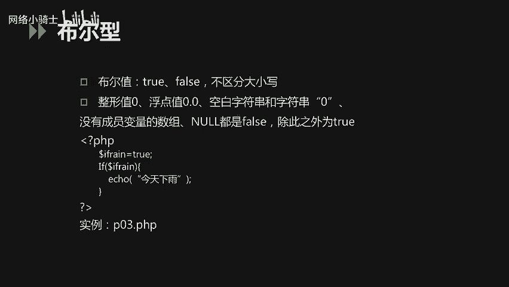

### 布尔型 (Boolean)

布尔型只有两个值：`true`（真）和 `false`（假），不区分大小写。在PHP中，以下值在布尔上下文中被视为 `false`：
*   布尔值 `false` 本身。
*   整型值 `0`。
*   浮点型值 `0.0`。
*   空字符串 `""` 和字符串 `"0"`。
*   没有成员变量的数组。
*   特殊类型 `NULL`。

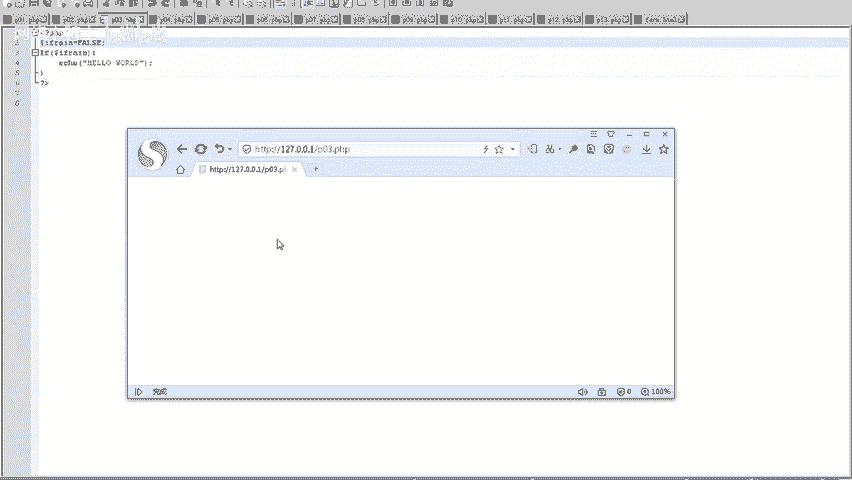

除此之外的所有其他值都被视为 `true`。

我们来看一个示例代码：
```php
<?php
$is_rain = true;
if ($is_rain) {
    echo "今天下雨";
}
?>
```
在这段代码中，变量 `$is_rain` 被赋值为 `true`。`if` 语句会进行判断，如果条件为真，则输出“今天下雨”。如果将 `$is_rain` 的值改为 `false`，则不会输出任何内容。

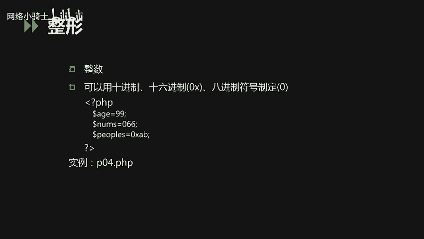

### 整型 (Integer)

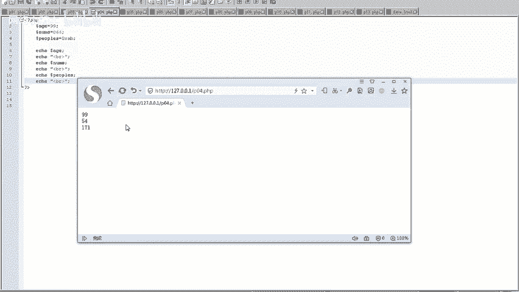

整型是一个非常重要的数据类型，可以用十进制、十六进制（以 `0x` 为前缀）或八进制（以 `0` 为前缀）表示。

以下是定义整型变量的示例：
```php
<?php
$age = 99;          // 十进制
$number = 066;      // 八进制，等于十进制的54
$peepos = 0xAB;     // 十六进制，等于十进制的171
echo $age . “, ” . $number . “, ” . $peepos;
?>
```
运行这段代码，三个变量都会以十进制形式输出：`99, 54, 171`。

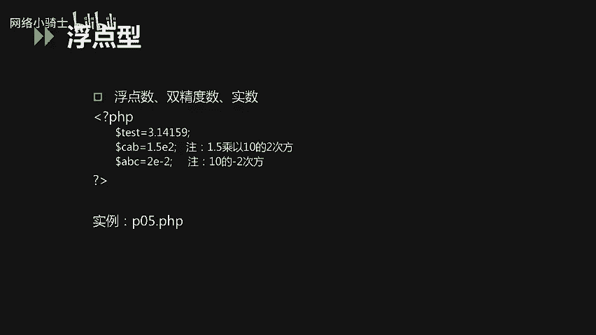

### 浮点型 (Float/Double)

浮点型用于表示小数，包括双精度数和实数，在PHP代码编写中应用广泛。

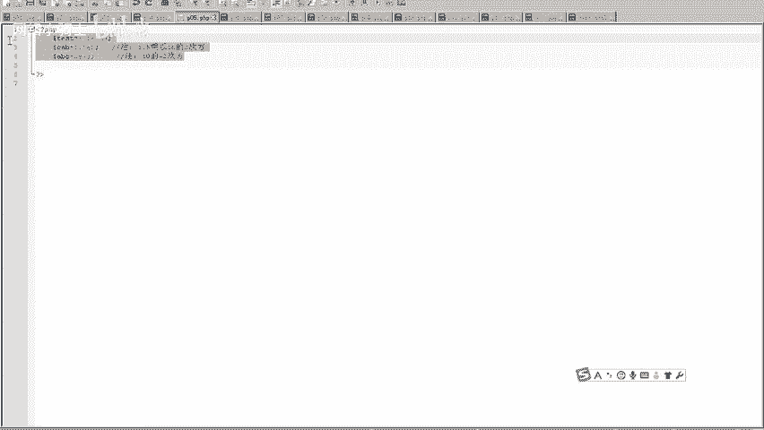

以下是定义浮点型变量的示例：
```php
<?php
$test1 = 3.1415926; // 浮点数
$test2 = 2.1e3;     // 双精度数，等于 2100
$test3 = 8E-5;      // 实数，等于 0.00008
?>
```
定义成功后，可以直接访问这些变量而不会报错。

### 字符串型 (String)

字符串是PHP中最常用的数据类型之一。定义字符串可以使用单引号 `‘’` 或双引号 `“”`，两者有重要区别：
*   **单引号字符串**：其中的所有内容（包括变量和大多数转义字符，如 `\n`）都会作为普通文本原样输出。
*   **双引号字符串**：会解析其中的变量值，并解释转义字符（如 `\n` 会换行）。

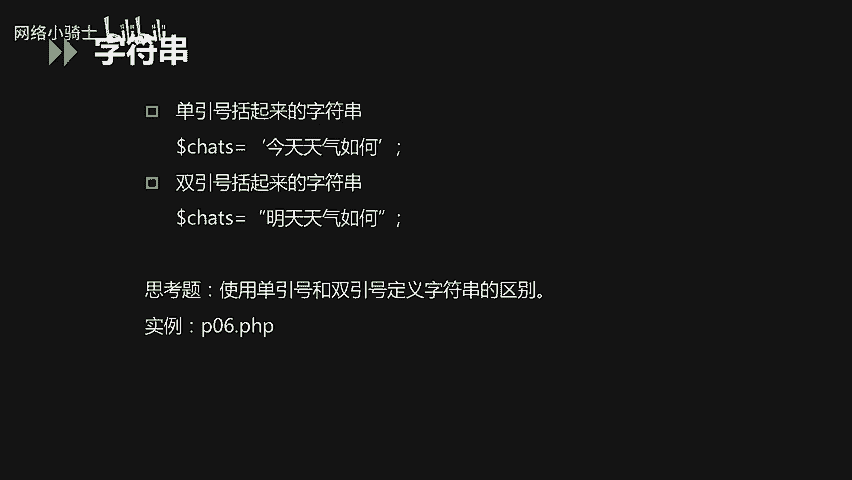

我们通过一个例子来理解：
```php
<?php
$str = 6;
echo ‘字符串是：$str\n’; // 输出：字符串是：$str\n
echo “字符串是：$str\n”; // 输出：字符串是：6 （并换行）
?>
```
可以看到，单引号直接输出了 `$str` 和 `\n` 字符本身，而双引号则输出了变量 `$str` 的值 `6`，并将 `\n` 解释为换行符。

### 数组 (Array)

数组是一种复合数据类型，用于存储多个值。PHP中的数组主要分为两类：
1.  **索引数组**：下标是数字索引，默认从0开始线性递增。
2.  **关联数组**：下标是自定义的键名（Key），以键值对（Key-Value Pair）的形式存储数据。

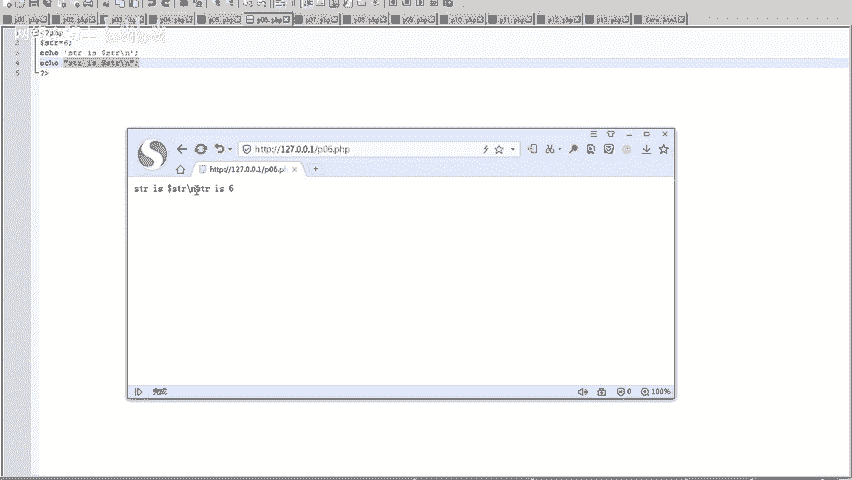

定义数组可以使用 `array()` 函数或简化的 `[]` 语法。

以下是定义和输出数组的示例：
```php
<?php
// 索引数组
$names = array(“Peter”, “Joy”, “Lily”);
echo $names[0] . “, ” . $names[1] . “, ” . $names[2]; // 输出：Peter, Joy, Lily

// 关联数组
$ages = array(“Peter”=>18, “Joy”=>20, “Lily”=>22);
echo $ages[‘Peter’]; // 输出：18
?>
```
索引数组通过数字下标 `0, 1, 2` 访问元素。关联数组通过自定义的键名，如 `‘Peter’`，来访问对应的值。

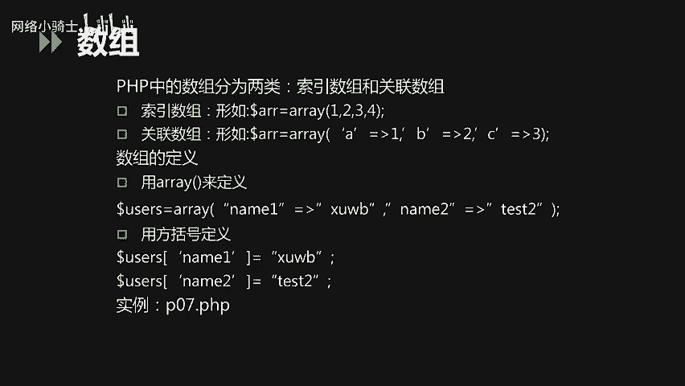

### NULL类型

NULL类型表示一个变量没有值。它不区分大小写（`NULL`, `null` 均可）。以下情况变量被认为是NULL：
*   变量被显式赋值为 `NULL`。
*   变量尚未被赋值。
*   变量被 `unset()` 函数销毁。

我们来看一个示例：
```php
<?php
$var1 = NULL; // 显式赋值为NULL
var_dump($var1); // 输出：NULL

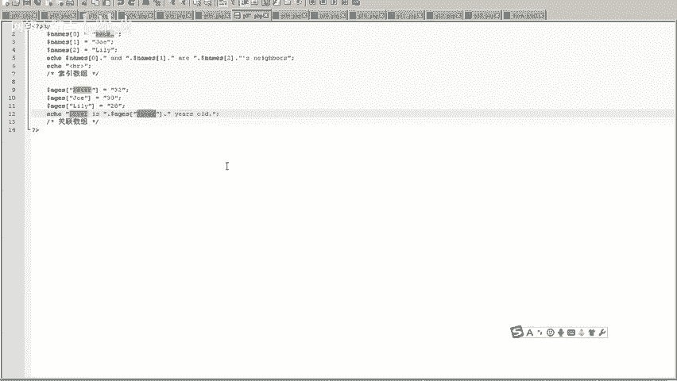

var_dump($var2); // 未赋值的变量，输出：NULL

$var3 = “test”;
unset($var3); // 销毁变量
var_dump($var3); // 输出：NULL
?>
```
以上三种情况，使用 `var_dump()` 函数检查变量，输出结果都是 `NULL`。

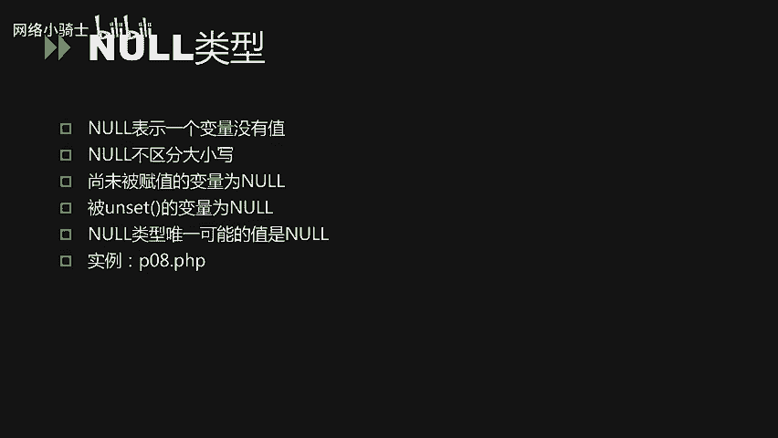

## 变量详解

了解了数据类型后，我们进一步探讨PHP中变量的使用规则。

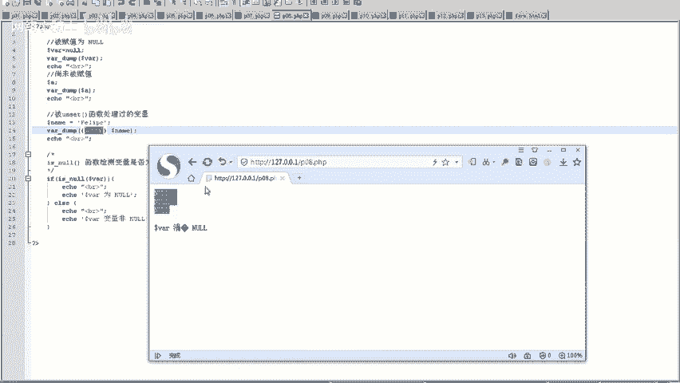

### 变量命名与预定义变量

PHP变量以美元符号 `$` 开头，名称是大小写敏感的（例如 `$number` 和 `$NUMBER` 是两个不同的变量）。变量名通常以字母或下划线开始，后跟字母、数字或下划线。虽然允许使用中文变量名，但不建议这样做。

PHP提供了一些**预定义变量**，用于获取特定的信息，例如：
*   `$_GET`：获取通过URL参数（GET方法）传递的数据。
*   `$_POST`：获取通过表单（POST方法）提交的数据。
*   `$_COOKIE`：获取客户端的Cookie信息。
*   `$_SERVER`：获取服务器和执行环境信息。

例如，`print_r($_SERVER);` 会输出大量关于服务器、请求头、脚本路径等信息。

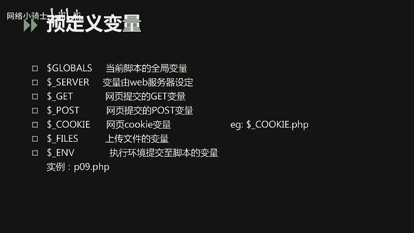

### 变量作用域

变量的作用域指的是变量在代码中的可访问范围。
*   **全局作用域**：在函数外定义的变量，通常在当前PHP文件内有效。
*   **局部作用域**：在函数内定义的变量，只在该函数内部有效。
*   **`global` 关键字**：在函数内部，使用 `global` 关键字可以引用在函数外部定义的全局变量。
*   **静态变量**：使用 `static` 关键字声明的变量。当函数执行完毕后，它的值不会被销毁，下次调用函数时，该变量仍保留上次的值。

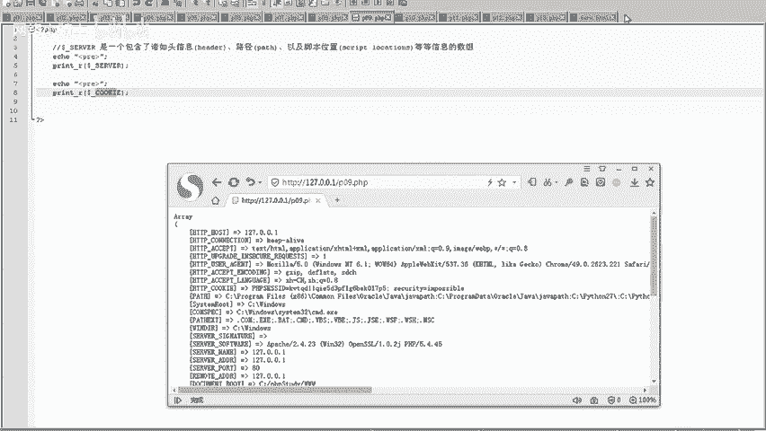

我们通过代码理解 `global` 的用法：
```php
<?php
$d = 2; // 全局变量
function myTest() {
    global $d; // 使用 global 引用全局变量 $d
    echo $d; // 现在可以输出 2
}
myTest();
?>
```
如果不使用 `global $d;`，函数内部的 `$d` 将被视为一个全新的局部变量，与外部无关，可能导致未定义变量的错误。

### 外部变量（表单处理）

当HTML表单提交给PHP程序时，表单中的数据会自动在PHP中可用。这是Web开发中获取用户输入的主要方式。

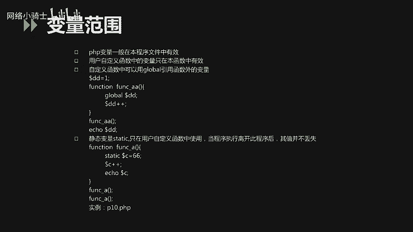

例如，一个简单的表单和处理脚本：
**HTML表单 (form.html):**
```html
<form action=“p11.php” method=“get”>
    名字: <input type=“text” name=“fname”>
    年龄: <input type=“text” name=“age”>
    <input type=“submit”>
</form>
```
**PHP处理脚本 (p11.php):**
```php
<?php
// 通过 $_GET 预定义变量获取表单数据
echo “你的名字是：” . $_GET[‘fname’];
echo “你的年龄是：” . $_GET[‘age’];
?>
```
当用户提交表单后，`p11.php` 会通过 `$_GET[‘fname’]` 和 `$_GET[‘age’]` 获取并显示用户输入的名字和年龄。

## 常量与常用函数

### 常量

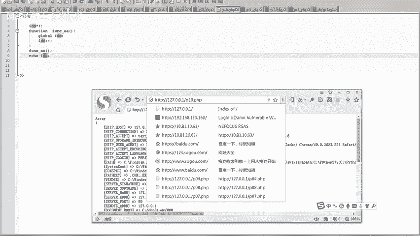

常量是一个简单值的标识符，在脚本执行期间其值不能改变。常量使用 `define()` 函数定义。
*   常量的值只能是标量（布尔、整型、浮点、字符串）。
*   常量定义后不能重新定义或取消定义。
*   常量名前没有 `$` 符号。
*   常量默认大小写敏感，但可以通过 `define()` 的第三个参数设置为不敏感。
*   常量的作用域是全局的。

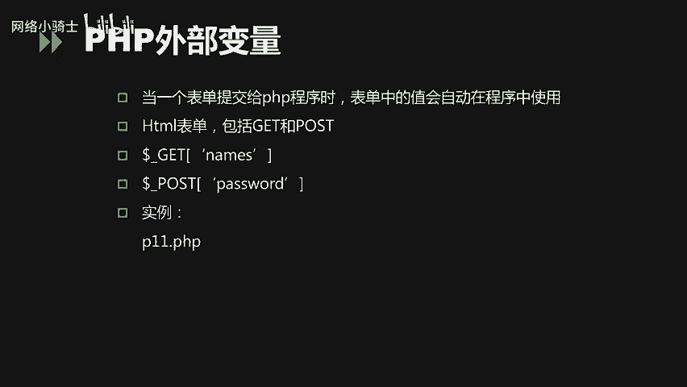

定义示例：`define(“GREETING”, “Hello World!”);`

PHP也提供了许多**预定义常量**，如 `PHP_VERSION`（PHP版本号）、`__FILE__`（当前文件的完整路径）等。

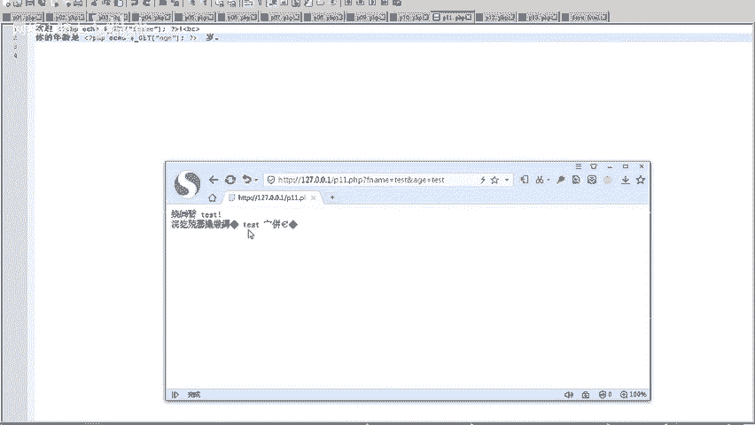

### 常用字符串函数

PHP内置了大量函数来操作字符串，以下是一些最常用的：
*   `strlen($string)`：返回字符串的长度。
*   `strpos($haystack, $needle)`：在字符串 `$haystack` 中查找子串 `$needle` 首次出现的位置。
*   `str_replace($search, $replace, $subject)`：在字符串 `$subject` 中将所有的 `$search` 替换为 `$replace`。
*   `substr($string, $start, $length)`：返回字符串的一部分。
*   `print` / `echo`：输出一个或多个字符串。`echo` 是语言结构，速度稍快，`print` 是函数，有返回值。

使用示例：
```php
<?php
$txt = “Hello World!”;
echo strlen($txt); // 输出 12
echo strpos($txt, “World”); // 输出 6
?>
```

## 课程总结

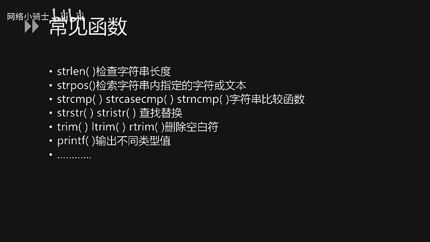


本节课中我们一起学习了PHP基础知识的第二部分。我们详细探讨了PHP的八种原始数据类型，特别是标量类型（布尔、整型、浮点、字符串）和复合类型（数组）的使用方法。我们还深入了解了变量的命名规则、作用域（包括 `global` 关键字的使用）以及如何通过预定义变量 `$_GET`、`$_POST` 处理表单数据。最后，我们介绍了常量的定义以及一些常用的字符串操作函数。掌握这些基础知识是进行PHP编程和后续CTF Web题目分析的关键。