# CTF夺旗赛教程：P38：Windows系统安全基础

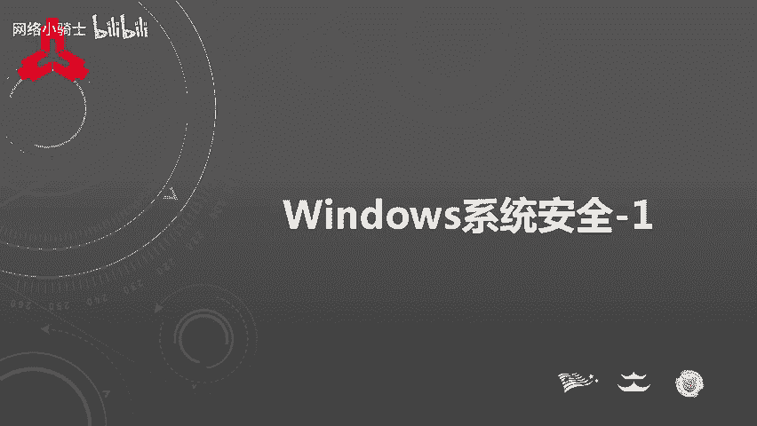

在本节课中，我们将要学习Windows系统安全的基础知识。作为最常用的操作系统，了解其安全机制对于安全工作者至关重要。本节内容将分为四个小节，涵盖常用命令、账户安全、本地安全策略和口令安全。

## 常用命令

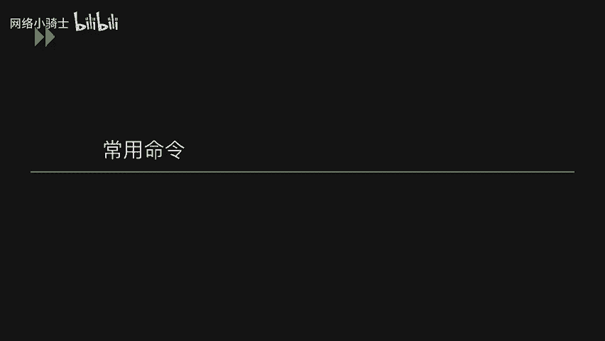

上一节我们介绍了课程概述，本节中我们来看看Windows系统安全的基础操作。掌握常用命令是进行系统安全配置和分析的第一步。这些命令可以帮助我们快速获取系统信息、配置安全策略，并且在不同Windows版本间具有通用性。

以下是常用Windows命令列表：

*   **查看系统版本**：`winver`
*   **查看主机名**：`hostname`
*   **查看网络配置**：`ipconfig /all`
*   **查看用户**：`net user`
*   **查看开放端口**：`netstat -ano`
*   **打开注册表**：`regedit`
*   **打开事件查看器**：`eventvwr.msc`
*   **打开系统服务**：`services.msc`
*   **打开组策略编辑器**：`gpedit.msc`
*   **打开本地安全策略**：`secpol.msc`
*   **打开本地用户和组**：`lusrmgr.msc`

## 账户安全

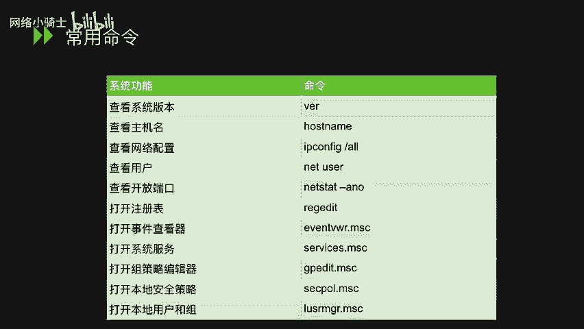

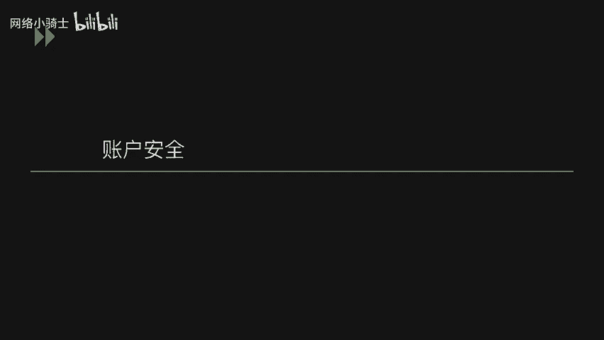

了解了基础命令后，我们进入账户安全部分。账户是系统访问控制的核心，管理好用户账户是保障系统安全的重要环节。

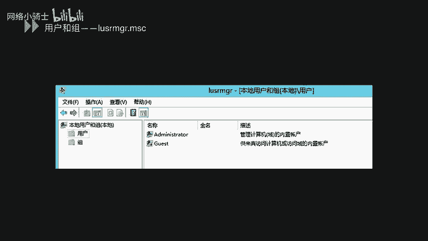

通过命令 `lusrmgr.msc` 可以打开本地用户和组管理器。在管理界面中，可以查看、创建、修改或删除用户账户。用户账户图标下的向下箭头表示该账户已被禁用。

建议为不同的应用程序或服务创建独立的低权限用户账户进行安装和运行。这样可以在程序出现漏洞时，防止攻击者直接获得整个操作系统的控制权。

用户组用于管理具有相同权限的用户集合。通过将用户添加到不同的组，可以批量管理其权限。

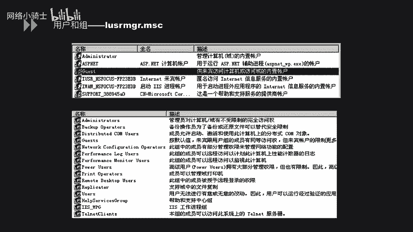

以下是两个常用的账户管理命令：

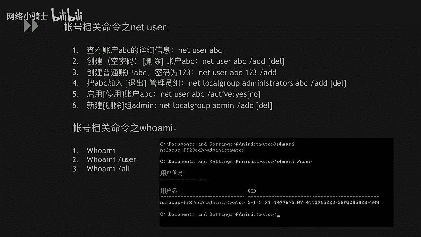

*   **`net user`**：用于查看用户信息、创建用户、设置密码、将用户添加到组、启用/禁用用户以及删除用户。
*   **`whoami`**：查看当前登录用户。
    *   `whoami /user`：查看当前用户的SID（安全标识符）。
    *   `whoami /all`：查看当前用户的所有信息，包括所属的组。

### 隐藏账户创建示例

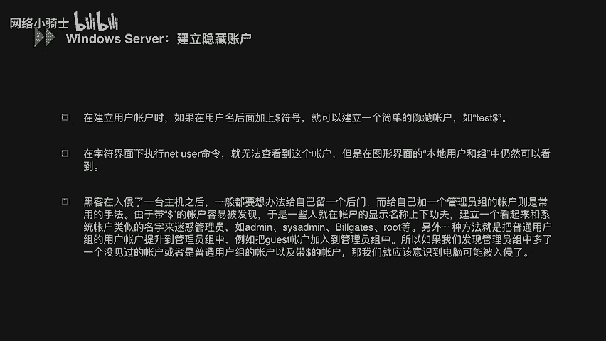

攻击者在获得系统权限后，为了维持长期访问，可能会创建隐藏账户。以下是一个创建隐藏账户的步骤示例：

1.  **创建隐藏账户并提权**：使用命令创建一个末尾带`$`符号的账户，并将其加入管理员组。
    ```cmd
    net user test$ Password123 /add
    net localgroup administrators test$ /add
    ```
2.  **修改注册表权限**：运行 `regedit` 打开注册表编辑器。定位到 `HKEY_LOCAL_MACHINE\SAM\SAM`，默认无权限查看。右键点击`SAM`文件夹，选择“权限”，为`Administrators`组添加“完全控制”和“读取”权限。
3.  **导出账户注册表项**：赋予权限后，在 `SAM\Domains\Account\Users\Names` 下可以找到用户（如 `test$`）及其对应的SID文件夹（如 `000003E9`）。分别导出这两个注册表项。
4.  **删除可见账户**：使用命令删除刚才创建的账户。`net user test$ /del`
5.  **导入注册表项**：在注册表编辑器中，右键点击对应路径，选择“导入”，将步骤3导出的两个文件重新导入。
6.  **克隆管理员SID**：在注册表中找到管理员账户（如`Administrator`）对应的SID项下的`F`键值，复制其全部数据。然后，将其粘贴到隐藏账户（如`000003E9`）项下的`F`键值中。这使得系统将隐藏账户识别为管理员账户的影子账户，共享同一用户配置文件，实现完全隐藏。

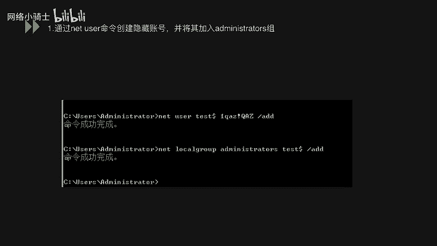

完成以上步骤后，无论在命令行 (`net user`) 还是图形界面中，都无法看到 `test$` 这个账户，但它实际拥有管理员权限。

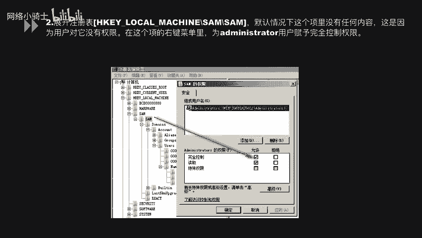

## 本地安全策略

在熟悉了账户管理后，我们来看如何通过策略进行更全局的安全配置。本地安全策略是Windows系统安全配置的核心工具，可以通过命令 `secpol.msc` 打开。

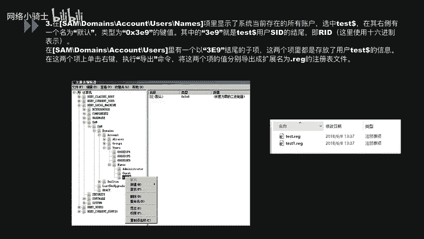

策略编辑器包含账户策略、本地策略、高级安全Windows防火墙等设置。

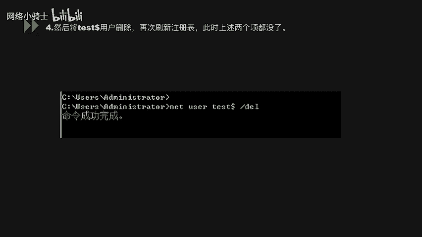

### 密码策略

密码策略用于强制用户设置符合安全要求的密码。

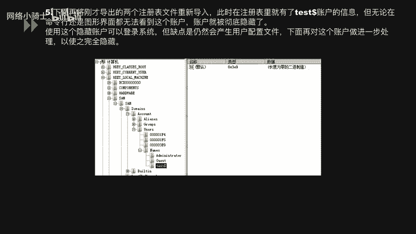

*   **密码必须符合复杂性要求**：启用后，密码必须包含大小写字母、数字和符号中的至少三种。
*   **密码长度最小值**：设置密码的最短字符数，例如8或12。
*   **密码最短使用期限**：设置密码在更改前必须使用的天数（例如1天），防止频繁更改。
*   **密码最长使用期限**：设置密码的有效期，到期后必须更改。
*   **强制密码历史**：系统记住的旧密码数量，防止用户重复使用近期用过的密码。
*   **用可还原的加密来存储密码**：通常应禁用，以使用不可逆的加密方式存储密码哈希。

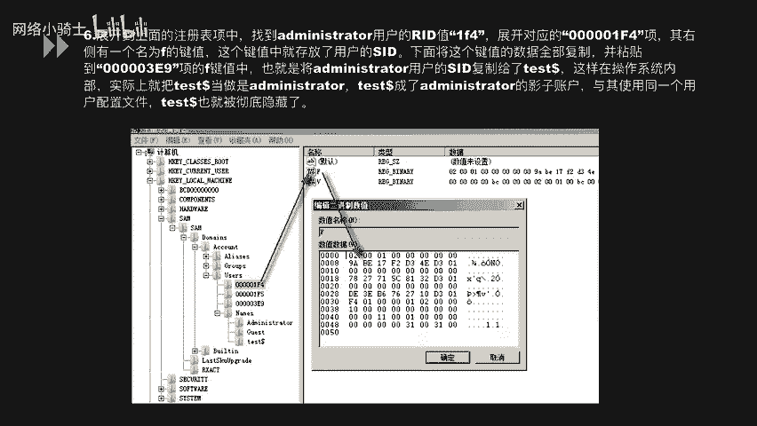

### 账户锁定策略

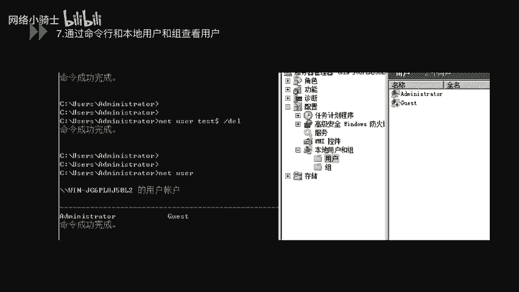

账户锁定策略用于防范暴力破解攻击。

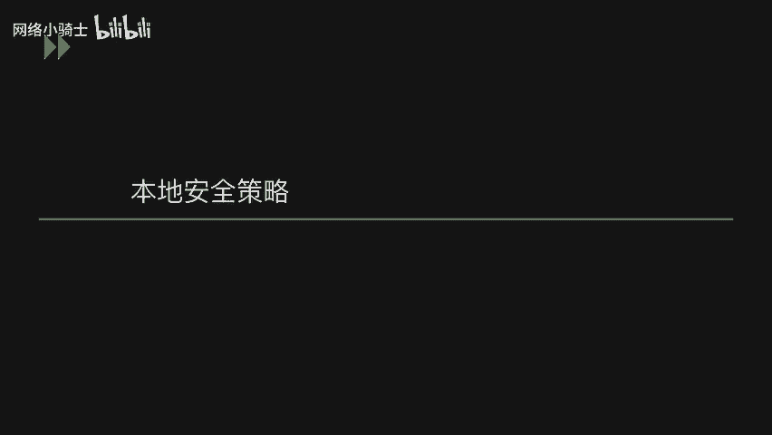

*   **账户锁定时间**：账户被锁定后，自动解锁所需的分钟数。
*   **账户锁定阈值**：在指定时间内，登录失败多少次后锁定账户。
*   **重置账户锁定计数器**：在指定的分钟数后，将失败登录尝试计数重置为零。

## 口令安全

最后，我们来探讨实际攻防中最常见的突破口——口令安全。弱口令是内网渗透和系统入侵中最常见的入口之一。攻击者常利用扫描器发现FTP、数据库、SSH等服务上的弱口令。

### 弱口令检查方法

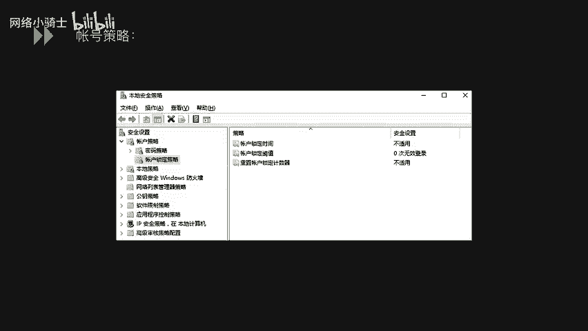

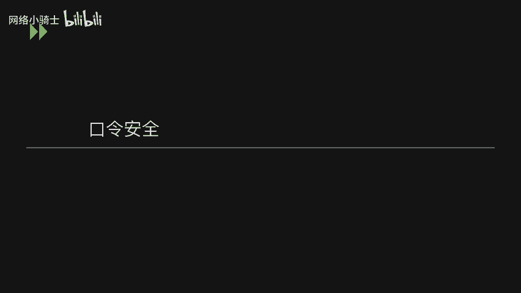

了解风险后，我们需要掌握检查系统是否存在弱口令的方法。

#### 1. 在线检查

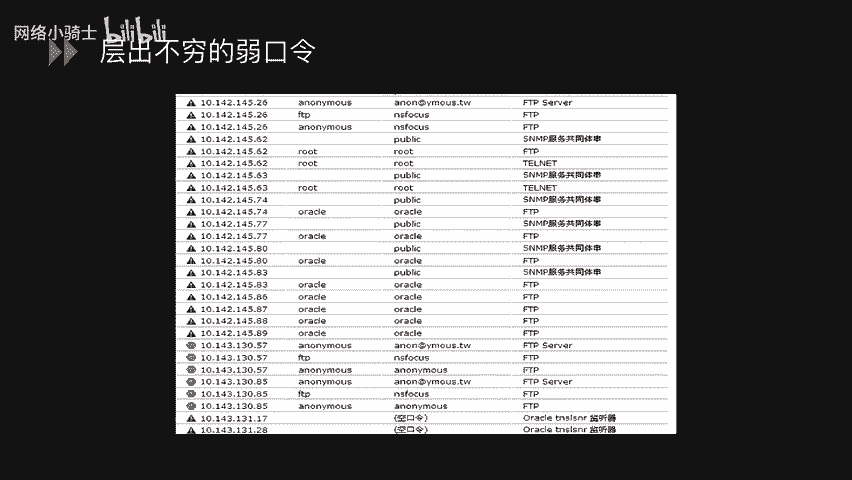

使用工具（如Hydra）对目标服务进行在线暴力破解。这种方式直接有效，但可能触发账户锁定策略，对生产环境造成影响。

**示例命令**：
```bash
hydra -l admin -P passlist.txt smb://192.168.1.114
```
该命令使用`passlist.txt`字典对IP为`192.168.1.114`主机的SMB服务进行密码破解。

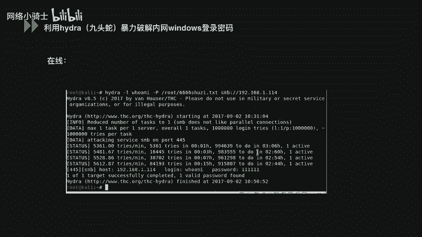

#### 2. 离线检查

为避免影响业务系统，可采用离线方式。首先需要从被锁定的系统文件（SAM）中提取用户密码哈希值。可以使用`pwdump`等工具完成提取。

提取出哈希值（如`NTLM Hash`）后，使用彩虹表或哈希破解工具（如`hashcat`）在本地进行破解。这种方式不会触发系统的登录失败限制。

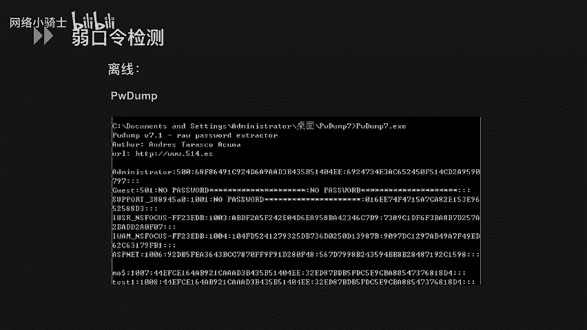

**离线破解流程**：
1.  获取哈希：`pwdump > hashes.txt`
2.  破解哈希：`hashcat -m 1000 hashes.txt rainbow_table`

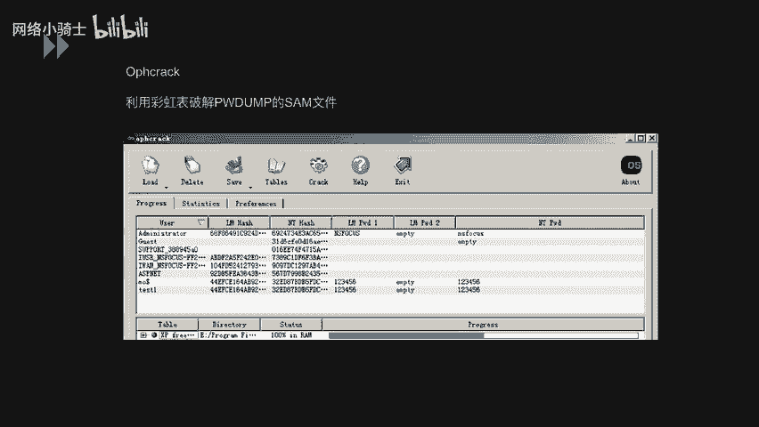

---

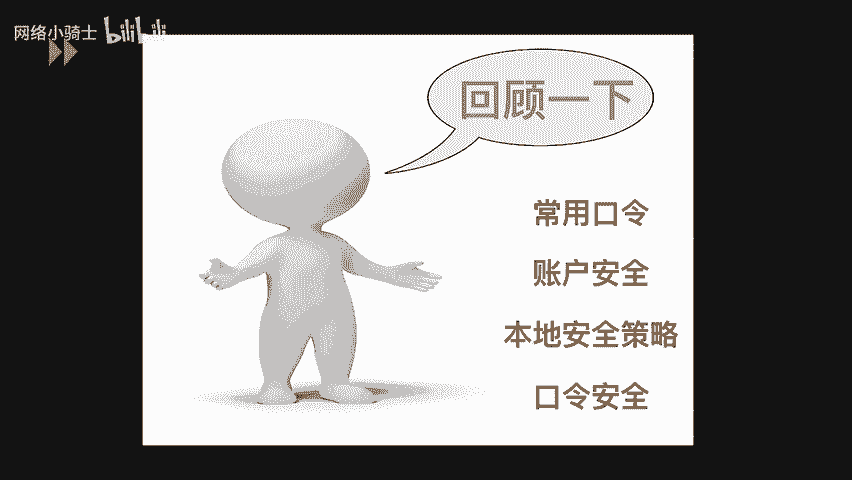

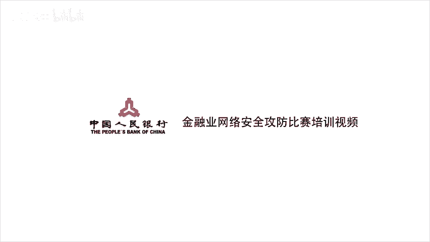

本节课中我们一起学习了Windows系统安全的基础部分。我们首先掌握了获取系统信息和配置的关键命令，然后深入了解了账户管理、隐藏账户的原理，接着学习了通过本地安全策略强化密码和账户锁定机制，最后探讨了弱口令的风险及其在线与离线的检查方法。这些知识是构建Windows系统安全防护的第一道防线。